for 

# Big Fixes — Match Experience Overhaul (Spec)

> **Status:** Draft spec, ready for build. Formalises the raw notes in
> [`Big Fixes.md`](<Big%20Fixes.md>) into an implementable design + engineering
> document. Nothing here changes the locked architecture in
> [`PROJECT_STATE.md`](PROJECT_STATE.md) — it extends it.
>
> **Scope in one line:** unify every knockout view, show final standings at the
> league→qualifiers hand-off, add an Android back-guard, fix weighted picks +
> a batch of draft/subs/chaos bugs, remove Era mode, and build the headline
> feature — a **Deep Simulation Match for finals** with **live Match Momentum**,
> **own goals / penalties / mistakes**, and a **redesigned (dedicated) Match
> Stats screen**.
>
> **How this doc is organised:** each work item has **Problem → Target →
> Requirements → UX notes → Implementation pointers → Acceptance criteria**.
> Screenshots are embedded from [`image/BigFixes/`](image/BigFixes). The two
> reference apps in the shots are the game's own **CL (full)** result screen and
> **FotMob** (used purely as a visual north star — we own no club emblems, so
> everywhere FotMob shows a crest we show a **team name**).
>
> **Naming convention (user-facing labels).** As part of this pass the displayed
> competition names become the full official forms everywhere in the UI:
> **"Champions League" → "UEFA Champions League"** and
> **"World Cup" → "FIFA World Cup"**. Internal mode ids
> (`champions_league`, `champions_league_custom`, `world_cup`) are unchanged — this
> is a display-string change only. "CL (classic)" / "CL (full)" below refer to the
> two UCL variants (`champions_league` and `champions_league_custom`).
>
> **Decisions locked** — all open questions from the first draft are now resolved;
> see [Appendix B](#appendix-b-resolved-decisions).

---

## Table of contents

**Fixes & polish**

1. [Knockout UI unification](#1-knockout-ui-unification)
2. [Final standings at the league → qualifiers hand-off](#2-final-standings-at-the-league--qualifiers-hand-off)
3. [Android back-button guard during simulations](#3-android-back-button-guard-during-simulations)
4. [Weighted picks in CL (full)](#4-weighted-picks-in-cl-full)
5. [Draft, subs &amp; chaos fixes (batch)](#5-draft-subs--chaos-fixes-batch)
6. [Remove Era mode](#6-remove-era-mode)

**Additions**
7. [Deep Simulation Match (finals)](#7-deep-simulation-match-finals)
8. [Match Momentum](#8-match-momentum)
9. [Own goals, penalties &amp; mistakes](#9-own-goals-penalties--mistakes)
10. [Match Stats screen redesign (dedicated screen)](#10-match-stats-screen-redesign-dedicated-screen)

**Roadmap**
11. [Full FIFA World Cup mode (after everything above)](#11-full-fifa-world-cup-mode-after-everything-above)

**Appendices**

- [A. Asset checklist](#appendix-a-asset-checklist)
- [B. Resolved decisions](#appendix-b-resolved-decisions)
- [C. Suggested commit message](#appendix-c-suggested-commit-message)
- [D. Screenshot index](#appendix-d-screenshot-index)

---

## 1. Knockout UI unification

### Problem

There are **two** knockout renderers with two different looks. The CL (full)
result screen already has the clean, tappable "Knockout Rounds" list we want
everywhere; the World Cup live/knockout view uses an older "featured match +
Elsewhere in the round" layout and — worse — its **header still reads "Group
Stage · Group K"** while showing knockout content.

**The look we want (CL full — the gold standard):**

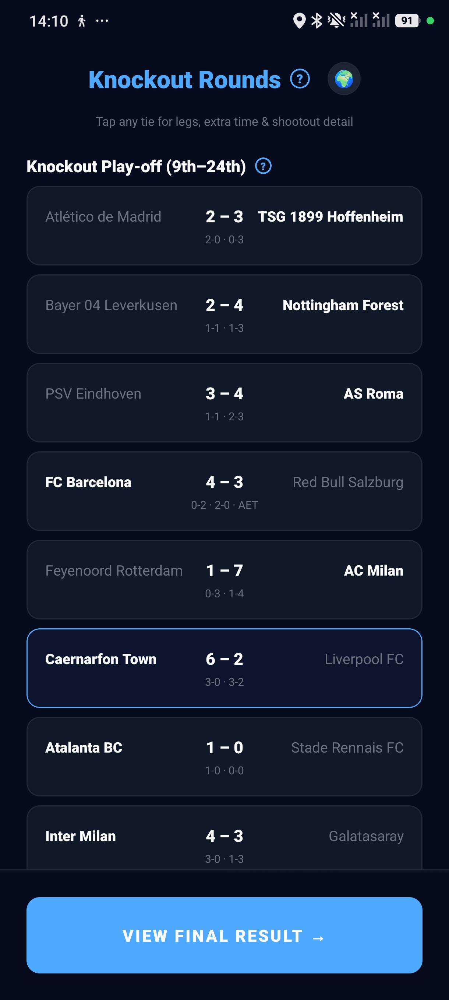

**The look we're replacing (current WC knockouts):** note the stale
`Group Stage · Group K` sub-header and the "PORTUGAL ADVANCES / Elsewhere in the
Round of 32" split.

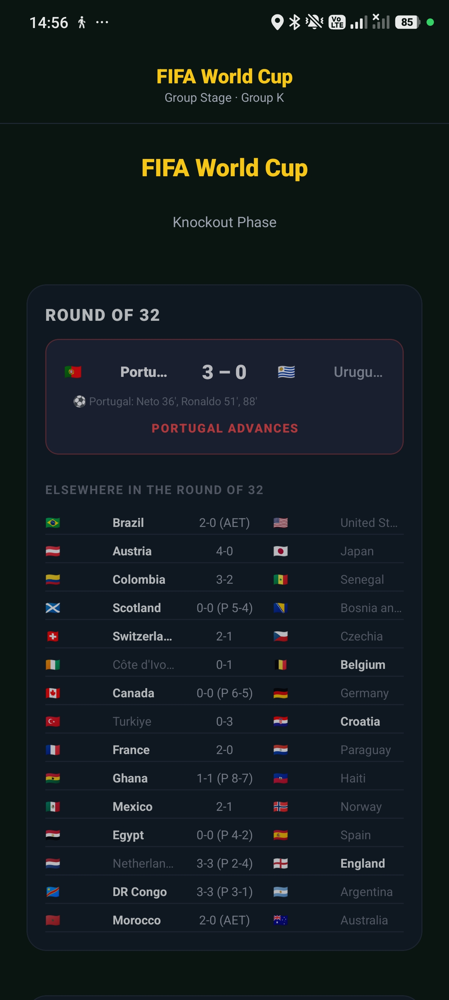

### Target

**One** knockout component used in **all four** places:

- WC knockouts
- CL (classic) knockouts
- CL (full) qualifiers
- CL (full) knockouts

It takes the **best of both**: the **colours, flags and per-round feel of the WC
card** combined with the **CL list's sizing, footer, and tappable rows**. The
mock below is WC data rendered in the unified style (flags preserved):

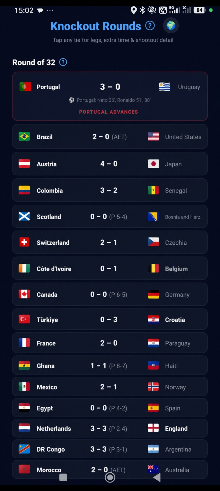

Every tie is **tappable** and opens the existing aggregate/leg detail modal
(both legs, ET, shootout, and per-leg "Match stats ›" links):

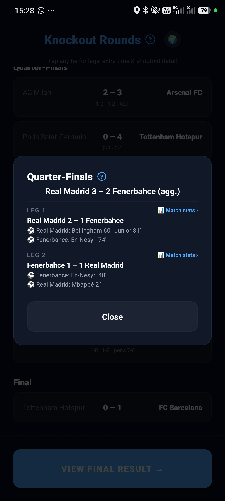

### Requirements

- **R1 — Single source of truth.** Extract one shared knockout list component
  (rows + round headers + footer) and one shared tie-detail modal. WC and CL
  render the same component with mode-specific props.
- **R2 — Correct, mode-specific header.** The header must reflect the *phase*
  (e.g. "Knockout Rounds", "Round of 32", "Qualifiers"), never a leftover
  "Group Stage · Group X". It shows **mode-specific** chrome (WC = FIFA/gold
  accent + Knockout Phase; UCL = UCL accent) — not the generic app header.
- **R3 — Sticky, always-visible header.** The phase header **overlays / stays
  pinned** while the list scrolls, so you always know where you are. (Today the
  CL header scrolls away — see the greyed header in the tie-detail shot.)
- **R4 — Flags stay.** WC ties keep nation flags on both sides. CL club ties show
  the club label (we have no emblems — text label per repo convention).
- **R5 — Clickable everywhere.** Every tie row is a `PressCard` and opens the tie
  detail. Single legs (WC) and two-legged ties (CL) both supported by the modal.
- **R6 — Footer.** Keep the CL-style bottom bar (e.g. "View Final Result →")
  pinned; WC currently lacks it.

### UX notes

- Rows read as a **table of ties**, not a hero + afterthought. The current WC
  "featured match then Elsewhere" hierarchy buries 15 of 16 ties in a cramped
  list. A flat, equally-weighted row list (as in the CL screenshot) scans far
  faster and treats every tie as first-class.
- **Winner/loser emphasis** via weight + opacity is already right in the CL list
  (winner bold/full-opacity, loser dimmed). Keep it; apply to WC.
- **Focus/selection ring** (the player's own tie) uses the accent border — keep
  the CL treatment (see FC Barcelona / Caernarfon rows in the first shot).
- Sticky header = a small persistent context anchor; pairs well with the modal
  so a user can drill in and pop back without losing the round they were reading.
- **Touch target ≥ 44pt** per row; the whole row is the hit area, not just the
  score.

### Implementation pointers

- **Reuse, don't fork.** The tappable CL knockout list + detail already live in:
  - [`app/game/cl-result.tsx`](../app/game/cl-result.tsx) (`"Knockout Rounds"`
    section, the round config array `r16/qf/sf/final`).
  - [`src/components/CustomUclViewers.tsx`](../src/components/CustomUclViewers.tsx)
    — `KoTieDetailModal`, `KoLeg`, `qualTieToKoMatch`.
- The WC renderer to retire/absorb is in
  [`app/game/wc-result.tsx`](../app/game/wc-result.tsx) (`BracketView`,
  `BracketMatch`, `WCKoDetail`) and the live version in
  [`src/components/LiveMatch.tsx`](../src/components/LiveMatch.tsx) /
  [`app/game/simulation.tsx`](../app/game/simulation.tsx) (the WC simulation path
  with `ADVANCES` / `Elsewhere in the Round of 32`).
- Extract a `KnockoutRoundsView` (list) into `src/components/` taking:
  `rounds: { key, label, sub?, matches, showDirect? }[]`, `accent`,
  `renderTeam` (club-label vs flag+nation), `onTiePress`, optional `footer`.
  Feed it from both `cl-result` and `wc-result`.
- Header stickiness: a pinned header above a `ScrollView` (or a `SectionList`
  `stickySectionHeadersEnabled`). Keep to the [modal scroll pattern](PROJECT_STATE.md)
  (`flexShrink: 1` body) so the footer never clips.
- Pull the accent from `useModeTheme()` (`src/theme.ts` `MODE_THEMES`), **never
  hardcode** the WC gold or UCL blue.
- Both WC (single-leg) and CL (two-leg agg) tie shapes must map onto the modal's
  input — `qualTieToKoMatch` is the precedent for adapting shapes.

### Acceptance criteria

- [ ] WC, CL-classic, CL-full qualifiers, and CL-full knockouts all render the
  *same* component; a visual diff shows one style.
- [ ] No knockout screen ever shows a "Group Stage · Group X" sub-header.
- [ ] Header stays visible while the list scrolls; footer never clips.
- [ ] Every tie (single- and two-legged) opens the detail modal; flags present on
  WC ties.
- [ ] `npx tsc --noEmit` clean; browser walkthrough (WC + UCL quick-sim) shows the
  unified view with an empty error console.

---

## 2. Final standings at the league → qualifiers hand-off

### Problem

When you finish a domestic league and progress toward the Champions League, the
transition screens (**"QUALIFIED!"** into the League Phase, and **"Super Liga
CHAMPIONS → First Qualifying Round"**) tell you the *outcome* but never show the
**final league table** you earned it from. The context is missing for both the
league-phase entry and the qualifier entry.

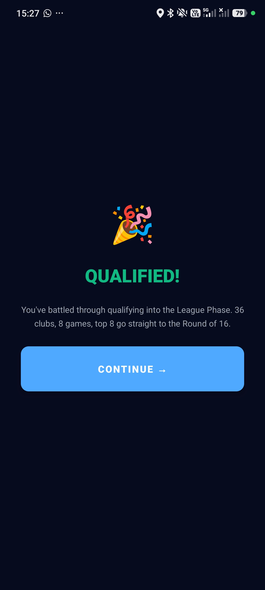

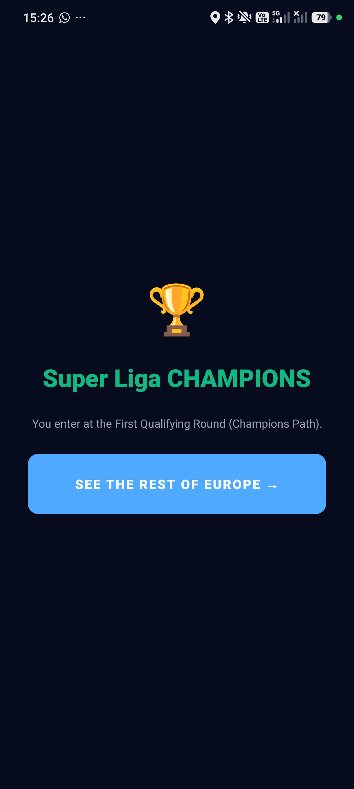

### Target

On the league-completion / qualifier-entry transition, **show the final league
standings** (the table the player finished in), before or alongside the
"Continue / See the rest of Europe" CTA. Same treatment for the qualifiers entry.

### Requirements

- **R1** — Render the completed league's final table on the transition screen,
  with the player's row highlighted and the qualification cut-off marked
  (e.g. a divider / colour for "into Europe").
- **R2** — Applies to **both** hand-offs: league → League Phase ("QUALIFIED!"),
  and league finish → qualifiers ("Super Liga CHAMPIONS").
- **R3** — Keep the celebratory hero (emoji + headline) but demote it to a compact
  banner so the table is the focus, then the CTA below.

### UX notes

- This closes a **feedback loop**: the player just simulated a season; showing the
  table is the payoff and the justification for the European berth. A bare
  "QUALIFIED!" throws away earned context.
- Reuse the existing league-table styling so it reads as the same table they saw
  during the season — recognition over re-learning.
- Order: **compact result banner → final table (player highlighted, cut-off line)
  → CTA**. One screen, scrollable if needed.

### Implementation pointers

- Transition screens live in the CL flow:
  [`app/game/simulation.tsx`](../app/game/simulation.tsx) (`CLSimulation`, the
  "League Phase" / qualifier orchestration) and the qualifying engine
  [`src/engine/cl-qualifying.ts`](../src/engine/cl-qualifying.ts) /
  [`src/engine/cl-access.ts`](../src/engine/cl-access.ts).
- Reuse `LeagueTableView` from
  [`src/components/CustomUclViewers.tsx`](../src/components/CustomUclViewers.tsx)
  (already knows `playerClubId` highlighting and final-table labelling) rather
  than building a new table.
- The final domestic table is produced by the league sim
  ([`src/engine/simulation.ts`](../src/engine/simulation.ts)); make sure it's
  passed through to the transition screen's props (it may currently be dropped
  once the berth is computed).

### Acceptance criteria

- [ ] Both hand-off screens show the final league table with the player's row
  highlighted and the European cut-off marked.
- [ ] Uses the shared `LeagueTableView`, not a new table.
- [ ] Hero banner still present but compact; CTA still reachable without the
  footer clipping.

---

## 3. Android back-button guard during simulations

### Problem — this is an anti-cheese guard, not just data-loss prevention

The Android OS back button (hardware/gesture back, *not* an in-app control) lets a
player **rewind a decided simulation and re-run it for a better result**. Real
exploit found in playtesting: a player **lost**, and *before* tapping "Go to
Result" they pressed OS-back, which rewound the sim so they could **restart it and
re-roll the outcome**. Because results are attributed deterministically up-front,
being able to jump back and replay is a straight-up cheat — the guard exists to
**close that reroll loophole**.

### Target

Once a simulation has produced its outcome, OS-back must **not** take the player to
a point where they can re-run it. The decided result stands; the only forward path
is to the result screen. This applies to normal sims and especially the Deep Match
final (§7), where the stakes and the temptation are highest.

### Requirements

- **R1 — Block the reroll.** On all simulation screens (league, UCL league phase,
  UCL knockouts, FIFA World Cup, custom UCL, and the new Deep Match), OS-back must
  **not** return to a pre-outcome / re-runnable state after the result is decided.
- **R2 — Behaviour: confirm-to-quit, never rewind-to-re-sim.** Intercept OS-back
  and show a confirm — **"Quit this run? You can't re-simulate — the result is
  final."** Cancel stays; Quit exits the *whole run* (to home / mode-select), it
  does **not** drop the player back into a re-runnable sim step. Under no path does
  back re-open the already-simulated match for another attempt.
- **R3 — Scope.** Native Android only (gate on `Platform.OS === 'android'`); do not
  affect in-app back controls or the web build.

### UX notes

- Frame the copy around **finality**, not just "progress lost" — the message should
  make clear the result won't change, which both explains the block and removes the
  incentive to try.
- The confirm respects a genuine "I want to leave" intent while denying the "let me
  secretly retry" one — the two must resolve to *quit the run* or *stay*, never
  *rewind and replay*.

### Implementation pointers

- Use React Native `BackHandler` (add/remove listener in a `useEffect`) on the sim
  screens, or expo-router's `usePreventRemove` where a route would pop. Native-only
  gate on `Platform.OS === 'android'`.
- The critical window is **outcome-decided-but-not-yet-committed** (after the sim
  resolves, before "Go to Result"). Ensure back during that window can't land on a
  screen/state that re-invokes the simulate step. Since results are attribute-once
  and stored on the match, "Quit" should discard the *run*, not rewind to re-attribute.
- Screens: [`app/game/simulation.tsx`](../app/game/simulation.tsx),
  [`app/game/custom-ucl-simulation.tsx`](../app/game/custom-ucl-simulation.tsx),
  and the new Deep Match screen (§7).
- A small reusable hook (`useSimBackGuard(active, onConfirmQuit)`) keeps it DRY
  across all sim screens (share, don't copy-paste).

### Acceptance criteria

- [ ] After a sim (or Deep Match) resolves, OS-back cannot reach a state that
  re-runs / re-rolls that match — reproduce the original exploit and confirm
  it's closed.
- [ ] OS-back shows the finality confirm; "Quit" exits the run (no re-sim), "Cancel"
  stays.
- [ ] In-app back controls and the web build are unaffected; listener removed on
  unmount.

---

## 4. Weighted picks in CL (full)

### Problem / feature

"Weighted picks" biases the draft spin pool toward stronger clubs. In CL (full)
it should be **automatic by difficulty**, plus a **manual override in custom**,
with the override winning when the two disagree.

### Requirements

- **R1 — Auto by difficulty.** For **easy → medium** (up to difficulty **4/10**,
  i.e. "medium"), weighted picks are **ON**. Above that, **OFF** by default.
- **R2 — Custom toggle.** In **custom**, a button in the drafting phase toggles
  weighted picks. When ON, the pool is **only teams from the top-10 leagues by
  UEFA coefficient that are in that pool** (see the coefficient source below).
- **R3 — Override precedence.** The **button state wins over the difficulty
  default**, in *both* directions:
  - Difficulty > 4 (would be OFF) but button ON → **weighted picks ON** (button
    wins).
  - Difficulty ≤ 4 (would be ON) but user turns the button OFF → **OFF** (button
    wins).
- **R4 — Real-time.** The default flips **live** as the difficulty slider moves;
  the manual toggle continues to override whatever the live default is.

### UX notes

- The button must show its **effective** state, and ideally hint *why* (e.g.
  "Weighted picks · on (medium)" vs "on (manual)"). A control that silently
  disagrees with the difficulty slider is confusing; surface the override.
- Because it changes the spin pool, reflect it before the first spin, not after.

### Implementation pointers

- Difficulty is a single model —
  [`src/engine/difficulty.ts`](../src/engine/difficulty.ts) `resolveDifficulty`
  (easy/medium/hard = screw-levels 2/4/6; custom rerolls 0–10). Add the weighted
  default as a **derived field** of the resolved difficulty (ON when level ≤ 4),
  so it lives with the other tilt/reroll/hidden-ratings outputs — don't re-derive
  it elsewhere (golden rule 5 territory: keep it one model).
- The manual override is a separate boolean in run/custom state
  (`src/store/gameStore.ts`); the *effective* value = `override ?? difficultyDefault`.
- Pool construction: [`src/engine/draft.ts`](../src/engine/draft.ts)
  (`spinClubSeason` / availability) restricted to clubs from the **top-10 leagues
  by UEFA coefficient** in the active pool. There's already a coefficient table in
  the repo — [`src/data/uefa-coefficients.ts`](../src/data/uefa-coefficients.ts) —
  use it as the single source for the league ranking (don't hardcode a second
  list). Custom draft UI:
  [`app/game/custom-ucl-simulation.tsx`](../app/game/custom-ucl-simulation.tsx)
  / [`app/game/draft.tsx`](../app/game/draft.tsx).
- Keep AI-vs-AI fair: weighting is a **draft-pool** bias for the player's own XI,
  not a global tilt.

### Acceptance criteria

- [ ] Easy/medium (≤4) default ON; harder defaults OFF; the default flips live
  with the slider.
- [ ] Custom toggle overrides the default both ways; button state always wins.
- [ ] When ON, spins are drawn only from top-10-league clubs in the pool.
- [ ] Button label communicates the effective state (and ideally the source).

---

## 5. Draft, subs & chaos fixes (batch)

Small, mostly self-contained correctness/UX fixes. Grouped because they share the
draft/placement/match-detail surface.

| #   | Fix                                                  | Detail                                                                                                                                                                                                                                                                 | Likely location                                                                                                                                                                                                                                                                                                                                                                 |
| --- | ---------------------------------------------------- | ---------------------------------------------------------------------------------------------------------------------------------------------------------------------------------------------------------------------------------------------------------------------- | ------------------------------------------------------------------------------------------------------------------------------------------------------------------------------------------------------------------------------------------------------------------------------------------------------------------------------------------------------------------------------- |
| 5.1 | **Subs show "-" for team**                     | A substitute's row doesn't show which team they're from (renders`-`). Populate the team for bench/subbed players. In the final result screen this bug appears not for WC countries but for UCL teams.                                                               | [`src/components/MatchDetailModal.tsx`](../src/components/MatchDetailModal.tsx) (timeline/lineup), [`src/engine/match-detail.ts`](../src/engine/match-detail.ts)                                                                                                                                                                                                              |
| 5.2 | **Chaos mode doesn't hide ineligible players** | In chaos, players who can't play the spun position should be**hidden**, but aren't.                                                                                                                                                                              | [`app/game/draft.tsx`](../app/game/draft.tsx), [`src/engine/draft.ts`](../src/engine/draft.ts) (`isPlayerAvailable`)                                                                                                                                                                                                                                                        |
| 5.3 | **Phantom "highlighted player" in drafting**   | The so-called highlighted player in the lineup during drafting is a**visual bug** — remove it.                                                                                                                                                                  | [`app/game/draft.tsx`](../app/game/draft.tsx) / [`app/game/placement.tsx`](../app/game/placement.tsx), `LineupPitch`                                                                                                                                                                                                                                                        |
| 5.4 | **Sort hidden-rating lists A–Z**              | When subs**and** rating are hidden, sort players by **name A–Z** (so OVR can't be inferred from order — consistent with the existing chaos/cursed surname-sort rule).                                                                                    | [`app/game/draft.tsx`](../app/game/draft.tsx), [`src/engine/draft.ts`](../src/engine/draft.ts)                                                                                                                                                                                                                                                                                |
| 5.5 | **Competition display-name rename**            | Every**user-facing** label reads **"UEFA Champions League"** (not "Champions League") and **"FIFA World Cup"** (not "World Cup"). Internal mode ids stay `champions_league` / `champions_league_custom` / `world_cup` — display strings only. | mode-select, headers, result/sim screens, how-to-play, tiers/labels — grep the display strings (`src/theme.ts` `MODE_THEMES` labels, [`app/game/mode-select.tsx`](../app/game/mode-select.tsx), [`app/game/simulation.tsx`](../app/game/simulation.tsx), [`app/game/wc-result.tsx`](../app/game/wc-result.tsx), [`app/game/cl-result.tsx`](../app/game/cl-result.tsx)) |

### Notes & acceptance

- **5.1**: a sub's team must be present everywhere the sub appears (timeline,
  lineup, tap-through stat line). Add the invariant to
  `scripts/verify-match-detail.ts` ("every event/lineup entry has a resolved
  team").
- **5.2**: mirror the existing availability filter; ineligible = not rendered (not
  just greyed). Verify by spinning a position in chaos and confirming off-position
  players are absent from the list.
- **5.3**: confirm it's purely presentational (no selection state depends on it)
  before deleting.
- **5.4**: reuse the existing hidden-rating sort path (chaos/cursed/hard already
  sort by surname) rather than a second sort implementation.
- **5.5**: prefer a **single source** for each competition's display name (e.g. the
  `MODE_THEMES` label or a `tiers.ts` label) and reference it everywhere, so the
  next rename is one edit — don't sprinkle raw literals. Keep one constant, update
  all call sites. Leave any *official-context* strings that already read "UEFA
  Champions League" (e.g. the league-phase header) as-is.

- [ ] `tsc` clean; `verify-match-detail.ts` green including the new sub-team
  invariant; no user-facing "Champions League"/"World Cup" short forms remain.

---

## 6. Remove Era mode

### Requirement

Remove **Era mode** (`era`) entirely — from mode selection, the `GameMode`
type/variants, theming, scoring, and any copy/how-to references.

### Implementation pointers

- `GameMode` variant `era` is referenced across mode-select, theme, tiers,
  scoring, and how-to-play. Grep and remove:
  [`app/game/mode-select.tsx`](../app/game/mode-select.tsx),
  [`src/theme.ts`](../src/theme.ts) (`MODE_THEMES`),
  [`src/data/tiers.ts`](../src/data/tiers.ts),
  `src/types/game.ts`, [`app/(tabs)/how-to-play.tsx`](../app/(tabs)/how-to-play.tsx).
- **Migration guard (decided):** existing saved runs / `career_stats` may carry
  `mode: 'era'`. Remove the mode from all *live* surfaces, but **keep the readers
  tolerant** and **label historical rows "Era (retired)"** wherever an old
  `era` run/stat is displayed (leaderboards, runs list, career). Do **not** delete
  or rewrite historical data — just stop offering the mode and render old rows with
  the retired label. Keep a single retired-label constant rather than scattering the
  string.

### Acceptance criteria

- [ ] Era is absent from mode selection and all live copy.
- [ ] `tsc` clean with no dangling `era` references.
- [ ] Loading a historical run/leaderboard that references `era` does not crash.

---

## 7. Deep Simulation Match (finals)

The headline feature. At the **final** of a knockout, the match becomes a **Deep
Simulation Match** — a one-time, live-feeling broadcast of an already-decided
result, with live stats, momentum, lineups, ratings, and a win/lose ceremony.

**Available in all three knockout competitions:** **UEFA Champions League**
(classic, `champions_league`), **custom UEFA Champions League** (full,
`champions_league_custom`), and the **FIFA World Cup** (`world_cup`).

> **Architecture guard (critical).** Per
> [`PROJECT_STATE.md`](PROJECT_STATE.md) the engine is **result-first** and deep
> stats are a **deterministic seeded texture layer**. The Deep Match must **not**
> invert this: the result, scoreline, scorers, momentum series, and event
> timeline are **all computed up-front** (from the match seed) and the live view
> merely **plays them back** on a clock. Nothing is decided during playback. This
> is why pause/skip are trivially safe.

### Flow

1. **From semi-finals onward the normal knockout list stops.** Instead of
   "Skip all", the control becomes **"Skip to Final"**.
2. After skip-to-final, the button changes to **"See Lineups"** → a screen showing
   **both finalists and their lineups**.
3. That screen has a **"Start Final"** button → enters the **live Deep Match**.
4. **Live Deep Match** shows, updating in real time as the predetermined minutes
   play out:
   - **All match stats**, moving the instant an event happens (a goal adds a shot
     on target + related stats live).
   - **Both lineups + player ratings**, including **subs** as they happen and
     **live rating updates**.
   - **Match Momentum** animating "live" (see §8).
5. **Ceremony** on the final whistle, based on outcome (**both are silent — no
   audio on win or loss**; the atmosphere is carried entirely by visuals):
   - **Win:** trophy (real trophy images — see Appendix A), **joyful** visual
     atmosphere, **confetti**. No sound.
   - **Lose:** **second-place medal** animation, **moody** atmosphere with
     **desaturated/depressive background tones**. No sound.
6. Then **"Final Results →"** leads to the normal post-match everything. **The
   Deep Match itself is a one-time experience and cannot be replayed** (the
   underlying result/stats remain viewable normally afterward).

### Timing & controls

- **Clock:** 1 match-minute = **0.5s** real time (→ a 90' match ≈ 45s;
  120' ≈ 60s).
- **Pause** and **Skip** are supported (everything is predetermined, so this is a
  pure UI fast-forward — safe by construction).

### Requirements

- **R1** — Applies to the **finals of all three knockout competitions**: UEFA
  Champions League (classic), custom UEFA Champions League (full), and FIFA World
  Cup. Semi-final onward the KO list yields to the Skip-to-Final → See-Lineups →
  Start-Final flow.
- **R2** — Live playback is driven by a single predetermined timeline (minute →
  events + momentum + running stats). No RNG during playback.
- **R3** — Stats, lineups, ratings, subs, and momentum all update on the clock and
  stay internally consistent with the final result and the §10 stats screen.
- **R4** — Pause/Skip available at all times; Skip jumps to the whistle +
  ceremony.
- **R5** — Ceremony branches on win/lose: win = confetti + trophy + joyful visuals,
  lose = medal + desaturated/moody visuals. **Both outcomes are fully silent — no
  audio on either path.**
- **R6** — One-time: no "replay Deep Match" entry point; "Final Results →" exits
  to the normal result/stats.
- **R7** — Guarded by the Android back-guard (§3).

### UX notes

- This is an **experience beat**, not a data screen — motion, pacing, and the
  emotional payoff carry it. The result-first architecture is what makes a
  *reliable* cinematic possible (no stutter from live computation).
- **0.5s/min** keeps a 90' final under a minute — long enough to feel live, short
  enough not to drag; Skip respects players who want the payoff now.
- Ceremony contrast is the whole point of the game's "Perfection or Misery" tone:
  lean **hard** into the asymmetry — confetti + gold vs. silent + grey/blue.
  Honour reduced-motion / accessibility by still delivering the outcome (medal vs
  trophy) even if confetti is toned down.
- **No audio at all** — both win and loss ceremonies are silent by design. The
  emotional contrast is carried purely by motion and colour (confetti + gold vs.
  desaturated grey/blue), which also sidesteps device-mute and autoplay concerns
  entirely.

### Implementation pointers

- **Build on the existing live + detail layers**, don't fork them:
  - [`src/components/LiveMatch.tsx`](../src/components/LiveMatch.tsx) — current
    live-reveal view; the Deep Match is a richer sibling.
  - [`src/engine/match-detail.ts`](../src/engine/match-detail.ts) — the seeded
    generator already produces the full sheet (possession/xG/shots/…/per-player
    ratings/MOTM) from a stored seed. Extend it to also emit a **per-minute
    timeline** (events + running stat deltas + momentum, §8) so the Deep Match can
    replay it. Same seed → identical timeline (determinism is mandatory).
  - [`src/components/MatchDetailModal.tsx`](../src/components/MatchDetailModal.tsx)
    — source the live stat rows / lineup / ratings widgets from here (or the new
    §10 screen) so the Deep Match and the static stats screen agree.
- New screen: `app/game/deep-match.tsx` (or a step inside `simulation.tsx`),
  reached only for WC/UCL finals. Drive playback with an interval keyed to the
  0.5s/min clock; pause = clear interval; skip = jump index to end then run
  ceremony.
- **React best-practices:** memoise the per-minute frames; the ticking clock
  should update only the changed rows (avoid re-rendering the whole sheet each
  tick — derive a `currentMinute` and select the frame, keep heavy widgets pure).
  Use Reanimated for confetti/medal (already a dep) and keep the timeline data out
  of React state where possible (a ref + minute cursor) to avoid churn.
- Trophy/medal/confetti assets: see Appendix A (need to be added to `assets/`).

### Acceptance criteria

- [ ] Finals of all three knockout competitions (UCL, custom UCL, FIFA World Cup)
  trigger the Deep Match; SF-onward shows Skip-to-Final → See-Lineups →
  Start-Final.
- [ ] Playback is a pure replay of a predetermined timeline (verify: same seed →
  byte-identical timeline; a headless `verify-deep-match.ts` asserts events,
  momentum, and running stats reconcile with the final result).
- [ ] Stats/lineups/ratings/subs/momentum update on the 0.5s/min clock and match
  the §10 stats screen exactly.
- [ ] Pause and Skip work; Skip → ceremony.
- [ ] Win = trophy + confetti + joyful; Lose = medal + desaturated; **both fully
  silent (no audio on either path)**.
- [ ] No replay entry point; "Final Results →" returns to the normal result/stats.
- [ ] Android back is guarded (§3); error console clean in a browser walkthrough.

---

## 8. Match Momentum

A new stat + visualisation: a graph of momentum minute-by-minute across the match
(1–90, or 1–120 for extra time), shown **live** in the Deep Match (§7) and in the
full **Match Stats** screen (§10).

### Reference graphs

**90-minute:** pink above / red below a centreline, HT dotted divider, goal
markers as ball icons, own-goal / red-card markers.

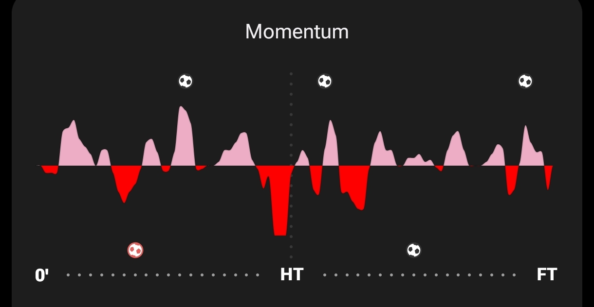

**With extra time (AET):** adds the FT dotted divider and an AET tail; here a
red-card marker (the red block at FT) is shown too.

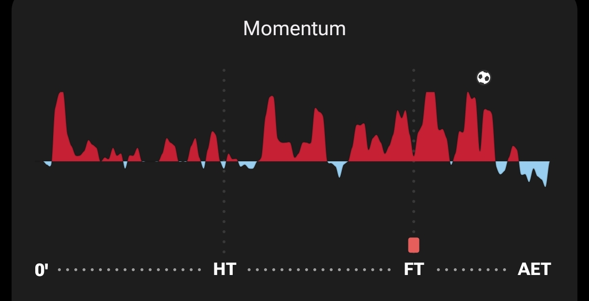

### Data model

- **Per-minute signed value.** For each minute `m` (1…90 or 1…120) produce a
  momentum value in **−100…+100**, where the **sign = which team** holds momentum
  and the **magnitude = intensity** (1–100). **100 is the absolute extreme**,
  reached only when a team is *really* on top. It is **not** a static 0/100 — it's
  a real derived range.
- **Derivation order:** `goals → stats → momentum`. Momentum is derived from goals
  and the generated stats, so **~85% of the time a goal occurs, momentum reflects
  it** (the scoring team holds momentum around that minute). It isn't "real" but is
  *effectively* real because it derives from the same data.
- **Markers on the axis:** goals (ball icon), **red cards**, and **own goals**
  (§9) are plotted at their minute. HT (and FT for AET) are **dotted Y-axis
  dividers**; X-axis = minutes, ticked.

### Rendering — hybrid (decided)

- **Axes:** X = minutes with `0' … HT … FT (… AET)` labels and dotted dividers at
  the breaks; Y = signed momentum, team colour above vs below the centreline
  (use the two mode/team accents, e.g. accent vs red).
- **Marks — hybrid (locked):** the underlying **data model is per-minute** (the
  raw notes' "rectangle per minute" — equal-width, magnitude = height, above/below
  by team), and it is **rendered as a smoothed/rounded filled area** for polish, as
  in the reference screenshots. So it's honest data *and* a broadcast-quality curve:
  per-minute values drive a smoothed area, not literal hard bars. (This is the
  confirmed choice — no bars-only fallback.)
- **Live reveal:** in the Deep Match, the smoothed area fills left-to-right on the
  0.5s/min clock, one minute at a time from the per-minute series; in the static
  stats screen it renders complete.

### UX notes

- Momentum is a **narrative** device — it answers "who was on top, when?" at a
  glance and makes the goal markers legible against the flow. Keep the centreline
  crisp and the two team colours unambiguous (respect the colour-blind-safe
  guidance — don't rely on hue alone; the above/below split already encodes team).
- Markers must not drown the curve — small, high-contrast, on the axis, not
  floating in the fill.

### Implementation pointers

- Generate the series deterministically in
  [`src/engine/match-detail.ts`](../src/engine/match-detail.ts) from the match
  seed (mulberry32, `src/lib/rng.ts`), *after* goals and stats are known, so the
  `goals → stats → momentum` order holds and re-opening reproduces it exactly.
- Render with `react-native-svg` (already a dep). A `<Momentum>` component takes
  `series: number[]` (signed), `breaks: { ht, ft? }`, `markers: {minute, kind}[]`,
  `accentA`, `accentB`. Shared by the Deep Match and the §10 screen.
- Add to `scripts/verify-match-detail.ts`: series length matches match length;
  values within −100…100; the "goal ⇒ momentum toward scorer ≈85%" aggregate
  holds over thousands of sims; markers land on real event minutes.

### Acceptance criteria

- [ ] Deterministic per-minute signed series (−100…100) derived after goals+stats.
- [ ] ~85% of goals show momentum toward the scoring team at that minute
  (verified in aggregate).
- [ ] HT (and FT for AET) dotted dividers; goals, red cards, own goals marked on
  the axis.
- [ ] One shared component renders both the live (progressive) and static (full)
  views.

---

## 9. Own goals, penalties & mistakes

New match events layered onto the result-first engine, feeding both stats
attribution and the momentum/timeline.

### Events

- **Own goals.** A goal can become an own goal: instead of the attacker scoring,
  an **opposition defender** puts it in their own net. **Rare**, and when it
  happens the scorer is a **defender 90%** of the time, **10%** any other position
  **including the goalkeeper**. Counts for the *benefiting* team's scoreline;
  attributed as an OG against the *scorer's* record (not a normal goal).
- **Penalties.** Some goals become **penalties**. This introduces a **new stat:
  the player who *won* the penalty** (drew the foul). The penalty taker is
  credited normally (with a "(pen)" marker); the winner gets the new "penalty won"
  credit.
- **Mistakes.** Events where a player's error **leads to** a goal (consistent with
  `goals → stats`, i.e. the goal exists first and the mistake is the attributed
  cause). Surfaced in the timeline/stat line as an error-leading-to-goal.

### Requirements

- **R1** — OG rarity + the 90/10 defender-vs-anyone (incl. GK) split.
- **R2** — Penalty conversion of some goals; **new "penalty won" stat** for the
  fouled player; taker marked "(pen)".
- **R3** — Mistakes attributed as "error led to goal".
- **R4** — All three appear in the **timeline** and the **momentum axis markers**
  (OGs and red cards explicitly called out in §8), and in per-player stat lines.
- **R5** — Attribution follows **attribute-once-store-on-match**: decided when the
  result is created, stored on the match, so live reveal, Deep Match, stats screen,
  and history all agree. Shootout kicks still never count as goals.

### UX notes

- **Markers on the reference:** the FotMob timeline shows exactly the vocabulary we
  need — **"Own goal"** label, **"Penalty"** label, running score in parentheses,
  and assist attribution — so mirror that labelling (team names, not crests).
- OGs are a *gut-punch/comedy* beat; make the marker unmistakable (distinct icon,
  the scoring shown for the correct team) so it never reads as a normal goal by the
  conceding side.

### Implementation pointers

- Decide the events in the **result-first** layer /
  [`src/engine/match.ts`](../src/engine/match.ts) &
  [`src/engine/match-detail.ts`](../src/engine/match-detail.ts) (seed-driven), then
  **attribute** in [`src/engine/stats.ts`](../src/engine/stats.ts) alongside the
  existing scorer/assist/clean-sheet attribution. Add "penalty won" and "error led
  to goal" to the per-player stat shape (`src/types/stats.ts`).
- Own-goal position roll (90% DEF / 10% any incl. GK) is a seeded draw over the
  conceding team's on-pitch players.
- Reconcile with momentum (§8) so an OG/penalty minute reads correctly (momentum to
  the *benefiting* team).
- Extend `scripts/verify-match-detail.ts`: OG rate is rare and matches the 90/10
  split over many sims; every penalty has a distinct winner ≠ taker's own-goal;
  totals still reconcile (OGs count for the right team; no double-count).

### Acceptance criteria

- [ ] OGs are rare with the 90/10 split; credited to the benefiting team, marked as
  OG against the scorer.
- [ ] Penalties mark the taker "(pen)" and credit a distinct "penalty won" player.
- [ ] Mistakes show as "error led to goal".
- [ ] All three appear in timeline + momentum markers + per-player stats and are
  consistent across live/Deep/stats/history (attribute-once).

---

## 10. Match Stats screen redesign (dedicated screen)

### Problem

The current match stats live in a **modal** with a single long strip / timeline.
It's cramped, added time isn't shown per half, and there's no room for momentum or
the richer breakdown.

**Current timeline (what we're upgrading from):**

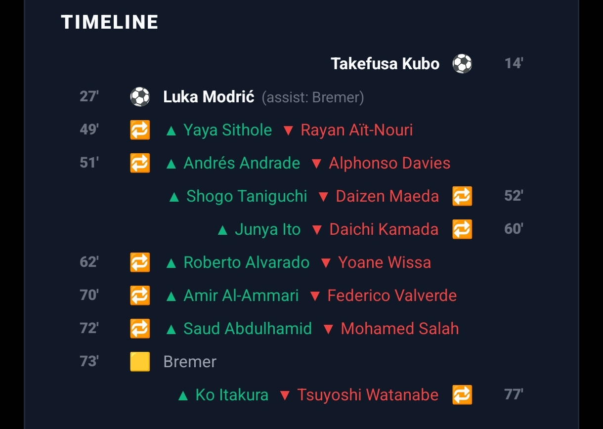

### Target

Promote match stats to a **dedicated screen** (not a modal), with **more spacing**
and **categorised sections** instead of one long strip. Also **show added time for
each half**, and **show penalties** in the timeline. The FotMob layout is the
visual reference; **we show team names, not crests.**

**Top of screen — header:** team names, big score, "FT" (or AET/pens), and the
scorer lists under each team with **(Pen)** and **(OG)** markers.

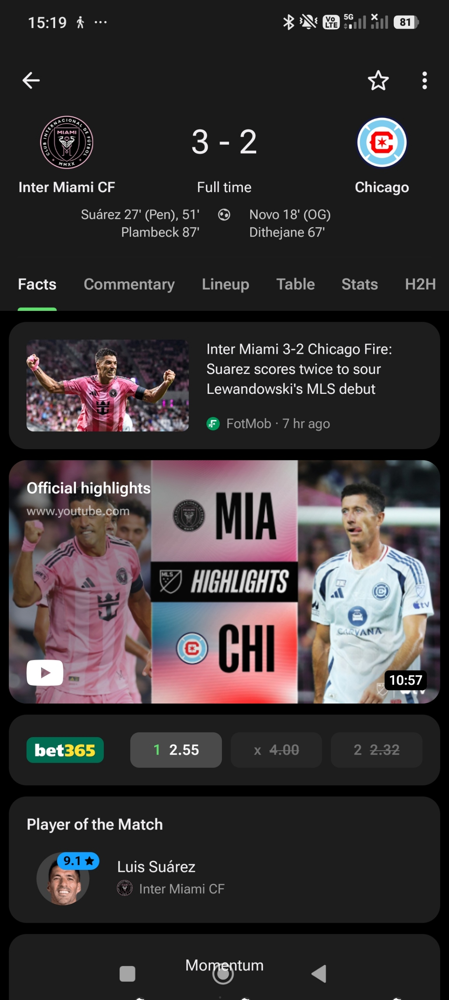

**Section — Momentum + first key stats:** the §8 momentum graph, then
possession, xG, shots, shots on target, touches in box, with the **leading team's
value highlighted** in a colour pill.

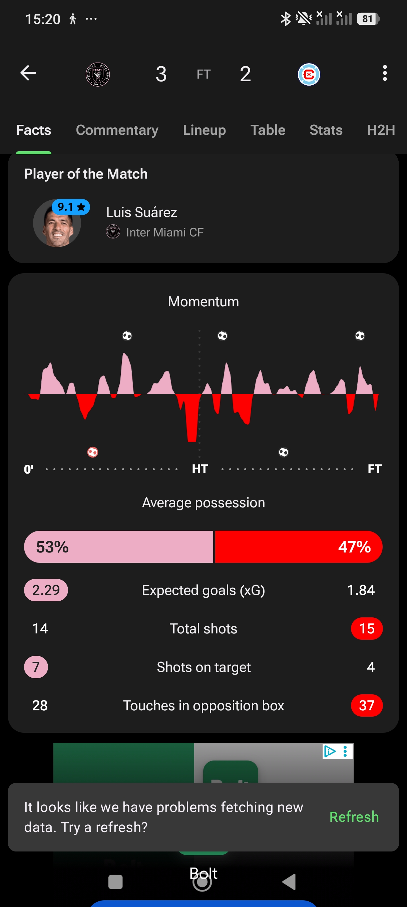

**Section — Timeline:** running score in parentheses, **HT divider with the
half-time score**, goals (with **Penalty** / **Own goal** / **assist by** labels),
subs (green in / red out), cards; **per-half added time** shown.

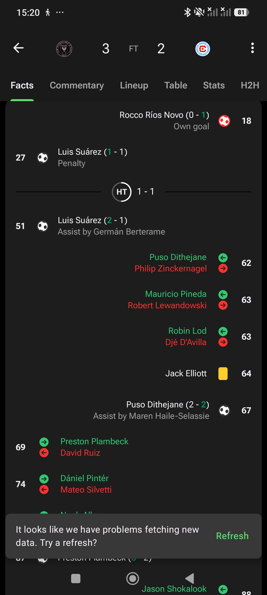

**Section — Context at the moment of the match:** the **standings as they were
when this match was played** (e.g. if it was matchday 7, the table after MD7),
**top-3 rated players from each team**, and **each team's last 5 results** before
this game (with how they finished). Team names throughout (no crests).

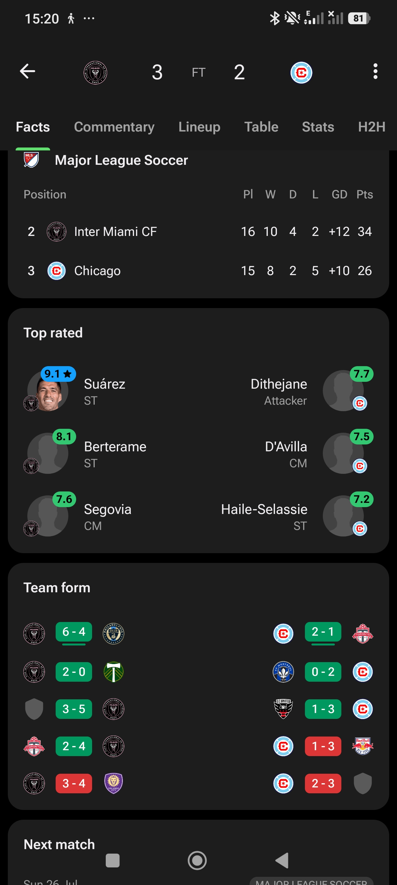

### Requirements

- **R1 — Dedicated screen**, replacing the modal for full stats (a quick peek can
  still link into it).
- **R2 — Header:** team names + score + status (FT/AET/pens) + scorer lists with
  **(Pen)** / **(OG)** markers.
- **R3 — Sections, not a strip:** (a) Momentum + key stats, (b) Timeline, (c)
  Context (standings-at-time / top-rated / last-5 form). Generous spacing.
- **R4 — Added time per half** shown; **penalties** shown in the timeline.
- **R5 — Momentum** embedded (§8). Key stats highlight the leader per row.
- **R6 — Standings "as of" this match** — the table state at that matchday, not the
  final table.
- **R7 — Top-3 rated per team** and **last-5 form per team** (results + W/D/L),
  team names only.
- **R8 — Consistency:** every number matches the Deep Match (§7) and the stored
  seed — attribute-once, regenerate-from-seed.

### UX notes

- **Scannability:** sectioning + a sticky mini-header (score always visible while
  you scroll, as in the FotMob shots) is the core win over the current one-strip
  modal. Group like with like; let each stat breathe.
- **Leader highlight** (colour pill on the higher value) lets the eye compare
  without reading both numbers — keep it, but ensure the pill colour meets
  contrast and doesn't rely on hue alone (pair with weight/position).
- **Standings-as-of** is a lovely context touch — it re-situates the match in the
  season. Reuse the season's table styling for recognition.
- Per repo convention: **no emblems → team names**; keep flag-emoji handling for WC.

### Implementation pointers

- Today's modal:
  [`src/components/MatchDetailModal.tsx`](../src/components/MatchDetailModal.tsx)
  (558 lines) — becomes (or feeds) a screen `app/game/match-stats.tsx`. Keep the
  data source — [`src/engine/match-detail.ts`](../src/engine/match-detail.ts)
  regenerates the sheet from the seed — and re-layout into sections.
- **Standings-as-of:** the season orchestrators already compute per-matchday
  tables ([`src/engine/simulation.ts`](../src/engine/simulation.ts),
  `cl-league-sim.ts`, `world-cup-sim.ts`); thread the matchday index onto the match
  so the screen can pull the table snapshot. If snapshots aren't retained, derive
  from the stored fixtures up to that matchday (deterministic).
- **Top-rated / last-5:** ratings come from `run-stats.ts` (`computeRunStats`
  regenerates ratings from seeds); last-5 from the fixtures preceding the match.
- **Added time / penalties in timeline:** surface fields already implied by the
  event model (§9) — add per-half stoppage to the generated timeline in
  `match-detail.ts`.
- Reuse `LineupPitch`, `ratingColor`, `PressCard`, `withAlpha`, theme tokens;
  follow the modal→screen scroll pattern (`flexShrink: 1` body) so nothing clips.
- **React best-practices:** a long stats screen should virtualise/lazy the heavy
  sections (timeline can be long); memoise section components and derive from one
  regenerated sheet rather than recomputing per section.

### Acceptance criteria

- [ ] Full match stats open as a **screen** with the header / momentum+key-stats /
  timeline / context sections and clear spacing.
- [ ] Header shows team names, score, status, and scorer lists with (Pen)/(OG).
- [ ] Timeline shows per-half added time, penalties, own goals, assists, subs,
  cards, HT divider with score.
- [ ] Context shows standings **as of that matchday**, top-3 rated per team, and
  last-5 form per team — all with team names.
- [ ] Every figure matches the Deep Match and a history reload (seed-consistent);
  `verify-match-detail.ts` green.

---

## 11. Full FIFA World Cup mode (after everything above)

**Only after §§1–10 ship:** build out **Full FIFA World Cup mode** to the same
depth as the custom (full) UEFA Champions League mode — qualifiers, the richer
bracket, tie detail, deep stats, and the Deep Match final. Tracked here as the next
milestone; detailed spec to follow once the shared knockout / Deep-Match / stats
foundations from this document are in place (they're the prerequisites that make
WC-full cheap to build).

---

## Appendix A. Asset checklist

New assets required (add under `assets/`; keep `club_facts.json` and the bundled DB
untouched):

- [ ] **Trophy images** for the win ceremony — real UCL and World Cup trophies
  (the source notes explicitly say to use actual trophy imagery). Provide as
  transparent PNGs sized for the ceremony screen.
- [ ] **Second-place medal** visual for the loss ceremony.
- [ ] **Confetti** — either a Reanimated/particle implementation (no asset) or a
  sprite/lottie; decide per the performance note in §7.
- [ ] Any **event icons** not already in Ionicons (own goal, penalty-won,
  error-led-to-goal) — prefer Ionicons/text markers over new art where
  possible (repo convention: Ionicons, not emoji-as-icon).

> Licensing note: the raw notes say not to worry about copyright for the trophy
> images. That's the author's call for a personal/unreleased build; flagging it
> here so it's a conscious decision if the app is ever distributed.

---

## Appendix B. Resolved decisions

Every open question from the first draft has been answered. Recorded here so the
"why" survives:

1. **Momentum marks — hybrid (§8).** Per-minute data model, rendered as a
   **smoothed filled area**. No bars-only fallback.
2. **Deep Match ceremony audio (§7).** **No audio at all** — both win and loss
   ceremonies are silent; contrast is carried by visuals only.
3. **Back-guard behaviour (§3).** It's an **anti-cheese guard**: OS-back must never
   let a player rewind a decided sim to re-roll it (real exploit — a player re-ran a
   lost match). Behaviour = **finality confirm** ("result is final") whose only
   outcomes are *quit the run* or *stay* — never *rewind and re-simulate*.
4. **Era-mode historical data (§6).** **Remove** Era from all live surfaces; keep
   readers tolerant and **label old rows "Era (retired)"**; never delete/rewrite
   historical data.
5. **"Top-10 leagues" (§4).** **Top 10 by UEFA coefficient**, sourced from the
   existing [`src/data/uefa-coefficients.ts`](../src/data/uefa-coefficients.ts).
6. **Deep Match availability (§7).** **All three knockout competitions:** UEFA
   Champions League (classic), custom UEFA Champions League (full), and FIFA World
   Cup — finals only, for now.
7. **Competition naming.** UI labels become the full official forms everywhere:
   **"UEFA Champions League"** and **"FIFA World Cup"** (internal mode ids
   unchanged). See the naming note at the top of this doc.
8. **Deliverable format.** Markdown in `docs/` only — no HTML version needed.

---

## Appendix C. Suggested commit message

From the source notes (kept, lightly tidied):

```
UPDATE TO MATCH STATS SCREEN AND SMALL SIMULATION

- Match stats promoted to a dedicated screen with categorised sections
  (header / momentum + key stats / timeline / context) and per-half added time
- Penalties, Own Goals and Mistakes events + attribution ("penalty won",
  "error led to goal")
- Match Momentum (per-minute data, seed-derived, smoothed-area render) — live in
  the Deep Match and static in the stats screen
- Deep Simulation Match for finals (UEFA Champions League, custom UCL, and FIFA
  World Cup) — silent win/lose ceremonies
- Major fixes / UI redesigns: unified knockout view, final standings at the
  league→qualifiers hand-off, competitions renamed to "UEFA Champions League" /
  "FIFA World Cup"
- Minor fixes: draft (phantom highlight, hidden-rating A–Z sort), subs team,
  chaos ineligible-player hiding; weighted picks (top-10 by UEFA coefficient);
  Android back-guard (anti-reroll); Era mode removed (historical rows kept +
  labelled "Era (retired)")
```

---

## Appendix D. Screenshot index

All in [`docs/image/BigFixes/`](image/BigFixes), listed in the order they appear
in the raw notes.

| #  | File                  | Shows                                             | Used in |
| -- | --------------------- | ------------------------------------------------- | ------- |
| 1  | `1784839328774.jpg` | CL (full) knockout list — the clean target style | §1     |
| 2  | `1784839335931.jpg` | Current WC knockouts (stale "Group Stage" header) | §1     |
| 3  | `1784839343505.jpg` | Target: WC data in the unified style              | §1     |
| 4  | `1784839371500.jpg` | Tappable tie detail (legs / agg / ET / shootout)  | §1     |
| 5  | `1784839384698.jpg` | Current "QUALIFIED!" transition (no table)        | §2     |
| 6  | `1784839397444.jpg` | Current "Super Liga CHAMPIONS" entry (no table)   | §2     |
| 7  | `1784839422643.jpg` | Momentum reference — 90 minutes                  | §8     |
| 8  | `1784839426249.jpg` | Momentum reference — with AET + red-card marker  | §8     |
| 9  | `1784839441897.jpg` | Current match timeline (upgrading from)           | §10    |
| 10 | `1784839457268.jpg` | Stats header reference (team names, (Pen)/(OG))   | §10    |
| 11 | `1784839465857.jpg` | Momentum + key stats reference                    | §10    |
| 12 | `1784839474791.jpg` | Timeline reference (running score, OG/Pen labels) | §10    |
| 13 | `1784839482015.jpg` | Context reference (standings / top-rated / form)  | §10    |
