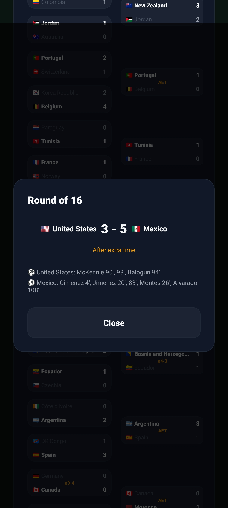
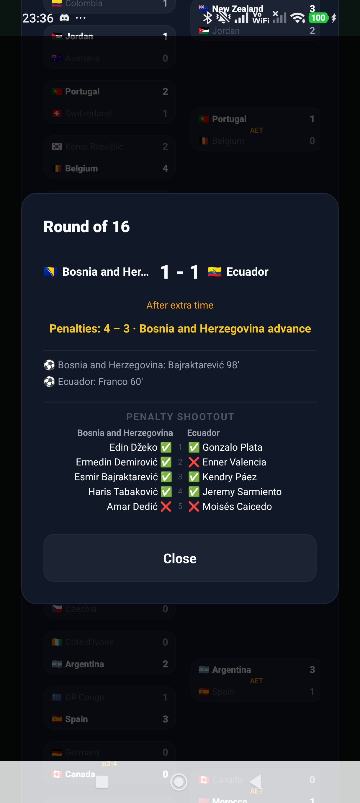
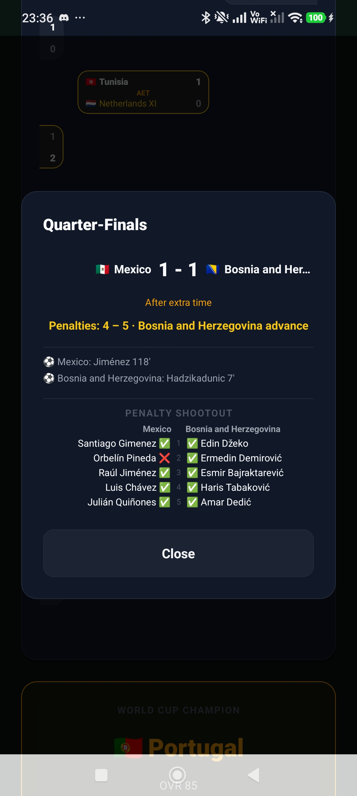
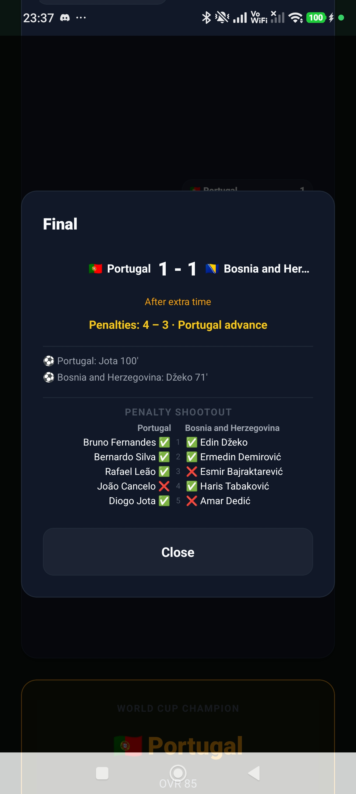

ERROR  [Error: Rendered fewer hooks than expected. This may be caused by an accidental early return statement.]

Call Stack

  finishRenderingHooks (node_modules\react-native\Libraries\Renderer\implementations\ReactFabric-dev.js)

  renderWithHooks (node_modules\react-native\Libraries\Renderer\implementations\ReactFabric-dev.js)

  updateFunctionComponent (node_modules\react-native\Libraries\Renderer\implementations\ReactFabric-dev.js)

  beginWork (node_modules\react-native\Libraries\Renderer\implementations\ReactFabric-dev.js)

  runWithFiberInDEV (node_modules\react-native\Libraries\Renderer\implementations\ReactFabric-dev.js)

  performUnitOfWork (node_modules\react-native\Libraries\Renderer\implementations\ReactFabric-dev.js)

  workLoopSync (node_modules\react-native\Libraries\Renderer\implementations\ReactFabric-dev.js)

  renderRootSync (node_modules\react-native\Libraries\Renderer\implementations\ReactFabric-dev.js)

  performWorkOnRoot (node_modules\react-native\Libraries\Renderer\implementations\ReactFabric-dev.js)

  performSyncWorkOnRoot (node_modules\react-native\Libraries\Renderer\implementations\ReactFabric-dev.js)

  flushSyncWorkAcrossRoots_impl (node_modules\react-native\Libraries\Renderer\implementations\ReactFabric-dev.js)

  processRootScheduleInMicrotask (node_modules\react-native\Libraries\Renderer\implementations\ReactFabric-dev.js)

  scheduleMicrotask$argument_0 (node_modules\react-native\Libraries\Renderer\implementations\ReactFabric-dev.js)

Call Stack

  BaseRoute (node_modules\expo-router\build\useScreens.js)

  SceneView (node_modules\@react-navigation\core\lib\module\SceneView.js)

  render (node_modules\@react-navigation\core\lib\module\useDescriptors.js)

  routes.reduce$argument_0 (node_modules\@react-navigation\core\lib\module\useDescriptors.js)

  reduce (`<native>`)

  useDescriptors (node_modules\@react-navigation\core\lib\module\useDescriptors.js)

  useNavigationBuilder (node_modules\@react-navigation\core\lib\module\useNavigationBuilder.js)

  NativeStackNavigator (node_modules\expo-router\build\fork\native-stack\createNativeStackNavigator.js)

  `<anonymous>` (node_modules\expo-router\build\layouts\withLayoutContext.js)

  Object.assign$argument_0 (node_modules\expo-router\build\layouts\StackClient.js)

  GameLayout (app\game\_layout.tsx)

  BaseRoute (node_modules\expo-router\build\useScreens.js)

  SceneView (node_modules\@react-navigation\core\lib\module\SceneView.js)

  render (node_modules\@react-navigation\core\lib\module\useDescriptors.js)

  routes.reduce$argument_0 (node_modules\@react-navigation\core\lib\module\useDescriptors.js)

  reduce (`<native>`)

  useDescriptors (node_modules\@react-navigation\core\lib\module\useDescriptors.js)

  useNavigationBuilder (node_modules\@react-navigation\core\lib\module\useNavigationBuilder.js)

  NativeStackNavigator (node_modules\expo-router\build\fork\native-stack\createNativeStackNavigator.js)

  `<anonymous>` (node_modules\expo-router\build\layouts\withLayoutContext.js)

  Object.assign$argument_0 (node_modules\expo-router\build\layouts\StackClient.js)

  RootLayout (app\_layout.tsx)

  BaseRoute (node_modules\expo-router\build\useScreens.js)

  SceneView (node_modules\@react-navigation\core\lib\module\SceneView.js)

  render (node_modules\@react-navigation\core\lib\module\useDescriptors.js)

  routes.reduce$argument_0 (node_modules\@react-navigation\core\lib\module\useDescriptors.js)

  reduce (`<native>`)

  useDescriptors (node_modules\@react-navigation\core\lib\module\useDescriptors.js)

  useNavigationBuilder (node_modules\@react-navigation\core\lib\module\useNavigationBuilder.js)

  Content (node_modules\expo-router\build\ExpoRoot.js)

  ContextNavigator (node_modules\expo-router\build\ExpoRoot.js)

  ExpoRoot (node_modules\expo-router\build\ExpoRoot.js)

  App (node_modules\expo-router\build\qualified-entry.js)

  WithDevTools (node_modules\expo\src\launch\withDevTools.tsx)

Waiting to start

2m 2s

```
Created  @ Thu, 25 Jun 2026 21:32:56 GMT, waiting for concurrency.Enqueued @ Thu, 25 Jun 2026 21:33:04 GMT, waiting for available worker.Started  @ Thu, 25 Jun 2026 21:34:58 GMT.
```

Spin up build environment

8ms

```
AMD, 4 vCPUs, 15.62 GB RAMUsing image "ubuntu-24.04-jdk-17-ndk-r27b" based on "ubuntu-2404-noble-amd64-v20250805"Installed software:- NDK 27.1.12297006- Node.js 20.19.4- Bun 1.2.20- Yarn 1.22.22- pnpm 10.14.0- npm 10.9.3- Java 17- node-gyp 11.3.0- Maestro 2.0.2Project environment variables:  EAS_USE_CACHE=1  EAS_USE_NPM_CACHE=0  __API_SERVER_URL=https://api.expo.dev/Environment secrets:  EXPO_TOKEN=********EAS Build environment variables:  NVM_INC=/home/expo/.nvm/versions/node/v20.19.4/include/node  HOSTNAME=turtle-worker-4ae070c6426d  JAVA_HOME=/usr/lib/jvm/java-17-openjdk-amd64  WORKER_TARBALL_URL=https://storage.googleapis.com/eas-build-worker-tarballs/worker-android-production.tar.gz  PWD=/usr/local/eas-build-worker  HOME=/home/expo  ANDROID_NDK_HOME=/home/expo/Android/Sdk/ndk/27.1.12297006  NVM_DIR=/home/expo/.nvm  ANDROID_HOME=/home/expo/Android/Sdk  SHLVL=1  ANDROID_SDK_ROOT=/home/expo/Android/Sdk  PATH=/home/expo/workingdir/bin:/home/expo/.nvm/versions/node/v20.19.4/bin:/opt/bundletool:/home/expo/Android/Sdk/build-tools/29.0.3:/home/expo/Android/Sdk/build-tools/35.0.0:/home/expo/Android/Sdk/ndk/27.1.12297006:/home/expo/Android/Sdk/cmdline-tools/tools/bin:/home/expo/Android/Sdk/tools:/home/expo/Android/Sdk/tools/bin:/home/expo/Android/Sdk/platform-tools:/usr/local/sbin:/usr/local/bin:/usr/sbin:/usr/bin:/sbin:/bin:/snap/bin:/home/expo/.bun/bin  LOGGER_LEVEL=debug  NVM_BIN=/home/expo/.nvm/versions/node/v20.19.4/bin  EAS_BUILD_WORKER_DIR=/home/expo/eas-build-worker  OLDPWD=/home/expo  _=/home/expo/.nvm/versions/node/v20.19.4/bin/node  CI=1  MAESTRO_DRIVER_STARTUP_TIMEOUT=120000  MAESTRO_CLI_NO_ANALYTICS=1  EAS_BUILD=true  EAS_BUILD_RUNNER=eas-build  EAS_BUILD_PLATFORM=android  EAS_CLI_SENTRY_DSN=https://ca4734dc503543b28d55fdaf0563f61c@o30871.ingest.sentry.io/1837720  NVM_NODEJS_ORG_MIRROR=http://nodejs.production.caches.eas-build.internal  EAS_BUILD_PROFILE=development  EAS_BUILD_GIT_COMMIT_HASH=5780cb2142aecc42c42017afc56a5e5c2aa243cf  EAS_BUILD_ID=9c614f4c-fc94-4d6b-8090-4ae070c6426d  LANG=en_US.UTF-8  EAS_BUILD_WORKINGDIR=/home/expo/workingdir/build  EAS_BUILD_PROJECT_ID=eebf5b96-e62d-478e-89d9-955e71192983  ANDROID_CCACHE=/usr/bin/ccache  EAS_BUILD_MAVEN_CACHE_URL=http://maven.production.caches.eas-build.internal  GRADLE_OPTS=-Dorg.gradle.jvmargs="-XX:MaxMetaspaceSize=1g -Xmx4g -XX:+HeapDumpOnOutOfMemoryError -Dfile.encoding=UTF-8" -Dorg.gradle.parallel=true -Dorg.gradle.daemon=false  EAS_BUILD_ANDROID_VERSION_CODE=1  EAS_BUILD_USERNAME=yolotime4564  __EAS_BUILD_ENVS_DIR=/home/expo/workingdir/envBuilder is ready, starting build
```

Read eas.json

2ms

```
Using eas.json:{
  "cli": {
    "version": ">= 16.28.0",
    "appVersionSource": "remote"
  },
  "build": {
    "development": {
      "developmentClient": true,
      "distribution": "internal"
    },
    "preview": {
      "distribution": "internal"
    },
    "production": {
      "autoIncrement": true
    }
  },
  "submit": {
    "production": {}
  }
}
```

Read package.json

2ms

```
Using package.json:{
  "name": "perfection-or-misery",
  "version": "0.0.1",
  "main": "expo-router/entry",
  "dependencies": {
    "@react-native-async-storage/async-storage": "2.2.0",
    "@supabase/supabase-js": "^2.107.0",
    "d3-geo": "^3.1.1",
    "expo": "~54.0.35",
    "expo-asset": "~12.0.13",
    "expo-constants": "~18.0.13",
    "expo-dev-client": "~6.0.21",
    "expo-file-system": "~19.0.23",
    "expo-haptics": "~15.0.8",
    "expo-image": "~3.0.11",
    "expo-linking": "~8.0.12",
    "expo-modules-core": "~3.0.30",
    "expo-navigation-bar": "~5.0.10",
    "expo-router": "~6.0.24",
    "expo-sharing": "~14.0.8",
    "expo-sqlite": "~16.0.10",
    "expo-status-bar": "~3.0.9",
    "react": "19.1.0",
    "react-native": "0.81.5",
    "react-native-chart-kit": "^6.12.3",
    "react-native-gesture-handler": "~2.28.0",
    "react-native-mmkv": "^4.3.1",
    "react-native-reanimated": "^3.16.7",
    "react-native-safe-area-context": "~5.6.0",
    "react-native-screens": "~4.16.0",
    "react-native-svg": "^15.15.5",
    "react-native-view-shot": "4.0.3",
    "typescript": "~5.9.2",
    "zustand": "^5.0.14"
  },
  "devDependencies": {
    "@types/better-sqlite3": "^7.6.13",
    "@types/d3-geo": "^3.1.0",
    "@types/react": "~19.2.2",
    "@types/topojson-client": "^3.1.5",
    "better-sqlite3": "^12.10.0",
    "node-html-parser": "^7.1.0",
    "topojson-client": "^3.1.0",
    "tsx": "^4.22.4",
    "typescript": "~6.0.3",
    "world-atlas": "^2.0.2"
  },
  "scripts": {
    "start": "expo start",
    "android": "expo run:android",
    "ios": "expo run:ios",
    "web": "expo start --web",
    "build-db": "tsx scripts/build-db.ts"
  },
  "private": true
}
```

Install dependencies

1s

```
Running "npm ci --include=dev" in /home/expo/workingdir/build directorynpm warn ERESOLVE overriding peer dependencynpm warn While resolving: @expo/require-utils@55.0.5npm warn Found: typescript@6.0.3npm warn node_modules/typescriptnpm warn   dev typescript@"~6.0.3" from the root projectnpm warnnpm warn Could not resolve dependency:npm warn peerOptional typescript@"^5.0.0 || ^5.0.0-0" from @expo/require-utils@55.0.5npm warn node_modules/@expo/require-utilsnpm warn   @expo/require-utils@"^55.0.5" from @expo/image-utils@0.8.14npm warn   node_modules/@expo/image-utilsnpm warnnpm warn Conflicting peer dependency: typescript@5.9.3npm warn node_modules/typescriptnpm warn   peerOptional typescript@"^5.0.0 || ^5.0.0-0" from @expo/require-utils@55.0.5npm warn   node_modules/@expo/require-utilsnpm warn     @expo/require-utils@"^55.0.5" from @expo/image-utils@0.8.14npm warn     node_modules/@expo/image-utilsnpm error code ERESOLVEnpm error ERESOLVE could not resolvenpm errornpm error While resolving: react-dom@19.2.7npm error Found: react@19.1.0npm error node_modules/reactnpm error   react@"19.1.0" from the root projectnpm error   peerOptional react@"*" from @expo/devtools@0.1.8npm error   node_modules/@expo/devtoolsnpm error     @expo/devtools@"0.1.8" from expo@54.0.35npm error     node_modules/exponpm error       expo@"~54.0.35" from the root projectnpm error       22 more (@expo/cli, @expo/metro-config, @expo/metro-runtime, ...)npm error   62 more (@expo/metro-runtime, @expo/vector-icons, ...)npm errornpm error Could not resolve dependency:npm error peer react@"^19.2.7" from react-dom@19.2.7npm error node_modules/react-domnpm error   peerOptional react-dom@"*" from @expo/metro-runtime@6.1.2npm error   node_modules/@expo/metro-runtimenpm error     peerOptional @expo/metro-runtime@"*" from expo@54.0.35npm error     1 more (expo-router)npm error   peer react-dom@"^16.8 || ^17.0 || ^18.0 || ^19.0 || ^19.0.0-rc" from @radix-ui/react-collection@1.1.9npm error   node_modules/@radix-ui/react-collectionnpm error     @radix-ui/react-collection@"1.1.9" from @radix-ui/react-roving-focus@1.1.12npm error     node_modules/@radix-ui/react-roving-focusnpm error       @radix-ui/react-roving-focus@"1.1.12" from @radix-ui/react-tabs@1.1.14npm error       node_modules/@radix-ui/react-tabsnpm error   10 more (@radix-ui/react-dialog, ...)npm errornpm error Conflicting peer dependency: react@19.2.7npm error node_modules/reactnpm error   peer react@"^19.2.7" from react-dom@19.2.7npm error   node_modules/react-domnpm error     peerOptional react-dom@"*" from @expo/metro-runtime@6.1.2npm error     node_modules/@expo/metro-runtimenpm error       peerOptional @expo/metro-runtime@"*" from expo@54.0.35npm error       1 more (expo-router)npm error     peer react-dom@"^16.8 || ^17.0 || ^18.0 || ^19.0 || ^19.0.0-rc" from @radix-ui/react-collection@1.1.9npm error     node_modules/@radix-ui/react-collectionnpm error       @radix-ui/react-collection@"1.1.9" from @radix-ui/react-roving-focus@1.1.12npm error       node_modules/@radix-ui/react-roving-focusnpm error         @radix-ui/react-roving-focus@"1.1.12" from @radix-ui/react-tabs@1.1.14npm error         node_modules/@radix-ui/react-tabsnpm error     10 more (@radix-ui/react-dialog, ...)npm errornpm error Fix the upstream dependency conflict, or retrynpm error this command with --force or --legacy-peer-depsnpm error to accept an incorrect (and potentially broken) dependency resolution.npm errornpm errornpm error For a full report see:npm error /home/expo/.npm/_logs/2026-06-25T21_34_59_426Z-eresolve-report.txtnpm error A complete log of this run can be found in: /home/expo/.npm/_logs/2026-06-25T21_34_59_426Z-debug-0.log
```

npm ci --include=dev exited with non-zero code: 1

Fail job

1ms

```

```

Build failed  npm ci --include=dev exited with non-zero code: 1


screenshots for AET minutes combinations, more math need to be put behind it









