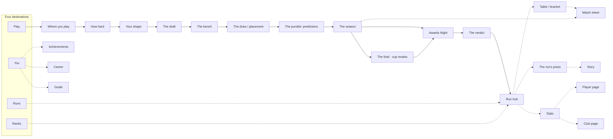

# 04 · Direction: Kit Drop, "Winner Stays" cut

> Part of the UI overhaul set. Start at [`00-README.md`](00-README.md).
> Status: **locked** by the maintainer on 14 September 2026, after two rolled rounds and a steer.
> Next in the set: the system in [`05-STYLE-GUIDE.md`](05-STYLE-GUIDE.md), the motion in [`06-MOTION.md`](06-MOTION.md).

This document argues for decisions before it shows anything. Section 1 is the direction contract. Section 2 is the world it describes. Section 3 is ten pitches, one per workflow, each saying what's wrong, what we bet on and where the work could go sideways. Section 4 is the lay of the land. Section 5 records every direction that was considered and why it lost.

---

## 1. The contract

```
THESIS       A run is a kickabout that becomes a final. It starts in the
             stockroom and ends under floodlights. It refuses the dark navy
             stat dashboard every football app ships.

OWN-WORLD    White cotton and black nylon grounds, chosen by phase. Safety
             orange for you and what you hold. Boot volt for perfection.
             Hazard stripes for anything out. Extra-condensed heavy italic
             caps, a garment-tag mono, straight-quoted labels, riveted plates
             for what matters, plain rules for everything else.

STORY        You pull a squad off the rack, get thrown into a real
             competition, and find out which label gets stitched on.

FIRST VIEW   Home: "PERFECTION" huge in italic caps over a hazard-striped
             "MISERY"; one orange plate, START A RUN, in the thumb zone;
             your last three runs below as garment labels.

FORM         Industrial streetwear grammar fused with 2014 boot-launch
             energy. Chosen by the maintainer's steer over round two.
```

---

## 2. The world

### 2.1 Where it comes from

Two cultural sources, fused.

**Industrial streetwear grammar.** The 2010s wave that put straight quotation marks around ordinary words, left zip-tie tags on the garment, and ran hazard stripes across white cotton and black nylon. Young football fans don't just watch the game in this language; they wear it. Club collaborations with streetwear labels, "blokecore", retro shirts worn as fashion: the kit is how this audience carries football around.

**The 2014 boot-launch advert.** Nike Football's "Winner Stays" (2014 World Cup, scored with Eagles of Death Metal's "Miss Alissa") is the reference the maintainer named. A park kickabout between friends becomes a stadium showdown as each kid imagines himself as one of the game's stars, and the losing side has to walk off. The grammar: hard cuts, speed ramps, scale jumps from a park to a stadium in one frame, big condensed supers, handheld urgency.

That second source is uncannily close to what PoM already is. You draft a squad out of the game's greatest club-seasons, and the season decides whether you stay or walk.

**Inspired, never copied.** No swoosh, no slogans from any campaign, no brand names in the interface, no licensed typefaces. The reference informs rhythm, scale and attitude.

### 2.2 The grounds, and why there are two

Dark or light is never a default here; the scene decides. A PoM run has two scenes:

- **The stockroom** is where you choose and read: mode, formation, the draft, stats, match sheets, your runs. It happens on the bus at lunch as often as in bed. Daylight reading wants **white cotton**.
- **The floodlights** are where things happen to you: the live season, knockout nights, the Deep Match, the ceremony, and every Misery verdict. That wants **black nylon**.

The switch between them is part of the story, not a theme toggle. Walking out of the draft and into the season is literally the lights going on.

### 2.3 Colour as data

| Role | What it means, everywhere | Never used for |
|---|---|---|
| **Safety orange** (the zip-tie tag) | You. Your XI, the player you're holding, the primary action on the screen | Decoration, other clubs, errors |
| **Boot volt** | Perfection: a win, through, promoted, the good end of the ladder | Buttons, links, "selected" |
| **Hazard stripe** (a pattern, not a colour) | Out: a loss, eliminated, relegated, suspended, disabled | Anything that is still in play |
| **Ink black and cotton white** | Everything else. Most of every screen | n/a |
| **Colourway tape** | Which competition you're in: World Cup tricolour (`#3CAC3B` `#2A398D` `#E61D25`), Champions League cobalt, Chaos red, Cursed violet, and in league modes the primary colour of the club you replaced | Meaning anything beyond "where you are" |

The hazard stripe is the most important choice in the set. It makes Misery a texture instead of a red, so it reads for colour-blind players, in greyscale screenshots, and at a glance in a dense table.

### 2.4 Type

Three voices, each with one job. Exact faces are provisional until the first build ([`05-STYLE-GUIDE.md`](05-STYLE-GUIDE.md) §3).

- **The super.** Extra-condensed, heavy, italic caps. Verdicts, the home lockup, round names, the scoreline on a final. Big or not at all.
- **The tag.** A mono, set small in caps, for garment-label data: `ID BAR-11/12`, `POS ST`, `OVR 91`, `MD 23/38`.
- **The workhorse.** A plain grotesque with tabular figures for tables, stats, stories and every sentence a player has to read.

Straight quotation marks name the obvious: `"YOUR XI"`, `"MISERY"`. They are used on names and states of one to three words, never on sentences.

### 2.5 Surfaces

- **Riveted label plates** (a rectangle with four rivet dots) are reserved for things that matter: the player you're holding, the verdict, a primary button, a run in your history.
- **Everything else is rules.** Tables, lists, stats and feeds sit directly on the ground, separated by hairlines. No card per row.
- **Corners are square.** The only rounded shapes are rivets, flags and the zip-tie tag itself.
- **Depth comes from print, not blur:** a 2px offset shadow in ink, like a label pressed onto fabric. No drop shadows, no glass, no glows.

### 2.6 Motion in one paragraph

Cuts, not fades, between scenes. Springs with no bounce for everything functional, one overshoot reserved for the tag swinging when you pick something. Scale jumps for the big moments: the verdict arrives huge and settles. The draft spin is a rack of kit tags whipping past with motion blur and snapping onto one. Full detail in [`06-MOTION.md`](06-MOTION.md).

### 2.7 Honest risks, and the rules that answer them

| Risk | Rule |
|---|---|
| Pastiche of one fashion label | No brand names, no logos, no copied slogans. Quotes only on one-to-three-word labels, at most one quoted label per region of a screen. |
| Stripes that hurt reading | Hazard stripes live on edges, badges and tapes. Never under running text. |
| A white ground breaks "football app" expectations | The floodlight half of the run is black, and it's the half that carries the emotion. |
| Condensed italic is hard to read small | The super never goes below 22px. Everything a player must read is in the workhorse. |
| Orange everywhere dilutes "you" | One orange primary action per screen. Other actions are ink outlines. |
| Italic energy fights dense tables | T3 screens (match stats, leaderboards) use the workhorse only; the super appears once as the screen's title at most. |
| Too close to the maintainer's other game (§2.8) | The separation rules below. |

### 2.8 The sibling check: Become a Legend's "THE KIT"

Become a Legend, the maintainer's football career game, locked its own world in July 2026: **"THE KIT"**, where football-shirt graphics are the interface. Both games now dress football in clothing, share square corners, a floodlit dark ground and a fluoro orange. Two sibling apps that look alike weaken both, so the line between them is written down.

| | Become a Legend · THE KIT | Perfection or Misery · Kit Drop |
|---|---|---|
| **The object** | The shirt's **graphic devices**: hoops, stripes, sashes, halves, chevrons | The garment's **trims and retail**: care labels, rivets, zip-tie tags, hazard tape, quoted labels, ID codes |
| **A club is** | Its kit device and colours | A three-letter code on a colour tape |
| **Grounds** | Green-shifted ink (turf under floodlight), chalk body copy | Neutral white cotton and black nylon, by phase |
| **Type** | Drawn block letterforms, no font files | Fonted extra-condensed italic caps, a tag mono, a grotesque |
| **Semantic colour** | Four training-bib colours | One orange (you), one volt (Perfection), a pattern (out) |
| **Motion** | A transfer restripes the surface | Advert cuts, speed ramps, the tag swing, the stitched verdict |

**Rules for PoM**

1. **No shirt devices as surfaces.** Hoops, sashes, halves and pinstripes never appear in PoM. The only stripe is the 45° hazard stripe, and it always means out.
2. **No green-shifted grounds**, and no chalk-cream body copy.
3. **No drawn block lettering.** PoM's display type is a font.
4. **Clubs are never shown as kit devices** in PoM, only as code-on-tape.
5. **If a screen could sit in Become a Legend unchanged, it's wrong for PoM**, and the reverse holds for Become a Legend.

---

## 3. The pitches

Each pitch follows the same shape: **the problem** (with evidence from [`01-CRITIQUE.md`](01-CRITIQUE.md)), **the bet**, **rabbit holes** that could eat the work, **no-gos** we refuse, and **done when**.

### Pitch 1 · First contact: know what this is in five seconds

**The problem.** Every new player starts as a guest, so Home's first words are "Playing as Guest / Create an account to save your runs". The pitch of the game sits under an account nag, next to a template icon and a blue button.

**The bet.** Home is a poster for the next run. The lockup says the game's two outcomes, one orange plate starts a run, and your last three verdicts sit below as garment labels. The guest nudge moves into the verdict screen, where it finally has a reason: "This run won't be kept. Keep it?"

**Rabbit holes.** A tutorial carousel. A marketing hero with feature bullets.
**No-gos.** No onboarding wall. No account required to play.
**Done when.** A friend handed the phone can say what the game is and start a run without asking.

### Pitch 2 · Setup: three decisions, not a settings form

**The problem.** Mode select is a form: a category switch labelled "SM (Finals)", expanding cards, four difficulty chips, two sliders and two toggles in one card. Formation select puts a substitutes toggle above the main choice and shows 12 formations with 6px labels.

**The bet.** One decision per screen, each answered on a full-bleed rack you swipe: **where you play** (mode), **how hard** (four difficulties as labels, Custom opening its own screen), **your shape** (formations as real shirt layouts large enough to read). Substitutes become part of the difficulty's rule sheet, stated rather than toggled in passing.

**Rabbit holes.** A combined "quick start" that hides the choices entirely.
**No-gos.** No hidden defaults that change scoring. No jargon without a one-line explanation.
**Done when.** Mode, difficulty and shape take three taps for a returning player and never show more than four options at once.

### Pitch 3 · The draft: the spin is the game

**The problem.** Picking a player takes two taps and a modal every time, sixteen times a run. The squad list grows above the picker until the thing you're acting on falls off the screen. Each spin is a 2.5-second animation you can't skip.

**The bet.** The pitch is the screen. Empty positions are hangers; you spin, a rack of club-season tags whips past and lands; the squad opens as a rail of player tags. Tap a player and his tag flies to the one position he fits; if more than one fits, those hangers light and you tap one. The first spin of a run is the full spectacle; after that a tap cuts straight to the landing.

**Rabbit holes.** Drag and drop as the only way to place a player (unreachable one-handed, and unreliable on web).
**No-gos.** No modal for the common case. Ratings never leak through ordering when they're hidden.
**Done when.** A full XI takes under a minute for someone who knows what they want, and the open positions are always on screen.

### Pitch 4 · The draw: fate should feel like a broadcast

**The problem.** Placement is already the best moment in the app, but each mode dresses it differently and the draws that follow (the UCL league-phase opponents, the World Cup group) arrive as static lists.

**The bet.** Every assignment of fate is one pausable reveal with the same grammar: the globe or the pot turns, your fate lands as a label, then your fixtures fill in underneath as fixtures (home and away marked), with everyone else collapsed as names you can open.

**Rabbit holes.** A 3D bowl.
**No-gos.** No reveal you can't pause or skip. Nothing about your opponents shown before your own placement lands.
**Done when.** All four modes share one reveal component and the player can stop it at any ball.

### Pitch 5 · The season: watch the stakes move

**The problem.** Two cramped tables side by side, no zone lines, and the only sign of drama is a small ↑↓ arrow. The run's most time-consuming screen tells no story.

**The bet.** One focus: your table, under floodlights, with the stakes drawn on it (title, Europe, relegation lines from the real season's rules). A ticker runs the run's press as it's written ("Six clubs, two points, one drop"). Results for the round land after your own match. Your season builds as a strip of result labels you can scrub.

**Rabbit holes.** A second live table for every other league.
**No-gos.** Nothing reveals a result before your match finishes.
**Done when.** A player glancing at the screen for two seconds can say whether they're in trouble.

### Pitch 6 · The final: one match, everything on it

**The problem.** The Deep Match works and has a strong ending. It still looks like the rest of the app.

**The bet.** Keep the flow (team sheets, live playback, ceremony) and give it the full floodlight treatment: the scoreline as a super, commentary lines assembled from events, the lineups as a kit wall, and a verdict that is stitched on, volt or striped.

**Rabbit holes.** Audio. It was ruled out for good reasons.
**No-gos.** No spoilers, ever. The final is watched once.
**Done when.** Someone watching over the player's shoulder wants to know how it ends.

### Pitch 7 · The verdict: Perfection or Misery, stamped

**The problem.** League runs, "the main experience", end on a ten-section scroll with an emoji, generic praise and no score. Nothing is saved until you leave.

**The bet.** A verdict beat for every mode. The position counts in, the label is stitched on (a volt label for the good end, a hazard-striped one for Misery), the score arrives with its difficulty multiplier, and the run is saved on arrival. Below the verdict, three things only: the Awards Night result, the season in five headlines, and one button into the full season. Everything else lives one tap deeper.

**Rabbit holes.** Trying to show every stat on the verdict.
**No-gos.** No praise the result didn't earn. Relegation never gets a champion's card.
**Done when.** A player can screenshot the verdict and it says everything that matters.

### Pitch 8 · The afterlife: every number leads somewhere

**The problem.** The stats are deep and half of them sit behind modals: the player log, the club squad, group results, tie details. Nothing has a URL.

**The bet.** A run is a place. It has a hub (verdict, table, bracket, stats, press, awards) and every name, club, matchday and match in it is a link to its own route. The match sheet stays the centrepiece, with its Android tab bug fixed and its sections labelled by side.

**Rabbit holes.** Rebuilding the stats engine. It is already right.
**No-gos.** No modals for content (see [`03-DUGOUT-COMPARISON.md`](03-DUGOUT-COMPARISON.md) and The Dugout's POM-REFERENCE §1.8).
**Done when.** Any stat in a run can be reached, shared and backed out of predictably.

### Pitch 9 · Your record: runs, ranks and what you've earned

**The problem.** Six tabs, three of them repeated in Profile. The leaderboard mixes modes and trusts client scores. Achievements disagree with themselves about their own scale.

**The bet.** Four destinations: Play, Runs, Ranks, You. Runs is your wardrobe of verdict labels. Ranks filters by mode and shows friends first. You holds achievements, career, the guide and settings.

**Rabbit holes.** Social features beyond a shared leaderboard.
**No-gos.** No leaderboard presented as global while scores are unverified.
**Done when.** Every destination is reachable in one tap and nothing appears in two places.

### Pitch 10 · Sharing: "look what I got"

**The problem.** The game spreads by screenshots in group chats, and there is nothing designed to be sent. `react-native-view-shot` and `expo-sharing` are installed and unused. A web link has no title and no preview.

**The bet.** Every verdict renders a shareable label (club, season, mode, difficulty, tier, score) at story and square sizes. On web, each run has a URL whose link preview is that label.

**Rabbit holes.** A social feed.
**No-gos.** No share card that claims anything the run didn't do.
**Done when.** Sending a run to a friend takes two taps and the preview is readable in WhatsApp and Discord.

---

## 4. The lay of the land

A low-fidelity map of the whole app after the redesign. Solid lines are the main path through a run; dotted lines are places you can step into and back out of.



Deep dives for each area are in the screen documents:

| Area | Document |
|---|---|
| Shell, Home, auth, You | [`07a-SCREENS-SHELL.md`](07a-SCREENS-SHELL.md) |
| Setup, draft, placement | [`07b-SCREENS-SETUP.md`](07b-SCREENS-SETUP.md) |
| The season, knockouts, the final | [`07c-SCREENS-SEASON.md`](07c-SCREENS-SEASON.md) |
| Verdict, run hub, stats, match sheet, records | [`07d-SCREENS-RESULTS.md`](07d-SCREENS-RESULTS.md) |

---

## 5. Directions considered

Recorded so nobody has to rediscover them.

| Round | Direction | Source | Outcome |
|---|---|---|---|
| 1 | **The Board** | Stadium scoreboards, the fourth official's board, split-flap drawing boards | Assigned by the roll. Maintainer re-rolled. |
| 1 | Fixture Timetable | Airline timetable slide rack, fused with the fixture list | Alternate. Densest and most legible; weaker at drama. |
| 1 | Matchday Step Row | Early-80s rhythm machine, fused with the season calendar | Alternate. Great playback metaphor; less instantly football. |
| 2 | **Page 302** | Ceefax and Teletext football results pages | Assigned by the roll. Maintainer re-rolled with a steer. |
| 2 | **Kit Drop** | Industrial streetwear grammar | Alternate. **Chosen by steer**, with 2014 boot-advert energy added. |
| 2 | Circle Catalog | Newsprint convention catalogues, fused with the draft pool | Alternate. Needs art the game doesn't have; close to the cream-paper rut. |

Grounded candidates that were ranked but never assigned: fruit-machine reels, the UEFA draw ceremony, the sticker album, the terrace fanzine, the tactics magnet board and the pools coupon. Each is a legitimate source of ideas for individual moments inside Kit Drop (the draw ceremony especially), and none of them is a second identity.
