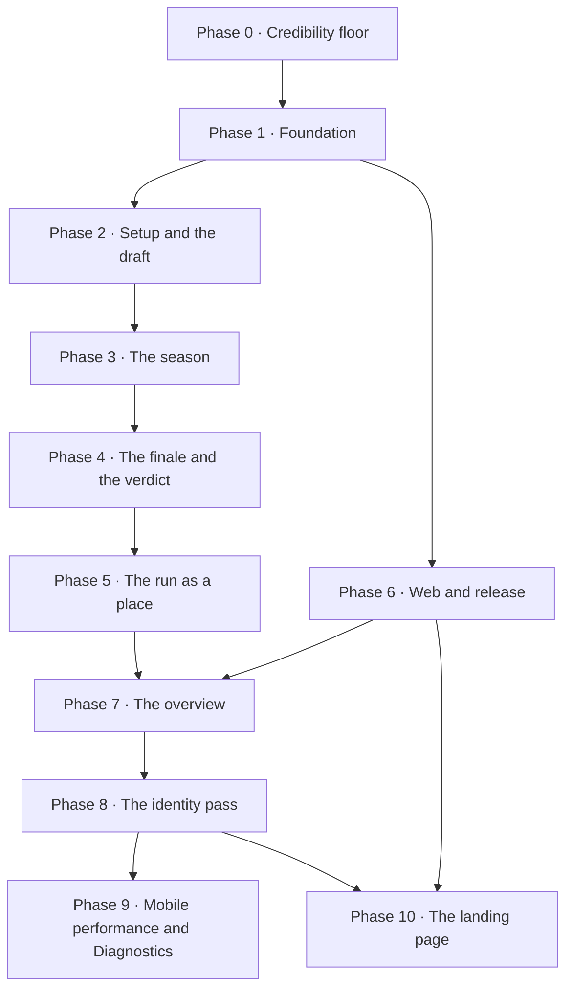

# 11 · Roadmap

> Part of the UI overhaul set. Start at [`00-README.md`](00-README.md).
> Nine phases in dependency order. Phase 0 can start today on the current look; everything after it builds on the Kit Drop foundation.

Each phase lists its **goal**, **scope** (with links to the screen and system documents), any **engine or data work** it needs, **done when**, and **how it's checked**. The checking follows this repo's conventions: `tsc` filtered as in `CLAUDE.md`, a headless `scripts/verify-*.ts` for any new engine logic, and the maintainer's own device and browser testing for anything visible.

---

## Order at a glance

| Phase | What it delivers | Main documents |
|---|---|---|
| 0 | Nothing lost, nothing false, nothing broken | [`01`](01-CRITIQUE.md), [`02`](02-VIBECODE-AUDIT.md), [`09`](09-COPY-DECK.md) |
| 1 | Tokens, type, icons, brand mark, core components, the shell | [`05`](05-STYLE-GUIDE.md), [`08`](08-COMPONENTS.md), [`07a`](07a-SCREENS-SHELL.md) |
| 2 | Setup, the draft, the draw, the pundits | [`07b`](07b-SCREENS-SETUP.md), [`06`](06-MOTION.md) |
| 3 | The season, zones, the press, knockouts | [`07c`](07c-SCREENS-SEASON.md), [`03`](03-DUGOUT-COMPARISON.md) |
| 4 | Deep Match, Awards Night, the verdict, sharing | [`07c`](07c-SCREENS-SEASON.md), [`07d`](07d-SCREENS-RESULTS.md) |
| 5 | Run hub, stats, player, club and story routes, records | [`07d`](07d-SCREENS-RESULTS.md) |
| 6 | Wide layouts, static web, store requirements, server scoring | [`10`](10-ADAPT-OPTIMIZE-A11Y.md), [`02`](02-VIBECODE-AUDIT.md) |
| 7 | Screen-by-screen consistency pass and re-scoring | all |
| 8 | Identity pass: every document re-read against the app, the 2010s flavour, motion and colour redone | all |
| 9 | Mobile performance pass and the Diagnostics screen | [`../diagnostics/`](../diagnostics/00-README.md), [`10`](10-ADAPT-OPTIMIZE-A11Y.md) |
| 10 | The landing page: what the game is, and play or download | [`02`](02-VIBECODE-AUDIT.md), [`05`](05-STYLE-GUIDE.md) |

---

## Phase 0 · Credibility floor

**Goal.** Fix what loses runs, says false things or breaks on Android, without waiting for the redesign.

**Scope**
- Save the run when the result screen opens; show saving, saved and failed states; tell guests the run won't be kept.
- Register: clear the spinner in every error path; human error messages; remove the false "Your guest runs stay".
- Replace developer copy ("seeder", "for now", "PM Special", "Not full route for now").
- One tier label set everywhere (the copy deck §2.1 decision), including the "WC Champion" bug and the two local `formatTier` functions.
- Achievements: one hardness scale.
- Runs and Ranks refresh on focus.
- Match sheet: the sticky tab strip stays one row on Android.
- `app.json`: remove the nested `expo` block, fix `userInterfaceStyle`.
- Strip `console.log` calls; gate the Quick Sim Tester behind a developer flag. The Diagnostics plan moves the tester under `/diagnostics/tools` and specifies the gate: see [`../diagnostics/06-IMPLEMENTATION.md`](../diagnostics/06-IMPLEMENTATION.md) step 5.
- Confirm before discarding draft picks and before skipping the bench.
- Correct the Guide's facts (12 formations, tier names); replace the song-lyric tagline.

**Engine or data work** · none.

**Done when** · closing the app on a result screen and reopening shows the run in Runs; every flag in [`09-COPY-DECK.md`](09-COPY-DECK.md) is resolved or consciously kept; the match sheet's tabs are one row on the maintainer's phone.

**Checked by** · `tsc`; the maintainer on device and web.

**Commands** · `/impeccable harden`, `/impeccable clarify`.

**As built (16 September 2026)**
- **Runs save on arrival.** `src/hooks/useRunSave.ts` saves once when the result screen's stats are ready; the exit buttons wait for that same save, so nothing inserts twice. `SaveStatusLine` (in `src/components/ui.tsx`) shows saving, saved, failed with Retry, and the guest notice, on all four result screens. Save errors now throw instead of being swallowed.
- **Register:** the spinner clears on every error; errors are in plain words; the false "Your guest runs stay" is gone. Found on the way: if the automatic sign-in after creating an account failed, `upgradeGuestAccount` returned quietly and the player landed on Home with no session. It now throws `SIGNIN_AFTER_UPGRADE` and register sends them to sign in.
- **Developer copy** replaced in placement (the three "seeder" messages, which also misreported a missing squad as missing data), mode select and formation select.
- **One tier label set:** `TIER_LABEL` in `src/data/tiers.ts` uses the copy deck §2.1/§2.3 names; the league card, the three cup banners, Home, Runs and Ranks all read it. The two local `formatTier` functions and three local `ROUND_LABELS` maps are gone. Runs' tier sort now uses `TIER_RANK` (the old list had no World Cup tiers, which sorted above Perfection).
- **Hardness** reads /11 everywhere (badge, achievements tile and footnote).
- **Runs and Ranks** refetch on focus and show a "Couldn't load this" state with Retry instead of the empty state (`LoadFailed`).
- **Match sheet tabs:** root cause was React Native's `ScrollViewStickyHeader`, which moves the sticky child's style to its wrapper and gives the child `flex: 1`, dropping `flexDirection: 'row'` on native. The row now lives one view down.
- **`app.json`:** the ignored nested `expo` block (which named the deleted `players_v4.db`) is gone; its background colours moved to `expo.backgroundColor` and `expo.android.backgroundColor`; `userInterfaceStyle` is `dark`. **Needs a native rebuild** (`android/` is prebuilt) to reach the device.
- **Logs:** every `console.log` in `app/` and `src/` removed, including ones that printed user ids and the internal login email. Error paths keep a `console.warn` without personal data.
- **Tester gated** behind `__DEV__` or `EXPO_PUBLIC_DEV_TOOLS=1`, set on the `development` and `preview` EAS profiles. About reads its version from `app.json` (it said 1.0.0; the app is 0.0.1).
- **Confirmations** (`ConfirmBar`, inline because `Alert.alert` does nothing on web): leaving the draft with picks (header back and Android back) and skipping the bench.
- **Guide and copy-deck flags:** 12 formations; Perfection naming; the score paragraph now mentions OVR direction and the difficulty multiplier; "rewards" removed; "shot maps" removed; Baby Mode no longer promises you can't lose; the song-lyric tagline replaced; formation descriptions describe shapes only. Flag 4 ("the board is furious") removed from the Misery line.
- **Not done here:** browser back on web during the draft isn't intercepted (only the header and Android back are); the muted-text contrast (3.67:1) waits for the Phase 1 theme.

---

## Phase 1 · Foundation

**Goal.** The Kit Drop system exists in code, and the shell uses it.

**Scope**
- Write `DESIGN.md` at the project root from [`05-STYLE-GUIDE.md`](05-STYLE-GUIDE.md); correct values as the build settles them.
- Restructure `src/theme.ts` into primitives and roles per ground; a `useKit()` hook for grounds, colourways and the replaced club's colour.
- Load Archivo and Martian Mono; verify tabular figures and the italic at extra-condensed width on Android before committing to them.
- Icon set: Material Symbols Sharp as SVG components, plus the custom football glyphs.
- The brand mark, app icon, adaptive layers, splash, favicon, manifest icons, default link preview.
- Core components from [`08-COMPONENTS.md`](08-COMPONENTS.md) §2, **states in use only**: Plate, Tag, Label, Tape, Stripe, ZipTag, ListRow, Table (on `FlatList`), SquareTabs, Chips, Field, Toggle, ConfirmScreen, feedback components, Icon, RoundFlag, ClubTag. Roles and accessibility labels built into each.
- The shell: four destinations, bottom bar and rail, RunHeader, insets, back behaviour, the not-found route.
- Home (A2) as the first full screen on the new system.

**Engine or data work** · a lookup of each club's three-letter code (derivable from names, with manual overrides for clashes); round flag assets for every nation in the data.

**Done when** · Home, the shell and You render entirely from roles and components with no raw hex; a TalkBack pass of Home announces every control; the launcher and browser tab show the real mark.

**Checked by** · `tsc`; a grep for raw hex outside `theme.ts`; the maintainer on device and web.

**Commands** · `/impeccable document` (DESIGN.md), `/impeccable extract`, `/impeccable typeset`, `/impeccable colorize`.

**As built (16 September 2026)** · the system is described in [`../../DESIGN.md`](../../DESIGN.md), including every place the build differs from this plan (§9 there).
- **Tokens:** primitives, roles per ground, colourways, font keys, type scale, spacing, density and borders added to `src/theme.ts` under the old palette, which stays for screens not yet rebuilt. The old `textMuted` is now `#8A92A0` (5.01:1 or better on every dark surface), closing the Phase 0 contrast item.
- **Fonts:** Barlow Condensed Black Italic (super; Archivo ExtraCondensed isn't in the static builds), Martian Mono, Archivo. Eight files required individually in `app/_layout.tsx` so the bundle carries only the weights used. Loaded at runtime, no rebuild needed.
- **Icons:** Ionicons Sharp behind a semantic `Icon` component instead of Material Symbols.
- **Components** (`src/components/kit/`): KitText, Stripe, Tape, Rivets, ZipTag, Icon, Plate, BackControl, SectionTag, ListRow, Toggle, Field, Checkbox, Tag, RunLabel (+ skeleton), Wordmark, IdTag, RoundFlag, ClubTag, KitScreen, StripedNotice, InlineError, EmptyState, KitTabBar. ConfirmScreen is a route (`app/confirm.tsx`, `openConfirm()`). SquareTabs, Chips, the Table and RunHeader are **not built yet**: nothing uses them until Phases 2, 3 and 5, and they'll be built with their first screen.
- **Shell:** four destinations (Play, Runs, Ranks, You) drawn by `KitTabBar`, a rail from 1024px. Guide and About moved to `app/guide.tsx` and `app/about.tsx`. Branded `app/+not-found.tsx`. Safe-area insets on Home, You, auth, Guide and About.
- **Screens rebuilt on cotton:** Home, You, sign in, create account, confirm, not found. Home has the wordmark, the best-verdict line, the last three runs as RunLabels that open the run, a skeleton and an inline error, the guest line only after a guest finishes a run, and START A RUN with an AGAIN plate that preselects the last mode and difficulty. You has the ID tag and three groups, and sign-out goes through ConfirmScreen.
- **Brand:** `scripts/brand-assets.py` draws the compact mark (riveted P/M plate with the orange tag) into the icon, adaptive layers, monochrome layer, favicon and splash. `expo-splash-screen` added with a nylon splash. Web glows removed; the page is nylon with an orange square focus ring (`src/lib/webChrome.ts`, shared by `+html.tsx` and the root layout).
- **Data:** `src/data/club-codes.ts` (101 overrides on top of the database codes) and `scripts/verify-club-codes.ts`: 970 clubs, 60 competitions, zero clashes.
- **Draft back button on web** now asks before discarding picks: `usePreventRemove` catches the header back, Android back and browser back, closing the Phase 0 open item.
- **Not done here:** round flag image assets (emoji clipped to a circle for now); You's settings, privacy, terms and delete account (Phases 2 and 6); the web column stays 480px until Phase 6, so the rail only appears on native tablets; a TalkBack pass is for the maintainer's device.
- **Needs a new dev build:** `expo-splash-screen` is a native module, and the icon, splash and `app.json` changes only reach Android through a build.

---

## Phase 2 · Setup and the draft

**Goal.** A run starts in three decisions and the draft is fast, readable and fun on the sixteenth spin.

**Scope** · B1 Where you play · B2 How hard · B3 Your shape · B4 The draft · B5 The bench · B6 The ratings reveal · B7 The draw (one reveal component for all four modes) · B8 The pundits' predictions · the lights-on transition.

**Engine or data work**
- **`src/engine/predictions.ts`**: predicted table from squad strength, two over- and two under-achievers, predicted Player of the Season, top scorer and best under-21. Pure and seeded, stored on the run when the season starts so the verdict checks what was actually predicted. **`scripts/verify-predictions.ts`**: determinism, and that predictions are sane against thousands of simulated seasons (the predicted champion wins more often than any other club).
- The draft's auto-assign when exactly one position fits (UI logic over the existing `positionPenalty`).

**Done when** · a returning player reaches the draft in three taps; a full XI takes under a minute for someone who knows what they want; later spins take under half a second; hidden-rating runs reveal ratings only in B6.

**Checked by** · `tsc`; `verify-predictions.ts` green; the maintainer on device.

**Commands** · `/impeccable shape` (per screen, if anything is still open), `/impeccable animate`, `/impeccable layout`.

**As built (16 September 2026)** · the setup flow is now: Where you play → How hard → Your shape → The draft (with the bench) → Your ratings (blind runs only) → The draw → The pundits → the season.
- **Shared:** `RunHeader`, `ChoiceLabel` (mode and care labels), `StepControl`, `Chips`, `InlineConfirm` in `src/components/kit/run.tsx`. Spring tokens in `src/lib/motion.ts`, the haptics map in `src/lib/haptics.ts`. The mode list lives in `src/data/modes.ts`.
- **B1 Where you play** (`app/game/mode-select.tsx`): mode labels grouped Leagues / Europe / World Cup, one tap moves on, League mode adds a league step with round flags, Chaos and Cursed wear the hazard edge and print their rules, `LAST TIME` on your last mode, plain-text competition names (no emblems).
- **B2 How hard** (`app/game/difficulty.tsx`, `difficulty-custom.tsx`): care labels with rerolls, ratings, what the AI does, the bench, and the score multiplier, all read from `resolveDifficulty`. Custom is its own screen with 48dp steppers and a live hardness and multiplier readout. The bench toggle moved here from the formation screen; picking a preset turns the bench back on. Chaos and Cursed skip this stage and show it as `SET`.
- **B3 Your shape** (`app/game/formation-select.tsx`): the selected shape as numbered shirts, one line each, "you'll need" tags, a swipe rack, and `LAST TIME` from a new `lastFormation` in the store.
- **B4/B5 The draft** (`app/game/draft.tsx`, parts in `src/components/setup/DraftParts.tsx`): pitch hangers with effective ratings and a striped edge when out of position; one-tap picks (auto-assigned when exactly one spot fits, otherwise the spots light); hold-and-tap moves and swaps on the pitch and the bench rail, with the same move rules as before; the rack spin (full length on the first spin, 450 ms after, tap to land, reduced motion skips it); the landed club card flips to its fact; sort chips (no OVR sort when ratings are hidden); a striped notice when nobody fits; the bench drafted on the same screen; "Play without a bench" through the ConfirmScreen.
- **B6 Your ratings** (`app/game/reveal.tsx`): blind runs only, on nylon, ratings flip in 60 ms apart, then Team OVR, a steal and a blunder, skippable.
- **B7 The draw** (`app/game/placement.tsx`): one layout for all four modes; the globe on a nylon panel, tap to land it, full length on the first draw of a session and half after (`GlobeReveal` got a `skip` prop); a riveted "YOU'RE" label; rivals with the gap in words; your first three league fixtures (the fixture generator's pairings are deterministic). League mode now always draws from the league you chose; the "League Pool" toggle is gone.
- **B8 The pundits** (`app/game/pundits.tsx`, engine `src/engine/predictions.ts`): a predicted table (the top eight plus your neighbourhood for 36- and 48-team fields), who they think will surprise and disappoint, a round call for cup modes, and the seed stored as `predictionSeed`. **`scripts/verify-predictions.ts`**: determinism, order independence, list rules, and 1,500 simulated seasons (the predicted champion wins 48.9%, more than twice any other predicted place; mean error 1.8 places; 55% of clubs placed away from pure strength).
- **Lights on:** "Start the season" cuts to nylon and draws the colourway tape across in 250 ms. League runs then start straight away (`?start=1`, after the scorer pools load); Champions League and World Cup keep their own pre-season step because their fixtures and group draw are made there. Their buttons now read `START THE LEAGUE PHASE` / `START THE GROUP STAGE`.
- **Removed:** `ConfirmBar` and `StepSlider` from `src/components/ui.tsx`.
- **Not done here, and why:**
  - The tag flying from the rail to its hanger and the Team OVR roll: the hanger's zip tag swings instead. The flight needs measured positions across a scroll view; worth doing with the Phase 3 table reorders, which need the same machinery.
  - The pundits' three player names (Player of the Season, top scorer, best under-21) need every club's squad loaded; they arrive with Phase 3, when the season screens load pools anyway.
  - Zone tapes on the predicted table wait for `qualification-bands.ts` (Phase 3).
  - A pause control on the globe (only tap-to-land exists).
  - The Champions League full path has no pundits step yet: its field isn't known until the domestic season is played.
  - Drag to move on the draft pitch: tap-to-hold covers it.

---

## Phase 3 · The season

**Goal.** Glancing at the season screen for two seconds tells you whether you're in trouble.

**Scope** · C1 league season · C2 Champions League league phase · C3 World Cup groups · C4 the full UCL path · C5 knockouts · the season strip · the ticker · zone tapes and legends everywhere a table appears.

**Engine or data work**
- **`src/data/qualification-bands.ts`**: per league per season, the real title, Champions League, Europa League, Conference League and relegation places for the seasons in the database. The tier ladder reads its thresholds from the same table, so a tier can't disagree with the zones. **`scripts/verify-zones.ts`**: every league-season has bands; bands never overlap; the ladder and the zones agree for every final position.
- **`src/engine/press.ts`**: stories from table snapshots, following The Dugout's four rules scaled to one run (see [`03-DUGOUT-COMPARISON.md`](03-DUGOUT-COMPARISON.md) §2.1 and §4). Pure: snapshots in, stories out. Stories store keys and the frozen rows they're about, attributed once and stored on the run like scorers are. **`scripts/verify-press.ts`**: determinism; no story before its threshold; cooldowns respected; frozen rows match the snapshot; a realistic number of stories per season (neither silent nor noisy).
- Split `simulation.tsx` into memoised panels reading narrow selectors (performance, [`10-ADAPT-OPTIMIZE-A11Y.md`](10-ADAPT-OPTIMIZE-A11Y.md) §3).

**Done when** · every table in a run shows real zones with a legend; a season produces a readable feed; your match resolves before the rest of its round on every mode; no two tables are ever side by side on a phone.

**Checked by** · `tsc`; `verify-zones.ts` and `verify-press.ts` green; existing `verify-match-detail.ts` and `verify-match-context.ts` still green; the maintainer on device.

**Commands** · `/impeccable layout`, `/impeccable animate`, `/impeccable optimize`.

**As built (16 September 2026)**
- **Zones** · `src/data/qualification-bands.ts`: title, Champions League, Europa League, Conference League, play-off and relegation places for the five domestic leagues, 2018/19 to 2025/26, based on league position only. The counts that changed between seasons are included: England had 5 Champions League places in 2024/25, Italy and Germany had 5 in 2023/24, France had 3 and then 4, Ligue 1 relegated four clubs in 2022/23, and 2019/20 was cut short. Cup winners moving the European lines are not modelled, because the domestic cups aren't simulated. 2025/26 uses the base counts until its extra performance places are known. `engine/tier.ts` now reads the zone. A 4th place in France, when France had three Champions League places, now earns `europa_glory`, and a relegation play-off place is Misery. Without a zone, the tiers are the same as before. **`scripts/verify-zones.ts`** checks all 40 league-seasons in the database.
- **The press** · `src/engine/press.ts`:
  - 13 story kinds: summit, runaway leader, title race, relegation battle, six-pointer, hot and cold streaks, unbeaten, winless, log jam, draw specialists, final-day champions, final-day survival.
  - Three headline variants per kind, chosen from the story's id.
  - The table rows a story is about are frozen when it's written, and each kind has a cooldown per club.
  - Nothing is written before a quarter of the season. Each round gets one story, plus one more if another story is about you.
  - Stored on `SeasonResult.press`. **`scripts/verify-press.ts`** runs 400 seasons: about 24 stories each (14 to 32).
- **C1 league season** · `src/components/season/LeagueSeason.tsx`. The old `LeagueSimulation` is gone from `simulation.tsx`. On nylon, from the top:
  - Your position as a super, with how far you moved.
  - The season strip: tap a matchday to look back.
  - Your result first, as a scoreline card.
  - A switch between three views:
    - **Table:** zone tapes, codes and a legend. Rows slide when positions change, and crossing a zone line gets a tape and a haptic.
    - **Results:** the rest of the round, a beat after yours.
    - **Press:** newest first, each story with its frozen rows.
  - The ticker and the controls sit in the thumb zone. Skip to the last day and abandon both go through the ConfirmScreen.
  - Before matchday 1 the table is in the pundits' order, greyed out. The simulation logic is unchanged, except that the live and skip paths now share one function.
- **Shared pieces** · `src/components/season/SeasonParts.tsx`: LeagueTable, ZoneLegend, StandingFigure, SeasonStrip, ScorelineCard, ResultRow, SegmentSwitch, FixtureRow, GroupWall, StampLabel, RoadTape, Ticker, StoryItem.
- **C2 Champions League league phase** ·
  - The review shows your eight fixtures with pot tags and the three zones.
  - The phase itself is on nylon with R16 / PO / OUT tapes. Your result comes first and the table a beat later (the table is now stored per matchday).
  - The locked "SLOW" badge is gone.
  - If you finish 25th or lower, the button reads `See how it ends`.
- **C3 World Cup groups** ·
  - **The draw:** the two qualification rules, your three fixtures with flags, and every group as a wall.
  - **The live stage:** your match on the clock, then four tabs: Your group, 3rd race, Results, All groups. The race for the best third places is now live, not only shown at the end.
  - **The end of the groups:** your fate stamped (`THROUGH AS WINNERS`, `THROUGH IN SECOND`, `THROUGH IN THIRD`, `OUT`), your group, your three results, the third-place table and the wall.
- **C5 knockouts** ·
  - `KnockoutPhaseView` is rebuilt on nylon.
    - Your tie plays live, then settles into a scoreline card: aggregate, legs, extra time, penalties, scorers and THROUGH or OUT.
    - The round's other ties appear after yours, with the winner in full ink.
    - Going out is a stamp: `OUT IN THE QUARTER-FINALS`, `RUNNERS-UP`, `THIRD PLACE` or `FOURTH PLACE`.
    - The next round is named, and `Skip to the final`, `See the line-ups` and `See your verdict` sit in the thumb zone.
  - `LiveMatch` now uses Kit Drop:
    - The score is a super, and the round and minute are in the tag mono.
    - The pause control is 48dp with an icon.
    - GOAL / PEN / OG / RED tags slide in from their side.
    - Penalties are a row of tags, filled for a goal and striped for a miss.
  - `BracketPreview` keeps its pinch, pan and wheel zoom. It gains a visible Fit control, square ties and `?` slots.
- **C4 full path, a readability slice** ·
  - The five-stage road tape is on every phase.
  - Every emoji and glyph control is replaced by words or icons.
  - The leagues browser button has a label.
  - The berth codes are explained in one line, and the skip buttons say what they skip.
- **Performance** · `simulation.tsx` went from 182 KB to 96 KB: the league screen moved out, and 185 dead styles and the old row-slide code were removed. Table and result rows are memoised.

**Not done in Phase 3, and why**
- **C4 in full:** under the new road tape, the full path's domestic, Europe, qualifying and league-phase screens still use the old dark cards. Still to do: berth tapes on the domestic table, the wall of champions, the qualifying track, and elimination shown as a verdict. It's the largest single screen (93 KB) and needs its own pass, so it opens Phase 4.
- **The pinned "you" row** for the 36-club table: your position, shown large above the table, already tells you where you are.
- **Group and league pages as routes:** `WCGroupModal` and the leagues browser are still modals (Phase 5 removes every content modal).
- **Rotation cut-offs still fixed** (`LEAGUE_EURO_SPOTS` 5, `LEAGUE_RELEGATION_SPOTS` 3) rather than read from the zones. Changing them shifts the game balance, which needs its own measured pass.
- **Cup-shaped stories** (group of death, the third-place scramble, giant killing, holders out, heartbreak on penalties) and a season-in-headlines section on the result screen: Phase 4, with the verdict.
- **Found in passing:** when you skip the Champions League league phase, matches are simulated without squad rotation or the missing-player penalty, unlike when you watch it. Match sheets still regenerate correctly, so nothing breaks, but a skipped league phase plays out slightly differently from a watched one.

---

## Phase 4 · The finale and the verdict

**Goal.** Every run ends on a moment worth screenshotting.

**Scope** · C6 Deep Match in the Kit Drop world · C7 Awards Night · D1 the unified verdict for every mode, including Misery's own treatment · D11 the share label.

**Engine or data work**
- **Awards extension** in `src/engine/stats.ts` (or a new `awards` module): Team of the Matchday and Team of the Season picked by line; a three-voter pundit panel for Player of the Season whose ballots are stored on the run. **`scripts/verify-awards.ts`**: determinism regardless of input order; a runaway season is never overturned by the panel; the team of the season is a legal shape.
- Share label rendering with `react-native-view-shot` and `expo-sharing` (both installed).

**Done when** · a relegated league run and a champion league run look unmistakably different; the score and its multiplier are on the verdict; sharing takes two taps; Awards Night can be paused and skipped at every beat.

**Checked by** · `tsc`; `verify-awards.ts` and `verify-deep-match.ts` green; the maintainer on device.

**Commands** · `/impeccable delight`, `/impeccable animate`, `/impeccable bolder` (if the verdict reads timid).

**In progress (17 September 2026)** — the first pass is in; the Deep Match and the bodies of the result screens are still to come.

- **C4 · The full Champions League path, rebuilt.** `app/game/custom-ucl-simulation.tsx` went from 93 KB to 72 KB and now runs on nylon from end to end, one phase at a time under the five-stage road:
  - **Your season:** the field by strength with a berth code on every place (UCL straight in, PO, Q3, Q2, Q1) and a legend.
  - **The season itself:** your position as a super, the strip you can scrub, your result first, then a switch between the table (berth tapes, and a heading where a split league divides) and the round's other results. A split league can still show its pre-split table.
  - **Where you finished:** the finish stamped, what it earned in one line, then the final table.
  - **Europe's seasons:** every league as a row with its champion, yours tagged, each opening its table.
  - **Qualifying:** the live tie on the clock above the ladder, the ladder itself through the shared tie rows.
  - **Qualified or out:** stamped, with your ladder underneath.
  - **The league phase:** the same screen as the Champions League finals mode, with R16 / PO / OUT.
  - **The knockouts:** your tie live, then as a card; the round's other ties as rows; going out stamped; the next round named.
- **One tie row, everywhere.** `TieCard` (yours) and `TieRow` (everyone else's) in `SeasonParts`, with `KnockoutRoundsView` and the qualifying ladder rendering through them, so the same tie reads the same on the live screens, the ladder and the result screens. The shared run furniture (thumb bar, back-to-live, abandon, the skip and abandon questions) moved to `src/components/season/RunChrome.tsx`.
- **The awards engine.** `src/engine/awards.ts`: a team of the season picked by line in a 4-3-3, the counting awards (golden boot, playmaker, golden glove, best under-21), and a **Player of the Season decided by three pundits who disagree** — one counts goals, one reads the ratings, one only respects what the club achieved. Each hands in a ranked five, scored 6-4-3-2-1, and the ballots are stored so "he came third because two of them had him fourth" is readable. **`scripts/verify-awards.ts`** over 2,000 seasons: determinism whatever order the candidates arrive in, legal ballots and team shape, the counting awards really are the leaders, a runaway season is never overturned (0 of 6 runaways), and the panel still disagrees with the raw score 20% of the time.
- **C7 · Awards Night** (`app/game/awards.tsx`): the beat between the final whistle and the verdict, on nylon. One award at a time with progress ticks, pausable, "show them all", your own players tagged and a haptic when one of them wins, and the three ballots printed under Player of the Season. Every mode routes through it (`/game/awards?to=…`), including after the Deep Match final. It also pays for computing the run's stats and hands them to the verdict through `src/lib/awardsNight.ts`, so nothing regenerates the match sheets twice.
- **D1 · The verdict, first pass** (`src/components/season/VerdictBlock.tsx`): one riveted label for every mode — Perfection wears the volt tape, Misery wears the hazard stripe, everything else its colourway — with the tier as a super, the run's score and the hardness multiplier that earned it, and **the pundits' pre-season call checked against what happened** (P8-24: "They had you 14th. You finished 3rd."). The cups get the same check in words, from the round the pundits called. It replaces the old banner on all four result screens.
- **D11 · The share label** (`src/lib/shareRun.ts`): the verdict card is captured and shared as an image on a phone; on the web it uses the browser's share sheet, or the clipboard.

**Fixed straight after that pass (17 September 2026)**
- **The verdict crashed the result screen.** The score and the pundits' check were added as `useMemo` calls *below* the screen's "no result" early return, so the hook count changed between renders ("Rendered more hooks than during the previous render") and the run could never reach its verdict. Both are plain values now; neither is expensive. The rule this broke, worth keeping in mind on every one of these long screens: **nothing below an early return may be a hook.**
- **The hand-off to the verdict** carried a slashed path in a query string (`/game/awards?to=/game/result`). It's a short mode key now (`?to=league|cl|wc|cucl`), and Awards Night falls back to the run's own mode if the key is missing.

**Corrections to the awards, from the maintainer's playtest (17 September 2026).** The panel was the wrong idea, and the rest of the night is thinner than it should be. All of this is Phase 4 work, not Phase 8:

- **P4-A · Player of the Season goes back to a scoring system.** The three-pundit vote replaced a working, explainable score with a popularity contest, and the maintainer is right that it's wrong: the award should be earned by what a player did, measured, not by what three invented voters thought. `computeAwards` in `stats.ts` is the correct model and comes back as the decider. The panel can survive at most as flavour *after* the fact — "the numbers had him first, the watcher had him third" — never as the thing that picks the winner. `verify-awards.ts` changes with it: the check becomes "the best season by the scoring model always wins", not "a runaway is never overturned".
- **P4-B · Use the deep stats we already have.** Every match generates attacking, creative and goalkeeping detail (`match-detail.ts`), and the awards only read goals, assists, clean sheets, ratings and man-of-the-match counts. The scoring model should use the real columns — chances created, shots on target, dribbles, tackles won, saves and the rest — and **the screen should show which numbers won the award**, so the result is arguable from the evidence rather than a bare total.
- **P4-C · An award winner is tappable.** Tapping a winner opens that player: their season, their matches, their game log. The player page is Phase 5's, so this is the first real caller of it.
- **P4-D · Team of the season gets a bench.** The eleven plus honourable mentions, so the near-misses are visible.
- **P4-E · The team of the season picks its own shape.** Rather than forcing a 4-3-3, take the strongest few players per position, weigh them against each other, and pick the formation that fits the actual talent (from the twelve shapes in `formations.ts`), then draw the eleven in that shape on a pitch. The same method decides the **team of the matchday**.
- **P4-F · A proper night, with more to it.** More awards, so it reads like a ceremony rather than a list: club awards as well as player awards, and a **manager award for the most overachieving club** — measured against what was expected of them, so the club that was tipped to win and did win can take it as easily as the surprise of the season.
- **P4-G · Awards Night plays once, live.** At the end of a run it's the ceremony. Opened later from history it is not: there it's a section that reads like the stats, with no count-down, no ticks, no pause.

**The corrections and the rest of Phase 4, built (18 September 2026)**
- **P4-A · Player of the Season is the scoring model again.** `computeAwards` decides it; the pundit panel is gone entirely. `verify-awards.ts` now checks the rule itself: the best season by the scoring model always wins.
- **P4-B · The deep stats count.** The stats pass now also sums interceptions, clearances, blocks, duels won, big chances created, and the keeper's saves and penalties saved. The scoring model keeps every one of its old terms and adds the deep columns at small weights (35 interceptions is worth about three goals). Each candidate carries a **breakdown** — the numbers that earned the score, biggest first — and the award cards print the top five of it.
- **P4-C · Winners open their season.** Any winner or runner-up, and any player on a team of the season or matchday, opens the stats screen straight onto that player's match-by-match log (`openPlayerSeason`, `/game/stats?player=…`). The fuller player page is Phase 5's.
- **P4-D/E · The team picks its shape.** `pickTeam` weighs each player against the usual starters of his own line (raw scores would always pick three at the back, since goals dominate the score), takes the best five per position, tries all twelve formations and keeps the one the talent fills best, then draws it on a pitch with a bench of seven honourable mentions. Over 600 test seasons every one of the twelve shapes turned up. The **team of the matchday** uses the same method on each round's match ratings — the stats pass now keeps every round's lines for it — and "team of the matchday regular" is an award.
- **P4-F · A proper night.** Player awards: Player of the Season, golden boot, playmaker, golden glove, defender, midfielder and forward of the season, most man-of-the-match awards, team-of-the-matchday regular, best under-21. Club awards: best attack, best defence, and **manager of the season** — places beaten against the pundits' table, with three extra for winning the title, so a favourite who delivers can take it as easily as a surprise (checked: a tipped-first champion beats a +2 overachiever).
- **P4-G · Awards Night plays once, live.** At the end of a run it's the ceremony; on the verdict and on any run opened from history the same awards are a plain section (`AwardsSection`) with no count-down. Runs from history have no rounds stored, so they show no team of the matchday.
- **C6 · The Deep Match, reskinned.** On nylon: the score as a super with the clock as a tag and a line of commentary under it; sections instead of cards; the controls in the thumb zone; the final whistle as a **cut to silence** (black, "full time", the score) before the ceremony. The ceremony is **stitched on**: a win is a one-frame cotton flash and a riveted volt label; a loss is a silver medal with the hazard stripe pulled across its label. The trophies stay original drawings. The pitch, momentum graph, stat bars and timeline inside it are the match screen's shared pieces, left as they are for that screen's own pass.
- **Commentary** (`src/engine/commentary.ts`): every event becomes a line built from its own fields — scorer, assister, penalty, own goal, the error that led to it, the keeper who saved it — with the phrasing picked by hashing the event, so a match reads the same every time. Quiet lines read the state of play between events. **`scripts/verify-commentary.ts`**: 6,000 events, deterministic, never an empty or broken line, scorers and assisters always named.
- **P4-H, first addition:** the match screen gains a **Commentary tab** (kick-off, half-time, extra time and full time marked). Nothing on the screen was removed.
- **The pundits name three players** before the season (`predictPlayers`): Player of the Season, top scorer (a forward), best under-21, from the loaded squads with the same deliberate noise as the table. They're shown on the pundits screen and read back on the night: "They said X. It was Y." or "The pundits called it." Checked in `verify-predictions.ts`: deterministic, eligible, reputation-led but not infallible. While there, **P8-14 is done**: the undercutting line is gone and the screen ends on "PROVE THEM WRONG".
- **The pundits' table, checked** (`PunditsTable`, league verdict): every club's finish beside where the pundits had it, how far out they were, how many places they got exactly right, and their worst call.

**The rest of Phase 4, built (18 September 2026)**
- **The pundits' check for the cups** (`src/engine/cup-calls.ts`, `PunditsRoundTable`): every side in the field, the round the pundits called against the round it reached, on one ladder, so "two rounds better" is a number. A 36- or 48-side field opens on the shortlist that matters — your side, the pundits' eight favourites, and their three worst calls either way — with the whole field one tap away. **`scripts/verify-cup-calls.ts`** checks it against generated brackets: one row per side, the winner as champion, each knockout loser out in that round, the exact difference in rounds.
- **P4-H · The match screen, on nylon, with the map.**
  - **Nothing lost.** The screen and every shared piece it draws with (the stat bars, the timeline, the scorer lists, the player rows, the pitch and bench, the momentum graph) moved onto nylon tokens, square corners and the kit's font families in place. No layout was rewritten.
  - **Words, not emoji.** Emoji icons became the kit's short codes (GOAL, OG, MISS, INJ, YC, RC, SUB, POTM).
  - **The score** is set in the super face, and no competition colour tints the numbers.
  - **The same change reaches the Deep Match,** whose inner panels are these same components.
  - **A new Map tab:**
    - a **shot map** with every shot where it was taken, sized by its xG and marked goal, saved, off target, blocked or woodwork;
    - **average positions** for every player who played;
    - a **heat map** for whichever player you tap.
  - **How it's generated.** The positions come from `src/engine/match-geometry.ts`, a texture layer on the sheet: it uses the sheet's own counts (each player's shots, on target and goals; the team's inside-box, blocked and woodwork totals; penalties from the events) and only places them. It runs on a separate seeded stream, so it can never move a number already on the sheet.
  - **Checked.** **`scripts/verify-match-geometry.ts`**, over 3,000 matches: generating the map leaves the sheet byte-identical, it's deterministic, every player's shots and goals match the sheet, each team's shots add up to its xG (worst drift 0.03), and everything is on the pitch.
- **The result screens, below the verdict, on nylon.**
  - **Colour and type.** The four result screens and every piece only they use (squad summary, lineup pitch, medical table, penalty shootout, the World Cup group view, the full-path viewers, the qualifying ladder, the info bubbles) moved onto nylon tokens, dropped the mode tints behind them, set their weights in the kit's font families, and lost their emoji.
  - **The awards move off the page** (the first part of P8-38): the result page carries a "See the awards" button, and the awards open as a plain page of their own (`app/game/run-awards.tsx`).
  - **Still to do.** The body of these pages is still the old *layout* in the new colours. The real rebuild of that ground (the run hub, stats, player and club pages, the match sheet as a route) is Phase 5's scope, and that's where it stays.

---

## Phase 5 · The run as a place

**Goal.** Every number in a run leads somewhere, and nothing is a modal.

**Scope** · D2 run hub · D3 stats · D4 player page · D5 club page · D6 story page · D7 match sheet restyle · D8 Runs · D9 Ranks · D10 Achievements and Career · deletion of every content modal listed in [`08-COMPONENTS.md`](08-COMPONENTS.md) §5.

**Engine or data work** · per-90 and position-rank aggregates over the existing run stats (pure functions over `computeRunStats` output); `scripts/verify-run-stats.ts` or an extension of an existing verifier for the new aggregates.

**The player page is its own pass (added 17 September 2026).** Like the match screen (P4-H), D4 isn't a restyle: the player page needs a real interface and real features, at the depth FotMob and SofaScore give a player — a season summary, the match-by-match log, the deep-stat columns, their awards, and how they compare with the rest of their position. It is also where an awards winner lands when tapped (P4-C), so it has to exist properly before Awards Night can link into it.

**Done when** · `AppModal` is used by no content surface; every route survives a reload on web; any player, club, match or story in a run can be reached in two taps from the run hub.

**Checked by** · `tsc`; verifiers green; the maintainer on device and web.

**Commands** · `/impeccable distill`, `/impeccable layout`.

**As built so far (18 September 2026).**
- **Data.** `src/lib/runData.ts` computes a run's data once: the live run is kept on the store, saved runs are cached by id. Every run page reads it through `useRunData(runId?)`, which fixes the long wait when opening a player.
- **Links.** `src/lib/runNav.ts` holds every link between run pages: `openPlayer`, `openClub`, `openStory`, `openRunHub`, `openRunMatch`.
- **Engine.** `src/engine/run-aggregates.ts` computes per-90 figures (from 270 minutes) and ranks within a player's own line (three rated matches for average rating), plus the "TOP x% · POS" tag. `scripts/verify-run-stats.ts` passes.
- **D2 run hub** (`app/game/run.tsx`). Tabs: TABLE/GROUPS, SEASON (form strip, position graph, every match), STATS, PRESS and SQUAD. The tab is kept in the URL, so it survives a reload.
- **D3 stats boards.** Six families, TOTAL/PER 90, the qualifying rule printed on the board, percentile tags, search, and a link on every row.
- **D4 player page, D5 club page, D6 story page** (`app/game/{player,club,story}.tsx`).
- **Stats screen and team modals gone.** `app/game/stats.tsx` is now a redirect to the hub, or to `/game/player` when a player is named. Its three modals are gone, and the result screens' team modals now open the club page.
- **Closed out (18 September 2026, second pass):**
  - **Modals.** `AppModal` is deleted and no content surface is a modal:
    - Knockout ties open on leg 1's match sheet, where the bracket block lists both legs (`openKoTie`).
    - World Cup groups, league tables and the leagues browser are pages through `openSheet` (`src/lib/sheet.ts`). They're in-memory content from live competitions, so a web reload says so instead of rebuilding them.
    - The `?` bubbles and "how it works" open `/game/rules?topic=`.
  - **Hub.** The BRACKET tab is rebuilt from the run's match list, drawn with the shared `TieRow`.
  - **Match sheet.** Opened from a finished run's pages (`linkPages`), club names, the player of the match, "their whole season" in the lineup and the player-stats rows all link to the player and club pages. They're off mid-season, where a player page would show results still to come.
  - **D8–D10.**
    - Runs and Ranks are rebuilt: each run is the same `RunLabel` Home shows, with `runMeta` in `src/data/tiers.ts` as the shared tag line.
    - Achievements and Career are rebuilt: modes wear their colourway tape and honours are tags.
  - **P8-54, result screens.** All four are rebuilt from the same pieces as the live screens:
    - the zoned `LeagueTable` (rows now tappable), the season strip, `ResultRow` and `KnockoutRoundsView`, which replaced three per-file `BracketView`s;
    - the World Cup zones moved into `SeasonParts`;
    - new `src/components/season/ResultParts.tsx`: `ResultFigures`, `ResultSection`, `ResultActions` and `YourMatches`;
    - `PositionGraph`, now in `SeasonParts`, is shared by the club page, the hub and the league result.
- **Left for later, on purpose:**
  - P8-66: legends on the graphs.
  - P8-67: the hub's own design pass.
  - The old-style `LineupPitch`, `SquadSummary` and `MedicalTable` still sit on the result screens. They're shared with other screens and belong to the centralisation pass (P8-71).

---

## Phase 6 · Web and release

**Goal.** Android and web are equal, and nothing blocks a public listing.

**Scope**
- Medium and expanded layouts for every area ([`10-ADAPT-OPTIMIZE-A11Y.md`](10-ADAPT-OPTIMIZE-A11Y.md) §2), web keyboard shortcuts, hover and focus.
- `web.output: "static"`, per-route titles, descriptions, canonical URLs and link previews; run pages preview their verdict.
- Web manifest; offline strip; clean console.
- A real domain (the maintainer's choice).
- Privacy policy and terms pages; in-app and web account deletion.
- Server-side scoring through the `submit-run` edge function using the shared tier ladder; RLS policies exported into the repo and tested cross-user.
- Store listing: screenshots and copy captured from the real redesigned app, never mock-ups presented as the real thing.
- Official competition marks replaced with original marks if the public release goes ahead.
- Optional: a consent-free analytics counter.

**This phase can run in parallel with Phases 2–5** once Phase 1's components exist, because every layout it builds uses them.

**Done when** · the vibecode audit's blockers are all closed; a desktop browser shows real multi-pane layouts; a pasted run link shows its verdict in WhatsApp and Discord.

**Checked by** · `tsc`; `python scripts/scan_static.py` from the vibecode-audit skill re-run against the built web output; Lighthouse on a throttled mobile profile; the maintainer on device and web.

**Commands** · `/impeccable adapt`, `/impeccable harden`, `/impeccable optimize`.

**As built so far (19 September 2026).**
- **The infinite strip, found.** The kit's `Stripe` drew its SVG at 100% height inside boxes sized by their row. On Android that's a layout loop. It was the sign-in notice that blocked sign-in and sign-up (P8-76), and the same loop as P8-02, P8-62 and P8-82. The SVG is now absolutely positioned.
- **Widths.**
  - The 480px phone column is gone. The frame stops at 1440px, and from 1024px the tabs become the left rail.
  - Screens pick their own width: `KitScreen width="column"` (a centred 640px reading column, the default) or `"wide"`. The four screens not yet on `KitScreen` use `WebColumn`.
  - `useSizeClass()` (`src/hooks/useSizeClass.ts`) gives compact, medium or expanded.
  - First wide layouts: the run hub's tabs become a left column, and Runs and Ranks show two columns of labels.
- **Keyboard (web).** Esc goes back everywhere (the run's back guard turns it into the abandon screen). The run hub takes 1–6 for its tabs. `WebKeys` (`src/lib/webKeys.tsx`) is how a screen adds its own keys; typing in a field is never a shortcut. Links get a pointer cursor.
- **Web output.**
  - `web.output: "static"` works. The Supabase client is inert during the Node render (no WebSocket or localStorage there).
  - Every public route has its title, description and Open Graph tags through `PageMeta`. Canonical URLs and `og:image` appear once `EXPO_PUBLIC_SITE_URL` is set.
  - There's a manifest with 192 and 512 icons plus an apple-touch icon. The dead `public/index.html` is deleted, and its flag-font rule moved into the shared web CSS.
- **Pages.** `/privacy` and `/terms`, written from what the code actually stores. They're linked from You and from sign-up. A contact line appears when `EXPO_PUBLIC_CONTACT_EMAIL` is set.
- **Account deletion.** You → Delete account, confirmed on the confirm route, calls the new `delete-account` edge function. It removes every row tied to the user and then the auth user.
- **Server-side scoring.**
  - The formula is one file, `supabase/functions/_shared/score.ts`, imported by the app and the server.
  - `insertRun` scores every row with it. The four save functions no longer score.
  - `submit-run` is rewritten: it takes the user from the token, whitelists columns, refuses impossible rows (`invalidRun`), re-scores and inserts with the service role. It refuses guest runs.
  - `scripts/verify-score.ts` (6,178 checks) proves every tier the league engine can produce passes, the scores equal the pre-Phase-6 formula, and impossible rows are refused.
  - Limit: the app simulates the season, so the server can't prove a result happened.
- **Policies.** `supabase/policies.sql` holds the intended RLS for every table the app touches. It was written from the code, not exported from the live database, so compare it before applying.
- **Waiting on the maintainer.**
  1. Deploy: `supabase functions deploy submit-run` and `supabase functions deploy delete-account`.
  2. Ship with `EXPO_PUBLIC_SERVER_SCORING=1`.
  3. Then apply `policies.sql`. The order matters: step 3 takes INSERT on `runs` away from the app.
  4. Choose a domain (`EXPO_PUBLIC_SITE_URL`) and a contact address (`EXPO_PUBLIC_CONTACT_EMAIL`).
  5. Decide whether official competition marks get replaced for a public release.
  6. Capture store screenshots from the real app.
- **Still to do in Phase 6.**
  - Two- and three-pane layouts for Home, setup, draft, season, knockouts, the Deep Match and the match sheet (10-ADAPT §2.2).
  - The remaining shortcuts: Space to pause and spin, arrows on the strip and stories, Enter for the primary plate, `/` to search.
  - Run pages that preview their verdict in a pasted link: that needs server rendering or an edge-rendered OG image, because a static export can't know a run.
  - The offline strip.
  - Lighthouse and the vibecode scan against the export.

---

## Phase 7 · The overview

**Goal.** The Dugout's step 17, applied here: go through every screen and find what is inconsistent, missing or stupid, by looking.

**Scope**
- Walk a full run of every mode on a phone and in a desktop browser.
- Re-run `/impeccable critique` on the app. **Target: 32/40 or better** (today: 22/40).
- Re-run the native audit in [`10-ADAPT-OPTIMIZE-A11Y.md`](10-ADAPT-OPTIMIZE-A11Y.md) §1. **Target: 15/20 or better** (today: 8/20).
- Re-run the vibecode audit. **Target: no blockers, no credibility items.**
- Run the five-question test from [`03-DUGOUT-COMPARISON.md`](03-DUGOUT-COMPARISON.md) §2.4 on every screen.
- Replace every wireframe in the `07` documents with a screenshot of the shipped screen and an "as built" note.

**Done when** · the three targets are met and the documents describe what shipped.

**Commands** · `/impeccable critique`, `/impeccable audit`, `/impeccable polish`.

---

## Phase 8 · The identity pass (added 16 September 2026)

**Why this phase exists.** The maintainer's verdict on Phases 1–2, played on a phone: better and more real than before, but **bland, with no identity**. The grammar is right; the life is missing. Animations read as flat, the colours never change, and nothing yet feels like the 2010s. This phase runs after Phase 7, and goes back through **every file in this set, one at a time** (`00` to `11`), asking of each: did we build what it says, and does the built thing have the flavour it describes? Anything that fails gets redone, not annotated.

**Maintainer remarks to carry in (16 September 2026)**
- Some of the rebuilt screens work, some don't yet; `GlobeReveal` and other shared pieces still carry the old design. Fine to fix here or in Phase 7.
- **The globe lags on a phone** in the dev server. Profile it before touching it (see the Dugout memory "profile before tuning"): the per-frame SVG path projection in `src/lib/globe-geo.ts` is the first suspect.
- **Phase 2 leftovers get redone, not deferred again:** the tag flying to its hanger, the Team OVR roll, the pundits' player picks, a globe pause, zone tapes on the pundits' table, reduced-motion and haptics settings on You.
- **Animations are "awful and bland".** `06-MOTION.md` is followed to the letter and still reads flat: the timings are right, the moments aren't. Each moment needs a beat you'd notice with the sound off.
- **The colours are the same everywhere.** Cotton and nylon are the only two states; the app never changes temperature.

**The flavour this phase has to find.** The feeling of being back in roughly 2010–2016: Nike's *Winner Stays* (2014) and *Risk Everything* (2014) adverts; the FIFA soundtracks from FIFA 13 to FIFA 23 as a mood board (Miss Alissa is the reference the direction was named from); the bands and songs of those years, how life felt at the time, the rivalries (Messi and Ronaldo, El Clásico, Pep and Mourinho), and the moments (Agüero 93:20, 7–1, Leicester, the Istanbul-style comebacks). Songs are **mood references only**: the app ships no audio and no licensed music (see `docs/maturita` licensing), so the flavour has to come through colour, cuts, type and copy.

**Ideas to test against the base, from an outside colour brief the maintainer shared.** It knew nothing of this app, so only the transferable ideas are kept; its palette is **not** adopted over Kit Drop's locked roles.
- **Colour as the emotional arc, not decoration.** The ground's temperature tells you where you are in a moment: rest, build, hype, heat, silence, eruption, gold. Kit Drop's version stays within its roles: nylon shifting cooler as a season's last matchdays close in, a near-black "breath" before a final, a one-frame cotton flash on a goal or a clinched title, and a volt pulse kept for Perfection only (the brief's "gold only when you've won" rule maps onto volt).
- **One club colour enters at a time.** The app stays monochrome until the spin lands; then the landed club's colour enters (the rack's edge strobing through passing clubs' colours, a flash on landing, a near-black tint of the club colour behind the club card). This fits the existing "colourways are location" rule.
- **A floodlit-pitch green** for the pitch surfaces (a very dark, warm green, not FIFA-menu green), lines barely visible.
- **Stamps, not fades.** A result or goal stamps in at 110% and snaps to 100%; a block vanishes on a hard cut. No gradients, no glass, no blur; a colour is on at full strength or it's gone. The brief's line worth keeping: *it should look made in 2013 by a broadcast graphics team, not in 2025 by an agency.*
- **Silence as a state.** Near the end of a tight season or a final, text drops in opacity and the clock slows; the quiet is the tension.
- **Conflicts to resolve, not copy:** the brief uses orange for errors and heat, but orange here means *you*; out stays the hazard stripe. Its blue CTA and gold are dropped for the locked orange and volt. A cinematic "ads" section is out of scope (no licensed footage).

**Maintainer playtest notes after Phase 3 (17 September 2026).** Every point below is kept and gets its own paragraph, in the order the maintainer raised it. Several were one sentence each in the original note; they're split here so none is lost. Phase 8 isn't done until every entry is either fixed or explicitly decided against with the maintainer.

**P8-01 · Setup lost its bench switch.** "Where you play", "How hard" and "Your shape" lost things the old screens had. Most visibly, the substitutes can only be turned off in Custom. Phase 2 moved the bench toggle from the formation screen onto the Custom rules screen, and picking a preset forces the bench back on (`setUseSubstitutes(true)` in `app/game/difficulty.tsx` and Home's AGAIN). The only other way to play without a bench is "Play without a bench" at the end of the draft. The fix: make the bench a visible choice for every difficulty, either as a toggle on "How hard" under the preset labels or back on "Your shape". A preset must stop silently overriding what the player chose. Also audit the old mode, difficulty and formation screens (git history before Phase 2) for anything else that went missing, and list it here.

**P8-02 · Only League, All Time and Chaos can be picked.** On the phone, "Where you play" shows League, All Time and Chaos, but no Cursed, no Champions League and no World Cup. All of them are still in `MODES` (`src/data/modes.ts`), so they were never removed. They're almost certainly pushed off the screen by P8-03.

**P8-03 · The Chaos label stretches downwards forever.** The Chaos label (and very likely Cursed, the other hazard label) grows downwards without end. Suspected cause: the hazard edge is `Stripe`, which draws an `Svg` at `height="100%"` inside a view that only has `alignSelf: 'stretch'` (`ChoiceLabel` in `src/components/kit/run.tsx`). On Android an SVG with a percentage height and no measured parent height can size itself very tall, and the label grows to match. The fix: give the stripe an absolute-fill position inside a label whose height comes from its text, as `InlineConfirm` already does, and check every other `Stripe` used as an edge (`Tag` loss, `StampLabel`, `ZoneEdge`, `SeasonStrip`, `LiveMatch`). This is probably the same bug as P8-02.

**P8-04 · The formation should be a pitch.** "Your shape" looks better and the shape it shows is almost right, but the maintainer wants a real pitch so the player can picture the team. Draw the shirts on a pitch surface with halfway line, centre circle and boxes, using the "floodlit pitch green" idea from the colour brief above, not a flat grid on cotton. Positions should match where the draft pitch puts them, so the shape doesn't change between screens.

**P8-05 · The spin animation needs a full redesign.** The spin was downgraded. It isn't bad, and its length is right, but it feels shorter and has no wow factor. It needs:
- **More clubs after the landed one.** More clubs should keep coming after the one that lands, so the strip reads as a real spinning reel rather than stopping at the end of a list.
- **Spectacle.** Use the brief's ideas: each passing club's colour strobing on the edge, a hard flash in the landed club's colour, a near-black tint of that colour behind the club card, and the swing tag.
- **The same controls as now.** Tap to land and reduced motion keep working.

**P8-06 · Bench anyone, at any time.** While spinning, the player should be able to put a pick on the bench even when the formation still has free slots. They should also be able to move someone already in the formation to the bench before the eleven is finished. Today the draft fills the eleven first and only then opens the bench (`app/game/draft.tsx`: a pick goes to the bench only in the bench phase, and "bring on" only works from the bench). Both directions need to work at any point, with the same position rules as today. The draft is finished when the eleven and the bench are both full, or the player skips the bench.

**P8-07 · "Play without a bench" blends in.** Keeping that option after the eleven is complete is right, but the text is too quiet. Make it a proper secondary plate, still less prominent than "Spin for sub 1".

**P8-08 · Strongest rivals should be a full, scrollable list.** The rivals list on the draw looks fair, but it should be the whole field rather than a few names, in a list you can scroll. Its scrollbar is P8-29.

**P8-09 · Home and Away become icons.** The first-fixtures list works, but the HOME and AWAY words should later become icons (a house for home, a travel icon for away), each with its word kept as the accessibility label. This applies to `FixtureRow` everywhere it's used.

**P8-10 · Tags sit off-centre and too high.** In the fixtures and rivals rows, the HOME / AWAY tags and "+X ON YOU" sit off-centre and too high against the row text. Align tags to the text baseline or the row centre across the kit: check `Tag`'s padding and line height against `KitText` body in a row, on Android and web.

**P8-11 · League flag and name on the draw.** The draw should show the league's country flag with the league's name above it, not only the club you replaced.

**P8-12 · Crests, with a switch between real and fake.** Clubs and competitions should have crests. The project must be able to switch in the `.env` file between real crests and competition marks, and original made-up ones, for example `EXPO_PUBLIC_BRAND_MODE=real|original`. Phase 6 already requires original marks for a public release, and the maturita licensing notes point the same way. The fake set needs a generator or a drawn set that follows Kit Drop. Everything that shows a crest reads it through one lookup, so the switch is a single place (today `getLogo` / `getFlag` in `src/lib`).

**P8-13 · The pundits predict points, not ratings.** On the pundits screen, drop the OVR column. Show the points the pundits expect each club to finish with. This needs a points prediction in `src/engine/predictions.ts`, checked by `verify-predictions.ts` against simulated seasons.

**P8-14 · Replace the pundits' closing line.** *(Done 18 September 2026, during Phase 4: the line is gone and the screen ends on "PROVE THEM WRONG"; the copy deck still needs the final wording recorded.)* Remove "Pundits go on squad strength and get it wrong on purpose. Beating their call is the point." It undercuts the pundits. Use something motivating instead, along the lines of "Disprove the pundits." The final wording goes in the copy deck (`09-COPY-DECK.md`).

**P8-15 · The season strip should start at the start.** The maintainer called the season screen "infinitely better". The strip between your position and the current result opens scrolled to the end, so before kick-off you see the last matchdays. It should open at matchday 1 and follow the current matchday as the season plays: `SeasonStrip` in `src/components/season/SeasonParts.tsx` scrolls to the end on mount; it should scroll to the latest played cell instead.

**P8-16 · Table codes and colours.** The table is fine apart from two details:
- **Shorter code:** CHAMP becomes C.
- **Two colours:** the champion's tape is a different colour from the Champions League tape, even though the champion also qualifies for it. The zone tones need a fifth value for the title, and the legend follows.

**P8-17 · Show who scored for whom.** In the results list (e.g. "RESULTS MD 20"), the scorers appear as one centred line, so you can't tell which side scored. Put each side's scorers under that side, the way `ScorelineCard` does.

**P8-18 · The press needs more variety and a better layout.** The press "looks fabulous". It needs more kinds of story, more headline variants per kind, and a better way to show a story: a proper story layout, a page later (Phase 5 has story routes), and a clearer frozen table inside it.

**P8-19 · Praise to keep: tapping the strip to go back.** Tapping a matchday on the strip to see the season as it was then is, in the maintainer's words, "glorious and really innovative". Keep it and don't simplify it away in any later pass.

**P8-20 · No YOU tag in your own result; the XI takes your username.** Drop the YOU tag from your result card; the card is already yours. The maintainer is also thinking of naming the side after the player: "{username} XI" instead of "Your XI", with a fallback for guests. This affects every place the player's club name is shown and stored.

**P8-21 · Turning off the skip warning.** The "Skip to the last day?" confirmation is fine, but the player should be able to turn it off:
- **In the dialog:** a checkbox, e.g. "Don't show the skip warning. You can turn it back on in Settings."
- **In Settings:** a switch to turn it back on.
- **Also needed:** a settings screen with persistent preferences, which Phase 2 already needed for reduced motion and haptics.

**P8-22 · More colour when places change.** Movement in the table needs more colour:
- **In the table:** small change numbers with an up or down arrow, green-ish for up and the loss treatment for down, within Kit Drop's roles.
- **In the position figure above:** the UP X / DOWN X text is coloured, and so is the place number to its left. Today only UP gets volt text, and the number stays plain.

**P8-23 · Drop the YOU tag wherever it's redundant.** (Revised 17 September 2026: this is app-wide, not only the table.) The tag was meant to mark you in a crowd. It doesn't earn its place when the surface it sits on is already yours, when the name beside it already says so, or when it repeats on every row of the same thing. Sweep every use of `Tag variant="you"` and keep it only where your row or club has to be found among others at a glance — the league table is arguably one of those, but the maintainer wants it gone there too, so your row is marked by its surface and, if that isn't enough, by an orange edge instead. Definitely gone: your own result card, the scoreline card's sides, the bracket's own tie, the group wall card that is already titled as yours. The rule to write into `DESIGN.md`: one "you" marker per region, and never one that repeats what the region's title already says.

**P8-24 · The pundits' call, checked on the result screen.** The result screen should show the pundits' predicted table next to the real one, how each club moved against the prediction, comments on the calls they got right and wrong, and a verdict on the pundits ("They had you 14th. You finished 3rd."). `predictionSeed` is already stored on the run for this. It belongs with the Phase 4 verdict and must be carried into Phase 8's review.

**P8-25 · Your injuries in the press.** Injuries and suspensions for your own players appear in the press, and only yours. The availability ledger (`src/engine/availability.ts`) already records them in matchday order, so the stories come from that and are written once, like the other stories.

**P8-26 · Back goes to the abandon screen; a second back abandons.** (Rewritten 18 September 2026 at the maintainer's request.) During a run, pressing back — Android's back button, the browser's back, a header back — must not open a pop-up of any kind. It opens the **abandon-run screen**, the brand's own full-screen ConfirmScreen, already used by the ✕ control. From that screen, pressing back *again* abandons the run and goes straight home, so a player who wants out can get home fast with two backs, while a single accidental press costs nothing. Every other system dialog in the app is still replaced with the brand's own (`Alert.alert`, `window.alert` and `window.confirm` all go); today `useSimBackGuard` still raises a native `Alert` on Android and a `window.alert` on web.

**P8-27 · Skipping plays differently from watching (Champions League and World Cup).** When you skip, the "skip" paths for the Champions League league phase and the World Cup group stage (`skipAll` in `CLSimulation` and `WCSimulation`, `app/game/simulation.tsx`) simulate each match with the clubs' base ratings. They skip what the live paths do:
- **Rotation:** no rested players.
- **Availability:** injured or suspended players don't lower the rating.
- **Lineups:** no seeded lineup-based effective rating (`effectiveMatchOvrs`).
- **Order:** the result is decided before the seed exists.

The stored sheets still regenerate consistently, because the skip also stores no rotation. But a skipped phase is a slightly different competition from a watched one: an injury that should have cost a side its rating doesn't, and nobody rests when a group is settled. The fix is the one the league screen already has: one shared "play this matchday" function that both the live loop and the skip call, so the two can't drift apart. Checked by a verifier that plays the same seeds live and skipped and compares the stored inputs.

**P8-28 · Rest-player cut-offs, explained and what to do about them.** Clubs rest players (`src/engine/rotation.ts`) only when their season can no longer change: they can't catch the leader, and they're mathematically safe or doomed on every line that matters. In the league screen those lines are two fixed numbers: a club counts as "still playing for Europe" if it can reach the top 5 (`LEAGUE_EURO_SPOTS`), and as "still in a relegation fight" if it can drop into the bottom 3 (`LEAGUE_RELEGATION_SPOTS`). The real zones (P3) now say something different per league and season. Seven places lead to Europe in most seasons, the Bundesliga has a play-off place above its two relegation places, and Ligue 1 relegated four in 2022/23. So today:
- **Europe race:** a 6th or 7th-placed side that can no longer reach the top 5 may rest players while it's still in a real Europa or Conference race.
- **Ligue 1 2022/23:** a side in 17th may rest players although it's going down.

What to do:
1. Read both cut-offs from `zonesFor(...)`: the qualify line becomes the last European place, and the drop line counts the play-off place too.
2. Keep the title rule as it is.
3. Measure before and after with a small verifier: how often clubs rest, the average points of the champion and of the relegated sides, and the player's win rate over a few thousand seasons.
4. Accept the change only if those numbers stay within noise, or move for a reason we can name.

This follows the "name the reason" rule and the lesson from The Dugout that the rating scale is a currency: rotation changes the strength of teams on the pitch, so it moves points. The same question applies to the Champions League (top 24) and World Cup (top 2) cut-offs, which are already correct for their formats.

**P8-29 · A custom scrollbar, everywhere.** (Added 17 September 2026.) The platform's own scroll indicator is the one piece of another design system left on screen, and it turns up on every long list: the rivals list, the draft's player grid, the table, the press, the leagues browser, the bracket. Kit Drop needs its own: a square, hairline-thin track with a solid thumb in ink or cotton depending on the ground, drawn from the scroll position and fading out shortly after scrolling stops. It goes in `src/components/kit/` as one piece that wraps or decorates a `ScrollView` or `FlatList`, so a screen gets it by using the kit's scrolling container instead of a raw one. Constraints: the native indicator is hidden (`showsVerticalScrollIndicator={false}`), the thumb never handles touches on native (it's an indicator, not a control), on web it can be draggable because a mouse expects that, it respects reduced motion by not animating its fade, and it must not cost a frame on a 38-row table — the position comes from the scroll event, with no layout passes per row.

**P8-30 · The same player can be drafted twice.** (17 September 2026: "got Real Sociedad twice and a 4-4-2, and got two Oyarzabals up top".) A club-season can be spun more than once in a run, and nothing stops the same player being picked from both spins, so a shape can field two of the same footballer. The draft must treat a player as taken for the rest of the run: once picked, they're unavailable in any later squad list, marked as already yours rather than silently missing, and the same rule applies to the bench. `isPlayerAvailable` (`src/engine/draft.ts`) is the one place that decides this. Worth deciding with the maintainer: whether a *different season* of the same player (2019 Oyarzabal and 2024 Oyarzabal) counts as the same footballer. The rule reads best as "one of each footballer", which means keying on the player's identity rather than the player-season row.

**P8-31 · The line-up tab doesn't show your formation mid-season.** Opening one of your matches during the season and going to LINEUP doesn't show the shape you're playing. The formation travels with a match sheet request (`playerFormation`), so during the season either it isn't being passed, or the sheet is falling back to a default shape. Your own eleven has to be drawn in your own formation on every route into the sheet: from the season screen, from the results list, from the match-day scrub and from a finished run.

**P8-32 · Opening a match doesn't pause the season.** Tapping a result while the season is simulating leaves the clock running underneath, so matchdays keep landing while you read. Opening the match sheet (or any route on top of a live season) has to pause the simulation, and closing it returns you to where you were, still paused, so the player decides when it starts again.

**Maintainer playtest notes after Phase 4's second pass (18 September 2026).** The pundits screen "looks okay". Everything else below is to fix.

**P8-33 · Commentary needs far more to say.** The commentary engine (`src/engine/commentary.ts`) reads only what the sheet stores as events: goals, penalties missed, cards, substitutions, injuries. FotMob's live feed covers much more of a match: shots saved, off target, blocked and off the woodwork; big chances missed; corners; free kicks in dangerous areas; offsides; fouls and their free kicks; VAR checks and overturned decisions; the added time announced; kick-off, half-time and full time with the score; and, in a shootout, every kick. The match sheet already generates most of this as per-player and per-team counts (shots, shots on target, big chances missed, offsides, corners, fouls). The work is to place those counts as timed, attributed events, seeded like everything else, so the feed has something to say every few minutes. First step: survey FotMob's (and SofaScore's) live event types properly and list which ones the sheet can already support.

**P8-34 · The awards' team doesn't say where players are from, and YOURS repeats.** On the team-of-the-season and team-of-the-matchday pitches, each shirt shows the surname and position but not the club, so the team can't be read. The club has to be on the shirt (a short code, as in the rest of the app). In the honourable mentions, the YOURS tag repeats on row after row (P8-23's rule applies: one marker per region, and not one that repeats).

**P8-35 · Awards arrive with no transition.** Each new award just appears. It needs an entrance: at the very least a fade, ideally the stamp or settle `06-MOTION.md` gives a verdict-like moment. The same goes for most of the new screens: things that change or arrive should move per the motion document, not pop.

**P8-36 · Tapping a player breaks the night, and the season view gives the game away.** Several problems in one place:
- **Tapping a player leaves the screen.** From Awards Night or the verdict, tapping a player goes to the stats screen, and coming back lands on the result screen instead of where you were. Tapping has to open the player *on top of* the current screen and return to exactly the same place.
- **It's slow.** The stats screen regenerates every match of the run before showing anything ("loading time of doom and despair"). The player's season must come from the stats already computed, not a fresh pass.
- **It spoils the night.** The stats screen shows the award lists, so opening one player mid-ceremony reveals the winners still to come. The player view must show that player only.
- **Awards belong on the player.** Every award won on the night (Player of the Season, best under-21, golden boot and the rest) should show on that player's statistics as badges.
- **The numbers in the breakdown need explaining.** The column of points next to "Rating 7.2 over 30 games", "Goals" and the rest isn't explained, so it reads as noise. Label it ("award points") and say in one line what it is.
- **The defender award goes to full-backs.** Defender of the season mostly lands on LB and RB, even when a centre-back had the better defensive numbers, because the season score rewards assists and chances created that full-backs pile up. A defender's award should be decided on what makes a defender: tackles, interceptions, clearances, blocks, duels won, clean sheets, errors avoided, with attacking output counting for less. Model it on what the real game rewards, and check the result is plausible across positions (a centre-back should win it as often as the numbers say).

**P8-37 · Manager of the season needs rethinking, and real managers.** Today it's "places beaten against the pundits, plus three for the title". Problems:
- **Improvement isn't linear.** 10th to 5th is a bigger achievement than 16th to 10th, even though it's fewer places, so place gains need weighting by where they happen.
- **It should reward how the team played,** not only the gap: the actual finish, points, how the side performed, and the best players it had.
- **The copy.** "Beat the pundits by the most places. Winning the title counts extra." says the wrong thing. The award isn't about the gap alone; the gap is one ingredient. The line should say what it really rewards.
- **Real managers.** Scrape each club-season's manager, so the award names a person, not a club. Your club's manager is you: your username.

**P8-38 · The result page is half finished, and the pundits' table needs more life.** *(Partly done 18 September 2026: the awards now sit behind a button on their own page, and the page is on nylon. The layout rebuild is Phase 5's, and the pundits' table colours and sparkle are still to do.)*
- **Half finished.** Below the new verdict the page is still the old one. It needs the full rebuild (tracked as Phase 4's result-screen work).
- **The pundits' table** almost works. It needs more colour: red for a club that did worse than tipped, gold for spot on, and more wow, such as a small sparkle on the exact calls.
- **The awards move to their own screen.** They make the result page far too long. The page gets a button, and the awards open on their own route.
- **Keep:** team of the matchday is "brilliant". Keep it as it is.

**P8-39 · The draft's zip tag doubles up and doesn't swing.** The pin (zip tag) appears on the last picked player, but picking another player leaves two pins on screen. There should only ever be one, on the latest pick. Tapping a pinned player doesn't play the small swing animation either. `SwingTag` should replay on tap, and the previous pin has to clear when the next one lands.

**P8-40 · PROVE THEM WRONG feels lost.** The line is right but sits unfocused on the pundits screen. Centre it and give it a small shake, or, better, make it the start button's label: the plate reads "PROVE THEM WRONG" instead of "START THE SEASON".

**P8-41 · Team of the matchday can't be seen during the season.** It only exists after the run, on Awards Night and the verdict. The season screen should show each round's team of the matchday as the round lands: it's the same data, and it makes every matchday a small awards moment.

**P8-42 · The press's tables cut off at five.** A story's frozen table shows at most five rows (`StoryItem` slices to five), even when the story is about six clubs ("six clubs, three points"). A story shows every row it's about.

**P8-43 · Big chances created is its own number.** "Chances created" (key passes) and "big chances created" are two different things and should both appear, and both feed the ratings and the award score as separate terms, with a big chance worth more.

**P8-44 · Ratings use SofaScore's colour scale.** The maintainer supplied SofaScore's rating scale as the reference: https://files.sofascore.com/news/2024/10/03-Sofascore-News_Ratings-Scale-16_9-1024x576.png. The bands, as SofaScore publishes them and to be confirmed against that image: below 6.0 red, 6.0–6.4 orange, 6.5–6.9 yellow, 7.0–7.9 green, 8.0–8.9 teal, 9.0 and up blue. `ratingColor` in `src/theme.ts` moves to that scale, with the text on every band checked for contrast. **Also, as a note only:** study how SofaScore *computes* a player rating (the inputs, how position changes the weights, how a player's rating moves during a match) before touching the rating model in `match-detail.ts`. Nothing changes until that study is written up.

**Maintainer playtest notes after Phase 4 (18 September 2026).** "All around nice change", and:

**P8-45 · A proper settings menu.** Not a couple of switches on You, but a settings screen of its own, with persistent preferences: reduced motion, haptics, the skip warning (P8-21), sound when there is any, and the light/dark question (P8-65). Every "can be turned back on in Settings" line in the app points here.

**P8-46 · Real icons instead of the text codes.** GOAL, OG, YC, RC, SUB, INJ, POTM and the rest were a stopgap for emoji. They become proper icons from an icon library. The maintainer's suggestions are Arcticons, Icons8 or Flaticon. To check before choosing:
- **Arcticons** is a set of launcher app icons, not UI glyphs, so it may not have football symbols.
- **Icons8** and **Flaticon** need attribution or a paid licence for most sets, which matters for a public release and for the maturita licensing notes.
Whatever is picked sits behind the kit's `Icon`, so it's one swap.

**P8-47 · The shot map, reworked.** The shot map is "too condensed and hard to see". Instead:
- **Greyed out by default.** All shots start greyed out.
- **Step through them.** Arrows above the map go shot by shot in the order they were taken (by minute). The map itself isn't tapped.
- **Highlight the current shot** with its taker, minute, outcome and xG.
- **A shot route:** a simple line from where the shot was struck to where it ended (in the goal, saved, wide, off the woodwork), so the map feels alive.
The heat map and average positions are "nice" and stay.

**P8-48 · Player taps scroll to their stats, and the match screens need real redesigns.** Tapping a player on a formation pitch should scroll the screen to that player's opened stats. More broadly, the match screen and the screens around it "have the skin of new but the feel of the old". They need redesigning to Kit Drop, not just recolouring (see P8-54, the same point about the result screens).

**P8-49 · Stat bars when both sides have nothing, and team colours.** When both teams have 0 of a stat, the bar tilts all the way to one side at random. It should be blank. And the two teams lost their colours when the sheet went to cotton: each side needs its own colour again. Probably the club's own (see P8-55), within the kit's rule that a colour is location, never text.

**P8-50 · Centralise the pieces.** A formation should look the same on every screen: the draft, the lineup tab, the Deep Match, the awards pitches and the verdict all draw it differently today. The same goes for everything else that appears in more than one place (tables, ties, scorelines, player rows, flags). One component each, used everywhere.

**P8-51 · Custom parts everywhere.** Beyond the scrollbar (P8-29, already recorded): the other stock controls — pickers, switches, sheets, loading indicators, text inputs, pull-to-refresh — become the kit's own, so the whole app "feels real" and nothing reads as a stock component.

**P8-52 · A domestic cup and last season's winners for the full Champions League path.** The full path has no FA Cup, and a domestic cup matters to European places. It can be done, but it pulls in more:
- **Last season's winners.** The previous season's Champions League, Europa League and Conference League winners need to be known for both seasons in the data, because they take places in the access list.
- **A ceremony before the run.** The cups and those winners are shown before it starts, with the same rule as every ceremony: it can be skipped to the end.
This is a pass of its own, with data work first.

**P8-53 · (See the rewritten P8-26 above:** back opens the abandon screen, a second back abandons.)

**P8-54 · The result screens need a real redesign.** Every mode's result screen got the new colours without the new design. In the maintainer's words: like putting a costume on a giraffe and expecting it to look like a rhino. They get the full Kit Drop treatment, not a token swap. (Phase 5 builds the run hub and pages they link to; this entry makes sure the result screens themselves are redesigned too.)

**P8-55 · League colours.** The colourway tape at the top of the season screen is meant to carry the league's (or the replaced club's) colours, and today a league run shows plain ink. Each league needs its colours, and the tape and team colour accents (P8-49) read from them.

**P8-56 · The cup pundits predict the whole tournament.** For the cups, the pundits' check should show every group and the whole knockout bracket as predicted, not just a shortlist of round calls: in effect, the pundits predict the entire tournament. That includes group points and, possibly, the scores of matches.

**P8-57 · A panel of pundits.** The pundits become real people on the screen: a random panel of 10 to 15 pundits from different countries, each with their own predictions, plus a central consensus prediction showing what the panel thought together.
- **World Cup:** every match predicted, shown as the panel went through it.
- **Leagues and the league phase:** far too many matches for that to feel real, so the panel predicts tables.
- **Champions League knockouts:** predicted match by match, like the World Cup.
- **The full Champions League path:** three pundit screens, before the domestic league, before the league phase and before the knockouts.
(Distinct from the rejected award vote, P4-A: this is prediction, which is what pundits are for.)

**P8-58 · Real flags, and real images for every emoji.** Emoji flags cropped into circles look bad. Every flag becomes a real flag image inside the round frame, and every remaining emoji in the app becomes a real image or icon (P8-46).

**P8-59 · No HOME and AWAY tags in the World Cup.** World Cup matches are at neutral venues, so the tags are wrong there.

**P8-60 · The red card in the World Cup group stage stretches downwards forever.** The RED tag in the live match (`LiveMatch`) grows without end, the same way as the Chaos label (P8-03). Almost certainly the same `Stripe` sizing cause, since the RED tag draws a stripe edge. Fix both at the root, in `Stripe`.

**P8-61 · The group view uses all three markers.** The World Cup group view (`WCGroupModal`, the route it becomes) only marks the qualifying places. It should show 3RD and OUT as well, the way the live group table does.
**Keep:** the little letter on the third-place match is "good".

**P8-62 · The bracket preview doesn't scroll, and its title sits under the status bar.** "THE BRACKET" runs into the phone's top bar, and the page can't scroll. The bracket preview needs the safe-area top inset and a scrolling body around the pinch canvas.

**P8-63 · Knockout rounds, live.**
- **Newest round first.** A new round should appear above the previous one, not below it. That also fixes having to scroll down to follow the run.
- **Wait when you can't see it.** If your live match is out of view (you scrolled away without pausing, or opened a match), it should stop and wait until you're back.
- **More varied commentary.** The per-match commentary is bland (see P8-33).
- **Pause on the big moments.** The clock stops briefly on commentary moments: goals, fouls, cards.

**P8-64 · (Reserved; merged into P8-63.)**

**P8-65 · Light and dark are inconsistent.** Some screens are cotton (white), some nylon (black), and the switch between them isn't always meaningful. Decide once: all dark, all light, or a proper dark/light toggle (in P8-45's settings). The grounds were meant to carry meaning (setup on cotton, play on nylon), so if they stay mixed the rule has to be visible and consistent everywhere, or the toggle replaces it.

*Added 18 September 2026, after the first look at Phase 5:*

**P8-66 · The graphs have no legend.** The club page's position graph and the player page's match-by-match rating trend have no axes, labels or legend, so they don't say anything on their own. Each needs a scale (1st at the top down to last; the rating bands) and a label for the latest point.

**P8-67 · The run hub needs a design pass, and has to reuse what already exists.** It's bland, and it's crowded: the tabs sat against each other (the spacing is fixed; the rest isn't), and the sections are close together. Where the app already has a piece for something (the season strip, the position graph, the table with zone tapes, result rows), the hub uses that exact piece rather than a lookalike, because near-copies make it feel pieced together.

**P8-68 · AI clubs change formation between matchdays.** Other clubs should seem to adapt: a formation per club per match, chosen for a reason (form, opponent, injuries), stored on the match like scorers (attribute once), and shown on the match sheet.

**P8-69 · The shared story needs to look like the app.** The shared image is too zoomed in and too small, and nothing marks it as Perfection or Misery. Give it a proper frame at a bigger size, with the app's name and the matchday on it, like the run label (which is praised as it is).

**P8-70 · The club page shows its best XI and formation.** A pitch with the club's most-used eleven in its most-used formation (the awards' `FormationPitch`), and on the MATCHES tab each match shows the formation that club played.

**P8-71 · Centralisation, across the whole app.** Go through every screen, find the things that mean the same (score rows, player rows, club rows, rating chips, section heads, graphs), and give each one component. It extends P8-49: the app should feel like one thing, not pieces put together.

**P8-72 · The guide starts with a choice.** When the guide page is built, it opens with a pick of topics ("what do you want to learn about?"), not one long list, and each topic is its own short page.

**P8-73 · About page and a real version button.**
- **Quick Sim Tester:** unlocked by tapping the "Made in Slovakia" line instead of the version number. It stays at the bottom of About.
- **Version button:** the version becomes a real button. It shows on the main screen and in every menu before a game starts, and it opens a version history.
- **Version history:** each version with its date and what changed, pieced together from git history (GitHub), the docs and their dates. Where a date is inferred, say so.
- **Known dev noise:** on Android dev builds, LogBox sometimes shows "configured linking in multiple places" after a reload. The app has one navigator, so it's from the reload. Check it on a cold start; if it shows there, find the cause.

*Added 19 September 2026, after the first look at Phase 5:*

**P8-74 · The palette, and the win/loss decision.** The colours in the app today (`src/theme.ts`, `prim`):

| Token | Hex | Meaning |
|---|---|---|
| Nylon | `#141416` | Black background for live play and Misery |
| Nylon raised | `#1F1F22` | Cards on black |
| Nylon sunken | `#0B0B0C` | Pressed areas on black |
| Rule (on black) | `#34343A` | Hairlines on black |
| Cotton | `#F3F3F0` | Off-white background for setup and reading |
| Label | `#E2E2DE` | Sunken areas on white |
| Rule (on white) | `#CFCFCA` | Hairlines on white |
| Ink | `#0C0C0D` | Text on white, and on any volt or orange fill |
| Ink muted / faint | `#5A5A60` / `#8A8A90` | Secondary text on white |
| Cotton muted / faint | `#A4A4AB` / `#6C6C73` | Secondary text on black |
| Safety orange | `#FF5A00` | Always means you (the zip-tie tag) |
| Boot volt | `#D5FF3F` | Perfection, and wins |
| Draw grey | `#6E6E74` | Draws |

- **Mode colours**, which say where you are and never good or bad: World Cup `#3CAC3B` `#2A398D` `#E61D25`, UCL `#2F4BFF`, Chaos `#C8261B`, Cursed `#7234F0`.
- **Fonts:** Barlow Condensed Black Italic for headlines, Martian Mono for tags, Archivo for body text.
- **Today:** a win is volt, a loss is the black-and-white hazard stripe, a draw is grey. There's no red anywhere, on purpose: the stripe reads without colour, and red would sit next to orange (you) and the Chaos colour.
- **The maintainer's logo drafts** use pure RGB green (`#00FF2x`) and pure red (`#FF0000`). Neither is in the system, and both are the harshest possible versions.
- **Recommendation, still to be decided:**
  - Win / Perfection stays volt `#D5FF3F`, which also replaces the logo's green.
  - Loss / Misery keeps the hazard stripe as the main mark, plus one "misery red" `#FF2E4D` for small places a stripe can't fit: tiny chips and the logo's bottom half. It leans pink, away from orange and from the brick-red Chaos colour, so "you" and "lost" never look alike, and ink text reads on it.
  - Draw stays grey `#6E6E74`.
  - The alternative keeps the app free of red: the logo's misery half is filled with the hazard stripe. That's more on-brand but weaker as an app icon.
- **When the maintainer picks,** add the token to `prim`/`ROLES` and use it for loss everywhere a loss is marked.

**P8-75 · Ranks lost the custom-difficulty tag.** The old leaderboard showed a `DifficultyBadge`, so you could see what rating a custom run was played on. The Phase 5 Ranks rebuild dropped it: the tag line only says "custom". Put the hardness back, e.g. `CUSTOM 7.4/11`, on Ranks and on Runs. *(Done 19 September 2026: `runMeta` prints it.)*

**P8-76 · Sign in and sign up are broken.** On both screens, the "There's no password recovery" notice stretches down forever, so you can't reach the button. *(Fixed 19 September 2026 in Phase 6, at the root: see P8-82.)*

**P8-77 · The bracket preview snaps when moved.** Dragging the bracket preview snaps and jumps, worst on zoom in and zoom out. Find the cause (gesture and scroll fighting, or a re-layout per frame) before tuning anything.

**P8-78 · A tournament is a tournament, not a season.** In the tournament modes (World Cup, Champions League) the words change everywhere: "Simulate tournament", not "Simulate season"; Player of the Tournament (POTT), not Player of the Season (POTS); the hub's SEASON tab becomes TOURNAMENT. One source for the word, per mode.

**P8-79 · The run hub has no flavour, and the bracket needs to be a real bracket.**
- It looks right, but it's plain: no country flags, no tags for who survived or went out, and no third-place play-off.
- The BRACKET tab should be a real bracket you can see, with rounds side by side and lines joining the ties, not a list.
- The same goes for the knockout results on the result screens: show the full bracket.
- Its design pass is P8-67.

**P8-80 · Stats boards: everyone who qualifies, and team stats.** The awards and the per-player stats look good. But a board should list every player who qualifies, not the top 50. And there are no team stats anywhere: add a team board (goals, conceded, clean sheets, xG, possession, cards) to the hub and to the club page.

**P8-81 · Penalty takers on the match screen.** On a finished match you can't see who took the penalties.
- **Commentary:** the shootout kick by kick, going back and forth.
- **Facts tab:** the shootout in the timeline, each kick with its taker and whether it went in.

**P8-82 · The UCL league phase's infinite strip, and why it keeps happening.** The Champions League league phase has an element that stretches down forever again, like the Chaos label (P8-02) and the World Cup red card (P8-62). There have been many of these. Investigate the common cause: it's probably an unbounded ScrollView, or a flex child with no height inside a scroll. Fix it once, where every caller routes through, and add a check so it can't come back. *(Root cause found and fixed 19 September 2026: the kit's `Stripe` drew its SVG at `height="100%"` inside boxes whose height comes from their row. On Android that's a layout loop: the SVG asks for the parent's height, the parent grows to fit it, and it never settles. Every "infinite strip" (the sign-in notice, Chaos label, World Cup red card, UCL OUT rows) is a `Stripe`. The SVG is now absolutely positioned, so it fills the box and never sizes it. Still to confirm on device.)*
**Done when** · every P8 entry above is fixed or explicitly declined with the maintainer; every document in this set has been re-read against the shipped app with a written verdict per file; the maintainer's playtest says the app has an identity; the globe runs smoothly on a mid-range Android phone.

**Commands** · `/impeccable critique`, `/impeccable bolder`, `/impeccable delight`, `/impeccable animate`, `/impeccable colorize`.

---

## Phase 9 · Mobile performance and the Diagnostics screen (added 18 September 2026)

**Why this phase exists.** The maintainer's standing complaint is that the app is slow on a phone: loading between screens, long waits before results, the stats screen regenerating a whole run before it shows anything, and the globe lagging (P8, globe). These are separate from the design work, so they get their own pass instead of being picked at during others.

**Scope**
- **Measure first.** Profile the real hot paths on a mid-range Android phone before changing anything. Lessons from The Dugout: profile before tuning, and a diagnosis isn't done until the number responds. The known suspects:
  - the full-run stats pass (`computeRunStats` regenerating every match sheet) on the verdict, Awards Night and the stats screen;
  - SQLite roster loads repeated per screen;
  - route transitions that mount a heavy screen before they paint;
  - the globe's per-frame SVG projection;
  - long tables rendered without virtualisation.
- **Compute once, keep it.** The run's stats should be computed once, when the run ends, and kept for every screen that needs them, rather than recomputed on each visit.
- **Keep the screen responsive.** Show something straight away and fill it in, instead of blocking the transition on a spinner.
- **The Diagnostics screen** from [`../diagnostics/`](../diagnostics/00-README.md): budgets with exact call sites, the self-test and engine fingerprint, the report format, and the tester moved under it. It is the instrument this phase is measured with, so it comes first in the phase.

**Done when** · every budget in the Diagnostics plan is met on the maintainer's phone; no screen transition waits on a full-run computation; the globe runs smoothly.

---

## Phase 10 · The landing page (added 19 September 2026)

**Goal.** Someone who has never heard of the game lands on one page and, in ten seconds, knows what it is, wants to try it, and can: play in the browser or get it on Android. Today the web address opens straight into the app's Home, which assumes you already know.

**Where it lives (a decision for the maintainer).**
- **Recommended: its own small static site on the main domain**, with the game at `play.` (e.g. `perfectionormisery.com` and `play.perfectionormisery.com`).
  - The landing page stays tiny, fast and fully indexable. The app keeps `/` as Home and nothing in its routing changes.
  - It's a second Vercel project from the same repo (a `landing/` folder, plain HTML and CSS, no framework) with the same fonts and tokens.
- **Alternative: a route inside the app,** with the landing page at `/` and the app moving under `/play`.
  - One project, one deploy.
  - But Home moves, every `router.replace('/(tabs)')` and saved link changes, and the landing page ships the whole app bundle before it can paint. That's the slowest possible first impression.

**What's on it.** One page, read top to bottom, in the Kit Drop style and on the final logo (P8-74):
1. **The poster.** The logo, the one-line promise ("Draft an XI from random real club-seasons. Survive a season. Perfection or Misery."), and two plates: Play in your browser, Get it on Android.
2. **How a run goes**, in four frames: the spin, the draw, the season strip, the verdict label. Each is a real screenshot from the app, never a mock-up passed off as the real thing.
3. **The verdicts:** the tier ladder as a row of garment labels, from PERFECTION to ABSOLUTE MISERY, so the stakes read at a glance.
4. **The modes:** league, All Time, Chaos, Cursed, Champions League, the full path and the World Cup, each on its colourway tape.
5. **Proof it's deep:** Awards Night, the pundits, the press and the match sheet, shown in two or three screenshots at most.
6. **The ranks,** live if cheap: the top five runs this week, read from `runs` (public read under `policies.sql`). Otherwise leave it out, and never fake it.
7. **The footer:** Privacy, Terms, the version (P8-73), "Made in Slovakia", and a contact.

**Engineering.**
- Static HTML: under 100 KB before images, images in AVIF/WebP, no client JavaScript except the optional live ranks.
- Full metadata: title, description, canonical URL, an Open Graph image built from the logo and a verdict label, `sitemap.xml`, `robots.txt`, `llms.txt`.
- The vibecode audit (`02-VIBECODE-AUDIT.md`) run against it before launch; it must pass every blocker.
- Link previews: the Open Graph image is the one place a pasted link shows the brand, so it gets designed, not generated.

**Needs first.** The final logo and the win/loss colour (P8-74), a domain (Phase 6), the redesigned screens to screenshot (Phases 7–8), and the Play Store listing if "Get it on Android" links there. Until the listing exists, that plate points to the APK or says "coming soon", never to a dead link.

**Done when** · a stranger can say what the game is after ten seconds; Lighthouse scores 95+ on every category on a throttled mobile profile; the vibecode scan passes; a pasted link shows the designed preview in WhatsApp and Discord.

**Commands** · `/impeccable shape`, `/impeccable craft`, `/impeccable critique`; the vibecode audit.

---

## Keeping these documents alive

Documentation that stops matching the app is worse than none. Four habits keep this set honest.

1. **Each phase ends by updating the documents it touched.** A screen that ships gets its wireframe replaced by a real screenshot and an "as built" line recording anything that changed from the plan and why.
2. **Decisions go in the log** in [`00-README.md`](00-README.md), dated, with the reason. A decision made in a chat that isn't in the log didn't happen.
3. **Every document carries a status** at the top: draft, provisional, locked, or as built.
4. **A short playtest note after each phase.** Two or three friends play a run on their own phones; the note records what they did, where they hesitated and what they said out loud. A screen recording of one run per phase goes with it. The critique and audit scores measure the interface; the playtest measures the game.
