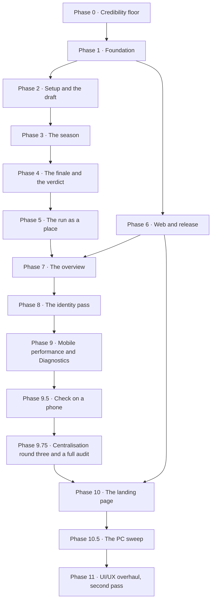

# 11 · Roadmap

> Part of the UI overhaul set. Start at [`00-README.md`](00-README.md).
> Nine phases in dependency order. Phase 0 can start today on the current look; everything after it builds on the Kit Drop foundation.

Each phase lists its **goal**, **scope** (with links to the screen and system documents), any **engine or data work** it needs, **done when**, and **how it's checked**. The checking follows this repo's conventions: `tsc` filtered as in `CLAUDE.md`, a headless `scripts/verify-*.ts` for any new engine logic, and the maintainer's own device and browser testing for anything visible.

---

## Order at a glance

```mermaid
flowchart TD
  P0[Phase 0 · Credibility floor] --> P1[Phase 1 · Foundation]
  P1 --> P2[Phase 2 · Setup and the draft]
  P1 --> P6[Phase 6 · Web and release]
  P2 --> P3[Phase 3 · The season]
  P3 --> P4[Phase 4 · The finale and the verdict]
  P4 --> P5[Phase 5 · The run as a place]
  P5 --> P7[Phase 7 · The overview]
  P6 --> P7
  P7 --> P8[Phase 8 · The identity pass]
  P8 --> P9[Phase 9 · Mobile performance and Diagnostics]
  P9 --> P95[Phase 9.5 · Check on a phone]
  P95 --> P975[Phase 9.75 · Centralisation round three and a full audit]
  P975 --> P10[Phase 10 · The landing page]
  P6 --> P10
  P10 --> P105[Phase 10.5 · The PC sweep]
  P105 --> P11[Phase 11 · UI/UX overhaul, second pass]
```

| Phase | What it delivers                                                                                   | Main documents                                                                        |
| ----- | -------------------------------------------------------------------------------------------------- | ------------------------------------------------------------------------------------- |
| 0     | Nothing lost, nothing false, nothing broken                                                        | [`01`](01-CRITIQUE.md), [`02`](02-VIBECODE-AUDIT.md), [`09`](09-COPY-DECK.md)      |
| 1     | Tokens, type, icons, brand mark, core components, the shell                                        | [`05`](05-STYLE-GUIDE.md), [`08`](08-COMPONENTS.md), [`07a`](07a-SCREENS-SHELL.md) |
| 2     | Setup, the draft, the draw, the pundits                                                            | [`07b`](07b-SCREENS-SETUP.md), [`06`](06-MOTION.md)                                 |
| 3     | The season, zones, the press, knockouts                                                            | [`07c`](07c-SCREENS-SEASON.md), [`03`](03-DUGOUT-COMPARISON.md)                     |
| 4     | Deep Match, Awards Night, the verdict, sharing                                                     | [`07c`](07c-SCREENS-SEASON.md), [`07d`](07d-SCREENS-RESULTS.md)                     |
| 5     | Run hub, stats, player, club and story routes, records                                             | [`07d`](07d-SCREENS-RESULTS.md)                                                      |
| 6     | Wide layouts, static web, store requirements, server scoring                                       | [`10`](10-ADAPT-OPTIMIZE-A11Y.md), [`02`](02-VIBECODE-AUDIT.md)                     |
| 7     | Screen-by-screen consistency pass and re-scoring                                                   | all                                                                                   |
| 8     | Identity pass: every document re-read against the app, the 2010s flavour, motion and colour redone | all                                                                                   |
| 9     | Mobile performance pass and the Diagnostics screen                                                 | [`../diagnostics/`](../diagnostics/00-README.md), [`10`](10-ADAPT-OPTIMIZE-A11Y.md) |
| 9.75  | Centralisation round three (audit and build) and a full app audit                                  | [`../centralisation/`](../centralisation/00-README.md), [`../audit-2026-10/`](../audit-2026-10/00-README.md) |
| 10    | The landing page: what the game is, and play or download                                           | [`02`](02-VIBECODE-AUDIT.md), [`05`](05-STYLE-GUIDE.md)                             |
| 10.5  | The PC sweep: every screen working on a computer                                                   | [`10`](10-ADAPT-OPTIMIZE-A11Y.md)                                                    |
| 11    | The UI/UX overhaul, second pass: impeccable's critique, other skills, the maintainer's references   | [`01`](01-CRITIQUE.md), [`../../DESIGN.md`](../../DESIGN.md)                        |

---

## Phase 0 · Credibility floor

**Goal.** Fix what loses runs, says false things or breaks on Android, without waiting for the redesign.

**Scope**

- Save the run when the result screen opens; show saving, saved and failed states; tell guests the run won't be kept.
- Register: clear the spinner in every error path; human error messages; remove the false "Your guest runs stay".
- Replace developer copy ("seeder", "for now", "PM Special", "Not full route for now").
- One tier label set everywhere (the copy deck §2.1 decision), including the "WC Champion" bug and the two local `formatTier` functions.
- Achievements: one hardness scale.
- Runs and Ranks refresh on focus.
- Match sheet: the sticky tab strip stays one row on Android.
- `app.json`: remove the nested `expo` block, fix `userInterfaceStyle`.
- Strip `console.log` calls; gate the Quick Sim Tester behind a developer flag. The Diagnostics plan moves the tester under `/diagnostics/tools` and specifies the gate: see [`../diagnostics/06-IMPLEMENTATION.md`](../diagnostics/06-IMPLEMENTATION.md) step 5.
- Confirm before discarding draft picks and before skipping the bench.
- Correct the Guide's facts (12 formations, tier names); replace the song-lyric tagline.

**Engine or data work** · none.

**Done when** · closing the app on a result screen and reopening shows the run in Runs; every flag in [`09-COPY-DECK.md`](09-COPY-DECK.md) is resolved or consciously kept; the match sheet's tabs are one row on the maintainer's phone.

**Checked by** · `tsc`; the maintainer on device and web.

**Commands** · `/impeccable harden`, `/impeccable clarify`.

**As built (16 September 2026)**

- **Runs save on arrival.** `src/hooks/useRunSave.ts` saves once when the result screen's stats are ready; the exit buttons wait for that same save, so nothing inserts twice. `SaveStatusLine` (in `src/components/ui.tsx`) shows saving, saved, failed with Retry, and the guest notice, on all four result screens. Save errors now throw instead of being swallowed.
- **Register:** the spinner clears on every error; errors are in plain words; the false "Your guest runs stay" is gone. Found on the way: if the automatic sign-in after creating an account failed, `upgradeGuestAccount` returned quietly and the player landed on Home with no session. It now throws `SIGNIN_AFTER_UPGRADE` and register sends them to sign in.
- **Developer copy** replaced in placement (the three "seeder" messages, which also misreported a missing squad as missing data), mode select and formation select.
- **One tier label set:** `TIER_LABEL` in `src/data/tiers.ts` uses the copy deck §2.1/§2.3 names; the league card, the three cup banners, Home, Runs and Ranks all read it. The two local `formatTier` functions and three local `ROUND_LABELS` maps are gone. Runs' tier sort now uses `TIER_RANK` (the old list had no World Cup tiers, which sorted above Perfection).
- **Hardness** reads /11 everywhere (badge, achievements tile and footnote).
- **Runs and Ranks** refetch on focus and show a "Couldn't load this" state with Retry instead of the empty state (`LoadFailed`).
- **Match sheet tabs:** root cause was React Native's `ScrollViewStickyHeader`, which moves the sticky child's style to its wrapper and gives the child `flex: 1`, dropping `flexDirection: 'row'` on native. The row now lives one view down.
- **`app.json`:** the ignored nested `expo` block (which named the deleted `players_v4.db`) is gone; its background colours moved to `expo.backgroundColor` and `expo.android.backgroundColor`; `userInterfaceStyle` is `dark`. **Needs a native rebuild** (`android/` is prebuilt) to reach the device.
- **Logs:** every `console.log` in `app/` and `src/` removed, including ones that printed user ids and the internal login email. Error paths keep a `console.warn` without personal data.
- **Tester gated** behind `__DEV__` or `EXPO_PUBLIC_DEV_TOOLS=1`, set on the `development` and `preview` EAS profiles. About reads its version from `app.json` (it said 1.0.0; the app is 0.0.1).
- **Confirmations** (`ConfirmBar`, inline because `Alert.alert` does nothing on web): leaving the draft with picks (header back and Android back) and skipping the bench.
- **Guide and copy-deck flags:** 12 formations; Perfection naming; the score paragraph now mentions OVR direction and the difficulty multiplier; "rewards" removed; "shot maps" removed; Baby Mode no longer promises you can't lose; the song-lyric tagline replaced; formation descriptions describe shapes only. Flag 4 ("the board is furious") removed from the Misery line.
- **Not done here:** browser back on web during the draft isn't intercepted (only the header and Android back are); the muted-text contrast (3.67:1) waits for the Phase 1 theme.

---

## Phase 1 · Foundation

**Goal.** The Kit Drop system exists in code, and the shell uses it.

**Scope**

- Write `DESIGN.md` at the project root from [`05-STYLE-GUIDE.md`](05-STYLE-GUIDE.md); correct values as the build settles them.
- Restructure `src/theme.ts` into primitives and roles per ground; a `useKit()` hook for grounds, colourways and the replaced club's colour.
- Load Archivo and Martian Mono; verify tabular figures and the italic at extra-condensed width on Android before committing to them.
- Icon set: Material Symbols Sharp as SVG components, plus the custom football glyphs.
- The brand mark, app icon, adaptive layers, splash, favicon, manifest icons, default link preview.
- Core components from [`08-COMPONENTS.md`](08-COMPONENTS.md) §2, **states in use only**: Plate, Tag, Label, Tape, Stripe, ZipTag, ListRow, Table (on `FlatList`), SquareTabs, Chips, Field, Toggle, ConfirmScreen, feedback components, Icon, RoundFlag, ClubTag. Roles and accessibility labels built into each.
- The shell: four destinations, bottom bar and rail, RunHeader, insets, back behaviour, the not-found route.
- Home (A2) as the first full screen on the new system.

**Engine or data work** · a lookup of each club's three-letter code (derivable from names, with manual overrides for clashes); round flag assets for every nation in the data.

**Done when** · Home, the shell and You render entirely from roles and components with no raw hex; a TalkBack pass of Home announces every control; the launcher and browser tab show the real mark.

**Checked by** · `tsc`; a grep for raw hex outside `theme.ts`; the maintainer on device and web.

**Commands** · `/impeccable document` (DESIGN.md), `/impeccable extract`, `/impeccable typeset`, `/impeccable colorize`.

**As built (16 September 2026)** · the system is described in [`../../DESIGN.md`](../../DESIGN.md), including every place the build differs from this plan (§9 there).

- **Tokens:** primitives, roles per ground, colourways, font keys, type scale, spacing, density and borders added to `src/theme.ts` under the old palette, which stays for screens not yet rebuilt. The old `textMuted` is now `#8A92A0` (5.01:1 or better on every dark surface), closing the Phase 0 contrast item.
- **Fonts:** Barlow Condensed Black Italic (super; Archivo ExtraCondensed isn't in the static builds), Martian Mono, Archivo. Eight files required individually in `app/_layout.tsx` so the bundle carries only the weights used. Loaded at runtime, no rebuild needed.
- **Icons:** Ionicons Sharp behind a semantic `Icon` component instead of Material Symbols.
- **Components** (`src/components/kit/`): KitText, Stripe, Tape, Rivets, ZipTag, Icon, Plate, BackControl, SectionTag, ListRow, Toggle, Field, Checkbox, Tag, RunLabel (+ skeleton), Wordmark, IdTag, RoundFlag, ClubTag, KitScreen, StripedNotice, InlineError, EmptyState, KitTabBar. ConfirmScreen is a route (`app/confirm.tsx`, `openConfirm()`). SquareTabs, Chips, the Table and RunHeader are **not built yet**: nothing uses them until Phases 2, 3 and 5, and they'll be built with their first screen.
- **Shell:** four destinations (Play, Runs, Ranks, You) drawn by `KitTabBar`, a rail from 1024px. Guide and About moved to `app/guide.tsx` and `app/about.tsx`. Branded `app/+not-found.tsx`. Safe-area insets on Home, You, auth, Guide and About.
- **Screens rebuilt on cotton:** Home, You, sign in, create account, confirm, not found. Home has the wordmark, the best-verdict line, the last three runs as RunLabels that open the run, a skeleton and an inline error, the guest line only after a guest finishes a run, and START A RUN with an AGAIN plate that preselects the last mode and difficulty. You has the ID tag and three groups, and sign-out goes through ConfirmScreen.
- **Brand:** `scripts/brand-assets.py` draws the compact mark (riveted P/M plate with the orange tag) into the icon, adaptive layers, monochrome layer, favicon and splash. `expo-splash-screen` added with a nylon splash. Web glows removed; the page is nylon with an orange square focus ring (`src/lib/webChrome.ts`, shared by `+html.tsx` and the root layout).
- **Data:** `src/data/club-codes.ts` (101 overrides on top of the database codes) and `scripts/verify-club-codes.ts`: 970 clubs, 60 competitions, zero clashes.
- **Draft back button on web** now asks before discarding picks: `usePreventRemove` catches the header back, Android back and browser back, closing the Phase 0 open item.
- **Not done here:** round flag image assets (emoji clipped to a circle for now); You's settings, privacy, terms and delete account (Phases 2 and 6); the web column stays 480px until Phase 6, so the rail only appears on native tablets; a TalkBack pass is for the maintainer's device.
- **Needs a new dev build:** `expo-splash-screen` is a native module, and the icon, splash and `app.json` changes only reach Android through a build.

---

## Phase 2 · Setup and the draft

**Goal.** A run starts in three decisions and the draft is fast, readable and fun on the sixteenth spin.

**Scope** · B1 Where you play · B2 How hard · B3 Your shape · B4 The draft · B5 The bench · B6 The ratings reveal · B7 The draw (one reveal component for all four modes) · B8 The pundits' predictions · the lights-on transition.

**Engine or data work**

- **`src/engine/predictions.ts`**: predicted table from squad strength, two over- and two under-achievers, predicted Player of the Season, top scorer and best under-21. Pure and seeded, stored on the run when the season starts so the verdict checks what was actually predicted. **`scripts/verify-predictions.ts`**: determinism, and that predictions are sane against thousands of simulated seasons (the predicted champion wins more often than any other club).
- The draft's auto-assign when exactly one position fits (UI logic over the existing `positionPenalty`).

**Done when** · a returning player reaches the draft in three taps; a full XI takes under a minute for someone who knows what they want; later spins take under half a second; hidden-rating runs reveal ratings only in B6.

**Checked by** · `tsc`; `verify-predictions.ts` green; the maintainer on device.

**Commands** · `/impeccable shape` (per screen, if anything is still open), `/impeccable animate`, `/impeccable layout`.

**As built (16 September 2026)** · the setup flow is now: Where you play → How hard → Your shape → The draft (with the bench) → Your ratings (blind runs only) → The draw → The pundits → the season.

- **Shared:** `RunHeader`, `ChoiceLabel` (mode and care labels), `StepControl`, `Chips`, `InlineConfirm` in `src/components/kit/run.tsx`. Spring tokens in `src/lib/motion.ts`, the haptics map in `src/lib/haptics.ts`. The mode list lives in `src/data/modes.ts`.
- **B1 Where you play** (`app/game/mode-select.tsx`): mode labels grouped Leagues / Europe / World Cup, one tap moves on, League mode adds a league step with round flags, Chaos and Cursed wear the hazard edge and print their rules, `LAST TIME` on your last mode, plain-text competition names (no emblems).
- **B2 How hard** (`app/game/difficulty.tsx`, `difficulty-custom.tsx`): care labels with rerolls, ratings, what the AI does, the bench, and the score multiplier, all read from `resolveDifficulty`. Custom is its own screen with 48dp steppers and a live hardness and multiplier readout. The bench toggle moved here from the formation screen; picking a preset turns the bench back on. Chaos and Cursed skip this stage and show it as `SET`.
- **B3 Your shape** (`app/game/formation-select.tsx`): the selected shape as numbered shirts, one line each, "you'll need" tags, a swipe rack, and `LAST TIME` from a new `lastFormation` in the store.
- **B4/B5 The draft** (`app/game/draft.tsx`, parts in `src/components/setup/DraftParts.tsx`): pitch hangers with effective ratings and a striped edge when out of position; one-tap picks (auto-assigned when exactly one spot fits, otherwise the spots light); hold-and-tap moves and swaps on the pitch and the bench rail, with the same move rules as before; the rack spin (full length on the first spin, 450 ms after, tap to land, reduced motion skips it); the landed club card flips to its fact; sort chips (no OVR sort when ratings are hidden); a striped notice when nobody fits; the bench drafted on the same screen; "Play without a bench" through the ConfirmScreen.
- **B6 Your ratings** (`app/game/reveal.tsx`): blind runs only, on nylon, ratings flip in 60 ms apart, then Team OVR, a steal and a blunder, skippable.
- **B7 The draw** (`app/game/placement.tsx`): one layout for all four modes; the globe on a nylon panel, tap to land it, full length on the first draw of a session and half after (`GlobeReveal` got a `skip` prop); a riveted "YOU'RE" label; rivals with the gap in words; your first three league fixtures (the fixture generator's pairings are deterministic). League mode now always draws from the league you chose; the "League Pool" toggle is gone.
- **B8 The pundits** (`app/game/pundits.tsx`, engine `src/engine/predictions.ts`): a predicted table (the top eight plus your neighbourhood for 36- and 48-team fields), who they think will surprise and disappoint, a round call for cup modes, and the seed stored as `predictionSeed`. **`scripts/verify-predictions.ts`**: determinism, order independence, list rules, and 1,500 simulated seasons (the predicted champion wins 48.9%, more than twice any other predicted place; mean error 1.8 places; 55% of clubs placed away from pure strength).
- **Lights on:** "Start the season" cuts to nylon and draws the colourway tape across in 250 ms. League runs then start straight away (`?start=1`, after the scorer pools load); Champions League and World Cup keep their own pre-season step because their fixtures and group draw are made there. Their buttons now read `START THE LEAGUE PHASE` / `START THE GROUP STAGE`.
- **Removed:** `ConfirmBar` and `StepSlider` from `src/components/ui.tsx`.
- **Not done here, and why:**
  - The tag flying from the rail to its hanger and the Team OVR roll: the hanger's zip tag swings instead. The flight needs measured positions across a scroll view; worth doing with the Phase 3 table reorders, which need the same machinery.
  - The pundits' three player names (Player of the Season, top scorer, best under-21) need every club's squad loaded; they arrive with Phase 3, when the season screens load pools anyway.
  - Zone tapes on the predicted table wait for `qualification-bands.ts` (Phase 3).
  - A pause control on the globe (only tap-to-land exists).
  - The Champions League full path has no pundits step yet: its field isn't known until the domestic season is played.
  - Drag to move on the draft pitch: tap-to-hold covers it.

---

## Phase 3 · The season

**Goal.** Glancing at the season screen for two seconds tells you whether you're in trouble.

**Scope** · C1 league season · C2 Champions League league phase · C3 World Cup groups · C4 the full UCL path · C5 knockouts · the season strip · the ticker · zone tapes and legends everywhere a table appears.

**Engine or data work**

- **`src/data/qualification-bands.ts`**: per league per season, the real title, Champions League, Europa League, Conference League and relegation places for the seasons in the database. The tier ladder reads its thresholds from the same table, so a tier can't disagree with the zones. **`scripts/verify-zones.ts`**: every league-season has bands; bands never overlap; the ladder and the zones agree for every final position.
- **`src/engine/press.ts`**: stories from table snapshots, following The Dugout's four rules scaled to one run (see [`03-DUGOUT-COMPARISON.md`](03-DUGOUT-COMPARISON.md) §2.1 and §4). Pure: snapshots in, stories out. Stories store keys and the frozen rows they're about, attributed once and stored on the run like scorers are. **`scripts/verify-press.ts`**: determinism; no story before its threshold; cooldowns respected; frozen rows match the snapshot; a realistic number of stories per season (neither silent nor noisy).
- Split `simulation.tsx` into memoised panels reading narrow selectors (performance, [`10-ADAPT-OPTIMIZE-A11Y.md`](10-ADAPT-OPTIMIZE-A11Y.md) §3).

**Done when** · every table in a run shows real zones with a legend; a season produces a readable feed; your match resolves before the rest of its round on every mode; no two tables are ever side by side on a phone.

**Checked by** · `tsc`; `verify-zones.ts` and `verify-press.ts` green; existing `verify-match-detail.ts` and `verify-match-context.ts` still green; the maintainer on device.

**Commands** · `/impeccable layout`, `/impeccable animate`, `/impeccable optimize`.

**As built (16 September 2026)**

- **Zones** · `src/data/qualification-bands.ts`: title, Champions League, Europa League, Conference League, play-off and relegation places for the five domestic leagues, 2018/19 to 2025/26, based on league position only. The counts that changed between seasons are included: England had 5 Champions League places in 2024/25, Italy and Germany had 5 in 2023/24, France had 3 and then 4, Ligue 1 relegated four clubs in 2022/23, and 2019/20 was cut short. Cup winners moving the European lines are not modelled, because the domestic cups aren't simulated. 2025/26 uses the base counts until its extra performance places are known. `engine/tier.ts` now reads the zone. A 4th place in France, when France had three Champions League places, now earns `europa_glory`, and a relegation play-off place is Misery. Without a zone, the tiers are the same as before. **`scripts/verify-zones.ts`** checks all 40 league-seasons in the database.
- **The press** · `src/engine/press.ts`:
  - 13 story kinds: summit, runaway leader, title race, relegation battle, six-pointer, hot and cold streaks, unbeaten, winless, log jam, draw specialists, final-day champions, final-day survival.
  - Three headline variants per kind, chosen from the story's id.
  - The table rows a story is about are frozen when it's written, and each kind has a cooldown per club.
  - Nothing is written before a quarter of the season. Each round gets one story, plus one more if another story is about you.
  - Stored on `SeasonResult.press`. **`scripts/verify-press.ts`** runs 400 seasons: about 24 stories each (14 to 32).
- **C1 league season** · `src/components/season/LeagueSeason.tsx`. The old `LeagueSimulation` is gone from `simulation.tsx`. On nylon, from the top:
  - Your position as a super, with how far you moved.
  - The season strip: tap a matchday to look back.
  - Your result first, as a scoreline card.
  - A switch between three views:
    - **Table:** zone tapes, codes and a legend. Rows slide when positions change, and crossing a zone line gets a tape and a haptic.
    - **Results:** the rest of the round, a beat after yours.
    - **Press:** newest first, each story with its frozen rows.
  - The ticker and the controls sit in the thumb zone. Skip to the last day and abandon both go through the ConfirmScreen.
  - Before matchday 1 the table is in the pundits' order, greyed out. The simulation logic is unchanged, except that the live and skip paths now share one function.
- **Shared pieces** · `src/components/season/SeasonParts.tsx`: LeagueTable, ZoneLegend, StandingFigure, SeasonStrip, ScorelineCard, ResultRow, SegmentSwitch, FixtureRow, GroupWall, StampLabel, RoadTape, Ticker, StoryItem.
- **C2 Champions League league phase** ·
  - The review shows your eight fixtures with pot tags and the three zones.
  - The phase itself is on nylon with R16 / PO / OUT tapes. Your result comes first and the table a beat later (the table is now stored per matchday).
  - The locked "SLOW" badge is gone.
  - If you finish 25th or lower, the button reads `See how it ends`.
- **C3 World Cup groups** ·
  - **The draw:** the two qualification rules, your three fixtures with flags, and every group as a wall.
  - **The live stage:** your match on the clock, then four tabs: Your group, 3rd race, Results, All groups. The race for the best third places is now live, not only shown at the end.
  - **The end of the groups:** your fate stamped (`THROUGH AS WINNERS`, `THROUGH IN SECOND`, `THROUGH IN THIRD`, `OUT`), your group, your three results, the third-place table and the wall.
- **C5 knockouts** ·
  - `KnockoutPhaseView` is rebuilt on nylon.
    - Your tie plays live, then settles into a scoreline card: aggregate, legs, extra time, penalties, scorers and THROUGH or OUT.
    - The round's other ties appear after yours, with the winner in full ink.
    - Going out is a stamp: `OUT IN THE QUARTER-FINALS`, `RUNNERS-UP`, `THIRD PLACE` or `FOURTH PLACE`.
    - The next round is named, and `Skip to the final`, `See the line-ups` and `See your verdict` sit in the thumb zone.
  - `LiveMatch` now uses Kit Drop:
    - The score is a super, and the round and minute are in the tag mono.
    - The pause control is 48dp with an icon.
    - GOAL / PEN / OG / RED tags slide in from their side.
    - Penalties are a row of tags, filled for a goal and striped for a miss.
  - `BracketPreview` keeps its pinch, pan and wheel zoom. It gains a visible Fit control, square ties and `?` slots.
- **C4 full path, a readability slice** ·
  - The five-stage road tape is on every phase.
  - Every emoji and glyph control is replaced by words or icons.
  - The leagues browser button has a label.
  - The berth codes are explained in one line, and the skip buttons say what they skip.
- **Performance** · `simulation.tsx` went from 182 KB to 96 KB: the league screen moved out, and 185 dead styles and the old row-slide code were removed. Table and result rows are memoised.

**Not done in Phase 3, and why**

- **C4 in full:** under the new road tape, the full path's domestic, Europe, qualifying and league-phase screens still use the old dark cards. Still to do: berth tapes on the domestic table, the wall of champions, the qualifying track, and elimination shown as a verdict. It's the largest single screen (93 KB) and needs its own pass, so it opens Phase 4.
- **The pinned "you" row** for the 36-club table: your position, shown large above the table, already tells you where you are.
- **Group and league pages as routes:** `WCGroupModal` and the leagues browser are still modals (Phase 5 removes every content modal).
- **Rotation cut-offs still fixed** (`LEAGUE_EURO_SPOTS` 5, `LEAGUE_RELEGATION_SPOTS` 3) rather than read from the zones. Changing them shifts the game balance, which needs its own measured pass.
- **Cup-shaped stories** (group of death, the third-place scramble, giant killing, holders out, heartbreak on penalties) and a season-in-headlines section on the result screen: Phase 4, with the verdict.
- **Found in passing:** when you skip the Champions League league phase, matches are simulated without squad rotation or the missing-player penalty, unlike when you watch it. Match sheets still regenerate correctly, so nothing breaks, but a skipped league phase plays out slightly differently from a watched one.

---

## Phase 4 · The finale and the verdict

**Goal.** Every run ends on a moment worth screenshotting.

**Scope** · C6 Deep Match in the Kit Drop world · C7 Awards Night · D1 the unified verdict for every mode, including Misery's own treatment · D11 the share label.

**Engine or data work**

- **Awards extension** in `src/engine/stats.ts` (or a new `awards` module): Team of the Matchday and Team of the Season picked by line; a three-voter pundit panel for Player of the Season whose ballots are stored on the run. **`scripts/verify-awards.ts`**: determinism regardless of input order; a runaway season is never overturned by the panel; the team of the season is a legal shape.
- Share label rendering with `react-native-view-shot` and `expo-sharing` (both installed).

**Done when** · a relegated league run and a champion league run look unmistakably different; the score and its multiplier are on the verdict; sharing takes two taps; Awards Night can be paused and skipped at every beat.

**Checked by** · `tsc`; `verify-awards.ts` and `verify-deep-match.ts` green; the maintainer on device.

**Commands** · `/impeccable delight`, `/impeccable animate`, `/impeccable bolder` (if the verdict reads timid).

**In progress (17 September 2026)** — the first pass is in; the Deep Match and the bodies of the result screens are still to come.

- **C4 · The full Champions League path, rebuilt.** `app/game/custom-ucl-simulation.tsx` went from 93 KB to 72 KB and now runs on nylon from end to end, one phase at a time under the five-stage road:
  - **Your season:** the field by strength with a berth code on every place (UCL straight in, PO, Q3, Q2, Q1) and a legend.
  - **The season itself:** your position as a super, the strip you can scrub, your result first, then a switch between the table (berth tapes, and a heading where a split league divides) and the round's other results. A split league can still show its pre-split table.
  - **Where you finished:** the finish stamped, what it earned in one line, then the final table.
  - **Europe's seasons:** every league as a row with its champion, yours tagged, each opening its table.
  - **Qualifying:** the live tie on the clock above the ladder, the ladder itself through the shared tie rows.
  - **Qualified or out:** stamped, with your ladder underneath.
  - **The league phase:** the same screen as the Champions League finals mode, with R16 / PO / OUT.
  - **The knockouts:** your tie live, then as a card; the round's other ties as rows; going out stamped; the next round named.
- **One tie row, everywhere.** `TieCard` (yours) and `TieRow` (everyone else's) in `SeasonParts`, with `KnockoutRoundsView` and the qualifying ladder rendering through them, so the same tie reads the same on the live screens, the ladder and the result screens. The shared run furniture (thumb bar, back-to-live, abandon, the skip and abandon questions) moved to `src/components/season/RunChrome.tsx`.
- **The awards engine.** `src/engine/awards.ts`: a team of the season picked by line in a 4-3-3, the counting awards (golden boot, playmaker, golden glove, best under-21), and a **Player of the Season decided by three pundits who disagree** — one counts goals, one reads the ratings, one only respects what the club achieved. Each hands in a ranked five, scored 6-4-3-2-1, and the ballots are stored so "he came third because two of them had him fourth" is readable. **`scripts/verify-awards.ts`** over 2,000 seasons: determinism whatever order the candidates arrive in, legal ballots and team shape, the counting awards really are the leaders, a runaway season is never overturned (0 of 6 runaways), and the panel still disagrees with the raw score 20% of the time.
- **C7 · Awards Night** (`app/game/awards.tsx`): the beat between the final whistle and the verdict, on nylon. One award at a time with progress ticks, pausable, "show them all", your own players tagged and a haptic when one of them wins, and the three ballots printed under Player of the Season. Every mode routes through it (`/game/awards?to=…`), including after the Deep Match final. It also pays for computing the run's stats and hands them to the verdict through `src/lib/awardsNight.ts`, so nothing regenerates the match sheets twice.
- **D1 · The verdict, first pass** (`src/components/season/VerdictBlock.tsx`): one riveted label for every mode — Perfection wears the volt tape, Misery wears the hazard stripe, everything else its colourway — with the tier as a super, the run's score and the hardness multiplier that earned it, and **the pundits' pre-season call checked against what happened** (P8-24: "They had you 14th. You finished 3rd."). The cups get the same check in words, from the round the pundits called. It replaces the old banner on all four result screens.
- **D11 · The share label** (`src/lib/shareRun.ts`): the verdict card is captured and shared as an image on a phone; on the web it uses the browser's share sheet, or the clipboard.

**Fixed straight after that pass (17 September 2026)**

- **The verdict crashed the result screen.** The score and the pundits' check were added as `useMemo` calls *below* the screen's "no result" early return, so the hook count changed between renders ("Rendered more hooks than during the previous render") and the run could never reach its verdict. Both are plain values now; neither is expensive. The rule this broke, worth keeping in mind on every one of these long screens: **nothing below an early return may be a hook.**
- **The hand-off to the verdict** carried a slashed path in a query string (`/game/awards?to=/game/result`). It's a short mode key now (`?to=league|cl|wc|cucl`), and Awards Night falls back to the run's own mode if the key is missing.

**Corrections to the awards, from the maintainer's playtest (17 September 2026).** The panel was the wrong idea, and the rest of the night is thinner than it should be. All of this is Phase 4 work, not Phase 8:

- **P4-A · Player of the Season goes back to a scoring system.** The three-pundit vote replaced a working, explainable score with a popularity contest, and the maintainer is right that it's wrong: the award should be earned by what a player did, measured, not by what three invented voters thought. `computeAwards` in `stats.ts` is the correct model and comes back as the decider. The panel can survive at most as flavour *after* the fact — "the numbers had him first, the watcher had him third" — never as the thing that picks the winner. `verify-awards.ts` changes with it: the check becomes "the best season by the scoring model always wins", not "a runaway is never overturned".
- **P4-B · Use the deep stats we already have.** Every match generates attacking, creative and goalkeeping detail (`match-detail.ts`), and the awards only read goals, assists, clean sheets, ratings and man-of-the-match counts. The scoring model should use the real columns — chances created, shots on target, dribbles, tackles won, saves and the rest — and **the screen should show which numbers won the award**, so the result is arguable from the evidence rather than a bare total.
- **P4-C · An award winner is tappable.** Tapping a winner opens that player: their season, their matches, their game log. The player page is Phase 5's, so this is the first real caller of it.
- **P4-D · Team of the season gets a bench.** The eleven plus honourable mentions, so the near-misses are visible.
- **P4-E · The team of the season picks its own shape.** Rather than forcing a 4-3-3, take the strongest few players per position, weigh them against each other, and pick the formation that fits the actual talent (from the twelve shapes in `formations.ts`), then draw the eleven in that shape on a pitch. The same method decides the **team of the matchday**.
- **P4-F · A proper night, with more to it.** More awards, so it reads like a ceremony rather than a list: club awards as well as player awards, and a **manager award for the most overachieving club** — measured against what was expected of them, so the club that was tipped to win and did win can take it as easily as the surprise of the season.
- **P4-G · Awards Night plays once, live.** At the end of a run it's the ceremony. Opened later from history it is not: there it's a section that reads like the stats, with no count-down, no ticks, no pause.

**The corrections and the rest of Phase 4, built (18 September 2026)**

- **P4-A · Player of the Season is the scoring model again.** `computeAwards` decides it; the pundit panel is gone entirely. `verify-awards.ts` now checks the rule itself: the best season by the scoring model always wins.
- **P4-B · The deep stats count.** The stats pass now also sums interceptions, clearances, blocks, duels won, big chances created, and the keeper's saves and penalties saved. The scoring model keeps every one of its old terms and adds the deep columns at small weights (35 interceptions is worth about three goals). Each candidate carries a **breakdown** — the numbers that earned the score, biggest first — and the award cards print the top five of it.
- **P4-C · Winners open their season.** Any winner or runner-up, and any player on a team of the season or matchday, opens the stats screen straight onto that player's match-by-match log (`openPlayerSeason`, `/game/stats?player=…`). The fuller player page is Phase 5's.
- **P4-D/E · The team picks its shape.** `pickTeam` weighs each player against the usual starters of his own line (raw scores would always pick three at the back, since goals dominate the score), takes the best five per position, tries all twelve formations and keeps the one the talent fills best, then draws it on a pitch with a bench of seven honourable mentions. Over 600 test seasons every one of the twelve shapes turned up. The **team of the matchday** uses the same method on each round's match ratings — the stats pass now keeps every round's lines for it — and "team of the matchday regular" is an award.
- **P4-F · A proper night.** Player awards: Player of the Season, golden boot, playmaker, golden glove, defender, midfielder and forward of the season, most man-of-the-match awards, team-of-the-matchday regular, best under-21. Club awards: best attack, best defence, and **manager of the season** — places beaten against the pundits' table, with three extra for winning the title, so a favourite who delivers can take it as easily as a surprise (checked: a tipped-first champion beats a +2 overachiever).
- **P4-G · Awards Night plays once, live.** At the end of a run it's the ceremony; on the verdict and on any run opened from history the same awards are a plain section (`AwardsSection`) with no count-down. Runs from history have no rounds stored, so they show no team of the matchday.
- **C6 · The Deep Match, reskinned.** On nylon: the score as a super with the clock as a tag and a line of commentary under it; sections instead of cards; the controls in the thumb zone; the final whistle as a **cut to silence** (black, "full time", the score) before the ceremony. The ceremony is **stitched on**: a win is a one-frame cotton flash and a riveted volt label; a loss is a silver medal with the hazard stripe pulled across its label. The trophies stay original drawings. The pitch, momentum graph, stat bars and timeline inside it are the match screen's shared pieces, left as they are for that screen's own pass.
- **Commentary** (`src/engine/commentary.ts`): every event becomes a line built from its own fields — scorer, assister, penalty, own goal, the error that led to it, the keeper who saved it — with the phrasing picked by hashing the event, so a match reads the same every time. Quiet lines read the state of play between events. **`scripts/verify-commentary.ts`**: 6,000 events, deterministic, never an empty or broken line, scorers and assisters always named.
- **P4-H, first addition:** the match screen gains a **Commentary tab** (kick-off, half-time, extra time and full time marked). Nothing on the screen was removed.
- **The pundits name three players** before the season (`predictPlayers`): Player of the Season, top scorer (a forward), best under-21, from the loaded squads with the same deliberate noise as the table. They're shown on the pundits screen and read back on the night: "They said X. It was Y." or "The pundits called it." Checked in `verify-predictions.ts`: deterministic, eligible, reputation-led but not infallible. While there, **P8-14 is done**: the undercutting line is gone and the screen ends on "PROVE THEM WRONG".
- **The pundits' table, checked** (`PunditsTable`, league verdict): every club's finish beside where the pundits had it, how far out they were, how many places they got exactly right, and their worst call.

**The rest of Phase 4, built (18 September 2026)**

- **The pundits' check for the cups** (`src/engine/cup-calls.ts`, `PunditsRoundTable`): every side in the field, the round the pundits called against the round it reached, on one ladder, so "two rounds better" is a number. A 36- or 48-side field opens on the shortlist that matters — your side, the pundits' eight favourites, and their three worst calls either way — with the whole field one tap away. **`scripts/verify-cup-calls.ts`** checks it against generated brackets: one row per side, the winner as champion, each knockout loser out in that round, the exact difference in rounds.
- **P4-H · The match screen, on nylon, with the map.**
  - **Nothing lost.** The screen and every shared piece it draws with (the stat bars, the timeline, the scorer lists, the player rows, the pitch and bench, the momentum graph) moved onto nylon tokens, square corners and the kit's font families in place. No layout was rewritten.
  - **Words, not emoji.** Emoji icons became the kit's short codes (GOAL, OG, MISS, INJ, YC, RC, SUB, POTM).
  - **The score** is set in the super face, and no competition colour tints the numbers.
  - **The same change reaches the Deep Match,** whose inner panels are these same components.
  - **A new Map tab:**
    - a **shot map** with every shot where it was taken, sized by its xG and marked goal, saved, off target, blocked or woodwork;
    - **average positions** for every player who played;
    - a **heat map** for whichever player you tap.
  - **How it's generated.** The positions come from `src/engine/match-geometry.ts`, a texture layer on the sheet: it uses the sheet's own counts (each player's shots, on target and goals; the team's inside-box, blocked and woodwork totals; penalties from the events) and only places them. It runs on a separate seeded stream, so it can never move a number already on the sheet.
  - **Checked.** **`scripts/verify-match-geometry.ts`**, over 3,000 matches: generating the map leaves the sheet byte-identical, it's deterministic, every player's shots and goals match the sheet, each team's shots add up to its xG (worst drift 0.03), and everything is on the pitch.
- **The result screens, below the verdict, on nylon.**
  - **Colour and type.** The four result screens and every piece only they use (squad summary, lineup pitch, medical table, penalty shootout, the World Cup group view, the full-path viewers, the qualifying ladder, the info bubbles) moved onto nylon tokens, dropped the mode tints behind them, set their weights in the kit's font families, and lost their emoji.
  - **The awards move off the page** (the first part of P8-38): the result page carries a "See the awards" button, and the awards open as a plain page of their own (`app/game/run-awards.tsx`).
  - **Still to do.** The body of these pages is still the old *layout* in the new colours. The real rebuild of that ground (the run hub, stats, player and club pages, the match sheet as a route) is Phase 5's scope, and that's where it stays.

---

## Phase 5 · The run as a place

**Goal.** Every number in a run leads somewhere, and nothing is a modal.

**Scope** · D2 run hub · D3 stats · D4 player page · D5 club page · D6 story page · D7 match sheet restyle · D8 Runs · D9 Ranks · D10 Achievements and Career · deletion of every content modal listed in [`08-COMPONENTS.md`](08-COMPONENTS.md) §5.

**Engine or data work** · per-90 and position-rank aggregates over the existing run stats (pure functions over `computeRunStats` output); `scripts/verify-run-stats.ts` or an extension of an existing verifier for the new aggregates.

**The player page is its own pass (added 17 September 2026).** Like the match screen (P4-H), D4 isn't a restyle: the player page needs a real interface and real features, at the depth FotMob and SofaScore give a player — a season summary, the match-by-match log, the deep-stat columns, their awards, and how they compare with the rest of their position. It is also where an awards winner lands when tapped (P4-C), so it has to exist properly before Awards Night can link into it.

**Done when** · `AppModal` is used by no content surface; every route survives a reload on web; any player, club, match or story in a run can be reached in two taps from the run hub.

**Checked by** · `tsc`; verifiers green; the maintainer on device and web.

**Commands** · `/impeccable distill`, `/impeccable layout`.

**As built so far (18 September 2026).**

- **Data.** `src/lib/runData.ts` computes a run's data once: the live run is kept on the store, saved runs are cached by id. Every run page reads it through `useRunData(runId?)`, which fixes the long wait when opening a player.
- **Links.** `src/lib/runNav.ts` holds every link between run pages: `openPlayer`, `openClub`, `openStory`, `openRunHub`, `openRunMatch`.
- **Engine.** `src/engine/run-aggregates.ts` computes per-90 figures (from 270 minutes) and ranks within a player's own line (three rated matches for average rating), plus the "TOP x% · POS" tag. `scripts/verify-run-stats.ts` passes.
- **D2 run hub** (`app/game/run.tsx`). Tabs: TABLE/GROUPS, SEASON (form strip, position graph, every match), STATS, PRESS and SQUAD. The tab is kept in the URL, so it survives a reload.
- **D3 stats boards.** Six families, TOTAL/PER 90, the qualifying rule printed on the board, percentile tags, search, and a link on every row.
- **D4 player page, D5 club page, D6 story page** (`app/game/{player,club,story}.tsx`).
- **Stats screen and team modals gone.** `app/game/stats.tsx` is now a redirect to the hub, or to `/game/player` when a player is named. Its three modals are gone, and the result screens' team modals now open the club page.
- **Closed out (18 September 2026, second pass):**
  - **Modals.** `AppModal` is deleted and no content surface is a modal:
    - Knockout ties open on leg 1's match sheet, where the bracket block lists both legs (`openKoTie`).
    - World Cup groups, league tables and the leagues browser are pages through `openSheet` (`src/lib/sheet.ts`). They're in-memory content from live competitions, so a web reload says so instead of rebuilding them.
    - The `?` bubbles and "how it works" open `/game/rules?topic=`.
  - **Hub.** The BRACKET tab is rebuilt from the run's match list, drawn with the shared `TieRow`.
  - **Match sheet.** Opened from a finished run's pages (`linkPages`), club names, the player of the match, "their whole season" in the lineup and the player-stats rows all link to the player and club pages. They're off mid-season, where a player page would show results still to come.
  - **D8–D10.**
    - Runs and Ranks are rebuilt: each run is the same `RunLabel` Home shows, with `runMeta` in `src/data/tiers.ts` as the shared tag line.
    - Achievements and Career are rebuilt: modes wear their colourway tape and honours are tags.
  - **P8-54, result screens.** All four are rebuilt from the same pieces as the live screens:
    - the zoned `LeagueTable` (rows now tappable), the season strip, `ResultRow` and `KnockoutRoundsView`, which replaced three per-file `BracketView`s;
    - the World Cup zones moved into `SeasonParts`;
    - new `src/components/season/ResultParts.tsx`: `ResultFigures`, `ResultSection`, `ResultActions` and `YourMatches`;
    - `PositionGraph`, now in `SeasonParts`, is shared by the club page, the hub and the league result.
- **Left for later, on purpose:**
  - P8-66: legends on the graphs.
  - P8-67: the hub's own design pass.
  - The old-style `LineupPitch`, `SquadSummary` and `MedicalTable` still sit on the result screens. They're shared with other screens and belong to the centralisation pass (P8-71).

---

## Phase 6 · Web and release

**Goal.** Android and web are equal, and nothing blocks a public listing.

**Scope**

- Medium and expanded layouts for every area ([`10-ADAPT-OPTIMIZE-A11Y.md`](10-ADAPT-OPTIMIZE-A11Y.md) §2), web keyboard shortcuts, hover and focus.
- `web.output: "static"`, per-route titles, descriptions, canonical URLs and link previews; run pages preview their verdict.
- Web manifest; offline strip; clean console.
- A real domain (the maintainer's choice).
- Privacy policy and terms pages; in-app and web account deletion.
- Server-side scoring through the `submit-run` edge function using the shared tier ladder; RLS policies exported into the repo and tested cross-user.
- Store listing: screenshots and copy captured from the real redesigned app, never mock-ups presented as the real thing.
- Official competition marks replaced with original marks if the public release goes ahead.
- Optional: a consent-free analytics counter.

**This phase can run in parallel with Phases 2–5** once Phase 1's components exist, because every layout it builds uses them.

**Done when** · the vibecode audit's blockers are all closed; a desktop browser shows real multi-pane layouts; a pasted run link shows its verdict in WhatsApp and Discord.

**Checked by** · `tsc`; `python scripts/scan_static.py` from the vibecode-audit skill re-run against the built web output; Lighthouse on a throttled mobile profile; the maintainer on device and web.

**Commands** · `/impeccable adapt`, `/impeccable harden`, `/impeccable optimize`.

**As built so far (19 September 2026).**

- **The infinite strip, found.** The kit's `Stripe` drew its SVG at 100% height inside boxes sized by their row. On Android that's a layout loop. It was the sign-in notice that blocked sign-in and sign-up (P8-76), and the same loop as P8-02, P8-62 and P8-82. The SVG is now absolutely positioned.
- **Widths.**
  - The 480px phone column is gone. The frame stops at 1440px, and from 1024px the tabs become the left rail.
  - Screens pick their own width: `KitScreen width="column"` (a centred 640px reading column, the default) or `"wide"`. The four screens not yet on `KitScreen` use `WebColumn`.
  - `useSizeClass()` (`src/hooks/useSizeClass.ts`) gives compact, medium or expanded.
  - First wide layouts: the run hub's tabs become a left column, and Runs and Ranks show two columns of labels.
- **Keyboard (web).** Esc goes back everywhere (the run's back guard turns it into the abandon screen). The run hub takes 1–6 for its tabs. `WebKeys` (`src/lib/webKeys.tsx`) is how a screen adds its own keys; typing in a field is never a shortcut. Links get a pointer cursor.
- **Web output.**
  - `web.output: "static"` works. The Supabase client is inert during the Node render (no WebSocket or localStorage there).
  - Every public route has its title, description and Open Graph tags through `PageMeta`. Canonical URLs and `og:image` appear once `EXPO_PUBLIC_SITE_URL` is set.
  - There's a manifest with 192 and 512 icons plus an apple-touch icon. The dead `public/index.html` is deleted, and its flag-font rule moved into the shared web CSS.
- **Pages.** `/privacy` and `/terms`, written from what the code actually stores. They're linked from You and from sign-up. A contact line appears when `EXPO_PUBLIC_CONTACT_EMAIL` is set.
- **Account deletion.** You → Delete account, confirmed on the confirm route, calls the new `delete-account` edge function. It removes every row tied to the user and then the auth user.
- **Server-side scoring.**
  - The formula is one file, `supabase/functions/_shared/score.ts`, imported by the app and the server.
  - `insertRun` scores every row with it. The four save functions no longer score.
  - `submit-run` is rewritten: it takes the user from the token, whitelists columns, refuses impossible rows (`invalidRun`), re-scores and inserts with the service role. It refuses guest runs.
  - `scripts/verify-score.ts` (6,178 checks) proves every tier the league engine can produce passes, the scores equal the pre-Phase-6 formula, and impossible rows are refused.
  - Limit: the app simulates the season, so the server can't prove a result happened.
- **Policies.** `supabase/policies.sql` holds the intended RLS for every table the app touches. It was written from the code, not exported from the live database, so compare it before applying.
- **Waiting on the maintainer.**
  1. Deploy: `supabase functions deploy submit-run` and `supabase functions deploy delete-account`.
  2. Ship with `EXPO_PUBLIC_SERVER_SCORING=1`.
  3. Then apply `policies.sql`. The order matters: step 3 takes INSERT on `runs` away from the app.
  4. Choose a domain (`EXPO_PUBLIC_SITE_URL`) and a contact address (`EXPO_PUBLIC_CONTACT_EMAIL`).
  5. Decide whether official competition marks get replaced for a public release.
  6. Capture store screenshots from the real app.
- **Second pass (19 September 2026).**
  - **Deployed and live.** Both edge functions are deployed and server scoring is on (`EXPO_PUBLIC_SERVER_SCORING=1`). `runs_own_insert` is dropped, so runs are saved only by `submit-run`. The maintainer confirmed a run saves afterwards.
  - **`vercel.json`.** It sets the build (`npx expo export -p web` into `dist`), clean URLs, security headers and immutable caching for `/_expo`.
  - **Offline strip (web).** From the browser's online/offline events: "you can still play; saving runs and Ranks need a connection". The native version needs `expo-network`, which means a new native build.
  - **Shortcuts.** Space spins in the draft; Space or Enter plays and pauses the season; the arrows scrub the season strip; the arrows turn stories; `/` opens the hub's Stats. A focused button keeps Space and Enter for itself.
  - **Wide layouts.** Home shows the poster and plate on the left and your record on the right. The league season has three panes: results, the table, and the press.
- **Third pass (19 September 2026).**
  - **No frame cap.** The root frame's 1440 cap is gone: it left dead bars on a 1920 monitor. The grounds and the rail run to the window edges, and each screen caps its own content.
  - **Kit layout pieces** (`src/components/kit/layout.tsx`): `Grid` (1 / medium / expanded columns), `Panes`, `Columns` (sections dealt into newspaper columns) and `PaneRow`/`Pane` (a screen's tabs standing side by side). `WebColumn` takes a `maxWidth`, and `ThumbBar` keeps its plates in the reading column.
  - **Wide layouts, now on every area except two:**
    - **Setup:** mode rack and leagues in three columns, difficulty in four, the shape screen with the pitch left and the details plus a wrapped shape rack right.
    - **Draft:** your team (pitch, bench, holding) left; the spin, the pick and the plate right. The pitch no longer scrolls away.
    - **The draw:** the globe left at 360px, the reveal, rivals, fixtures and plate right. `DrawScreen` finds the globe itself, so all four modes get it.
    - **Match sheet:** Facts and Lineup side by side ("Facts & lineup").
    - **Result screens (all four):** the sections in two newspaper columns under the verdict.
    - **Champions League and World Cup live:** the tabs as panes. League phase: results, table, your eight. World Cup: your group with the third-place race, results, all groups.
  - **Deliberately left:** the knockout view and the Deep Match keep the centred column. The knockout view is being rebuilt as a real bracket (P8-79), which brings its own wide layout. The Deep Match is a staged, cinematic sequence, so it needs its own design, not a split.
- **Fourth pass (19 September 2026): the release checks.**
  - **Run link previews.** `api/r.ts`, a Vercel function behind `/r/<id>` (rewrite in `vercel.json`), reads the run through the public REST API and answers with its verdict in the preview tags ("Kolka: "PERFECTION"", league, record, points), then forwards to the run's page.
    - `submit-run` now returns the new run's id. Redeploy it: `npx supabase functions deploy submit-run`.
    - The id is kept on the store as `savedRunId`, cleared with the run, and the verdict's share text appends the link.
  - **Lighthouse** (static export served compressed, simulated mid-range phone):
    - **Home before:** performance 52; first contentful paint 2.7 s, largest 28 s.
    - **Home after:** performance 80 mobile / 93 desktop; FCP 0.6 s, LCP 2.7 s. Accessibility 100, best practices 96, SEO 100.
    - **The causes:**
      1. The 10.6 MB player database downloaded at boot on web. It now loads 2.5 s after Home paints.
      2. The font gate hid the static HTML until nine font files arrived. On web it no longer waits.
      3. `app/index.tsx` was a bare redirect, so `/` had no static content. It's deleted; `(tabs)/index` already is `/`.
    - **Also fixed:** the rail's tablist held the wordmark (an a11y failure).
    - **Tried and reverted:** route bundle splitting; the shared engine chunk kept Home at 3.6 MB of JS anyway.
  - **Vibecode scan.**
    - **Fixed:** six `h1`s per page, because React Native Web makes every header an `h1` (the kit's `H2` now marks section headings); missing `robots.txt`, `sitemap.xml` and `llms.txt`; no structured data (Home carries VideoGame JSON-LD); About and the guide had no heading.
    - **SEC-1 was a false positive:** it matched icon names like `flask-empty`. The bundle carries only the public anon key; no service-role key and no source maps.
  - **Store listing:** `docs/store/STORE-LISTING.md` has the shot list, the Play Store sizes, the short and full descriptions and the data-safety answers. The screenshots themselves have to come from the phone.
- **Still open, for later phases.**
  - React hydration warning #418 on web (the static render has no window size or session, and the browser does). React recovers, but the console isn't clean.
  - The 3.9 MB bundle includes a whole icon set's name table.
  - Em dashes in the About, guide and rules copy (a writing tell, TRU-6).
  - The "coming soon" World Cup full route on the mode rack (BLD-6).

---

## Phase 7 · The overview

**Goal.** The Dugout's step 17, applied here: go through every screen and find what is inconsistent, missing or stupid, by looking.

**Scope**

- Walk a full run of every mode on a phone and in a desktop browser.
- Re-run `/impeccable critique` on the app. **Target: 32/40 or better** (today: 22/40).
- Re-run the native audit in [`10-ADAPT-OPTIMIZE-A11Y.md`](10-ADAPT-OPTIMIZE-A11Y.md) §1. **Target: 15/20 or better** (today: 8/20).
- Re-run the vibecode audit. **Target: no blockers, no credibility items.**
- Run the five-question test from [`03-DUGOUT-COMPARISON.md`](03-DUGOUT-COMPARISON.md) §2.4 on every screen.
- Replace every wireframe in the `07` documents with a screenshot of the shipped screen and an "as built" note.

**Done when** · the three targets are met and the documents describe what shipped.

**Commands** · `/impeccable critique`, `/impeccable audit`, `/impeccable polish`.

**As built (19 September 2026).** The full write-up is [`12-OVERVIEW.md`](12-OVERVIEW.md).

- **The walk:** the web build at desktop and phone sizes, with the Android pass and the screenshots from the maintainer.
- **Fixed on the way:** 12 findings, among them a free-reroll exploit on the draft's Space key and P8-26 (back opens Abandon, back again abandons).
- **Scores:**
  - Critique **31/40**, target 32.
  - Native audit **13/20**, target 15.
  - Vibecode: no blockers; the two credibility items are accepted by the maintainer.
- **Where the rest lives:** the misses are Phase 8 (old-look screens, legends) and Phase 9 (lists, orientation) work, and are handed on there.

---

## Phase 8 · The identity pass (added 16 September 2026)

**How to read the status of an entry (from 19 September 2026).**

- ~~**Struck-through title**~~: done, and confirmed working by the maintainer. Nothing left to do.
- A struck title with a *(Declined …)* note: decided against with the maintainer. Also closed.
- A title with a *(Done …)* note after it, not struck: built, waiting for the maintainer's check.
- A title with a *(Partly …)* note: some of it is built; the note says what's left.
- A plain title with no note: open.

**How batches are chosen (from 19 September 2026, the maintainer's rule).** Work the open entries in order, from the top of the list, not by picking. A batch is at least 5 entries and at most 10, aiming for 7 or 8; it ends where the work reaches a sensible stopping point.

**Why this phase exists.** The maintainer's verdict on Phases 1–2, played on a phone: better and more real than before, but **bland, with no identity**. The grammar is right; the life is missing. Animations read as flat, the colours never change, and nothing yet feels like the 2010s. This phase runs after Phase 7, and goes back through **every file in this set, one at a time** (`00` to `11`), asking of each: did we build what it says, and does the built thing have the flavour it describes? Anything that fails gets redone, not annotated.

**Maintainer remarks to carry in (16 September 2026)**

- Some of the rebuilt screens work, some don't yet; `GlobeReveal` and other shared pieces still carry the old design. Fine to fix here or in Phase 7.
- **The globe lags on a phone** in the dev server. Profile it before touching it (see the Dugout memory "profile before tuning"): the per-frame SVG path projection in `src/lib/globe-geo.ts` is the first suspect.
- **Phase 2 leftovers get redone, not deferred again:** the tag flying to its hanger, the Team OVR roll, the pundits' player picks, a globe pause, zone tapes on the pundits' table, reduced-motion and haptics settings on You.
- **Animations are "awful and bland".** `06-MOTION.md` is followed to the letter and still reads flat: the timings are right, the moments aren't. Each moment needs a beat you'd notice with the sound off.
- **The colours are the same everywhere.** Cotton and nylon are the only two states; the app never changes temperature.

**The flavour this phase has to find.** The feeling of being back in roughly 2010–2016: Nike's *Winner Stays* (2014) and *Risk Everything* (2014) adverts; the FIFA soundtracks from FIFA 13 to FIFA 23 as a mood board (Miss Alissa is the reference the direction was named from); the bands and songs of those years, how life felt at the time, the rivalries (Messi and Ronaldo, El Clásico, Pep and Mourinho), and the moments (Agüero 93:20, 7–1, Leicester, the Istanbul-style comebacks). Songs are **mood references only**: the app ships no audio and no licensed music (see `docs/maturita` licensing), so the flavour has to come through colour, cuts, type and copy.

**Ideas to test against the base, from an outside colour brief the maintainer shared.** It knew nothing of this app, so only the transferable ideas are kept; its palette is **not** adopted over Kit Drop's locked roles.

- **Colour as the emotional arc, not decoration.** The ground's temperature tells you where you are in a moment: rest, build, hype, heat, silence, eruption, gold. Kit Drop's version stays within its roles: nylon shifting cooler as a season's last matchdays close in, a near-black "breath" before a final, a one-frame cotton flash on a goal or a clinched title, and a volt pulse kept for Perfection only (the brief's "gold only when you've won" rule maps onto volt).
- **One club colour enters at a time.** The app stays monochrome until the spin lands; then the landed club's colour enters (the rack's edge strobing through passing clubs' colours, a flash on landing, a near-black tint of the club colour behind the club card). This fits the existing "colourways are location" rule.
- **A floodlit-pitch green** for the pitch surfaces (a very dark, warm green, not FIFA-menu green), lines barely visible.
- **Stamps, not fades.** A result or goal stamps in at 110% and snaps to 100%; a block vanishes on a hard cut. No gradients, no glass, no blur; a colour is on at full strength or it's gone. The brief's line worth keeping: *it should look made in 2013 by a broadcast graphics team, not in 2025 by an agency.*
- **Silence as a state.** Near the end of a tight season or a final, text drops in opacity and the clock slows; the quiet is the tension.
- **Conflicts to resolve, not copy:** the brief uses orange for errors and heat, but orange here means *you*; out stays the hazard stripe. Its blue CTA and gold are dropped for the locked orange and volt. A cinematic "ads" section is out of scope (no licensed footage).

**Maintainer playtest notes after Phase 3 (17 September 2026).** Every point below is kept and gets its own paragraph, in the order the maintainer raised it. Several were one sentence each in the original note; they're split here so none is lost. Phase 8 isn't done until every entry is either fixed or explicitly decided against with the maintainer.

~~**P8-01 · Setup lost its bench switch.**~~ "Where you play", "How hard" and "Your shape" lost things the old screens had. Most visibly, the substitutes can only be turned off in Custom. Phase 2 moved the bench toggle from the formation screen onto the Custom rules screen, and picking a preset forces the bench back on (`setUseSubstitutes(true)` in `app/game/difficulty.tsx` and Home's AGAIN). The only other way to play without a bench is "Play without a bench" at the end of the draft. The fix: make the bench a visible choice for every difficulty, either as a toggle on "How hard" under the preset labels or back on "Your shape". A preset must stop silently overriding what the player chose. Also audit the old mode, difficulty and formation screens (git history before Phase 2) for anything else that went missing, and list it here. *(Status checked against the code, 19 September 2026: open. The presets still force the bench on: `setUseSubstitutes(true)` in `difficulty.tsx` and in Home's AGAIN.)* *(The maintainer, 19 September 2026: open, to be done or redone)* *(Done 19 September 2026 (batch 6): "How hard" has the same bench switch as Custom, for every difficulty, and neither the presets nor Home's AGAIN force it back on; the preset labels say BENCH ON or NO BENCH as set. The audit against the pre-redesign screens (commit `dda88a9`'s parent) found one more loss, now back: the shape screen's list of which other positions each slot takes ("Who else fits"). Mode emoji were dropped on purpose (no emoji as icons); nothing else went missing.)* *(Confirmed working by the maintainer, 20 September 2026.)*

~~**P8-02 · Only League, All Time and Chaos can be picked.**~~ On the phone, "Where you play" shows League, All Time and Chaos, but no Cursed, no Champions League and no World Cup. All of them are still in `MODES` (`src/data/modes.ts`), so they were never removed. They're almost certainly pushed off the screen by P8-03. *(Status checked against the code, 19 September 2026: done, waiting for the maintainer's check. All modes are still in `MODES` and the mode screen lists them; they were pushed off screen by P8-03, fixed at the root with P8-82.)* *(Confirmed working by the maintainer, 19 September 2026.)*

~~**P8-03 · The Chaos label stretches downwards forever.**~~ The Chaos label (and very likely Cursed, the other hazard label) grows downwards without end. Suspected cause: the hazard edge is `Stripe`, which draws an `Svg` at `height="100%"` inside a view that only has `alignSelf: 'stretch'` (`ChoiceLabel` in `src/components/kit/run.tsx`). On Android an SVG with a percentage height and no measured parent height can size itself very tall, and the label grows to match. The fix: give the stripe an absolute-fill position inside a label whose height comes from its text, as `InlineConfirm` already does, and check every other `Stripe` used as an edge (`Tag` loss, `StampLabel`, `ZoneEdge`, `SeasonStrip`, `LiveMatch`). This is probably the same bug as P8-02. *(Status checked against the code, 19 September 2026: done, waiting for the maintainer's check. Fixed at the root in `Stripe` (P8-82): the SVG is absolutely positioned, so it can't size the label.)* *(Confirmed working by the maintainer, 19 September 2026.)*

~~**P8-04 · The formation should be a pitch.**~~ "Your shape" looks better and the shape it shows is almost right, but the maintainer wants a real pitch so the player can picture the team. Draw the shirts on a pitch surface with halfway line, centre circle and boxes, using the "floodlit pitch green" idea from the colour brief above, not a flat grid on cotton. Positions should match where the draft pitch puts them, so the shape doesn't change between screens. *(Status checked against the code, 19 September 2026: partly done. "Your shape" draws the shape on a pitch with a halfway line, but on the sunken ground: no floodlit green, no centre circle or boxes yet.)* *(The maintainer, 19 September 2026: open, to be done or redone)* *(Done 19 September 2026 (batch 6): "Your shape" stands on a real pitch, the kit's new `PitchSurface`: floodlit green (`prim.pitch`), barely-there lines, halfway line, centre circle and both boxes, drawn from plain views so it can't loop like P8-82. The shirts use the same rows as the draft pitch.)* *(Confirmed working by the maintainer, 20 September 2026.)*

~~**P8-05 · The spin animation needs a full redesign.**~~ The spin was downgraded. It isn't bad, and its length is right, but it feels shorter and has no wow factor. It needs:

- **More clubs after the landed one.** More clubs should keep coming after the one that lands, so the strip reads as a real spinning reel rather than stopping at the end of a list.
- **Spectacle.** Use the brief's ideas: each passing club's colour strobing on the edge, a hard flash in the landed club's colour, a near-black tint of that colour behind the club card, and the swing tag.
- **The same controls as now.** Tap to land and reduced motion keep working.
  *(Status checked against the code, 19 September 2026: open. Only the length was tuned (`SPIN_MS`, P8-59). No clubs after the landed one, no strobe or flash yet.)* *(The maintainer, 19 September 2026: open, to be done or redone)* *(Done 19 September 2026 (batch 6): the reel runs five tags past the landed club; its top and bottom edges strobe through the colour of the club passing the marker; the club card lands with a hard flash of the club's colour, sits on a near-black tint of it (read in cotton) and the zip tag swings on. Tap-to-land unchanged; reduced motion keeps the tint and drops the flash, swing and strobe. Length unchanged.)* *(Confirmed working by the maintainer, 20 September 2026.)*

~~**P8-06 · Bench anyone, at any time.**~~ While spinning, the player should be able to put a pick on the bench even when the formation still has free slots. They should also be able to move someone already in the formation to the bench before the eleven is finished. Today the draft fills the eleven first and only then opens the bench (`app/game/draft.tsx`: a pick goes to the bench only in the bench phase, and "bring on" only works from the bench). Both directions need to work at any point, with the same position rules as today. The draft is finished when the eleven and the bench are both full, or the player skips the bench. *(Status checked against the code, 19 September 2026: open. The bench is still drafted only once the eleven is full (`draftingBench` in `draft.tsx`).)* *(The maintainer, 19 September 2026: open, to be done or redone)* *(Done 19 September 2026 (batch 6): a "Pick for: XI / Bench" switch over the squad sends a pick to the bench while the eleven is unfinished, whoever he is; a held starter drops onto an empty bench spot, opening his slot. Subs could already come on to any slot. Bench numbers now take the next free one (`nextBenchIndex`): "11 + bench size" could collide once subs could leave early. Cursed keeps its picks on the pitch, since it spins the position for you.)* *(Confirmed working by the maintainer, 20 September 2026.)*

~~**P8-07 · "Play without a bench" blends in.**~~ Keeping that option after the eleven is complete is right, but the text is too quiet. Make it a proper secondary plate, still less prominent than "Spin for sub 1". *(Status checked against the code, 19 September 2026: partly done. It's a Plate now, but the `quiet` variant, not `secondary`.)* *(The maintainer, 19 September 2026: open, to be done or redone)* *(Done 19 September 2026 (batch 6): a `secondary` plate, under the orange "Spin for sub" plate.)* *(Confirmed working by the maintainer, 20 September 2026.)*

~~**P8-08 · Strongest rivals should be a full, scrollable list.**~~ The rivals list on the draw looks fair, but it should be the whole field rather than a few names, in a list you can scroll. Its scrollbar is P8-29. *(Status checked against the code, 19 September 2026: open. The draw still shows the top three (`slice(0, 3)` in `placement.tsx`).)* *(The maintainer, 19 September 2026: open, to be done or redone)* *(Done 19 September 2026 (batch 6): all three draws (league, Champions League, World Cup) show the whole field, strongest first, with the count, in a list capped at about six rows that scrolls (with the Kit scrollbar on web).)* *(Confirmed working by the maintainer, 20 September 2026.)*

~~**P8-09 · Home and Away become icons.**~~ The first-fixtures list works, but the HOME and AWAY words should later become icons (a house for home, a travel icon for away), each with its word kept as the accessibility label. This applies to `FixtureRow` everywhere it's used. *(Status checked against the code, 19 September 2026: open. `FixtureRow` still prints HOME / AWAY as a tag.)* *(The maintainer, 19 September 2026: open, to be done or redone)* *(Done 19 September 2026 (batch 6): a new kit `VenueMark`, a house (home, filled) or a plane (away, outlined) in a tag's box, with the word as its accessibility label, in `FixtureRow` and the draw's first fixtures. The scoreline card's "MD 5 · HOME" header stays words: it's a label line, not a tag.)* *(Confirmed working by the maintainer, 20 September 2026.)*

~~**P8-10 · Tags sit off-centre and too high.**~~ In the fixtures and rivals rows, the HOME / AWAY tags and "+X ON YOU" sit off-centre and too high against the row text. Align tags to the text baseline or the row centre across the kit: check `Tag`'s padding and line height against `KitText` body in a row, on Android and web. *(Status checked against the code, 19 September 2026: open. Needs checking on a device; nothing has changed `Tag`'s alignment.)* *(The maintainer, 19 September 2026: open, to be done or redone)* *(Done 19 September 2026 (batch 6): the cause was in `Tag`: its box set `alignSelf: 'flex-start'` (to stop it stretching in a column), which also overrode every row's `alignItems: 'center'`, so tags in rows sat high. The caller's style now goes on a thin row wrapper, so a tag centres in a row and still keeps to its text in a column (about 42 tags sit in rows, 20 in columns). The text's own position inside the box still wants a look on Android.)* *(Confirmed working by the maintainer, 20 September 2026.)*

~~**P8-11 · League flag and name on the draw.**~~ The draw should show the league's country flag with the league's name above it, not only the club you replaced. *(Status checked against the code, 19 September 2026: partly done. The league's name is in the reveal's meta line; its flag isn't shown with it.)* *(The maintainer, 19 September 2026: still open)* *(Done 20 September 2026 (batch 7): the league's name, with its country's flag, sits above the club whose place you took; the label's meta line drops the name it repeated.)* *(Confirmed working by the maintainer, 20 September 2026. The maintainer also wants the competition's own mark beside the name — that comes with the competition crests in P8-12.)*

~~**P8-12 · Crests, with a switch between real and fake.**~~ Clubs and competitions should have crests. The project must be able to switch in the `.env` file between real crests and competition marks, and original made-up ones, for example `EXPO_PUBLIC_BRAND_MODE=real|original`. Phase 6 already requires original marks for a public release, and the maturita licensing notes point the same way. The fake set needs a generator or a drawn set that follows Kit Drop. Everything that shows a crest reads it through one lookup, so the switch is a single place (today `getLogo` / `getFlag` in `src/lib`). *(Status checked against the code, 19 September 2026: open. No `EXPO_PUBLIC_BRAND_MODE` anywhere yet.)* *(The maintainer, 19 September 2026: open, to be done or redone)* *(Done 20 September 2026 (batch 7) for clubs: one lookup, `crestFor` in `src/lib/brand.ts`, behind `EXPO_PUBLIC_BRAND_MODE` (`real` uses a bundled badge when there is one — none are bundled today — anything else, and the default, uses ours). Ours is the kit's new `Crest`: a square badge carrying one of the shirt's graphic devices (solid, hoop, sash, halves, chevron) and the club's initials, both fixed by the club's id, in ink and cotton only since colour is the tape's job. `TeamLabel` reads it; national sides keep their flag. **Still open: competition marks** (the competitions have colourway tapes, not crests).)* *(**Reopened and extended, 20 September 2026: the crests get scraped for real.** The maintainer is about to scrape club crests AND competition marks (the Champions League and World Cup marks are real images, so they're shown as images), following how The Dugout does it. *(Confirmed working by the maintainer, 28 September 2026.)*

**What The Dugout does** (`D:\The Dugout\docs` TECH.md §"Crests and the rights toggle", SCRAPE.md):

- Resolve at **scrape** time, never at runtime: download once, cache to disk, **ship keys, not URLs**.
- **Exactly one component reads an asset URL** (its `<Crest>`); everything else passes a key. We already have that shape: `crestFor` + the kit's `Crest`.
- An asset switch with more than two settings: `full | logos_only | safe | fictional`. Ours is `EXPO_PUBLIC_BRAND_MODE=real|original`; widen it if a "competition marks but no club badges" middle ground is wanted.
- The fallback must look **designed**, because shipping in it is plausible — that's our drawn monogram badge.
- Scraper rules learned the hard way: resumable (one file per competition, skip what exists), `AbortController` on every fetch (`fetch` has no timeout), rate-limit politely, curate afterwards in a `curated/` file.

**The URLs, confirmed live by The Dugout** (Transfermarkt's image CDN serves even when the pages are blocked):

- club crest `https://tmssl.akamaized.net/images/wappen/head/<vereinId>.png`, and `wappen/big/<vereinId>.png` (~30 kB) where a crest is shown large;
- competition mark `logo/header/<competitionId lowercased>.png` (~19 kB; `logo/normal/` is smaller, `logo/big/` 404s);
- country flag `flagge/head/<countryId>.png` (424 bytes);
- **the ids are the ones already recorded, never guessed** — the Conference League is `ucol`, not `uecl`, and guessed cup ids returned the wrong competition six times out of twenty-five;
- player portraits are NOT fetchable this way (the real URL carries a cache-busting timestamp) — leave them.

**What this project needs on top:**

- We already fetch `wappen/head/<vereinId>.png` at scrape time to derive club colours (`scripts/lib/colors.ts`), so the crest download is the same request saved to disk instead of thrown away.
- The Transfermarkt `vereinId` is currently used during the scrape and then **dropped** — the seed keeps our own slug id. Either keep `tm_id` per club in the seed, or download the crest in the same pass and name the file by our club id.
- Competition marks want the same for each league's `tmCode` (`GB1`, …), plus `cl` for the Champions League and the World Cup's own id, so the draw, the run header and the mode screen can show the real mark (P8-11 asks for it beside the league's name).
- Licensing: Phase 6 and the maturita notes require original marks for a public release, so `original` stays the default and the real set is the switchable one.)* *(**Done 20 September 2026: the crests are scraped and shown.** `scripts/scrape-crests.ts` does the whole job, resumable and polite, following The Dugout's method above.
- **Finding a club's id** is the only part that reads a page: one participants page per competition-season lists every club with its Transfermarkt id and name (90 pages for all 53 UEFA leagues plus the Champions League's editions). Names are matched to the seeds with the league scraper's own `norm`, and the id is written back to each seed as `tm_id`, so a later run never looks a club up again.
- **What came back:** 914 club entries across the eight seeds resolved to 765 distinct crests (766 files, 6.2 MB), 1 missing, plus 6 competition marks (the five leagues and the Champions League).
- **Size:** the crests are the `medium` variant (~7 kB), not `head` (~25 kB): they're drawn at 16–24px, and `head` would have put about 20 MB of badges in the app for nothing visible. `CREST_SIZE=small` shrinks it further if the bundle ever needs it.
- **The World Cup has no mark**: Transfermarkt has no 2026 tournament yet (`WM26` 404s, and its page doesn't exist), so it wears our drawn one until it does. Drop a file into `assets/crests/competitions/world_cup.png` and it's used.
- **`src/lib/logoMap.ts` is generated** by the scraper: Metro only bundles an asset it can see `require`d with a literal path, so every club id that shares a crest gets its own line (the same club is `bayern_munich`, `..._ucl` and `..._cucl` across seeds).
- **Where they show:** the league table, the results list, the club page, the pundits' table, the draft's landed club card, the draw (the club whose place you took, and the competition's own mark beside its name — P8-11's follow-up), and the mode cards for the Champions League and World Cup. A national side keeps its flag, which is the mark people know it by.
- **The switch:** `EXPO_PUBLIC_BRAND_MODE=real` now, so the scraped marks show; anything else falls back to the drawn badge, which is what a public release ships. Nothing outside `crestFor` / `competitionCrestFor` reads an asset.
- **Still open:** short club names beside crests where a row is tight — the sim carries full names only, so it needs the short name plumbed through; and national sides, which keep the flag as their mark — but as a real image rather than an emoji (P8-112).)*

~~**P8-13 · The pundits predict points, not ratings.**~~ On the pundits screen, drop the OVR column. Show the points the pundits expect each club to finish with. This needs a points prediction in `src/engine/predictions.ts`, checked by `verify-predictions.ts` against simulated seasons. *(Status checked against the code, 19 September 2026: open. The pundits' rows still show OVR, not predicted points.)* *(The maintainer, 19 September 2026: open, to be done or redone)* *(Done 20 September 2026 (batch 7): the pundits call POINTS, not a rating. The number is worked out from the engine's own odds — `matchOdds` is now exported from `match.ts` and used by both — applied to the rating the pundits believe, home and away against every other club, scaled to the matches actually played (38 in a league, 8 in the league phase, 3 in a World Cup group). `verify-predictions` checks it against 1500 simulated seasons: mean error 5.96 points a club, bias −0.01, and a club called lower can never be called to finish on more points.)* *(Confirmed working by the maintainer, 20 September 2026.)*

~~**P8-14 · Replace the pundits' closing line.**~~ *(Done 18 September 2026, during Phase 4: the line is gone and the screen ends on "PROVE THEM WRONG"; the copy deck still needs the final wording recorded.)* Remove "Pundits go on squad strength and get it wrong on purpose. Beating their call is the point." It undercuts the pundits. Use something motivating instead, along the lines of "Disprove the pundits." The final wording goes in the copy deck (`09-COPY-DECK.md`). *(Status checked against the code, 19 September 2026: the line itself is done (Phase 4); the final wording still isn't recorded in `09-COPY-DECK.md`.)* *(Confirmed working by the maintainer, 19 September 2026.)*

~~**P8-15 · The season strip should start at the start.**~~ The maintainer called the season screen "infinitely better". The strip between your position and the current result opens scrolled to the end, so before kick-off you see the last matchdays. It should open at matchday 1 and follow the current matchday as the season plays: `SeasonStrip` in `src/components/season/SeasonParts.tsx` scrolls to the end on mount; it should scroll to the latest played cell instead. *(Status checked against the code, 19 September 2026: open. `SeasonStrip` still scrolls to the end.)* *(The maintainer, 19 September 2026: open, to be done or redone)* *(Done 20 September 2026 (batch 7): the strip follows the matchday just played. It scrolled to the END of the strip, which is the last matchday of the season, so before kick-off you were looking at May.)* *(Confirmed working by the maintainer, 20 September 2026.)*

~~**P8-16 · Table codes and colours.**~~ The table is fine apart from two details:

- **Shorter code:** CHAMP becomes C.
- **Two colours:** the champion's tape is a different colour from the Champions League tape, even though the champion also qualifies for it. The zone tones need a fifth value for the title, and the legend follows.
  *(Status checked against the code, 19 September 2026: open. The code is still CHAMP and the champions share the Champions League tone.)* *(The maintainer, 19 September 2026: open, to be done or redone)* *(Done 20 September 2026 (batch 7): the code is C, and the title has its own tape. Volt is now the title alone; the Champions League places take a solid cotton edge, Europa grey, Conference broken, out the stripe. `verify-zones` passes.)* *(Confirmed working by the maintainer, 20 September 2026.)*

~~**P8-17 · Show who scored for whom.**~~ In the results list (e.g. "RESULTS MD 20"), the scorers appear as one centred line, so you can't tell which side scored. Put each side's scorers under that side, the way `ScorelineCard` does. *(Status checked against the code, 19 September 2026: open. `ResultRow` still prints the scorers as one line.)* *(The maintainer, 19 September 2026: open, to be done or redone)* *(Done 20 September 2026 (batch 7): each side's scorers sit under that side, lined up with the names and the score (all seven results lists).)* *(Confirmed working by the maintainer, 20 September 2026.)*

~~**P8-18 · The press needs more variety and a better layout.**~~ The press "looks fabulous". It needs more kinds of story, more headline variants per kind, and a better way to show a story: a proper story layout, a page later (Phase 5 has story routes), and a clearer frozen table inside it. *(Status checked against the code, 19 September 2026: partly done. The story has its own page (Phase 5, `story.tsx`) with the frozen table; more kinds of story and more headlines are still to do.)* *(The maintainer, 19 September 2026: open, to be done or redone)* *(Done 22 September 2026 (batch 8): five new kinds of story, each from something measured — a **thrashing** (the round's biggest win, by four or more), a **giant-killing** (a bottom-third side beating a top-three side, judged on the table BEFORE the round so the result can't write its own story), the **race for Europe** (clubs around the last European place, from halfway on), and your players' **injuries and suspensions** (P8-25). Thrashings and giant-killings have a league-wide cooldown, since a four-goal win happens somewhere most weeks. Every kind that had one or two headlines now has three. The story page's frozen table has column headings and crests. `verify-press`: 18 kinds fire across 400 seasons, about 30 stories a season, none dominant.)* *(Confirmed working by the maintainer, 22 September 2026.)*

~~**P8-19 · Praise to keep: tapping the strip to go back.**~~ Tapping a matchday on the strip to see the season as it was then is, in the maintainer's words, "glorious and really innovative". Keep it and don't simplify it away in any later pass. *(Status checked against the code, 19 September 2026: kept. Nothing to build; it's a rule for later passes.)* *(Kept, 22 September 2026: nothing to build. Tapping a matchday on the strip still looks back at the season as it stood, and it's a rule for every later pass.)* *(Confirmed working by the maintainer, 22 September 2026.)*

~~**P8-20 · No YOU tag in your own result; the XI takes your username.**~~ Drop the YOU tag from your result card; the card is already yours. The maintainer is also thinking of naming the side after the player: "{username} XI" instead of "Your XI", with a fallback for guests. This affects every place the player's club name is shown and stored. *(Status checked against the code, 19 September 2026: open. The side is still "Your XI"; no username naming.)* *(The maintainer, 19 September 2026: open, to be done or redone)* *(Done 22 September 2026 (batch 8): your side in a league run is **"{username} XI"** when you're signed in and "Your XI" as a guest (`sideName` in `src/engine/placement.ts`), and it's stored on the run under that name. The modes where you take over a club or a nation keep its name. The YOU tag is gone from your own result card (P8-23).)* *(Confirmed working by the maintainer, 22 September 2026.)*

~~**P8-21 · Turning off the skip warning.**~~ The "Skip to the last day?" confirmation is fine, but the player should be able to turn it off: *(Confirmed working by the maintainer, 28 September 2026.)*

- **In the dialog:** a checkbox, e.g. "Don't show the skip warning. You can turn it back on in Settings."
- **In Settings:** a switch to turn it back on.
- **Also needed:** a settings screen with persistent preferences, which Phase 2 already needed for reduced motion and haptics.
  *(Status checked against the code, 19 September 2026: open. No setting to turn the skip warning off, and no settings screen yet.)* *(The maintainer, 19 September 2026: open, to be done or redone)* *(Done 22 September 2026 (batch 8): the skip confirm has a "Don't ask again" box, applied only if you tick it AND skip. The You tab has a **Settings** section with "Ask before skipping ahead" to turn it back on. The preference lives in a new persisted `src/store/settingsStore.ts`, which is where P8-45's full settings menu will grow.)* *(Follow-up, 22 September 2026: "Play without a bench" gets the same "Don't ask again" in game, and You › Settings has "Ask before playing without a bench" beside the skip one.)* *(The maintainer, 22 September 2026: the skip needs the same in-game switch as the bench, so you can tag it to skip without asking without leaving the run. *(Done 22 September 2026: every "skip ahead" in a run is now one shared control, `SkipPlate` in `RunChrome`: the plate, and under it a **Skip without asking** box bound to the same setting as the You tab's toggle and the confirm's opt-out. It's in the league season, the Champions League league phase, the World Cup group stage, and the full path's domestic season and league phase. Doing it found a bug: the league season had its own copy of the skip question that never read the setting, so the You-tab toggle and the opt-out did nothing in league runs. That copy is gone; the league uses the shared one.)*)* *(The maintainer, 22 September 2026: it was supposed to work the way the bench does — the choice lives in the popup only, not as a second box in the simulation. *(Done 22 September 2026: the box under the skip button is gone; the popup's "Don't ask again" is the in-game switch, exactly like "Play without a bench". What stays is the centralisation: every skip in a run is still the one shared `SkipPlate` → `askSkip`, so the league season's private copy, which ignored the setting, stays gone. Both popups now say you can turn it back on in **Settings** (P8-45).)*)*

~~**P8-22 · More colour when places change.**~~ Movement in the table needs more colour:

- **In the table:** small change numbers with an up or down arrow, green-ish for up and the loss treatment for down, within Kit Drop's roles.
- **In the position figure above:** the UP X / DOWN X text is coloured, and so is the place number to its left. Today only UP gets volt text, and the number stays plain.
  *(Status checked against the code, 19 September 2026: open. Only UP is coloured; DOWN and the place number are plain, and the table has no change arrows.)* *(The maintainer, 19 September 2026: open, to be done or redone)* *(Done 22 September 2026 (batch 8): the place figure is coloured both ways — volt going up, misery red going down — on the place number as well as the UP/DOWN words (on cotton a climb stays ink, since volt can't be text there). The season's table has a movement column: a caret and the number of places, volt or red, worked out from the stored matchday snapshots, so looking back at matchday 12 shows matchday 12's moves. **Still to add:** the same column in the Champions League league phase and the full path's tables, which keep their snapshots differently.)* *(Confirmed working by the maintainer, 22 September 2026.)* *(Follow-up the same day: the result screen's table had no movement column; it now has the same one, from the matchday before the one being looked at.)*

~~**P8-23 · Drop the YOU tag wherever it's redundant.**~~ (Revised 17 September 2026: this is app-wide, not only the table.) The tag was meant to mark you in a crowd. It doesn't earn its place when the surface it sits on is already yours, when the name beside it already says so, or when it repeats on every row of the same thing. Sweep every use of `Tag variant="you"` and keep it only where your row or club has to be found among others at a glance — the league table is arguably one of those, but the maintainer wants it gone there too, so your row is marked by its surface and, if that isn't enough, by an orange edge instead. Definitely gone: your own result card, the scoreline card's sides, the bracket's own tie, the group wall card that is already titled as yours. The rule to write into `DESIGN.md`: one "you" marker per region, and never one that repeats what the region's title already says. *(Status checked against the code, 19 September 2026: open. `Tag variant="you"` is still used in 23 places.)* *(The maintainer, 19 September 2026: open, to be done or redone)* *(Done 22 September 2026 (batch 8): the YOU tag is gone from the league table and the pundits' table (your row keeps its surface), the scoreline card, the champion's header on the three result pages, the group wall card, the bracket preview's team rows, and every row of a results list, a tie list and the press (an orange left edge instead). The rule is in DESIGN.md. Nine remain on purpose: your club page, your league among Europe's 53, DRAFTED BY YOU, the story page, the bracket preview's "YOU v" line, and the four in the awards, which are P8-34's.)* *(Follow-up, 22 September 2026: your row wasn't visible in the pundits' table — the "surface" colour it used is the page colour on cotton — and the orange edge on the results list broke on away rows. Both replaced by one new role, `roles.yours`: a quiet background that shows on both grounds (the label grey on cotton, the raised grey on nylon). Every place that marks your row uses it — the league, pundits', verdict and story tables, the club boards, the medical table, and your row in the results, ties and press lists.)* *(Confirmed working by the maintainer, 22 September 2026.)*

~~**P8-24 · The pundits' call, checked on the result screen.**~~ The result screen should show the pundits' predicted table next to the real one, how each club moved against the prediction, comments on the calls they got right and wrong, and a verdict on the pundits ("They had you 14th. You finished 3rd."). `predictionSeed` is already stored on the run for this. It belongs with the Phase 4 verdict and must be carried into Phase 8's review. *(Status checked against the code, 19 September 2026: done in Phase 4, waiting for the maintainer's check: the verdict's THE PUNDITS, CHECKED table.)* *(Confirmed working by the maintainer, 19 September 2026.)*

~~**P8-25 · Your injuries in the press.**~~ Injuries and suspensions for your own players appear in the press, and only yours. The availability ledger (`src/engine/availability.ts`) already records them in matchday order, so the stories come from that and are written once, like the other stories. *(Status checked against the code, 19 September 2026: open. The press has no injury or suspension stories yet.)* *(The maintainer, 19 September 2026: open, to be done or redone)* *(Done 22 September 2026 (batch 8): your players' injuries and bans are written into the press the round they happen, from the availability ledger, and only yours. They're allowed from matchday 1 (the quarter-season rule is for statistics) and sit outside the one-a-round cap. Each names the games missed, the minute for an injury, and who stands in; the story page says which matchdays. `verify-press` checks exactly your absences appear, on the right matchday, and never another club's.)* *(Confirmed working by the maintainer, 22 September 2026.)*

~~**P8-26 · Back goes to the abandon screen; a second back abandons.**~~ (Rewritten 18 September 2026 at the maintainer's request.) During a run, pressing back — Android's back button, the browser's back, a header back — must not open a pop-up of any kind. It opens the **abandon-run screen**, the brand's own full-screen ConfirmScreen, already used by the ✕ control. From that screen, pressing back *again* abandons the run and goes straight home, so a player who wants out can get home fast with two backs, while a single accidental press costs nothing. Every other system dialog in the app is still replaced with the brand's own (`Alert.alert`, `window.alert` and `window.confirm` all go); today `useSimBackGuard` still raises a native `Alert` on Android and a `window.alert` on web. *(Built 19 September 2026 in Phase 7: `backConfirms` on the Abandon screen. Still to try on a device.)* *(Confirmed working by the maintainer, 28 September 2026.)*

~~**P8-27 · Skipping plays differently from watching (Champions League and World Cup).**~~ When you skip, the "skip" paths for the Champions League league phase and the World Cup group stage (`skipAll` in `CLSimulation` and `WCSimulation`, `app/game/simulation.tsx`) simulate each match with the clubs' base ratings. They skip what the live paths do:

- **Rotation:** no rested players.
- **Availability:** injured or suspended players don't lower the rating.
- **Lineups:** no seeded lineup-based effective rating (`effectiveMatchOvrs`).
- **Order:** the result is decided before the seed exists.
  *(Done 19 September 2026: both paths call one `playFixture` (`src/engine/play-fixture.ts`). The skip was missing more than listed: it also never updated form. Skipping during your live World Cup match also used to replay the matchday on the clock, counting its injuries twice and dropping the match you were watching; it now commits it. `verify-play-fixture` plays the same seeds watched and skipped and compares them, and checks absences, rotation and form reach the fixture.)*

The stored sheets still regenerate consistently, because the skip also stores no rotation. But a skipped phase is a slightly different competition from a watched one: an injury that should have cost a side its rating doesn't, and nobody rests when a group is settled. The fix is the one the league screen already has: one shared "play this matchday" function that both the live loop and the skip call, so the two can't drift apart. Checked by a verifier that plays the same seeds live and skipped and compares the stored inputs. *(Confirmed working by the maintainer, 19 September 2026.)*

~~**P8-28 · Rest-player cut-offs, explained and what to do about them.**~~ Clubs rest players (`src/engine/rotation.ts`) only when their season can no longer change: they can't catch the leader, and they're mathematically safe or doomed on every line that matters. In the league screen those lines are two fixed numbers: a club counts as "still playing for Europe" if it can reach the top 5 (`LEAGUE_EURO_SPOTS`), and as "still in a relegation fight" if it can drop into the bottom 3 (`LEAGUE_RELEGATION_SPOTS`). The real zones (P3) now say something different per league and season. Seven places lead to Europe in most seasons, the Bundesliga has a play-off place above its two relegation places, and Ligue 1 relegated four in 2022/23. So today: *(Confirmed working by the maintainer, 28 September 2026.)*

- **Europe race:** a 6th or 7th-placed side that can no longer reach the top 5 may rest players while it's still in a real Europa or Conference race.
- **Ligue 1 2022/23:** a side in 17th may rest players although it's going down.

What to do:

1. Read both cut-offs from `zonesFor(...)`: the qualify line becomes the last European place, and the drop line counts the play-off place too.
2. Keep the title rule as it is.
3. Measure before and after with a small verifier: how often clubs rest, the average points of the champion and of the relegated sides, and the player's win rate over a few thousand seasons.
4. Accept the change only if those numbers stay within noise, or move for a reason we can name.

This follows the "name the reason" rule and the lesson from The Dugout that the rating scale is a currency: rotation changes the strength of teams on the pitch, so it moves points. The same question applies to the Champions League (top 24) and World Cup (top 2) cut-offs, which are already correct for their formats. *(Done 22 September 2026 (batch 9): the two stakes lines come from the league's real zones for that season (`leagueCutoffs` in `rotation.ts`): the qualify line is the last European place, the drop line counts the play-off place; a league with no zones keeps 5 and 3. Measured by the new `verify-rotation` over 300 seasons across five leagues, played through `playFixture` with the same dice both ways: rested club-matches **5.29% → 4.91%** (fewer, for the named reason — more places are live), champion's points 88.61 → 88.69, relegated sides' 23.53 → 23.53, your win rate 40.61% → 40.56%. It also checks the two cases the entry names: a 7th-placed side out of the top five but in a real race for the last European place, and 17th in a four-down season.)*

~~**P8-29 · A custom scrollbar, everywhere.**~~ (Added 17 September 2026.) The platform's own scroll indicator is the one piece of another design system left on screen, and it turns up on every long list: the rivals list, the draft's player grid, the table, the press, the leagues browser, the bracket. Kit Drop needs its own: a square, hairline-thin track with a solid thumb in ink or cotton depending on the ground, drawn from the scroll position and fading out shortly after scrolling stops. It goes in `src/components/kit/` as one piece that wraps or decorates a `ScrollView` or `FlatList`, so a screen gets it by using the kit's scrolling container instead of a raw one. Constraints: the native indicator is hidden (`showsVerticalScrollIndicator={false}`), the thumb never handles touches on native (it's an indicator, not a control), on web it can be draggable because a mouse expects that, it respects reduced motion by not animating its fade, and it must not cost a frame on a 38-row table — the position comes from the scroll event, with no layout passes per row. *(Web version done 19 September 2026, in CSS (`webChrome.ts`): a 6px square solid thumb on a hairline track, cotton on nylon and ink on cotton. `KitScreen` writes the focused screen's ground to `<html data-ground>`. Chrome ignored the old webkit rules because the standard `scrollbar-color` was also set; that's now a Firefox-only fallback. The page and the long lists (draft, rivals, bracket, home, About, guide) show it on web. Not built: the native indicator, the fade after scrolling stops.)* *(Confirmed working by the maintainer, 19 September 2026.)*

~~**P8-30 · The same player can be drafted twice.**~~ (17 September 2026: "got Real Sociedad twice and a 4-4-2, and got two Oyarzabals up top".) A club-season can be spun more than once in a run, and nothing stops the same player being picked from both spins, so a shape can field two of the same footballer. The draft must treat a player as taken for the rest of the run: once picked, they're unavailable in any later squad list, marked as already yours rather than silently missing, and the same rule applies to the bench. `isPlayerAvailable` (`src/engine/draft.ts`) is the one place that decides this. Worth deciding with the maintainer: whether a *different season* of the same player (2019 Oyarzabal and 2024 Oyarzabal) counts as the same footballer. The rule reads best as "one of each footballer", which means keying on the player's identity rather than the player-season row. *(Done 19 September 2026: `footballerKey` (name + birth year, `src/engine/draft.ts`) marks every footballer already in the XI or on the bench as YOURS in later spins, in any season. The player id couldn't be the key: the full-path pool keeps its own `…_cucl` copy of each player.)* *(Confirmed working by the maintainer, 28 September 2026.)*

~~**P8-31 · The line-up tab doesn't show your formation mid-season.**~~ Opening one of your matches during the season and going to LINEUP doesn't show the shape you're playing. The formation travels with a match sheet request (`playerFormation`), so during the season either it isn't being passed, or the sheet is falling back to a default shape. Your own eleven has to be drawn in your own formation on every route into the sheet: from the season screen, from the results list, from the match-day scrub and from a finished run. *(Done 22 September 2026 (batch 9): the league season already passed your formation; the gap was the Champions League's knockout legs. `koLegDetailRequest` takes `playerFormation`, and every route that builds a knockout leg passes it — the finals result page, the full path's result page, `openKoTie` (qualifying and knockout ties), the full path's final and the classic live knockouts. A leg opened from the match sheet's own tie card carries it too (P8-101's `requestFromContext`).)* *(Confirmed working by the maintainer, 22 September 2026.)*

~~**P8-32 · Opening a match doesn't pause the season.**~~ Tapping a result while the season is simulating leaves the clock running underneath, so matchdays keep landing while you read. Opening the match sheet (or any route on top of a live season) has to pause the simulation, and closing it returns you to where you were, still paused, so the player decides when it starts again.

**Maintainer playtest notes after Phase 4's second pass (18 September 2026).** The pundits screen "looks okay". Everything else below is to fix. *(Done 22 September 2026 (batch 9): a live season pauses whenever its screen loses focus — a match sheet, a story, a club page, anything opened on top — and stays paused when you come back. One hook, `usePauseOnBlur`, in all four live screens (the league season, the Champions League league phase, the World Cup group stage, the full path), so no "open" call has to remember to pause.)* *(Confirmed working by the maintainer, 22 September 2026.)*

~~**P8-33 · Commentary needs far more to say.**~~ The commentary engine (`src/engine/commentary.ts`) reads only what the sheet stores as events: goals, penalties missed, cards, substitutions, injuries. FotMob's live feed covers much more of a match: shots saved, off target, blocked and off the woodwork; big chances missed; corners; free kicks in dangerous areas; offsides; fouls and their free kicks; VAR checks and overturned decisions; the added time announced; kick-off, half-time and full time with the score; and, in a shootout, every kick. The match sheet already generates most of this as per-player and per-team counts (shots, shots on target, big chances missed, offsides, corners, fouls). The work is to place those counts as timed, attributed events, seeded like everything else, so the feed has something to say every few minutes. First step: survey FotMob's (and SofaScore's) live event types properly and list which ones the sheet can already support. *(Done 22 September 2026 (batch 9), first slice: the chances between the events now have minutes and lines — every non-goal shot on the shot map (saved, off target, blocked, off the woodwork, with big chances called out), and every corner and offside the sheet counted. The shots are the shot map's own, from the same seed, so the feed and the map describe the same match; the minutes come from their own salted stream so they can never move a goal. About 23 lines a match, merged into the match sheet's commentary in minute order (kick-off, half-time and full time were already there). `verify-commentary` checks the count, the clock, the order and determinism over 2,000 matches. **Still to do:** fouls and their free kicks, VAR, the added time announced; and the Deep Match, which plays its own timeline with its own shot moments, so its feed needs the chances placed on *that* timeline, not these minutes.)* *(The maintainer, 22 September 2026: it's hard to tell your news from theirs, and the feed and the timeline look bland beside FotMob's (screenshots of FotMob's commentary and Facts timeline supplied). Make the comms look like FotMob's cards, and the timeline too. *(Done 22 September 2026, second slice. **More to say:** every foul, named from the sheet's own `foulsCommitted` and only while that player was on the pitch, with the free kick it gives (one in five "in a dangerous position"); the added time as the board goes up, placed before any stoppage-time event; and about one match in nine a goal **VAR rules out** (offside, handball or a foul in the build-up) — one of that side's own saved or wide shots told as it went, in the net then chalked off, so the shot map, the shot count and the score don't move; an offside call uses up one of the side's offsides. About 47 lines a match now. Shots and fouls are also kept inside the player's own minutes, which the first slice didn't do. **The Deep Match:** the same lines, placed on its own clock (`clockFromFrames`): a shot, corner, offside or foul lands on a minute where the live stats show that number moving. **FotMob's look:** the feed is cards and rows. A line with a heading (goal, card, change, injury, big chance, woodwork, VAR, added time) is a card — the minute in a badge, the heading, the player on his own row beside his club's crest, the words — with the side's club colour down its edge, so whose moment it is reads first; the rest are plain rows with a dot in the side's colour. The timeline has real icons (ball, card shapes, change arrows, injury, missed penalty, VAR), the score beside every goal, "+N minutes added" where the stoppage starts, each break as a pill with the score (HT 1 - 0), and a ruled-out goal on its side. `verify-commentary` now also checks the fouls and boards in the count, at most one VAR call, players inside their minutes, and that every Deep Match corner and foul lands on a minute its frames moved. **Still open:** the Deep Match only shows the latest line under the board; a full live feed there is the natural next step.)*)* *(Confirmed working by the maintainer, 22 September 2026.)* *(The maintainer, 22 September 2026: the Facts timeline is liked; a red card should carry red, as FotMob's does. *(Done 22 September 2026: a red card's card in the feed has FotMob's red wash across its top and a red minute badge.)*)*

~~**P8-34 · The awards' team doesn't say where players are from, and YOURS repeats.**~~ On the team-of-the-season and team-of-the-matchday pitches, each shirt shows the surname and position but not the club, so the team can't be read. The club has to be on the shirt (a short code, as in the rest of the app). In the honourable mentions, the YOURS tag repeats on row after row (P8-23's rule applies: one marker per region, and not one that repeats). *(Done 22 September 2026 (batch 9): each shirt on the awards' pitch shows the player's club as its short code (`clubCode`), under the surname. In the honourable mentions your players are marked by the row's background, not a YOURS tag on every row.)* *(The maintainer, 22 September 2026: to be replaced later by P8-125 (a player's nation and club behind him), and by the centralisation of the formation, so one formation drawing is used everywhere. **The first rule: if you create something, you use it again and again instead of creating another.** The awards' pitch, the draft's pitch, the match sheet's line-up and the verdict's pitch should become one component.)* *(Confirmed working by the maintainer, 28 September 2026.)*

~~**P8-35 · Awards arrive with no transition.**~~ Each new award just appears. It needs an entrance: at the very least a fade, ideally the stamp or settle `06-MOTION.md` gives a verdict-like moment. The same goes for most of the new screens: things that change or arrive should move per the motion document, not pop. *(Done 22 September 2026 (batch 9): each award on Awards Night now **stamps** in — it arrives at 115% and lands on `spring.stamp`, with its opacity cut in fast — instead of fading. It's a shared `stampIn` in `src/lib/motion.ts`, so the verdict-like moments elsewhere can use the same entrance. Reduced motion keeps it static. **Still open:** the entry's wider point, that most new screens should move per the motion document rather than pop.)* *(The maintainer, 22 September 2026: slow it down and make it more like a statement; it feels too fast. *(Done 22 September 2026: a heavier `verdictIn` in `src/lib/motion.ts`, built on the same `stampIn` (now parameterised): a 200 ms held breath, then the award comes down from 150% on a new `spring.verdict` (700 ms, no bounce, because a statement doesn't wobble) while it fades in over 260 ms. Each landing is a medium haptic on the phone (yours stays the success buzz), timed to the landing rather than the start. The beat is 3.4 s instead of 2.8, so the slower landing doesn't eat the reading time.)*)* *(Confirmed working by the maintainer, 22 September 2026.)*

~~**P8-36 · Tapping a player breaks the night, and the season view gives the game away.**~~ Several problems in one place: *(Confirmed working by the maintainer, 28 September 2026.)*

- **Tapping a player leaves the screen.** From Awards Night or the verdict, tapping a player goes to the stats screen, and coming back lands on the result screen instead of where you were. Tapping has to open the player *on top of* the current screen and return to exactly the same place.
- **It's slow.** The stats screen regenerates every match of the run before showing anything ("loading time of doom and despair"). The player's season must come from the stats already computed, not a fresh pass.
- **It spoils the night.** The stats screen shows the award lists, so opening one player mid-ceremony reveals the winners still to come. The player view must show that player only.
- **Awards belong on the player.** Every award won on the night (Player of the Season, best under-21, golden boot and the rest) should show on that player's statistics as badges.
- **The numbers in the breakdown need explaining.** The column of points next to "Rating 7.2 over 30 games", "Goals" and the rest isn't explained, so it reads as noise. Label it ("award points") and say in one line what it is.
- **The defender award goes to full-backs.** Defender of the season mostly lands on LB and RB, even when a centre-back had the better defensive numbers, because the season score rewards assists and chances created that full-backs pile up. A defender's award should be decided on what makes a defender: tackles, interceptions, clearances, blocks, duels won, clean sheets, errors avoided, with attacking output counting for less. Model it on what the real game rewards, and check the result is plausible across positions (a centre-back should win it as often as the numbers say). *(Done 22 September 2026 (batch 10). Most of this already landed with Phase 5's player page: a player opens on top of Awards Night and back returns to the same beat (the night pauses), the page reads the run's cached numbers instead of regenerating the season, from the ceremony it shows that player only, and his honours are badges on his page. What was left: **the award points are labelled** — the breakdown under a winner has column heads (His season · Number · Award pts) and one line saying what award points are. **Defender of the season is decided on defending**: a `defenderScore` of tackles, interceptions, clearances, blocks, duels and clean sheets, minus errors and own goals, with goals and assists at a discount (weights in `DEF_WEIGHT`, `src/engine/stats.ts`), and the award shows that score's own breakdown. The new `verify-defender` plays 30 whole 20-club seasons through the real match sheet: centre-backs won the old award **7–10%** of the time and win the new one **100%**, the same as the pure defensive numbers (in this match engine a CB out-defends a full-back in every column: 2.0 tackles, 1.7 interceptions, 0.6 blocks per 90 against 1.6, 1.3, 0.2). If full-backs should sometimes win, that's the generator's per-position numbers to look at, not the award.)* *(The maintainer, 23 September 2026: the rest works. But a really great full-back season has to be able to win too — compared even with the great centre-backs — or have an award of its own; and no position should be shut out of every award. Split the midfielder award into attacking and defensive (a CM in both), add a winger award (RM, RW, LM, LW) and a full-back award. *(Done 23 September 2026. **Seven positional awards** now, and every position can win one: Golden glove (GK); Defender of the season (every defender); **Full-back of the season** (RB, LB, RWB, LWB — his defending plus what he gives going forward); **Defensive midfielder** (CDM and CM — tackles, interceptions, duels, passing, plus goals and assists); **Attacking midfielder** (CAM and CM); **Winger** (RW, LW, RM, LM); Forward (ST, CF). Golden boot, playmaker and man of the match stay open to everyone. Each award with its own score shows that score's breakdown. **Defender of the season, evened:** in raw numbers a centre-back out-defends a full-back every season, so for the ranking each full-back's defender score is lifted toward the centre-backs' by the ratio of the two groups' medians, to the power `DEF_EVEN` = 0.75. `verify-defender` (60 seasons, now fully seeded, so it's reproducible) measured it: centre-backs win it **75%** of seasons, full-backs 25% — when a full-back's season is exceptional for a full-back. The sweep: 0.6 → 97%, 0.7 → 83%, 0.8 → 65%, 0.9 → 52%. Across the 60 seasons GK, CB, RB, LB, CDM, CM, CAM, RW, LW and ST all won at least one award, which the script now checks. The script also found it wasn't deterministic — scorers were attributed with `Math.random` — and now seeds them.)*)* *(The maintainer, 23 September 2026: "we are missing a simple midfielder of the season award." *(Done 23 September 2026: Midfielder of the season is back, for every midfielder — holding, central, attacking and wide — on the season score, beside the defensive and attacking ones. `verify-awards` and `verify-defender` check it goes to a midfielder.)*)*

~~**P8-37 · Manager of the season needs rethinking, and real managers.**~~ Today it's "places beaten against the pundits, plus three for the title". Problems:

- **Improvement isn't linear.** 10th to 5th is a bigger achievement than 16th to 10th, even though it's fewer places, so place gains need weighting by where they happen.
- **It should reward how the team played,** not only the gap: the actual finish, points, how the side performed, and the best players it had.
- **The copy.** "Beat the pundits by the most places. Winning the title counts extra." says the wrong thing. The award isn't about the gap alone; the gap is one ingredient. The line should say what it really rewards.
- **Real managers.** Scrape each club-season's manager, so the award names a person, not a club. Your club's manager is you: your username. *(Done 22 September 2026 (batch 10), except the real managers. **The score:** each finish is valued on a curve (0 for last, 10 for first, quadratic), so climbing near the top is worth more — 10th to 5th now beats 16th to 10th. The award is the value gained over the pundits' tip, plus a quarter of where the side finished, plus 2 for the title, plus half a point for each of its players in the team of the season. **The copy:** "Who did most with what they had: beating the pundits, with places near the top worth more than places lower down, plus where they finished, the title, and the players they got the best out of." The headline also says how many of its players made the team of the season. **You are your club's manager:** when your side wins it, the award names your username, with the club under it. `verify-awards` checks the winner has the best manager score, that 10th→5th beats 16th→10th, and that your win names you. **Still open:** scraping each club-season's real manager — it needs a new source (Transfermarkt's club pages carry the coach) and a column in the clubs table.)* *(Confirmed working by the maintainer, 23 September 2026.)*

~~**P8-38 · The result page is half finished, and the pundits' table needs more life.**~~ *(Partly done 18 September 2026: the awards now sit behind a button on their own page, and the page is on nylon. The layout rebuild is Phase 5's, and the pundits' table colours and sparkle are still to do.)*

- **Half finished.** Below the new verdict the page is still the old one. It needs the full rebuild (tracked as Phase 4's result-screen work).
- **The pundits' table** almost works. It needs more colour: red for a club that did worse than tipped, gold for spot on, and more wow, such as a small sparkle on the exact calls.
- **The awards move to their own screen.** They make the result page far too long. The page gets a button, and the awards open on their own route.
- **Keep:** team of the matchday is "brilliant". Keep it as it is. *(Done 22 September 2026 (batch 10), the pundits' table: every call is coloured — better than tipped in volt, worse in misery red, and **spot on in gold with a sparkle** that twinkles now and then (staggered by row, still under reduced motion). The same in the cups' round table. Gold is a new token, `prim.gold`, for exact calls only. **Still open:** the result page's full rebuild below the verdict (Phase 4/5's result-screen work, and P8-54).)* *(Confirmed working by the maintainer, 23 September 2026.)* *(The maintainer, 23 September 2026: the sparkle "makes it feel more alive, great call — make more like these". Recorded as a principle in P8-145.)*

~~**P8-39 · The draft's zip tag doubles up and doesn't swing.**~~ The pin (zip tag) appears on the last picked player, but picking another player leaves two pins on screen. There should only ever be one, on the latest pick. Tapping a pinned player doesn't play the small swing animation either. `SwingTag` should replay on tap, and the previous pin has to clear when the next one lands. *(Done 22 September 2026 (batch 10): one pin on screen. While a club is being drafted the pin is on its card, so the last pick's comes off when the next spin starts; the new pick takes it, bench picks included (they had none). Tapping the pinned player now replays the swing — picking a player up is its own mount of the tag, where before the pinned tag was reused and sat still.)* *(The maintainer, 23 September 2026: the pin still doubled — a drafted player kept his pin while another player was picked up and moved, so two showed until the next spin. *(Fixed 23 September 2026: picking any player up (a starter or a sub) takes the pin off the last pick, so the held player is the only one wearing it; the move then pins the moved player.)*)* *(Confirmed working by the maintainer, 23 September 2026.)*

~~**P8-40 · PROVE THEM WRONG feels lost.**~~ The line is right but sits unfocused on the pundits screen. Centre it and give it a small shake, or, better, make it the start button's label: the plate reads "PROVE THEM WRONG" instead of "START THE SEASON". *(Done 22 September 2026 (batch 10): the dare is the button. The plate reads **PROVE THEM WRONG** (it starts the season), and the unfocused line above it is gone.)* *(Confirmed working by the maintainer, 23 September 2026.)*

~~**P8-41 · Team of the matchday can't be seen during the season.**~~ It only exists after the run, on Awards Night and the verdict. The season screen should show each round's team of the matchday as the round lands: it's the same data, and it makes every matchday a small awards moment. *(Done 22 September 2026 (batch 10): the season screen's Results tab shows the round's **team of the matchday** under the results, the moment the round lands. A new shared `teamOfTheRound` (`src/engine/run-stats.ts`) regenerates only that round's sheets, with the same seed, rotation and absences as the match sheet, and picks the side with Awards Night's own `pickTeam`, so the team is the one the night will show. Drawn with the awards' `FormationPitch` (one pitch, reused). League seasons only for now; the Champions League and World Cup live screens can take the same helper.)* *(Confirmed working by the maintainer, 23 September 2026.)* *(The maintainer, 23 September 2026: also on the result screen, under the chosen matchday's games; and opening the Results tab during the simulation left a black screen that only a reload got out of. *(Done 23 September 2026: the verdict page's "Your season" section shows the picked matchday's team of the matchday under its results — the same team Awards Night picked for that round, read from the night the page already builds for its awards button. On the season screen the team is now worked out once per matchday and kept, and after the frame rather than inside the render. Both sit in a new `SafeSection` error boundary (kit), so if anything in them throws, it's logged and only that section is left out — the screen itself can't go black over it. The cause of the black screen wasn't found from the code (one round's team costs about 5 ms on a desktop), so if it comes back with the team hidden, it isn't this, and the warning in the console will say what it is.)*)* *(The maintainer, 23 September 2026: the black screen happened during the simulation and hasn't come back. Left as it is, behind the `SafeSection` guard.)*

~~**P8-42 · The press's tables cut off at five.**~~ A story's frozen table shows at most five rows (`StoryItem` slices to five), even when the story is about six clubs ("six clubs, three points"). A story shows every row it's about. *(Done 22 September 2026 (batch 10): the cut was in the title-race story, which passed only the first five clubs of the race ("six clubs, three points" with five rows). It now carries every club it's about. `verify-press` checks that any story counting N clubs shows N rows.)* *(Confirmed working by the maintainer, 23 September 2026.)*

~~**P8-43 · Big chances created is its own number.**~~ "Chances created" (key passes) and "big chances created" are two different things and should both appear, and both feed the ratings and the award score as separate terms, with a big chance worth more. *(Done 19 September 2026: the ratings already scored them apart (+0.1 a key pass, +0.2 a big chance created). The award score now has its own "Big chances created" term at 1 point (a chance created is 0.5, an assist 3), and the match sheet's player table has a Big chances column. `verify-awards` still passes.)* *(Confirmed working by the maintainer, 19 September 2026.)*

~~**P8-44 · Ratings use SofaScore's colour scale.**~~ The maintainer supplied SofaScore's rating scale as the reference: https://files.sofascore.com/news/2024/10/03-Sofascore-News_Ratings-Scale-16_9-1024x576.png. The bands, as SofaScore publishes them and to be confirmed against that image: below 6.0 red, 6.0–6.4 orange, 6.5–6.9 yellow, 7.0–7.9 green, 8.0–8.9 teal, 9.0 and up blue. `ratingColor` in `src/theme.ts` moves to that scale, with the text on every band checked for contrast. **Also, as a note only:** study how SofaScore *computes* a player rating (the inputs, how position changes the weights, how a player's rating moves during a match) before touching the rating model in `match-detail.ts`. Nothing changes until that study is written up. *(Done 19 September 2026: `ratingColor` uses SofaScore's six bands, colours sampled from the reference image (#DC0C00, #ED7E07, #D9AF00, #00C424, #00ADC4, #374DF5). A new `ratingInk` gives the figure on each chip: cotton on red and blue, ink on the rest. Every chip uses it, and the match sheet's player table shows the chip when sorted by rating.)* *(Confirmed working by the maintainer, 19 September 2026.)*

**Maintainer playtest notes after Phase 4 (18 September 2026).** "All around nice change", and:

~~**P8-45 · A proper settings menu.**~~ Not a couple of switches on You, but a settings screen of its own, with persistent preferences: reduced motion, haptics, the skip warning (P8-21), sound when there is any, and the light/dark question (P8-65). Every "can be turned back on in Settings" line in the app points here. *(Done 22 September 2026 (batch 10): **Settings** is a screen of its own (`app/settings.tsx`), opened from You. It has the two questions (skipping ahead, playing without a bench), **Less motion** — the app's own switch, on top of the phone's setting, applied through Reanimated's `ReducedMotionConfig` at the root and a shared `useReducedMotion` hook that every screen now reads — and **Haptics** (not on web, which has none). Every "turn it back on" line points to Settings. Not there yet, on purpose: sound (the app has none) and light or dark (P8-65 undecided); each gets a row when it exists.)* *(The maintainer, 23 September 2026: the screen looks nice; haptics didn't seem to work (none fired when picking a player from the club just drafted), and this isn't a game that needs them — don't implement haptics. *(Done 23 September 2026: haptics are out of the app — the Settings row, the preference, `src/lib/haptics.ts` and all 19 calls. `expo-haptics` is still in package.json, unused; removing it is a dependency change for the next native build.)*)* *(Confirmed working by the maintainer, 23 September 2026.)*

~~**P8-46 · Real icons instead of the text codes.**~~ GOAL, OG, YC, RC, SUB, INJ, POTM and the rest were a stopgap for emoji. They become proper icons from an icon library. The maintainer's suggestions are Arcticons, Icons8 or Flaticon. To check before choosing:

- **Arcticons** is a set of launcher app icons, not UI glyphs, so it may not have football symbols.
- **Icons8** and **Flaticon** need attribution or a paid licence for most sets, which matters for a public release and for the maturita licensing notes.
  Whatever is picked sits behind the kit's `Icon`, so it's one swap. *(Done 23 September 2026 (batch 11): every text code is now a mark, from one kit component, `EventMark` — goal, own goal (the ball in misery red), assist, yellow and red cards (drawn as cards, in a new referee-yellow token and misery red), on and off (arrows in volt and red), injury, penalty scored and missed, VAR and player of the match (a gold star). A count above one is written beside the mark (a hat-trick is the ball and a 3). It replaced GOAL/OG/YC/RC/SUB/INJ/POTM/IN/MISS/▲/▼ in the match timeline, the player rows, the lineup pitch and its bench, the player page's match rows, the live match feed and the shootout. **The library:** Ionicons, which the kit's `Icon` already uses — MIT-licensed, no attribution, so it's clean for a public release and the maturita licensing notes; Arcticons is launcher icons (no football glyphs), and Icons8/Flaticon need attribution or a licence. The cards are drawn rather than taken from a set, because a card is a shape.)* *(Confirmed working by the maintainer, 24 September 2026.)*

~~**P8-47 · The shot map, reworked.**~~ The shot map is "too condensed and hard to see". Instead: *(Confirmed working by the maintainer, 28 September 2026.)*

- **Greyed out by default.** All shots start greyed out.
- **Step through them.** Arrows above the map go shot by shot in the order they were taken (by minute). The map itself isn't tapped.
- **Highlight the current shot** with its taker, minute, outcome and xG.
- **A shot route:** a simple line from where the shot was struck to where it ended (in the goal, saved, wide, off the woodwork), so the map feels alive.
  The heat map and average positions are "nice" and stay. *(Done 23 September 2026 (batch 11): all shots start greyed out; arrows above the map step through them in the order they were taken, and the current one lights up in its outcome's colour with its taker, minute, outcome and xG ("23' · Kubo · Saved · 0.12 xG · shot 4 of 11"). A line draws out from where it was struck to where it ended — in the net, at the keeper, wide, charged down (dashed), off a post — with the ball running along it (still under Less motion). Every shot's minute comes from one place, `timedShots` (`src/engine/commentary.ts`): non-goal shots take the minute the commentary told them at, goals and penalties their event's, so the map and the feed agree; where each ended is seeded. `verify-commentary` checks every shot has a minute, the order, that each ends on the pitch, and determinism. The heat map and average positions are unchanged.)* *(The maintainer, 24 September 2026: brilliant — but the first shot should already be picked, and on every step the route flashed in the top-left corner for a split second. *(Fixed 24 September 2026: the map opens on the first shot; the route's line and ball are drawn from the boot on their first frame, where before the frame before the animation landed drew them from the pitch's corner (0, 0).)*)* *(The maintainer, 24 September 2026: for a split second every other shot's route snapped to where the first one ended. *(Fixed 24 September 2026: the route was animated by one progress value that lived in the map and was reset only after the render, so each step's first frame drew the new route at full length — at the previous shot's end — before it snapped back and grew. Each shot's route is now its own component, mounted fresh per shot, starting at zero with its own coordinates, so it has no previous shot to remember.)*)*

~~**P8-48 · Player taps scroll to their stats, and the match screens need real redesigns.**~~ Tapping a player on a formation pitch should scroll the screen to that player's opened stats. More broadly, the match screen and the screens around it "have the skin of new but the feel of the old". They need redesigning to Kit Drop, not just recolouring (see P8-54, the same point about the result screens). *(Done 23 September 2026 (batch 11), the tap: tapping a player on the lineup pitch (or the bench) opens his stats in the list below and slides the screen down to them — before, the row opened out of sight. **Still open:** the entry's wider point, redesigning the match screens to Kit Drop rather than recolouring them; it belongs with P8-54's batch.)* *(The maintainer, 24 September 2026: works, but slow it down. *(Done 24 September 2026: the slide to his stats is a 0.7 s ease-out, driven frame by frame — the platform's own animated scroll is a fixed, quick jump.)*)* *(Confirmed working by the maintainer, 24 September 2026.)*

~~**P8-49 · Stat bars when both sides have nothing, and team colours.**~~ When both teams have 0 of a stat, the bar tilts all the way to one side at random. It should be blank. And the two teams lost their colours when the sheet went to cotton: each side needs its own colour again. Probably the club's own (see P8-55), within the kit's rule that a colour is location, never text. *(Done 22 September 2026 (with the maintainer's note that team colours were missing from the momentum graph and the match details): each side now wears its club colour. `src/lib/teamColours.ts` loads both clubs' colours (`getClubColours`) and picks, per side, the first of primary and secondary that reads on the nylon ground (3:1), stepping the away side to its other colour, then a neutral, when the two clubs are too alike. A match screen provides the pair once and the momentum graph, every stat bar (the leading side's bar), the player-stats side marks and the feed cards read it — in the match sheet and the Deep Match. The momentum graph's away side used to default to safety orange, which means *you* everywhere else. When both sides are on 0, both bars are now empty instead of one filling up. National teams have no colours in the table yet, so World Cup matches stay neutral until P8-55.)* *(The maintainer, 22 September 2026: team colours still didn't show in the feed or the Facts, and worked only for some teams. *(Fixed 22 September 2026: two causes. **58 clubs** — mostly the Champions League copies of a club (`real_madrid_ucl`) — carry the scrapers' slate placeholder (#1E293B) instead of their colours; `getClubColours` now borrows the same club's real colours by name (53 of the 58 are covered; PAOK, Kolos Kovalivka and the Juventus rows have no real colours anywhere). And a dark kit colour (Everton's royal blue, Atlético's navy) was thrown away for the secondary or a grey; it's now **lifted toward white** until it reads on nylon, so it keeps its hue. Your own side still wears the replaced club's colours: see P8-142.)*)* *(Confirmed working by the maintainer, 28 September 2026.)*

~~**P8-50 · Centralise the pieces.**~~ A formation should look the same on every screen: the draft, the lineup tab, the Deep Match, the awards pitches and the verdict all draw it differently today. The same goes for everything else that appears in more than one place (tables, ties, scorelines, player rows, flags). One component each, used everywhere. *(Done 23 September 2026 (batch 11), the formation: one kit `Pitch` — the floodlit surface with its markings (P8-04's `PitchSurface`), rows spaced the same way, attack at the top — and every formation sits on it: the draft (its hangers take the pitch's inks when they stand on the green), the formation preview, the match sheet's lineup and the Deep Match's (which reuses it), and the awards' teams, the verdict's lineup and every team of the matchday. What goes in a slot is still each screen's own; one slot for all of them is P8-71's centralisation, with the rating square (P8-146). **Still open, for P8-71:** tables, ties, scorelines, player rows, flags.)* *(Confirmed working by the maintainer, 24 September 2026.)*

~~**P8-51 · Custom parts everywhere.**~~ Beyond the scrollbar (P8-29, already recorded): the other stock controls — pickers, switches, sheets, loading indicators, text inputs, pull-to-refresh — become the kit's own, so the whole app "feels real" and nothing reads as a stock component. *(Done 23 September 2026 (batch 11): taking stock, the only stock control left was the spinner — switches, checkboxes and text inputs already go through the kit, and the app has no pickers, sheets or pull-to-refresh. The spinner is gone from all nine places: a kit `Loader`, the plate's own progress bar on its own (a short block sliding along a faint track), `wide` for a screen that's waiting as a whole. The scrollbar is P8-29's.)* *(Confirmed working by the maintainer, 24 September 2026.)*

**P8-52 · A domestic cup and last season's winners for the full Champions League path.** The full path has no FA Cup, and a domestic cup matters to European places. It can be done, but it pulls in more:

- **Last season's winners.** The previous season's Champions League, Europa League and Conference League winners need to be known for both seasons in the data, because they take places in the access list.
- **A ceremony before the run.** The cups and those winners are shown before it starts, with the same rule as every ceremony: it can be skipped to the end.
  This is a pass of its own, with data work first.
  *(Done 28 September 2026 (batch 24), as the full path through all three competitions; the research is [`docs/europe/05-THE-FULL-PATH.md`](../europe/05-THE-FULL-PATH.md). **Last season's winners** are data now (`EURO_HOLDERS`, from UEFA's archived 2026–27 access lists): Paris Saint-Germain (Champions League), Aston Villa (Europa League, into the Champions League) and Crystal Palace (Conference League, into the Europa League). **Every association's cup** is played (P8-173's engine), and the cup winners take their places. **The Europa and Conference Leagues' access lists** are in, one club one competition, a place passing down its league's table when its club is already in (a cup winner already in passes his down too). **The three qualifying ladders** run round by round, each fed the losers of the one above: Champions League Q1 losers into the Conference League, the rest into the Europa League, the Europa League's into the Conference League. You play whichever you end up in: its league phase (six pots and six games for the Conference League), its knockouts, its names, and the tier and score of that competition (`uel_qf_exit`, weighted 0.8 and 0.65 as in the classic modes); going out in the Conference League's qualifying is the only real exit. **The ceremony** is the rest-of-Europe screen, skippable as before: the champions, then the holders and where they play, then every cup winner. The league tables mark Europa and Conference League places too. `verify-europe-path` plays 318 seasons on the real 53 associations: every league phase 36, nobody in two competitions or twice in a round, every Champions League qualifying loser dropping, the holders placed right, every route adding up, each field drawing under the full rules, every tier scored and named. **To apply:** redeploy `submit-run` (the score ladder).)*

**P8-53 · (See the rewritten P8-26 above:** back opens the abandon screen, a second back abandons.)

**P8-54 · The result screens need a real redesign.** Every mode's result screen got the new colours without the new design. In the maintainer's words: like putting a costume on a giraffe and expecting it to look like a rhino. They get the full Kit Drop treatment, not a token swap. (Phase 5 builds the run hub and pages they link to; this entry makes sure the result screens themselves are redesigned too.) *(The maintainer, 23 September 2026: big enough for a batch of its own. **The plan for that batch:** one result-screen skeleton shared by all four modes (league, Champions League, full path, World Cup) instead of four screens — the verdict block on top (already Kit Drop), then the season or tournament told in order (your strip and graph, your matches with the scoreline card, the table or bracket), the awards button, the run hub link and the save/leave plates; the old dark sections below the verdict (the highlights, the stat grid, the old tables) rebuilt on the kit rather than recoloured; P8-48's match screens in the same batch, since they share the problem. Do it after P8-71's centralisation has given tables, ties and scorelines one component each, or the rebuild copies them a fifth time.)* *(24 September 2026: the P8-71 research makes this batch step 6 of its plan; [07-PHASE-TWO-PLAN step 6](../centralisation/07-PHASE-TWO-PLAN.md) lists the items it absorbs: round-by-round lookup and team of the matchday for every mode, highlights, the bracket, history on the same screen, one run-data source.)* *(Done 3 October 2026 (centralisation step 6 / Wave F): the four result screens are one, `app/game/result.tsx` routing to a family per mode, all drawn by `ResultShell`; the tables, bracket, pundits, cup, Europe and squad live in the run hub's tabs, one tap from a door. See P8.5-43.)*

~~**P8-55 · League colours.**~~ The colourway tape at the top of the season screen is meant to carry the league's (or the replaced club's) colours, and today a league run shows plain ink. Each league needs its colours, and the tape and team colour accents (P8-49) read from them. *(Done 23 September 2026 (batch 11): a league run's tape wears the league's own colours — Premier League purple and green, LaLiga red, the Serie A blues, Bundesliga red and white, Ligue 1's lime and navy (`LEAGUE_COLOURWAYS` in `src/theme.ts`, checked after the mode, so chaos and cursed keep theirs). Other leagues fall back to ink, as before. **Still open:** the run list's and the leaderboard's tapes read only the mode, since a saved run doesn't carry its league id to them yet; the club-colour accents stay P8-49's, which are the clubs', not the league's.)* *(Confirmed working by the maintainer, 24 September 2026.)* *(The maintainer, 24 September 2026: while the simulation screen loads, the dotted thing (the plate's rivets, or the loader) shows — worth noting, nothing to change yet.)*

~~**P8-56 · The cup pundits predict the whole tournament.**~~ For the cups, the pundits' check should show every group and the whole knockout bracket as predicted, not just a shortlist of round calls: in effect, the pundits predict the entire tournament. That includes group points and, possibly, the scores of matches. *(Done 24 September 2026 (batch 12). The groups and the bracket don't exist when the pundits make their call (they're drawn after the preview), so the check applies the same belief to what was drawn: one `punditRatings` (the table and the tournament share it, from the same seed), and under the round-by-round check a new **Their whole tournament** section on the Champions League, full-path and World Cup verdicts — every real group in the order they rated it, with the points they'd expect and where each side really finished (gold sparkle when spot on), every knockout tie with who they backed and whether they were right, how many ties they called, and their champion. It opens on your group and your ties; every group and tie is one tap. `verify-cup-calls` checks the groups, the picks, the count, the champion and that the table and tournament agree. **Not done:** predicted scorelines.)* *(The maintainer, 24 September 2026: couldn't open the individual predictions; each pundit should have their own version of the pundits screen — table, surprises and disappointments, their picks for Player of the Season, top scorer and best under-21 — with the combined table to switch back to; and it wasn't clear what "Their whole tournament" shows. *(Done 24 September 2026: the panel rail is a switcher. The first card is the panel together (the consensus, the one the verdict checks); tap any pundit and the whole screen below becomes their preview — their table with points, their call on you in the headline ("Tom has you 5th"), their surprises and disappointments, their three picks. Every pundit's preview is built the same way as the consensus (`tableFromRatings`), and their picks are drawn from their own seed. "Their whole tournament" now opens with a line saying what it is: the draw came after the pundits spoke, so it's their pre-season view applied to the groups and ties as they were actually drawn.)*)* *(Confirmed working by the maintainer, 28 September 2026.)*

~~**P8-57 · A panel of pundits.**~~ The pundits become real people on the screen: a random panel of 10 to 15 pundits from different countries, each with their own predictions, plus a central consensus prediction showing what the panel thought together.

- **World Cup:** every match predicted, shown as the panel went through it.
- **Leagues and the league phase:** far too many matches for that to feel real, so the panel predicts tables.
- **Champions League knockouts:** predicted match by match, like the World Cup.
- **The full Champions League path:** three pundit screens, before the domestic league, before the league phase and before the knockouts.
  (Distinct from the rejected award vote, P4-A: this is prediction, which is what pundits are for.) *(Done 24 September 2026 (batch 12): a panel of 12 pundits from different countries (invented people — a real name would put words in a real person's mouth), each with their own call: where they have you and their champion, on a rail on the pundits screen, with one line on how split they are. The panel's **consensus is the table the game has always made**, so the verdict, the awards and every check still read that one; each panellist starts from the shared view and adds an opinion of their own. `verify-predictions` measures it: a pundit is about a place off the consensus on average and 99% of panels split on you (at a smaller opinion they were half a place off — too polite). **Not done:** the World Cup's and the knockouts' match-by-match panel predictions, and the full path's three pundit screens.)* *(Confirmed working by the maintainer, 24 September 2026.)* *(The maintainer, 24 September 2026: why weren't the match-by-match predictions done? *(Because the pundits screen comes before the draw, the groups and ties don't exist there, and they were left out of scope rather than said plainly. Done 24 September 2026 for the knockouts: above your live tie in the Champions League and World Cup knockouts, the panel's split on it — each pundit backs the side they rank higher in their own table ("9 of 12 pundits back Arsenal", or split down the middle). **Still to do:** the World Cup group matches (each fixture once the draw is made) and the full path's knockouts.)*)*

~~**P8-58 · Real flags, and real images for every emoji.**~~ Emoji flags cropped into circles look bad. Every flag becomes a real flag image inside the round frame, and every remaining emoji in the app becomes a real image or icon (P8-46). *(Done 24 September 2026 (batch 12): every round flag is the real flag — 306 bundled flag images (flagcdn's 80 px PNGs, public-domain artwork, fetched by `scripts/fetch-flags.py` into `assets/flags`, 598 KB), England, Scotland, Wales and Northern Ireland included. `RoundFlag` reads the country back out of the emoji it's already given, so no call site changed; all 48 World Cup nations resolve to an image. About's "Made in Slovakia" wears the real flag. The only emoji left in the UI is a typographic ★ in the guide's text. **A slip, fixed:** generating the image map overwrote the hand-written `src/lib/flagMap.ts` (`getFlag`, used in eight files); it was rebuilt as an explicit table of the 48 nations, and the generated images now live in their own file, `flagImages.ts`, so the generator can never touch it again. **Still emoji in text:** the old match sheet's `withFlag(name)` puts a flag inside a line of text.)* *(Confirmed working by the maintainer, 24 September 2026.)*

~~**P8-59 · No HOME and AWAY tags in the World Cup.**~~ World Cup matches are at neutral venues, so the tags are wrong there. *(Done 19 September 2026: `FixtureRow` takes `home={null}` for a neutral venue; the World Cup's fixture rows use it.)* *(Confirmed working by the maintainer, 19 September 2026.)*

~~**P8-60 · The red card in the World Cup group stage stretches downwards forever.**~~ The RED tag in the live match (`LiveMatch`) grows without end, the same way as the Chaos label (P8-03). Almost certainly the same `Stripe` sizing cause, since the RED tag draws a stripe edge. Fix both at the root, in `Stripe`. *(Fixed at the root in Phase 6 (the `Stripe` layout loop, see P8-82); to confirm on a phone.)* *(Confirmed working by the maintainer, 24 September 2026.)*

~~**P8-61 · The group view uses all three markers.**~~ The World Cup group view (`WCGroupModal`, the route it becomes) only marks the qualifying places. It should show 3RD and OUT as well, the way the live group table does. *(Done 19 September 2026: the group page opened from the group wall uses the shared LeagueTable with IN / 3RD / OUT and its legend. The run hub's table now marks places too: World Cup groups (plus a best-thirds table), the league phase's R16 / PO / OUT, and a league's own places for its season (champions, Europe, play-off, relegation), each with a legend. `RunData` gained `leagueId` for that.)* *(Confirmed working by the maintainer, 19 September 2026.)*
**Keep:** the little letter on the third-place match is "good".

~~**P8-62 · The bracket preview doesn't scroll, and its title sits under the status bar.**~~ "THE BRACKET" runs into the phone's top bar, and the page can't scroll. The bracket preview needs the safe-area top inset and a scrolling body around the pinch canvas. *(Done 19 September 2026: the preview starts below the status bar, the page scrolls, and the canvas has its own height (at least 340px, 55% of the window).)* *(Confirmed working by the maintainer, 19 September 2026.)*

~~**P8-63 · Live rounds, everywhere they play out.**~~ *(Widened 20 September 2026: this was written for the Champions League knockouts, but the maintainer wants the same behaviour in every live phase — the domestic season, qualifying, the league phase, the World Cup group stage and both brackets and even the deep match, for example the pause on big moments.)*

- **Newest round first.** A new round should appear above the previous one, not below it. That also fixes having to scroll down to follow the run.
- **Follow the live one, and a way back up.** The page keeps the round being played in view as it builds, and a "to the top" control returns to the newest round after you've scrolled back through the earlier ones.
- **Wait when you can't see it.** If your live match is out of view (you scrolled away without pausing, or opened a match), it should stop on its own and wait until you're back.
- **More varied commentary.** The per-match commentary is bland (see P8-33).
- **Pause on the big moments.** The clock stops briefly on commentary moments: goals, fouls, cards. *(Done 24 September 2026 (batch 12): in the live knockouts (the Champions League, the World Cup and the full path) the **newest round sits on top**, where you already are; the page returns to it as each round opens; scroll down through earlier rounds and a **Back to the newest round** tag appears, and while you're away your live match and the next round **wait for you**. The live match **holds for a beat** on a goal or a red card, and the Deep Match's clock holds on a goal, a red or a missed penalty. Already done earlier: the season pausing when you look away (P8-32), the richer commentary (P8-33). **For P8-71:** the full path's knockout view is a near-copy of the classic one; they should become one.)* *(Confirmed working by the maintainer, 24 September 2026.)*

**P8-64 · (Reserved; merged into P8-63.)**

~~**P8-65 · Light and dark are inconsistent.**~~ Some screens are cotton (white), some nylon (black), and the switch between them isn't always meaningful. Decide once: all dark, all light, or a proper dark/light toggle (in P8-45's settings). The grounds were meant to carry meaning (setup on cotton, play on nylon), so if they stay mixed the rule has to be visible and consistent everywhere, or the toggle replaces it. *(About and the guide done 19 September 2026: both on the kit and on cotton, like the You tab they open from. The guide's words are carried over unchanged, each section its own block ready for P8-72. The wider light/dark decision is still open.)* *(Confirmed working by the maintainer, 19 September 2026.)*

*Added 18 September 2026, after the first look at Phase 5:*

~~**P8-66 · The graphs have no legend.**~~ The club page's position graph and the player page's match-by-match rating trend have no axes, labels or legend, so they don't say anything on their own. Each needs a scale (1st at the top down to last; the rating bands) and a label for the latest point. *(Done 19 September 2026: one shared `LineGraph` (in `SeasonParts`) with labelled guide lines, first and last matchday, a legend and the latest point in orange. The position graph (1st, middle, last) and the player's rating trend (6.0, 7.0, 8.0, with rating-coloured points) both use it.)* *(Reopened 19 September 2026, the maintainer's spec: *(Done to the spec, 19 September 2026: *(Confirmed working by the maintainer, 19 September 2026.)*

- **`LineGraph`:** labels the scale's top, the line's best, its worst and the scale's bottom, each with a guide line (solid for the scale, dashed for the extremes). They merge into one label when they coincide ("10.0 MAX = BEST") and are pushed apart so they never overlap. The graph is now 200px tall.
- **Ratings:** run on a 3.0–10.0 scale.
- **Player page:** tapping a rating dot scrolls down to that match and opens the row in place (minutes, goals, assists, shots, chances created, tackles, rating, and an "Open the match" button). The dot is ringed in orange.
- **League result screen:** tapping a position point picks that matchday for the results and table below it; the whole season stays drawn.
- **Still plain:** the run hub's and the club page's position graphs aren't tappable yet.)*
- **The scale:** the left side labels ALL the reference values: the scale's maximum, the player's highest, his lowest and the scale's minimum. When the highest equals the maximum (or the lowest the minimum), one label says both.
- **Size:** the graph is bigger, so the labels don't crowd each other.
- **Tapping a dot:** scrolls down to that match in the list below and opens it there.)*

~~**P8-67 · The run hub needs a design pass, and has to reuse what already exists.**~~ It's bland, and it's crowded: the tabs sat against each other (the spacing is fixed; the rest isn't), and the sections are close together. Where the app already has a piece for something (the season strip, the position graph, the table with zone tapes, result rows), the hub uses that exact piece rather than a lookalike, because near-copies make it feel pieced together. *(Done 24 September 2026 (batch 12), the reuse half: the hub's own match rows became the season's `ResultRow` (crests, scorers, your side marked as everywhere), its press rows the season's `StoryItem`, the squad's "8G 3A · 2 MOTM" the match marks (P8-46), and the sections have room (they sat 8 px apart). **Still open:** its flavour (P8-79).)* *(Confirmed working by the maintainer, 24 September 2026.)*

~~**P8-68 · AI clubs change formation between matchdays.**~~ Other clubs should seem to adapt: a formation per club per match, chosen for a reason (form, opponent, injuries), stored on the match like scorers (attribute once), and shown on the match sheet. *(Done 24 September 2026 (batch 12): each club has a repertoire — its usual shape and two others — and picks one per match for a reason the match already stores: the squad it has that day (absences change which shape its players fit) and the opponent (clearly stronger → more defenders, clearly weaker → more attackers); a rotated side keeps its usual shape. The shape is chosen inside the matchday squad the club already picked, and only the eleven is re-drawn from it, so no stored scorer can fall outside it — runs saved before this still open correctly (at worst a scorer starts on the bench and comes on before his goal). The match sheet's lineup shows the shape played. The new `verify-shapes` checks all of that and measures it: clubs change shape in 21% of matches, 74% of the changes against a much stronger side add defenders and 83% against a much weaker one add attackers (at the first weight the lean didn't show; tuned to `LEAN_PER` = 1). Every engine verifier still passes. **Not shown yet:** the reason for a change on the sheet.)* *(The maintainer, 24 September 2026: couldn't see AI sides change shape against each other. *(Found and fixed 24 September 2026. Measured on three real leagues' squads (LaLiga 18/19, Premier League 22/23, Serie A 20/21), counting matches away from each club's most-played shape: without a new reason, 12 of 20 Premier League clubs played one shape all season — with no injuries and an even opponent, the same squad fits the same shape best every week, and the first measure (changes from the club's hashed shape) hid it by counting a club that always switched to the same alternative as "changing" every match. Added the reason managers change most: a seeded **manager's call** for this opponent, this week (`TINKER` = 1). Now a club is off its usual shape in about 23% of matches in all three leagues, only 3-5 clubs per league never change, and `verify-shapes` confirms the opponent lean still shows through (63% of changes against a much stronger side add defenders, 65% against a much weaker one add attackers). Every engine verifier passes.)*)* *(Confirmed working by the maintainer, 28 September 2026.)*

~~**P8-69 · The shared story needs to look like the app.**~~ The shared image is too zoomed in and too small, and nothing marks it as Perfection or Misery. Give it a proper frame at a bigger size, with the app's name and the matchday on it, like the run label (which is praised as it is). *(Done 24 September 2026 (batch 13): a card made for sharing, instead of a crop of the page. Built like the run label: a riveted label on the kit's offset shadow, the run's colourway tape down its edge (the league's own, P8-55), the matchday, the headline as a super, the standfirst, the table as it stood with crests and points, and the **Perfection or Misery** wordmark under it. It's laid out at 360 points off-screen and captured at 1080 pixels wide, so the image is big and sharp. **To check on a phone:** some Android versions capture an off-screen view as blank; if the shared image is empty, the card moves on-screen behind the page.)* *(Confirmed working by the maintainer, 28 September 2026.)*

~~**P8-70 · The club page shows its best XI and formation.**~~ A pitch with the club's most-used eleven in its most-used formation (the awards' `FormationPitch`), and on the MATCHES tab each match shows the formation that club played. *(Done 24 September 2026 (batch 13): the club page opens with its **most-used XI** — the eleven that started most, in the shape it played most ("23 of 38 matches"), on the shared pitch, each shirt with his starts and his rating square, and the next in line under it. On the Matches tab every match wears the shape the club played in it. The shapes are read off each match's regenerated sheet when the run's stats are computed and kept on the match (attribute once), so the page never regenerates anything. Runs that don't keep match-by-match detail don't show it.)* *(Confirmed working by the maintainer, 28 September 2026.)*

**P8-71 · Centralisation, across the whole app.** Go through every screen, find the things that mean the same (score rows, player rows, club rows, rating chips, section heads, graphs), and give each one component. It extends P8-49: the app should feel like one thing, not pieces put together. *(The maintainer, 24 September 2026: stop before this item; it becomes **two phases** — first research: find everything that is drawn or computed differently even though it should be the same; then make all the changes. Found while working on batch 13, for the research list: the live knockout view exists twice (classic and full path, P8-63); the two-leg live periods existed twice and one copy had a bug the other had fixed (leg 2 skipping extra time); club colours were read two ways (the match sheet's lookup vs the raw `clubs` row); tie view models are built in five places (`KoTieVM` lost the crests); the old match sheet still puts flags inside text (`withFlag`).)* *(Phase one done 24 September 2026: the research is in [`docs/centralisation/`](../centralisation/00-README.md) — 72 items across feature parity (F), drawing (C), computing (L), marks and colours (A) and two screen-only findings (S), each with evidence and the shared base it should come from, walked screen by screen, and an eight-step phase-two plan with Build / Done when steps. Headlines: nation flags break because `ClubName` and `ResultRow` default to a crest and the pundits' tables draw no mark at all (one `TeamMark` by id fixes it); the classic and full-path result screens print "21th" and every `surname` copy turns "van Dijk" into "Dijk"; the World Cup's matchday lookback is state nothing sets; the full path has drifted furthest. Step 6 of the plan is P8-54. Seven open decisions (D1–D7) have defaults in the README.)*

~~**P8-72 · The guide starts with a choice.**~~ When the guide page is built, it opens with a pick of topics ("what do you want to learn about?"), not one long list, and each topic is its own short page. *(Done 24 September 2026 (batch 14): the guide opens on "What do you want to learn about?" — sixteen topics in three groups (before, during and after the run), each its own short page with the next topic a tap away (`/guide?topic=…`). The old sections are the topics, brought up to date where the app moved on: the awards (every position, the team of the season, the manager), the pundits and the press are new topics, the knockouts mention the finished bracket, and the ▲/▼, ★ and "Full stats →" of the old copy are gone. The kit's `ListRow` gained a second line (`sub`) for the topic's one-line summary.)* *(Confirmed working by the maintainer, 25 September 2026.)*

~~**P8-73 · About page and a real version button.**~~

- **Quick Sim Tester:** unlocked by tapping the "Made in Slovakia" line instead of the version number. It stays at the bottom of About.
- **Version button:** the version becomes a real button. It shows on the main screen and in every menu before a game starts, and it opens a version history.
- **Version history:** each version with its date and what changed, pieced together from git history (GitHub), the docs and their dates. Where a date is inferred, say so.
- **Known dev noise:** on Android dev builds, LogBox sometimes shows "configured linking in multiple places" after a reload. The app has one navigator, so it's from the reload. Check it on a cold start; if it shows there, find the cause. *(Done 24 September 2026 (batch 14): **the tester** is behind eight taps on "Made in Slovakia" (dev builds only, as before) and stays at the bottom of About. **The version** is a real button, `VersionButton` ("V0.8.0 ›"), on Home, You, About and every menu before a run starts (mode, difficulty, custom difficulty, shape), and it opens **`/versions`**, the history. The history comes from the GitHub commits (hoopjakub/perfection-or-misery: 37 commits, 8 June to 19 September, read 24 September), with the day's documents filling in what a short commit message doesn't say, and the roadmap for the work since the last commit: eight versions, 0.1 (12 June, the commit that says "probably the first v0.1") to 0.8 (Phases 7 and 8, not committed yet), each saying where it comes from. The app said 0.0.1 until now, so the versions are numbered after the fact and `app.json`/`package.json` are **0.8.0** to match. **Dev noise:** the app has one navigator and no linking of its own (only `scheme: pom`), so the "configured linking in multiple places" warning is the reload remounting the root; worth a look on a cold start.)* *(Confirmed working by the maintainer, 25 September 2026.)*

*Added 19 September 2026, after the first look at Phase 5:*

~~**P8-74 · The palette, and the win/loss decision.**~~ The colours in the app today (`src/theme.ts`, `prim`): *(Partly decided 19 September 2026: misery red is in (`#FF2E4D` fill and text on nylon, `#D1123F` text on cotton), first used by Delete account. Using it for losses everywhere is still to do.)* *(Losses done 19 September 2026: the loss Tag is misery red with ink text and keeps its striped edge, which covers every W/D/L result tag, DOWN n, the blunder and the gap tags. The season strip's L cell is filled red like W is volt. The OUT stamp has a red edge, a knocked-out club tag has a red edge, the qualifying ladder's knocked-out colour is red, and the match sheet's form pills use volt/red/grey instead of the old yellow and danger red. Left as the stripe: the Misery verdict, table OUT zones, disabled and warning states.)* *(Confirmed working by the maintainer, 19 September 2026.)*

| Token                | Hex                       | Meaning                                       |
| -------------------- | ------------------------- | --------------------------------------------- |
| Nylon                | `#141416`               | Black background for live play and Misery     |
| Nylon raised         | `#1F1F22`               | Cards on black                                |
| Nylon sunken         | `#0B0B0C`               | Pressed areas on black                        |
| Rule (on black)      | `#34343A`               | Hairlines on black                            |
| Cotton               | `#F3F3F0`               | Off-white background for setup and reading    |
| Label                | `#E2E2DE`               | Sunken areas on white                         |
| Rule (on white)      | `#CFCFCA`               | Hairlines on white                            |
| Ink                  | `#0C0C0D`               | Text on white, and on any volt or orange fill |
| Ink muted / faint    | `#5A5A60` / `#8A8A90` | Secondary text on white                       |
| Cotton muted / faint | `#A4A4AB` / `#6C6C73` | Secondary text on black                       |
| Safety orange        | `#FF5A00`               | Always means you (the zip-tie tag)            |
| Boot volt            | `#D5FF3F`               | Perfection, and wins                          |
| Draw grey            | `#6E6E74`               | Draws                                         |

- **Mode colours**, which say where you are and never good or bad: World Cup `#3CAC3B` `#2A398D` `#E61D25`, UCL `#2F4BFF`, Chaos `#C8261B`, Cursed `#7234F0`.
- **Fonts:** Barlow Condensed Black Italic for headlines, Martian Mono for tags, Archivo for body text.
- **Today:** a win is volt, a loss is the black-and-white hazard stripe, a draw is grey. There's no red anywhere, on purpose: the stripe reads without colour, and red would sit next to orange (you) and the Chaos colour.
- **The maintainer's logo drafts** use pure RGB green (`#00FF2x`) and pure red (`#FF0000`). Neither is in the system, and both are the harshest possible versions.
- **Recommendation, still to be decided:**
  - Win / Perfection stays volt `#D5FF3F`, which also replaces the logo's green.
  - Loss / Misery keeps the hazard stripe as the main mark, plus one "misery red" `#FF2E4D` for small places a stripe can't fit: tiny chips and the logo's bottom half. It leans pink, away from orange and from the brick-red Chaos colour, so "you" and "lost" never look alike, and ink text reads on it.
  - Draw stays grey `#6E6E74`.
  - The alternative keeps the app free of red: the logo's misery half is filled with the hazard stripe. That's more on-brand but weaker as an app icon.
- **When the maintainer picks,** add the token to `prim`/`ROLES` and use it for loss everywhere a loss is marked.

~~**P8-75 · Ranks lost the custom-difficulty tag.**~~ The old leaderboard showed a `DifficultyBadge`, so you could see what rating a custom run was played on. The Phase 5 Ranks rebuild dropped it: the tag line only says "custom". Put the hardness back, e.g. `CUSTOM 7.4/11`, on Ranks and on Runs. *(Done 19 September 2026: `runMeta` prints it.)* *(Confirmed working by the maintainer, 28 September 2026.)*

~~**P8-76 · Sign in and sign up are broken.**~~ On both screens, the "There's no password recovery" notice stretches down forever, so you can't reach the button. *(Fixed 19 September 2026 in Phase 6, at the root: see P8-82.)* *(Confirmed working by the maintainer, 28 September 2026.)*

~~**P8-77 · The bracket preview snaps when moved.**~~ Dragging the bracket preview snaps and jumps, worst on zoom in and zoom out. Find the cause (gesture and scroll fighting, or a re-layout per frame) before tuning anything. *(Done 19 September 2026: the pan gesture ran alongside the pinch and rewrote the position every frame from before the pinch began, so the two fought. Pan is now one finger only. Web wheel zoom scales the offset with the zoom instead of clamping it, and takes the wheel with a non-passive listener so the page doesn't scroll at the same time.)* *(Confirmed working by the maintainer, 19 September 2026.)*

~~**P8-78 · A tournament is a tournament, not a season.**~~ In the tournament modes (World Cup, Champions League) the words change everywhere: "Simulate tournament", not "Simulate season"; Player of the Tournament (POTT), not Player of the Season (POTS); the hub's SEASON tab becomes TOURNAMENT. One source for the word, per mode. *(Done 19 September 2026: `src/data/competition.ts` (`isTournament`, `seasonWord`, `forCompetition`). The awards engine words every title, explanation and headline for the mode, and the awards night carries its word for the "Team of the …" headings. The hub's tab, stage 6 of the run header, the pundits' pick and the career cabinet all follow it.)* *(Reopened 19 September 2026: Awards Night's loading lines, shown before the ceremony, still say "season" in a tournament; they need the same wording.)* *(Done 19 September 2026: swept every visible "season" on a cup run's path. Awards Night's and the Deep Match's loading lines, the pundits' start plate and its screen-reader label, and the player and club pages now follow `forCompetition`. The loading lines on the player and club pages are neutral ("Reading the run."), because a saved run's mode isn't known until it has loaded. Left alone on purpose: the full path's domestic league stage ("Kick off the season", "Regular season"), which really is a season, and the league-only draw screen.)* *(Confirmed working by the maintainer, 19 September 2026.)*

~~**P8-79 · The run hub has no flavour, and the bracket needs to be a real bracket.**~~

- It looks right, but it's plain: no country flags, no tags for who survived or went out, and no third-place play-off.
- The BRACKET tab should be a real bracket you can see, with rounds side by side and lines joining the ties, not a list.
- The same goes for the knockout results on the result screens: show the full bracket.
- Its design pass is P8-67. *(Done 24 September 2026 (batch 14): **the bracket** is one component now, `BracketTree`: rounds side by side, each tie a card with both sides' marks and scores, the loser faded, your tie heavy-bordered, and lines joining each pair of ties to the tie their winners play next (a straight line where a round doesn't halve, as the play-off feeds the round of 16). The ties are put in bracket order by where each winner turns up next, so the lines are true. It keeps the preview's pinch-zoom-and-pan canvas (moved, not copied), and the World Cup's **third-place play-off** hangs under the final. It's used by the bracket preview, the run hub's Bracket tab and all three cup result screens, which drop the old list (`KnockoutRoundsView` is gone; its row stays for qualifying). **Flavour:** flags everywhere in the hub — a new kit `TeamMark` decides crest or flag from the team's id, and `ClubName`, `ResultRow` and the table rows use it, so a nation can't be drawn as an initials badge (this also fixes the pundits table and the stories, docs/centralisation A-02/A-03); a group's third place says IN or OUT once the run is over (it said "into the race"); and every club's row carries how far it got (R16, QF, SF, FINAL, WON, 3RD, 4TH). **Found on the way:** the hub decided who won a World Cup semi-final by who played in a later round, and both semi-finalists play in the third-place game, so side A always "won"; the third-place game is now left out of that check.)* *(Confirmed working by the maintainer, 25 September 2026.)*

~~**P8-80 · Stats boards: everyone who qualifies, and team stats.**~~ The awards and the per-player stats look good. But a board should list every player who qualifies, not the top 50. And there are no team stats anywhere: add a team board (goals, conceded, clean sheets, xG, possession, cards) to the hub and to the club page. *(Done 19 September 2026: *(Confirmed working by the maintainer, 19 September 2026.)*

- **The engine:** the stats pass totals every match sheet per club (xG for and against, possession, pass accuracy, shots, shots on target, big chances, corners, fouls, cards). `verify-run-stats` checks the totals are exact and that league possession averages 50.
- **The run hub:** the Stats tab has a Players/Clubs switch. The player boards list everyone who qualifies, with the count. There are fifteen club boards, and the lower-is-better ones rank fewest first.
- **The club page:** its Record tab shows the club's own numbers.
- **Older saves:** they have only the goal record and say so.)*

~~**P8-81 · Penalty takers on the match screen.**~~ On a finished match you can't see who took the penalties. *(Done 19 September 2026: match requests carry the shootout (`shootout`, oriented to that match's home side). The sheet names the kicks through `nameShootout` when the reveal hadn't. Facts has a Penalty shoot-out section, kick by kick with the running score; the commentary plays it after "Penalties decide it".)* *(Revised 19 September 2026: the shootout is two columns, the home side's takers on the left and the away side's on the right as at the top of the screen, one row per round, with the score after that round between them.)* *(Confirmed working by the maintainer, 19 September 2026.)*

- **Commentary:** the shootout kick by kick, going back and forth.
- **Facts tab:** the shootout in the timeline, each kick with its taker and whether it went in.

~~**P8-82 · The UCL league phase's infinite strip, and why it keeps happening.**~~ The Champions League league phase has an element that stretches down forever again, like the Chaos label (P8-02) and the World Cup red card (P8-62). There have been many of these. Investigate the common cause: it's probably an unbounded ScrollView, or a flex child with no height inside a scroll. Fix it once, where every caller routes through, and add a check so it can't come back. *(Root cause found and fixed 19 September 2026: the kit's `Stripe` drew its SVG at `height="100%"` inside boxes whose height comes from their row. On Android that's a layout loop: the SVG asks for the parent's height, the parent grows to fit it, and it never settles. Every "infinite strip" (the sign-in notice, Chaos label, World Cup red card, UCL OUT rows) is a `Stripe`. The SVG is now absolutely positioned, so it fills the box and never sizes it. Still to confirm on device.)* *(Confirmed working by the maintainer, 28 September 2026.)*

*Added 19 September 2026:*

~~**P8-83 · The first spin is slower than the rest.**~~ The draft's first spin animates slower than every spin after it. Find out why before touching the timing: a first-run cost such as images, fonts or a JIT warm-up, or a duration that's only set after the first spin. *(Done 19 September 2026: the first spin was 1.4 s by design (06 §5.1) and later spins 0.45 s; every spin is now 0.8 s until the spin redesign (P8-05).)* *(Confirmed working by the maintainer, 19 September 2026.)*

~~**P8-84 · "Show them all" freezes the Awards Night counter.**~~ After "show them all", the small counter in the top right stays on the last award shown before the skip. It should jump to the end (e.g. 12 / 12), or hide. *(Done 19 September 2026: the counter jumps to the end after "Show them all".)* *(Confirmed working by the maintainer, 19 September 2026.)*

~~**P8-85 · Ranks: find yourself, filter, and a weekly board.**~~

- **You:** your runs carry the YOU tag or an orange outline, and your own place shows even when you're outside the list ("You: 214th").
- **Filters:**
  - by mode: All Time, League, Chaos, Cursed, and each tournament (Champions League, the full path, World Cup), plus "all tournaments";
  - by difficulty: easy, medium, hard, or custom with a hardness range (e.g. 6.0–11).
- **Two boards:** all time, and this week.
  - The week runs Monday 00:00 to Sunday 23:59: a run at 23:59 on Sunday counts for the old week, and one at 00:01 on Monday starts the new one.
  - Nothing is deleted. The weekly board is the same `runs` table filtered by `created_at` from the last Monday 00:00.
  - Do it in the query or as a database view, not a scheduled job, so there's nothing to "reset".
  - Decide the time zone once (Slovakia, Europe/Bratislava, is the obvious choice) and say it on the screen. *(Done 24 September 2026 (batch 14): **two boards**, All time and This week; the week is Monday 00:00 to Sunday 23:59 Slovak time and the screen says so. It's the same `runs` table filtered from the week's start, worked out in the query (`src/lib/week.ts`, with the summer-time switch; `scripts/verify-week.ts` checks the edges and two years of weeks), so nothing resets. **Filters:** mode (All Time, League, Chaos, Cursed, each tournament, and all tournaments) and difficulty (Easy, Medium, Hard, or Custom with a hardness range from 3.0–11 to 10.0–11). **You:** your runs carry the YOU tag and an orange outline, and your own place shows above the list even outside the fifty ("YOU 214th · outside the fifty"). A hardness range filters the best 1,000 custom runs on the phone, because the hardness sits inside JSON (noted in the code, with the fix if custom runs outgrow it).)* *(Confirmed working by the maintainer, 25 September 2026.)*

~~**P8-86 · Tournament icons are missing.**~~ The tournament modes have no icon where the other modes do. Give each one (Champions League, the full path, World Cup) its icon from the P8-46 icon set. *(Done 24 September 2026 (batch 14): every mode card wears an icon, the tournaments included, from the kit's icon set (Ionicons, P8-46): All Time ∞, League a ball, Chaos a flash, Cursed a skull, the Champions League Finals a star and the Full path a signpost (the two share a competition, so the icon is what tells them apart), the World Cup a globe. The tournaments keep their competition mark (P8-12) beside the icon.)* *(Confirmed working by the maintainer, 25 September 2026.)*

~~**P8-87 · Delete account should be red.**~~ The Delete account row takes the loss/Misery colour decided in P8-74 (misery red `#FF2E4D`, if that's the pick), so it reads as dangerous at a glance. *(Done 19 September 2026: `danger` rows are misery red (edge, icon, label), from the new `prim.misery` / `roles.loss` / `roles.lossText` tokens.)* *(Confirmed working by the maintainer, 19 September 2026.)*

~~**P8-88 · A real profile page, one the player shapes.**~~ Today "You" is a name tag and a few rows. It becomes a proper profile, and each player chooses what others see.

- **Identity:** name; profile picture, compressed on the device before upload (a must: resize to about 512px and re-encode, never the raw camera photo); real-life favourite team, shown as a small badge beside the name everywhere the name appears; favourite player.
- **Record:** world rank, best tier, chosen runs pinned to the profile, chosen achievements on display, total playing time, runs played.
- **Look:** a backdrop colour and effect for the profile. It's stored in its own table (colour, effect, and room for more later), so it can grow without touching `profiles`. It stays inside the palette (P8-74): the effects are Kit Drop trims (tape, stripe, rivets, stitched edge), not glows or gradients.
- **Privacy:** a visible-to-others switch per section (runs, achievements, playing time, favourites), all readable only through RLS that honours those switches.
- **Storage:** Supabase Storage, one avatars bucket; you can only write your own file, and everyone can read. Deleting the account (Phase 6's `delete-account`) must also remove the avatar and the look row. *(Done 24 September 2026 (batch 14), **to apply:** the database part is written, not applied — run `supabase/profile.sql` once in the Supabase SQL editor. Until then the app shows the plain profile and the edit screen says it needs the update. **The page:** `/u/<id>`, anyone's profile: the look (a band in the chosen palette colour with a Kit Drop trim: tape, stripe, rivets or a stitched edge), picture, name and favourite team's badge, the record (world rank, best tier, runs played, playing time), favourites, up to three pinned runs and three trophies on display. **Editing:** `/profile-edit`, from You. **Privacy:** a switch per section (pinned runs, trophies, playing time, favourites). Because `profiles` is public-readable for Ranks and row security can't hide single columns, the private fields live in `profile_details` (owner-only), and everyone else reads them through the database function `public_profile()`, which returns a hidden section as nothing; the badge by your name follows the favourites switch. **The look** has its own table, `profile_looks`. **Playing time:** each run now saves its length (`duration_seconds`, from choosing the mode to the save, capped at four hours). **Avatars:** one public `avatars` bucket, each player writing only their own folder; the picture is shrunk to 512 px and re-encoded as JPEG before upload. On the web that works now; on a phone it needs an image picker (`expo-image-picker` and `expo-image-manipulator`), which means installing them and a new dev build — **waiting for the maintainer's go-ahead**. **Deleting the account** removes the avatar and both new rows (`delete-account`). With server scoring on, `duration_seconds` also has to be added to `submit-run`'s allowed columns after the SQL is applied (the SQL file says so).)* *(25 September 2026: the maintainer ran `supabase/profile.sql`. Picking a picture on the phone is built: the system photo picker with a square crop, then `expo-image-manipulator` shrinks it to 512 px and saves a JPEG, uploaded as an ArrayBuffer (a Blob read from a file:// URI can upload empty on Android). `expo-image-picker` 17 and `expo-image-manipulator` 14 are installed with `npx expo install`, and the picker's config plugin is in `app.json` with the camera and microphone permissions turned off (only the library is used). A new Android development build is queued on EAS, since both are native modules. `submit-run` now allows `duration_seconds`; it needs redeploying.)* *(Confirmed working by the maintainer, 25 September 2026.)* *(The maintainer, 25 September 2026: You still showed only the name tag; others' pictures didn't show; the pinned-runs and trophies lists could grow forever and weren't sortable. *(Fixed 25 September 2026: You shows your picture beside the tag, and refreshes after a save or an upload. A phone upload now reads the file through `expo-file-system` (a `fetch(file://)` into an ArrayBuffer isn't dependable in React Native and could upload an empty file nobody could see) and refuses an empty one. Pictures uploaded before this fix may be empty: upload again. The pinned runs are the same garment labels as everywhere, a page of eight at a time with Show more, sorted Newest or Best score, the pinned ones first; the trophies page the same way. The Republic of Ireland pundit's flag was missing (the country table only knew "Rep. Ireland"): fixed.)*)* *(The maintainer, 25 September 2026: time played doesn't work. *(The cause: server scoring is on (`EXPO_PUBLIC_SERVER_SCORING=1`), so runs are saved by the `submit-run` edge function, and the deployed one still drops `duration_seconds` until it's redeployed (`npx supabase functions deploy submit-run`); the one run on the account was also saved before the column existed. From 25 September 2026 the profile shows Played only once there's time recorded, instead of "0 min".)*)* *(The fixes above (pictures, pinned runs and trophies, the Ireland flag): Confirmed working by the maintainer, 25 September 2026. *(The maintainer, 25 September 2026: profile pictures can't be seen on the web. *(The cause: the web on Vercel is still the 19 September deploy. Its bundle has none of the profile code (no avatars, no public profile, no profile editing), while the pictures themselves are served fine (the avatars bucket answers 200 with an image and `Access-Control-Allow-Origin: *`). They show once the current code is committed and the web is deployed again.)*)*)* *(The maintainer, 25 September 2026: the pictures don't show on the local web either (an empty grey box where the picture should be). *(Fixed 25 September 2026: the cause was the dev server, not the app. `metro.config.js` sent `Cross-Origin-Embedder-Policy: require-corp` (for the web SQLite's SharedArrayBuffer), and that blocks every cross-origin image that doesn't send a `Cross-Origin-Resource-Policy` header. Supabase Storage doesn't send one, so the browser refused the pictures, and the box with no initials was the tell (a missing picture shows initials). It sends `credentialless` now, which loads them without cookies and keeps the page cross-origin isolated in Chrome, Edge and Firefox; `docs/Web & Desktop Deployment.md` says the same for when production needs the header. **Restart the web dev server** for it to take effect.)*)*

~~**P8-89 · Every run says whose it is.**~~

- **Run pages:** a run opened from Ranks, a friend or a shared link shows its owner at the top: name, avatar, badges, tapping through to their profile. Today a run opened from Ranks doesn't say whose it is.
- **Sharing:** sharing someone else's run (the run label, a story, awards) carries their name and badge on the shared card, so it's clear whose run it was. Your own share says it's yours. *(Done 24 September 2026 (batch 14): a run's page says whose it is — the verdict on every result screen and the run hub show the owner (picture, name, team badge, "YOUR RUN" or "RUN BY"), a tap from their profile, and Ranks shows each run's player the same way. The shared image carries it too ("YOUR RUN" or "TOM'S RUN" on the verdict card) and so does the shared text ("My run: …" / "Tom's run: …"). Stories and Awards Night can't be shared from someone else's run (a saved run keeps no press, and Awards Night is the live run's), so the verdict card is where it matters.)* *(Confirmed working by the maintainer, 25 September 2026.)*

~~**P8-90 · Friends: requests and a friends list, with the UI they never had.**~~

- **What exists:** `src/lib/friends.ts` and `src/lib/versus.ts` have the logic (send, accept, list, versus challenges), but no screen reaches them, so friends can't be used or tested at all.
- **To build:** find a player by username; send, accept and decline requests; a friends list on the profile with each friend's latest run and rank; notifications for requests.
- **The database:** `friendships` and `notifications` have no INSERT policy while `friends.ts` inserts into both on accept. The needed rules are written, not applied, at the bottom of `supabase/policies.sql`. Apply them with this work, and make `friends.ts` check its errors instead of ignoring them.
  *Added 19 September 2026, with the batch 2 playtest:* *(Done 25 September 2026 (batch 15), **to apply:** run `supabase/friends.sql` once in the Supabase SQL editor. **Why not the insert policies policies.sql suggested:** an open insert on `friendships` lets any signed-in player write a friendship with anyone, no request needed, and one on `notifications` lets anyone post into anyone's notifications. Instead three checked database functions do everything: `send_friend_request` (asking someone who already asked you accepts them), `respond_friend_request` (accept or decline) and `remove_friend`; they write the friendship rows and the notifications themselves, and the tables stay closed to direct writes. Guests can't make friends. `src/lib/friends.ts` is rewritten on them and throws every error (the old version ignored them, so accepting failed silently). **The screen:** `/friends`, from You: what's new (requests and accepted requests), requests to answer, find a player by username (as you type), your friends each with their world rank and latest run, and the requests you're waiting on. **On a profile:** Add friend / Request sent / Accept / Friends (with Remove, confirmed). **Notifications:** a count on the You tab (orange, it's yours to deal with), refreshed when the app comes back to the front; opening Friends marks them read.)* *(Confirmed working by the maintainer, 25 September 2026.)*

~~**P8-91 · Preview the bracket with live scores during the knockouts.**~~

- **The button:** during a knockout round, a button opens the bracket.
- **Pausing:** opening it pauses the playing match, since you're leaving the live screen.
- **What it shows:** the whole bracket, with finished ties and their results, and every other tie in the round that's still being played, with its live score as it stands. *(Done 25 September 2026 (batch 15): every knockout (classic, World Cup, full path) has **See the bracket** at the top. It opens the shared bracket (P8-79) on its own page, and **your live match pauses** while you're there — `LiveMatch` now holds whenever its screen isn't in front (a match sheet too), and carries on when you come back. Finished rounds show their results; the round being played shows **every tie as it stands at the same moment as yours**: the live match reports how far through the tie it is, and each other tie is read at that same point from its stored goal minutes (two legs share the time half and half, extra time counts at the end), so the bracket never shows a result your match hasn't reached. Rounds still to come show `?` and the day they're played (P8-92). `scripts/verify-live-bracket.ts` checks that a tie read this way starts at 0–0, never goes backwards, is leg 1's result halfway, and ends on the full result.)* *(The maintainer, 25 September 2026: See the bracket looked out of place; and during a live knockout, a match sheet opened mid-round let you tap a tie still being played and see its final score. *(Fixed 25 September 2026: See the bracket is a proper secondary plate. A match sheet's timeline no longer includes the round being played until your match in it is over — the same rule for the classic and World Cup knockouts.)*)* *(Confirmed working by the maintainer, 25 September 2026.)* *(The maintainer, 26 September 2026: See the bracket didn't stop the knockouts once you were out. *(Fixed 26 September 2026: the rounds reveal on their own timers when you have no live match, and they held while you'd scrolled away from the top (P8-63) but not while another screen was on top. They wait for the screen to be in front now, in every knockout (classic, World Cup, full path), and so do the full path's Europe's seasons and qualifying reveals; they carry on when you come back. The playing loops already stopped on leaving (P8-32), and a live match already paused (P8-91); every other timer in the simulation screens was checked and is one of those or cosmetic.)*)*

~~**P8-92 · Dates and kick-off times.**~~ Every match gets a date and a kick-off time, and rounds are spread over several days, as real competitions are.

- **Why:** it makes the game feel alive, and P8-91's bracket needs it to say what's live, what's finished and what's still to come.
- **Where it shows:** fixtures, results, the match sheet's header and the season strip.
- **How:** the schedule is fixed when the draw is made and stored with the run (attribute once, store on the match), like the scorers, so every view agrees. *(Done 25 September 2026 (batch 15): `src/engine/schedule.ts` gives every match a date and a kick-off time, in each competition's real rhythm: a league weekly from mid-August with the international breaks free, extra midweek rounds at Christmas when there are more matchdays than weekends, and a round spread Friday to Monday at the usual times; the Champions League on Tuesdays and Wednesdays (the league phase September to January, its last matchday all on one Wednesday, the knockouts February to May, the final on the last Saturday of May — 31 May 2025 and 30 May 2026, as they really were; the full path's qualifying in July and August); the World Cup in its real window, 11 June to 19 July 2026, the final on the 19th. **Stored, in effect:** the kick-off is worked out from what every match already stores (its round, its season, its two sides), so the live screen, the match sheet, the run hub and a run saved months ago all agree, and older saved runs get dates too — the two sides, not the seed, decide the day and the time, so a fixture listed before it's played keeps its kick-off once it has a seed. **Where it shows:** the match sheet's header, your fixtures (Champions League, World Cup, full path), your result card on every live screen, and the matchday picked on the league result's strip. `scripts/verify-schedule.ts` checks the order of every round, the real finals' dates, the World Cup windows and that the same match always gets the same kick-off.)* *(Confirmed working by the maintainer, 25 September 2026.)*

~~**P8-93 · Stadiums.**~~ Scrape every club's stadium, and the stadiums each competition used.

- **Club matches:** each one shows where it was played; ties in with P8-92.
- **Champions League:** the final's venue for each edition (the rest are home grounds).
- **World Cup:** about 15 venues. Which hosted group games and which hosted the knockouts and the final are recorded, and a map shows them. *(Done 25 September 2026 (batch 15): **club grounds:** `scripts/scrape-stadiums.ts` read every club's stadium page on Transfermarkt (753 of 766 of the seeds' clubs; resumable, paced, a timeout on every request) into `scripts/seed/stadiums.json` and the generated `src/data/stadiums.ts` (753 club names; one real club, several ids). It's each club's **current** ground, so an older season can show a club's newer stadium (Tottenham before 2019). **Where a match was played:** `src/data/venues.ts` — the home side's ground; a Champions League final at that edition's venue (Munich's Allianz Arena for 2024/25, Budapest's Puskás Aréna for 2025/26); the World Cup at its **sixteen** stadiums (not fifteen), with the real knockout plan: the final at MetLife, the semi-finals in Dallas and Atlanta, the quarter-finals in Boston, Los Angeles, Miami and Kansas City, third place in Miami. A group plays around one region as the real ones do, but which group plays where is the game's own, since the game's draw isn't the real draw. The ground shows under the date on the match sheet. **The map:** the World Cup result has a Grounds section — the three host countries drawn from the globe's own outlines, every stadium on it (the final's in gold), the ones your run played at ringed in orange, and each ground's city, capacity and the rounds it hosts.)* *(The maintainer, 25 September 2026: the Grounds are a great addition; the grounds you played at should be filled orange instead of ringed, and the rows squeezed their text. *(Fixed 25 September 2026: your grounds are orange on the map and carry an orange dot in the list; each row is one column — name and tag, then city, country and capacity, then the rounds — so nothing breaks mid-word.)*)* *(Confirmed working by the maintainer, 25 September 2026.)* *(The maintainer, 25 September 2026: THE FINAL written beside the final's ground reads oddly. *(Fixed 25 September 2026: a trophy sits over the final's dot instead, and the words are gone.)*)*

~~**P8-94 · "Skip to the final" becomes a real skip.**~~ Today it skips straight to the final. Instead, it plays the rest of the knockouts in one go and stops at the end of your run: you can still be knocked out on the way, and the screen shows where you went out and what happened. It's a skip to the end, not a guaranteed final. *(Done 25 September 2026 (batch 15): one skip, **Skip to the end of your run**, in the classic, World Cup and full-path knockouts. It plays every round up to the last one you're in and stops there, settled: the round you went out in shows the result and where you went out, and if you reached the final it's waiting for the Deep Match as before. Once you're out, **Skip to the end** reveals the remaining rounds at once instead of one every few seconds. The old "Skip to the final" only appeared when you were going to reach the final, which gave the result away; it's gone.)* *(Confirmed working by the maintainer, 25 September 2026.)*

~~**P8-95 · The run overhaul, and graphs you can edit.**~~

- **The overhaul:** the run hub and the run pages get the full redesign (with P8-67 and P8-79).
- **Every graph (position, rating, others) can be edited:**
  - add other teams or players to compare against;
  - each gets its own colour;
  - a legend appears saying which colour is which. *(Done 25 September 2026 (batch 15), **the graphs:** every graph can be compared — the position graph on the run hub, the club page and the league result, and the player's rating graph. A row of chips under the graph (up to four) adds other clubs (from the same table) or other players (teammates first, then the best rated); each gets its own line, colour and legend entry with where it ended up. The colours are new palette tokens for this only (`SERIES` in `theme.ts`): identity, never meaning, so none is volt, misery red or the "you" orange, and each measured at 3:1 or better on both cotton and nylon. The shared pieces are `LineGraph`'s `compare`, `ComparePicker` and `PositionCompare` (one graph-plus-picker for the three position graphs). **The overhaul half:** the run hub has the P8-79 bracket, flags and how-far tags, P8-89's owner, P8-96's rebuilt saved runs and these graphs; a visual redesign beyond that belongs with P8-54's result-screen rebuild, not here.)* *(The maintainer, 25 September 2026: compare should be a search, not a fixed row; a compared player's points should wear their rating colours like his. *(Fixed 25 September 2026: Compare with is a search field (clubs or players, up to four), the chosen ones listed above it in their colours with a tap to remove; a compared player's line is his colour and each of his points wears its rating colour.)*)* *(Confirmed working by the maintainer, 25 September 2026.)* *(The maintainer, 25 September 2026: Compare with doesn't offer every player. *(Fixed 25 September 2026: the player page offered only the thirty best-rated with two or more matches; now every player in the run with a match to draw is searchable. The search also ignores accents, so "muller" finds Müller.)*)*

~~**P8-96 · Result pages: new things, and a pass on what gets stored.**~~ *(22 September 2026: the maintainer reports saved runs are missing a lot — no press, no match-by-match detail, no teams of the matchday — which is this entry's storage audit; it's where P8-135's saved-run case lands too.)*

- **New ideas:** result pages get new material that makes the end of a run feel worth reading.
- **An audit of what's stored:**
  1. List everything the engine computes during a run.
  2. List what the result pages actually show.
  3. List what a saved run keeps (`runs` columns and their JSON).
  4. Find what's computed and then thrown away, and what's saved but never shown.
- **Why:** significant data may already exist in the code and simply be forgotten by the result pages. *(Done 25 September 2026 (batch 15): the audit is **[`docs/storage-audit.md`](../storage-audit.md)** — what a run computes, what the pages show, what a saved run's row keeps, and what was lost. **The big find:** a saved run already stores every match it played (a league's matchday history with scorers and seeds, a cup's whole result), but a saved run's pages read only the totals — hence no match-by-match detail, teams of the matchday, player match logs, position graph or bracket. `src/lib/runData.ts` now rebuilds them from the stored matches with the same stats pass as a live run (the saved totals and awards stay the record). **Two things were really thrown away** and are now saved inside `highlights`: the **press** (stories from a saved run open too) and the **pundits' calls** (the league verdict from history shows the pundits again; the calls are saved, not the seed, because rebuilding them needs the field in its original order). Runs saved before today have no press, and the page says so. **New material** for the result pages is listed there as proposals for P8-54's rebuild.)* *(Confirmed working by the maintainer, 25 September 2026.)*

~~**P8-97 · Runs has a stray back control.**~~ A clickable back arrow sits at the top of the Runs page (reported as top right). Runs is a tab, so there's nothing to go back to: remove it. Check the other tab screens (Ranks, You) for the same. *(Done 19 September 2026: removed from Runs (the only tab that had one); Runs' title now sits at the same height as Ranks'.)* *(Confirmed working by the maintainer, 19 September 2026.)*

~~**P8-98 · The colourway tapes, and Chaos and Cursed rebuilt.**~~

- **The tapes feel random:** UEFA's is a solid colour, FIFA's shows the stripes through it, and Chaos and Cursed barely read at all. The tapes need one consistent treatment, and a real one for Chaos and Cursed.
- **Chaos and Cursed get a full rebuild, design and gameplay**, so each mode feels like its name:
  - **Cursed:** names blur and change; the mode takes control and picks a player for you, with its own animation. A deliberate pain of a mode.
  - **Chaos:** your players are placed in random positions.
  - **The design** follows (a cursed and a chaotic version of the kit, not the default look with a different colour). *(Done 25 September 2026 (batch 16): **the tapes** are one treatment now: every mode's a woven band of three, a light one in the middle, so each reads on both grounds (the Champions League was a solid block, Chaos and Cursed one dark colour that vanished on nylon). **Chaos:** you pick the player, chaos picks where he plays — any open spot he can play, whatever it costs him — and says so ("CHAOS PUT SALAH AT LB"); the draft's cards sit askew. **Cursed:** the squad's names swap around every second, so you can't be sure who you're picking, and about one pick in three the curse overrides you and puts in another player who fits, with its own moment ("THE CURSE CHOSE …", flickering like a bad signal). The modes' cards and the guide say the new rules. **To come:** a full cursed and chaotic version of the kit beyond the draft (the season screens still wear the default look in their colours).)* *(Confirmed working by the maintainer, 25 September 2026.)* *(The maintainer, 25 September 2026: sorting doesn't work in Cursed, and the ratings reveal should show the formation and reveal the ratings slowly. *(Fixed 25 September 2026: **Cursed** drops the A–Z chip. The names swap every second, so A–Z sorted the real names under shown ones that weren't them, and looked like no order at all; position still sorts, since it's never hidden. **The ratings reveal** (every blind draft) now stands the eleven on the pitch in their shape, each with ??, and turns the figures over one at a time from the keeper forwards, a little over half a second each, with the latest one said in words under the pitch; Show all still skips. It was a list that counted through in well under a second.)*)*

~~**P8-99 · Ranks: any place, friends, and each run's place.**~~ (Extends P8-85.)

- **Choose which 50 you see:**
  - a YOU button jumps to your best run with the 50 around it;
  - or type any place number and see the 50 around that.
- **Friends only:** a toggle that shows only you and your friends, in both the all-time and the weekly board. If you're in the top 25, it shows more below; otherwise 25 above and 25 below.
- **Each run's place:** every run in Runs shows its place on the all-time board, and on the weekly board when it's from the current week (the week as P8-85 defines it: Monday 00:00 to Sunday 23:59). *(Done 25 September 2026 (batch 16): **any fifty:** Around you jumps to your best run with 25 above and 25 below; Go to place takes any place number; Back to the top returns. The places counted on down the page. **Friends only:** Who: You and your friends, on the all-time and weekly boards alike; it opens at the top when you're in the first 25, otherwise round you. **Each run's place:** every run in Runs says its place on the all-time board, and on this week's when it's from this week ("214TH ALL TIME · 3RD THIS WEEK"); read from the boards' top 1,000 scores in two queries rather than one per run, so a run below that reads "outside the top 1000" (noted in the code, with the upgrade if the board grows).)* *(Confirmed working by the maintainer, 25 September 2026.)*

*Added 19 September 2026, with the batch 3 playtest:*

~~**P8-100 · "Picked 4 times in 42": tournament matchdays are counted per group.**~~ The Team of the matchday regular award in the World Cup reads "Picked N times in 42", but a tournament run has nowhere near 42 matchdays.

- **The cause (found in the code):** `computeRunStats` (`src/engine/run-stats.ts`) groups the teams of the matchday by each match's label. World Cup group games are labelled `Group A · MD 1`, `Group B · MD 1` and so on, so every group's matchday is its own "round": 12 groups × 3 matchdays = 36, plus the knockout rounds, is about 42. Each of those teams is picked from just the four clubs of one group, so the award counts the wrong thing twice over.
- **The fix:** a round is a matchday of the whole competition. Group-stage matchday 1 is one round across all 12 groups, then each knockout round. The labels shown on matches stay as they are; only the grouping key changes.
- **Check the others too:** the Champions League league phase already groups by matchday. Its knockout legs are keyed per leg (`Round of 16 · Leg 1`); decide whether a two-legged tie is one round or two. The full path's league stage is unaffected.
- **Done when:** the World Cup award reads out of the real number of matchdays (3 group + the knockout rounds played), and `verify-run-stats`/`verify-awards` check the round count per mode.
  *(Done 19 September 2026: a match now carries the `round` it counts toward, separate from its label. World Cup group games share `Group stage · MD n`, so a World Cup has 3 group rounds plus its knockout rounds. Custom-path qualifying legs are named per round ("First Qualifying Round · Leg 1"…); all four used to be "Qualifying" and were merged the same way. Champions League legs stay one round each, as in the real competition. The match lists moved to the DB-free `src/engine/run-matches.ts`; `verify-run-stats` counts every mode's rounds (it reproduces the old 42 when the fix is taken out) and `verify-awards` checks the headline's count.)* *(Confirmed working by the maintainer, 19 September 2026.)*

*Added 19 September 2026, with the batch 4 playtest:*

~~**P8-101 · A two-legged tie's second leg is hard to reach from the first.**~~ Opening a tie shows the first leg; getting to the second takes going back and finding it again.

- **What's wanted:** the match sheet's header, in the free space beside the back arrow, gets a leg switcher: an arrow either side and the leg in the middle (`‹ LEG 1 ›`).
- **Where it applies:** every two-legged tie (qualifying, knockout play-off, the Champions League knockouts). A single match shows nothing there.
- **What it switches:** the whole sheet, to the other leg of the same tie, without leaving the page.
  *(Done 19 September 2026: `‹ LEG 1 OF 2 ›` in the match sheet's top bar for every two-legged tie; the arrows switch the whole sheet in place, and the leg label gives way to the score as you scroll. The sheet finds the other leg on its timeline; the run hub, which has none, hands both legs over.)* *(Confirmed working by the maintainer, 19 September 2026, with one fix asked for and made the same day: the arrows sat at the bar's edges; they now sit right beside LEG 1 OF 2, and the switcher stops taking taps once the score has replaced it.)* *(Confirmed working by the maintainer, 20 September 2026.)*

~~**P8-102 · Ratings calculated the way SofaScore calculates them.**~~ The colours already follow SofaScore (P8-44). The maintainer wants the ratings themselves worked out the way SofaScore works them out.

- **Not in any plan yet:** no document in `docs/` plans it. The ratings today come from `match-detail.ts`'s own weighting.
- **Condition, set by the maintainer:** only if SofaScore's method is freely available. If it's proprietary or only described loosely, this is declined, not approximated.
- **First step:** research what SofaScore publishes about its method and write down, with sources, whether it's enough to implement.
  *(Researched 19 September 2026: **not freely available, so declined under the maintainer's condition.** SofaScore publishes only the frame: a 3–10 scale, every player starting at 6.5, five categories (shooting, passing, dribbling, defending, goalkeeping) judged by their effect on the chance of scoring or conceding, and a Gaussian spread; the formula and weights are proprietary. Sources: sofascore.com/news/sofascore-rating-breakdown-what-goes-into-calculations and corporate.sofascore.com/about/rating. Ours already shares the frame (3–10 clamp, a 6.05 baseline in `match-detail.ts`).)* *(Declined by the maintainer, 19 September 2026, as agreed: the method isn't published)*

~~**P8-103 · A two-legged tie's extra time and penalties can't be seen.**~~ When a second leg goes to extra time and penalties, the app says a shootout happened, but the penalty takers and their kicks aren't shown anywhere. A single-match tie already shows them (the shootout on the match sheet, P8-81). Two-legged ties need the same, on the second leg's sheet. *(Done 19 September 2026: the timeline dropped the shootout, so a leg opened from the tie card showed nothing. The shootout now travels on the timeline, on the run hub's matches and on the World Cup result's knockouts, all through one helper (`clTieShootout` / `wcTieShootout`), told from each match's own home side (leg 2's note now reads B–A). `verify-run-stats` checks the orientation.)* *(Confirmed working by the maintainer, 19 September 2026.)*

~~**P8-104 · Pieces from before the redesign still look it.** *(Widened 20 September 2026, with the full-path playtest: the whole Champions League full path needs going through screen by screen — see P8-113, which lists what the screenshots show.)*~~ Some parts of screens were never rebuilt and stand out next to Kit Drop. The maintainer's examples, from the Champions League result page: **Medical & Suspensions** and **Your Lineup**, each inside a rounded, bordered box with the old type. Sweep for every such leftover (the old `colors`/`typography` imports are the trail) and bring each onto the kit, or list it for a named later phase. *(First part done 19 September 2026: Medical & Suspensions and Your Lineup are on the kit on every result page. Your Lineup is the awards' `FormationPitch`. Still on the old tokens, for the sweep: the four result pages' remaining parts, `simulation.tsx`, `custom-ucl-simulation.tsx`, `match-stats.tsx`, `CustomUclViewers`, `FixtureList`, `GlobeReveal`, `MatchLineupPitch`, `MatchStatsParts`, `MomentumGraph`, `PenShootout`, `QualifyingLadder`, `SquadSummary`, `WCGroupModal`'s matchdays, `ui.tsx`.)* *(Confirmed working by the maintainer, 19 September 2026.)*

~~**P8-105 · The "quoted" headline treatment is used too widely.**~~ Setting a line in quotation marks (`"WALKING OUT"`, the stamps' `"OUT"`) is a strong idea, but in many places it reads wrong. Redesign it, and keep the quotes only where someone is actually speaking: the commentary, and the press (the body of a story). *(Done 19 September 2026: quotes removed from every headline, stamp, run label and ceremony title (29 places); the press ticker keeps them. DESIGN.md, the style guide, the copy deck and the direction doc now say quotes are only for the press and the commentary.)* *(Confirmed working by the maintainer, 19 September 2026.)*

~~**P8-106 · Difficulty doesn't pay enough.**~~ The hardest settings (11/11) earn only 1.85×, which doesn't feel worth the extra pain. Today the multiplier is linear, `1 + (hardness − 3.9) × 0.12`, clamped to 0.45–1.9×: medium is 1.0×, the easiest is about 0.53×, the hardest 1.85×.

- **Rework the curve** so hardness pays more the higher it goes, and check how the extra difficulty actually changes results, so the reward matches the pain.
- **The multiplier is shared with the server** (`supabase/functions/_shared/score.ts`), so a change moves the leaderboard. Decide what happens to runs already saved (rescored, or kept as they are).
  *(Proposal, 19 September 2026, for the maintainer to decide; no code yet. What the pain is: against an equal side your win rate falls from 33.5% at medium to 9.3% at level 10, and an 89-rated World Cup side's title chance from 4.5% (medium) to 1.5% (hard). It multiplies; the reward only adds. Two curves: **A**, the multiplier doubles every 3.55 points of hardness: easiest 0.47×, easy 0.65×, medium 1.00×, hard 1.83×, 9/11 2.71×, 11/11 4.00×. **B**, doubling every 2.5: 0.34×, 0.54×, 1.00×, 2.36×, 4.11×, 7.16× (today: 0.53×, 0.74×, 1.00×, 1.37×, 1.61×, 1.85×). Recommendation: A. It only changes the score (tiers don't use it). Saved runs: the server scores with `scoreRun`, so rescoring them is a one-off update if wanted.)* *(The maintainer chose curve A, 19 September 2026. Done the same day: `scoreMultiplierFor` in `supabase/functions/_shared/score.ts` now doubles every 3.55 points of hardness, no cap. `verify-difficulty` and `verify-score` pass. The `submit-run` edge function has to be redeployed for the server to score with it. Runs already saved keep their old score unless the maintainer asks for a rescore)* *(Confirmed working by the maintainer, 20 September 2026.)*

~~**P8-107 · The zone legend repeats itself: "OUT OUT".**~~ The legend under a table prints a zone's code and then its label, so a zone whose label is the code again reads twice ("OUT OUT" on the league phase; the World Cup's OUT too). When the label only repeats the code, show one of them. *(Done 19 September 2026: a label that only repeats its code is printed once.)* *(Confirmed working by the maintainer, 19 September 2026.)*

*Added 19 September 2026, with the batch 5 playtest:*

~~**P8-108 · The team of the matchday can't be seen anywhere.**~~ The engine picks a team of the matchday for every round (it's what the "Team of the matchday regular" award counts), but there's no way to look at one: you can't open, say, matchday 32's team. Show it: a way to browse every round's team on the pitch (the awards' `FormationPitch`), from the run hub, and from a matchday wherever the matchday is shown. *(Done 25 September 2026 (batch 16): the run hub has a **Teams** tab: every round's team of the matchday on the awards' pitch, stepped through round by round or jumped to from a row of round numbers, each shirt opening the player. The cup verdicts link straight to it (Teams of the matchday); the league verdict already shows the picked matchday's under its strip, and the live screens under each round's results (P8-161).)* *(Confirmed working by the maintainer, 25 September 2026.)*

*Added 20 September 2026, with the batch 6 playtest:*

~~**P8-109 · Sorting the squad by position does nothing.**~~ While drafting, the SORT chips are stuck on A–Z: picking POS changes nothing. *(Done 20 September 2026: the comparator checked "are ratings hidden" before it checked which sort was picked, so with ratings hidden — Hard, Chaos, Cursed — every choice fell through to A–Z. Hidden ratings now only rule out ordering BY rating, which would leak it; position sorts, and inside a position it falls back to name rather than OVR.)* *(Confirmed working by the maintainer, 20 September 2026.)*

~~**P8-110 · The bench can't be brought back.**~~ Turning the bench off during the draft is final. Once the eleven is done, there should be a way to change your mind, as a button under the formation — not next to the draw button — like the one that turned it off. *(Done 20 September 2026: "Draft a bench after all", a secondary plate in the same place as "Play without a bench".)* *(Confirmed working by the maintainer, 20 September 2026.)*

*Added 20 September 2026, with the batch 7 playtest:*

~~**P8-111 · The hazard stripe and misery red collide. One system, not two.**~~ Now that red means a loss, the black-and-white checkered stripe turns up next to it and the two say the same thing twice — most visibly in the simulation screen, between the table and the matchday panel, where your losing result carries a red fill AND a striped edge. Relegation is the other odd one: with green for going up, red is what going down should be, not a stripe.

- **The rule to settle on (proposed, for the maintainer to confirm):**
  - **Misery red** = a bad outcome, or a destructive or failed action: a defeat, elimination, relegation, a red card, a missed penalty, Delete account, abandoning a run, an error.
  - **Volt** = a win, the title, Perfection. **Grey** = a draw.
  - **The stripe** stops meaning "bad" and means **"not available, handle with care"**: a player you can't pick, a hanger out of position, offline, and notices that warn rather than report a result. It also stays as dressing where it isn't next to an outcome (the awards' header band, a title's underline, the Chaos and Cursed labels — those are P8-98's anyway).
- **Every stripe in the app today, and what it becomes:**

| Where                                                                                                         | Today                   | Becomes                                            |
| ------------------------------------------------------------------------------------------------------------- | ----------------------- | -------------------------------------------------- |
| The loss tag's edge (`Tag variant="loss"`)                                                                  | red fill + striped edge | red fill alone — the collision the maintainer saw |
| Relegation and OUT rows in a table (`ZoneEdge` tone `out`)                                                | stripe                  | red                                                |
| The Misery verdict (`VerdictBlock`, `RunLabel`, the ceremony fill)                                        | stripe                  | red                                                |
| A red card, a penalty not scored (`LiveMatch`)                                                              | stripe                  | red                                                |
| A destructive plate, the abandon screen, a field in error                                                     | stripe                  | red                                                |
| An error notice ("That didn't work", "the pool didn't load")                                                  | striped notice          | red-edged notice                                   |
| A player unavailable, a hanger out of position                                                                | stripe                  | stripe (unchanged)                                 |
| Offline                                                                                                       | stripe                  | stripe (unchanged)                                 |
| A notice that explains rather than reports (Cursed's warning, "no leagues in this build", "nobody here fits") | striped notice          | stripe (unchanged)                                 |
| The awards' header band, a super title's underline, the Chaos/Cursed labels                                   | stripe                  | stripe (dressing)                                  |

- **Done when** every entry above matches, and no screen shows red and the stripe meaning the same thing. *(Done 20 September 2026. Every entry in the table above now matches: the loss tag is red alone, relegation and OUT rows are red, the Misery verdict (the label, the block and the ceremony's pull-across) is red, a red card and a penalty not scored are red, a destructive plate, a field in error and the abandon screen are red, and a notice that reports a failure takes a red edge (`StripedNotice failed`). The stripe keeps only what it now means — not available, handle with care: an unavailable player, a hanger out of position, offline, and notices that warn rather than report (Cursed's, "no leagues in this build", "nobody here fits") — plus its dressing uses (the awards' header band, a title's underline, the Chaos and Cursed labels, which P8-98 rebuilds))*

*Added 20 September 2026, after the maintainer played the Champions League full path end to end (the screenshots are the source for every entry below):*

~~**P8-112 · Flags become real flags, not emoji.**~~ Every flag in the app is a text emoji inside a circle (`RoundFlag`, `flagMap`, `flagForCountry`). National sides keep the flag as their mark — that part is settled — but it should be a proper circular flag IMAGE, the same way clubs now wear scraped crests (P8-12).

- **Why:** an emoji is the platform's font, not ours. It renders differently on every device, it's missing on some Windows browsers (the web build already ships a font polyfill just to draw them), and it sits oddly beside a real crest in the same row.
- **Where:** everywhere `RoundFlag` is used — the World Cup tables, groups and brackets, the draw, the fixtures list, the Europe pages, the club and match pages.
- **The source is already known:** Transfermarkt serves `flagge/head/<countryId>.png` (424 bytes) and `flagge/verysmall/` (175 bytes), and the country ids are a fixed list of about 55 (The Dugout's SCRAPE.md, and it's the cheapest thing on that list). The crest scraper (`scripts/scrape-crests.ts`) gains a flags pass, and `crestFor` gains the national-side case so nothing else changes.
- **Keep the fallback:** when there's no image, the circle keeps the country's code the way it does today. *(Already done as P8-58 (24 September 2026, confirmed): every round flag is a bundled flag image, the emoji only a fallback. What's left is the emoji inside a line of text on the old match sheet (`withFlag`), which the maintainer put in Phase 8.5.)* *(Confirmed working by the maintainer, 26 September 2026.)*

~~**P8-113 · The Champions League full path, screen by screen.**~~ The maintainer played it end to end and it doesn't hold together: some screens were never rebuilt, some are missing whole sections, several read as a wall of text, and crests don't show at every size. It needs going through **screen by screen**, in the order the run happens, against the screenshots.

- **Europe's seasons / a league's table** (the "SÜPER LIG · TURKEY · #9 IN EUROPE" screen): still the old design (`CustomUclViewers.LeagueTableView`) — old type, its own zone colours (`UCL` volt, `Q3` orange, a legend in three colours), no crests on any row, and a table that doesn't match the kit's `LeagueTable` anywhere else in the app.
- **The qualifying ladder**: the tie rows show a drawn badge with **truncated initials** (`F…`, `U…`, `R…`) rather than a crest, because these clubs come from the custom-path seed and many have no crest file, and because the badge is drawn at a size its initials don't fit. Crests at small sizes are the general fault — see P8-119.
- **The result page** ("CHAMPIONS OF EUROPE · CHELSEA FC"): the knockout list is the old `KnockoutRoundsView` — no crests, its own type, a different row shape from the rest of the app.
- **The bracket**: old design, no crests, and still a list-with-lines rather than the real bracket P8-79 asks for.
- **Missing sections:** the full path has **no press** at all, and no "the field" or pundits step (P8-120).
- **Too much text:** the league-phase and qualifying screens open with several sentences of explanation before anything happens; the maintainer's words are "too much text, very hard to read". Each screen should say one line and show the football.
- **Done when** every screen of the full path is on the kit, carries the same table, tie row, crest and type as the rest of the app, and none of them opens with a paragraph. *(Done 25 September 2026 (batch 17), the parts that were still open (the bracket and the knockout list were already done by P8-79, crests on the tie rows by P8-156): **Europe's tables** are the kit's own `LeagueTable` now (`CustomUclViewers.tsx`, rewritten): crests on every row, the berths drawn as the table's zones (UCL, PO, Q3, Q2, Q1) with the zone legend, the regular-season/final switch as chips, and the page's subtitle in words (no emoji flag in the text). The list of leagues (Europe is done, the result's Domestic leagues, Every league) is one row everywhere: the country's flag, the league, and its champion with the champion's crest. What each finish earns, on the draw, is on the kit too (it sat on a dark panel of the old design). **The qualifying ladder's** headings are the kit's, one line each ("3 TIES · 1 BYE · WINNERS TO Q3"), not a sentence per round. **Too much text:** the league phase opens with one line in both Champions League modes. **The result page** lost about 100 lines of dead pre-redesign helpers and styles. **Still open:** the full path's missing press, field and pundits steps are P8-120's, which waits for the phase-two plan (P8-71).)* *(Confirmed working by the maintainer, 26 September 2026.)* *(The maintainer, 26 September 2026, from screenshots: the top of every full-path screen was cut off; no crests on the matchday results or on the live tie; the qualifying ladder still read downwards. *(Fixed 26 September 2026: **the cut-off** was `KitScreen`'s status-bar band (added 24 September so a scrolled page can't run under the clock). It's drawn at the screen's own top, and the full path's screens sit under the stage road, so the band covered each page's first lines. `KitScreen` takes `underHeader` now, for a screen with a header above it: no band and no status-bar padding. **Crests on results:** the shared result row's two sides were plain columns, so a crest fell under the name instead of beside it (every result list in the app), and the full path's rows were never given club ids, so every crest was drawn initials. Both fixed. **The scoreline card** (your match, every league and Champions League season) carries both crests now. **The live tie** showed only a nation's flag, so no club tie had any mark: it wears each side's crest or flag now (every knockout, qualifying tie and World Cup match). **The qualifying ladder** has the newest round on top, as the knockouts do (P8-63), live and on the result page.)*)* *(The screenshot fixes above: Confirmed working by the maintainer, 26 September 2026.)* *(The maintainer, 26 September 2026: your tie's card in the knockouts had no crests, and said KNOCKOUT PLAY-OFF (9TH–24TH) twice. *(Fixed 26 September 2026: the tie card shows each side's crest (or a nation's flag); it had flags only. The round's name is the heading just above it, with its explainer, so the card doesn't repeat it (it stays in what a screen reader says).)*)*

~~**P8-114 · The league-phase draw is missing entirely, and the pots with it.**~~ The Champions League league phase currently appears fully formed: there's no draw, and no pot structure the player can see.

- **What it should be:** the real thing — 36 clubs in four pots of nine, each club drawn two opponents from each pot, two home and two away, with the association rule (no two clubs from the same country, and at most two from any one country in your eight).
- **Copy it from The Dugout**, which already models this; **the official UEFA papers are in The Dugout's docs** (`D:\The Dugout\docs`, the competitions plan and its reference folder) — read them before writing anything, and follow the ids-as-recorded rule from P8-12.
- **Show the pots**: which pot each club is in, and which pot each of your eight opponents came from (the "YOUR EIGHT" list already prints POT 1–4, so the data is there; the draw itself is what's missing).
- **More research first:** this is a research-then-build entry, not a quick one. *(Not in batch 17, on purpose: it's the next batch on its own. What reading The Dugout's version showed (25 September 2026): today's pots are by OVR and each club's eight opponents come from fixed offsets within the pots, so it isn't a draw at all, and there's no association rule. The Dugout's draw needed a real backtracking search (greedy and most-constrained-first both drew 0 of 20 fields, because the format has no slack: 72 pot-1 endpoints against exactly 72) and a feasibility count before searching (`minimumViableCap`: its first version searched an impossible field for 160 seconds and froze the game). Both lessons come over with it.)* *(Done 26 September 2026 (batch 18), the draw only. **The rules** (UEFA's 2025–26 draw procedure, from The Dugout's `docs/reference/uefa`): four pots of nine, the title holders top of pot 1; every club draws one opponent at home and one away from each pot; never a club from its own country, at most two from any other. **The engine** is `src/engine/cl-draw.ts`, a backtracking search that always fills the most constrained slot next, with a step budget. Before it searches, **a count** says whether the pots can be drawn at all: a country with K clubs in the field can have at most 9 − K in any pot (every club of that country needs two opponents from each pot, and each other club there can meet only two of them). That's why the real pot 1 had three English clubs, and it's what PoM's 2025 edition broke: potted by rating, it put four English clubs in pot 1 and could never be drawn. So **the pots are nudged** where the count fails: the weakest club of the crowded country swaps with the nearest-rated club of another country in the next pot (the holders never move). Where a field still can't be drawn, the cap rises only as far as the count forces, and the country rule only goes if even that fails; the draw screen says which rule gave. Measured by `scripts/verify-draw.ts` over 600 made-up fields plus the real ones: the real 2025–26 field with its real pots draws under the full rules 60 times in 60, PoM's 2024 and 2025 editions 40 in 40, and 150 in 150 fields shaped like the real one; 8 ms a draw on average and 107 ms at the slowest (the first version averaged 300 ms and took 1.2 s at worst, searching fields the count now turns away at once). It checks two opponents per pot, one home and one away, four and four, no one met twice, the country rule and cap, one match per club per matchday, that the same field draws differently twice, and that the holders stay in pot 1. **The screen** (both Champions League modes, before the league phase): the four pots on screen, your club marked, then your eight drawn one at a time in UEFA's order (pot 1 first, home then away), each lighting up in its pot, with its crest and its country's flag, and the country rule in words; Show all skips; then your eight by matchday as before. The quick-sim tester draws the same way. **Found on the way:** the full path made its whole fixture list again after every league-phase matchday and reset the injury and suspension ledger with it (the setup effect listened to the table, which changes every matchday); it runs once now. **Not here:** pots by real club coefficients (PoM has none; they're by rating, as before) and the matchday schedule's own UEFA rules (no more than two home or away in a row).)* *(The maintainer, 26 September 2026: the draw works, but it looks stale beside The Dugout's. *(Redone 26 September 2026 after The Dugout's `DrawReveal` (its five lessons are in the file's comment): **one card for your club**, named in full, with your eight grouped by the opponent's pot, each pot a block with its own coloured spine (`POT_COLOURS`, the four the old Champions League screens used), and **HOME and AWAY as columns**, your club standing in whichever it plays in; an undrawn opponent **scrambles** (random capitals re-rolling, settling left to right when its ball comes out, so a name's length gives nothing away), drawn in its pot's colour with its crest and flag; **a small bowl** of discs that lifts a ball before each name; **pause and skip**, and a count of how many are out; then **every club's eight**, folded by pot until you open one. One clock drives all the noise, and it stops once the last name has settled. Reduced motion shows the card filled.)*)* *(The redone draw, the pundits' spot-on calls, See the bracket pausing, the landed label and your name on the full path: Confirmed working by the maintainer, 27 September 2026.)*

~~**P8-115 · "Skip to the last matchday" does nothing in the league phase.**~~ In the full path's league phase the skip button is wired to `lpSkipRef`, which is created (`custom-ucl-simulation.tsx` line 247) and **never assigned** — the domestic season's equivalent is assigned (`domSkipRef.current = skipDomesticSeason`), the league phase's isn't. So the confirm appears, you accept, and nothing happens. It needs the league phase's own skip, and that skip must play the matches exactly as watching does (P8-27's `playFixture`). *(Done 25 September 2026 (batch 17): the skip is wired (`lpSkipRef` is assigned to the league phase's skip). And watching and skipping now play every match through one function, the classic league phase's `playFixture` (P8-27): rotation, availability, the lineup-based rating and form all apply. The full path had two copies of its own that left out rotation and form.)* *(Confirmed working by the maintainer, 26 September 2026.)* *(The maintainer, 26 September 2026: it skips a little too much, straight on to the knockouts with no time to see the final table. *(Fixed 26 September 2026: the league phase stops on its final table, skipped or watched (watching went on to the knockouts one tick after matchday 8), and **To the knockouts** takes you on when you've read it. A skip now keeps every skipped matchday's results too, so the strip of your results and the results tab have all eight.)*)* *(Stopping on the final table: Confirmed working by the maintainer, 26 September 2026.)*

~~**P8-116 · The tournament's best players are decided by how far their club went.**~~ In the full path a club can play two matches (out in the first qualifying round) or seventeen (into the final), and **every award term is a season total** — goals ×6, assists ×3, man of the match ×4, and the rating term is `(rating − 6.3) × matches played × 2` (`src/engine/stats.ts`). A player who was outstanding over two qualifying legs cannot compete with a steady player who played fifteen more games, so the team of the tournament and the player of the tournament are really a "who went furthest" list. *(Confirmed working by the maintainer, 28 September 2026.)*

- **What's wanted:** a player who didn't reach the league phase but was genuinely excellent should still be able to make the team, and shouldn't be shut out by volume alone.
- **Ways to weigh it (to decide with the maintainer):** score per match played with a minimum-matches floor; or keep totals but normalise by the matches the player's club actually had available; or split the award (a totals-based "of the tournament" and a rate-based one). The existing carry modifier (a lower finish boosts a player, `CARRY_WEIGHT`) is a different thing and doesn't fix volume.
- **Checked by `verify-awards`:** a two-game star and a fifteen-game steady player should both be able to win, and neither should win every time.
- **The maintainer's direction (22 September 2026):** split it by stage — **qualifying** gets its own recognition, and **the league phase and knockouts** keep theirs. Going further *should* count: UEFA's real team of the season is drawn almost entirely from the clubs that went deepest, so the main awards leaning that way is right. What's wrong is a qualifying-only standout having no award at all to win. So: a qualifying team and player of their own, and the tournament awards measured over the league phase and knockouts. *(Done 25 September 2026 (batch 17), the maintainer's direction: the full path's awards, the team of the tournament and the club awards are measured over the **league phase and knockouts** only, as UEFA's own are; **qualifying has its own player and team** ("Player of qualifying", "The team of qualifying"), measured on the same scoring model over qualifying alone with no finishing carry. The run's stats, player pages, game logs and teams of the matchday still count every match; only the awards are split, in the same pass (two more accumulators), so no match sheet is generated twice. The split is kept with the run (`awards.qualifying`, the best six at each position, and `awards.teams`, the main stage's club lines), so a saved run shows it too. The awards page and the live ceremony show Qualifying under its own heading (first in the ceremony, as it was played). `verify-awards` checks that a two-game qualifying star wins player of qualifying and makes its team but reaches no tournament award, that the club awards read the main stage, and that a run without qualifying has no such section; `verify-run-stats` that exactly the qualifying legs are marked.)*

~~**P8-117 · Your side sits on the side it actually played.**~~ In the league phase's "YOUR EIGHT" (and anywhere a fixture is shown as two sides), your club should be on the left when you're at home and on the right when you're away, so the list reads like the scoreline it becomes. Today the opponent is always on the same side and only the house/plane icon says which it was. *(Done 25 September 2026 (batch 17): the shared `FixtureRow` takes your club's name and then reads like the scoreline it becomes: your side on the left at home and on the right away, `v` between you until it's played, then the score home–away, with the W/D/L still yours. Used in Your eight in both Champions League modes (before the start and in the live tab). Without your name (the World Cup's neutral grounds) it's the opponent only, as before.)* *(Confirmed working by the maintainer, 26 September 2026.)*

~~**P8-118 · The draw's crest should be big, and on the left.**~~ On the finished draw the club's crest is a 24px mark tucked into the label's top row, and there's a wide empty space to the right of the club's name (the maintainer circled it). The crest should be **large and on the left of the label**, with the name and meta beside it — the label has the room, it's just not being used. *(Done 25 September 2026 (batch 17): the landed label on the draw has the crest (or the nation's flag) at 64 px on the left, with YOU'RE, the name and the details beside it.)* *(Confirmed working by the maintainer, 26 September 2026.)* *(The maintainer, 26 September 2026: the full path's label showed a flag and no crest, and called you by the club. *(Fixed 26 September 2026: a club run's label shows the club's crest large, with its country's flag small by the details; only the World Cup, where you are the nation, shows the flag large (the classic and full Champions League both showed only the flag). The full path's side wears your name now, as a league run's does (P8-20), "MasterMan XI", with IN PLACE OF ZULTE WAREGEM under it, from the domestic season through Europe to the result; the league draw's label says the same (it read YOU'RE SD HUESCA while the table said MasterMan XI). The classic Champions League keeps the club's name: there you take over a club (P8-20).)*)*

~~**P8-119 · Crests are missing or broken at small sizes.**~~ Several places still show no crest, and the drawn fallback breaks when it's small.

- **The drawn badge truncates its initials** (`F…`, `U…`, `P…`) at 16–20px: the text is sized from the badge, but the badge is too narrow for three letters plus its padding, so the tail is cut. Either the badge widens, or the initials shorten at small sizes, or the text scales to fit.
- **Clubs with no crest file** fall back to the drawn badge (it's how it's meant to work), but the custom path's field is where most of them are — the scrape resolved 914 of the seeds' club entries, and what's left is largely small-association clubs. Worth a second pass with `REMAP=1` and the missing names listed, so what remains is a known list rather than a surprise.
- **Still missing a crest entirely:** the knockout tie rows on the result pages (old `KnockoutRoundsView`), the bracket, the Europe's-seasons league tables, the champions list ("EUROPE IS DONE" names its winners with no mark), the squad and player pages, and the awards. *(Done 25 September 2026 (batch 17), in part: **the drawn badge** below 24 px shows two letters, not three, with the club-form words dropped first (FC Metz is ME, not FC; Bayern München BM), so nothing is cut to "F…" any more (`shortCrestInitials` in `src/lib/brand.ts`). **Crests added:** every row of Europe's tables and the list of leagues (their champions), with P8-113. **Still open:** a second scrape pass with `REMAP=1` to list the clubs that still have no crest file (it needs the network and a run of the scraper, so it wasn't done here), and crests on the squad and player pages and on the awards' shirts (which show the club's code).)* *(Confirmed working by the maintainer, 26 September 2026.)* *(What was left of it moves to P8-171.)*

**P8-120 · One version of each step, used by every mode.** The full path is missing steps the other modes have, and where both exist they're different screens doing the same job.

- **The full path has no "the field"** (the strongest-first list of who you're up against) and **no pundits** — the league modes and the tournaments both have them.
- **It also has no press**, where a league run does.
- **The rule:** one version of each step, the better of the two, used everywhere — as the season, the table, the tie row and the match sheet already are. Where the two versions each do something well, combine them rather than picking. *(Not in batch 19: this is P8-71's phase two (one version of each step, shared by every mode), which waits until the rest of Phase 8 is done and the centralisation audit is redone.)*

~~**P8-121 · Sharing a run: the picture AND a link back into the app.**~~ Sharing currently produces the image only. It should offer the image **plus a link**, and that link should open the run: in the app when it's installed (a deep link), or on the web build otherwise.

- **What the link needs:** a run is already saved with an id, so the link is that id; the run page has to load a run that isn't yours to read (the sharing rules from P8-89's run ownership work).
- **Where:** everywhere a run can be shared — the result screens, the run hub, Runs. *(Done 26 September 2026 (batch 19): runs already had a public link (`/r/<run id>`, with the verdict in its preview, `api/r.ts`), and the result screens put it in the shared text. What was broken: **on a phone the link never went anywhere.** The picture is shared through expo-sharing, which shares a file alone; the text with the link was only the share sheet's title. A phone's sheet can't carry a picture and text together, so they're two plates now: **Share the picture** and **Share the link** (the system sheet, text only). On the web it's one share, words and link, as before. **The link opens the app:** the link's page (`api/r.ts`) hands a phone's visit to the app (`pom://r/<id>`; on Android through Chrome's intent link, which falls back to the web page by itself when the app isn't installed; on iOS the scheme, then the web page if nothing answers), and a computer goes to the web page. The app answers `pom://r/<id>` at `app/r/[id].tsx`: it looks the run up and opens its result screen (the run is public to read, P8-89). **Where:** the result screens and the run hub (`ShareLinkPlate`, one piece). Runs has no share of its own: a run opened from it shares from its result. **To take effect:** the web has to be deployed for the new link page; the app's `pom` scheme is already in every build, so no new build is needed. **Not done:** https links opening the app directly (Android App Links, iOS universal links) need the signing certificate's fingerprint published on the site (`.well-known/assetlinks.json`, from `eas credentials`); until then the page hands over through the scheme.)* *(Confirmed working by the maintainer, 26 September 2026.)* *(The maintainer, 26 September 2026: do the credentials part soon. It's P8-174 now.)*

~~**P8-122 · The pundits, checked: show the points too, and make it look like the rest.**~~ The verdict's pundits table reads as a plain list of places and UP/DOWN calls.

- **Add the points** they predicted against the points you actually finished on (P8-13 made the pundits call points, so the number exists), per club and for you.
- **Say more:** what they got right and wrong is one line today ("They got 3 of 18 places exactly right"); it should also name their best call, their worst call, and how they did on you specifically.
- **Visually:** it needs the same pass the rest of the verdict had. In the screenshot its heading also **collides with the screen above it** — the title sits over the previous section's text. *(Done 26 September 2026 (batch 19): **the points:** each club's row shows where it finished with its crest, what the pundits tipped ("TIPPED 4TH · 61 PTS") and the points it actually got. The pundits' points were already worked out (P8-13) and never shown; a saved run now keeps them beside the places (`highlights.punditPoints`); a run saved before this has no points column. **Say more:** four lines instead of one: how many places they got exactly right, their best call (spot on, then nearest on points), their worst, and how they did on you ("On you: tipped 5th on 55 points. You finished 2nd on 70 points, 3 places better than they said."). **The collision:** the section has room above its heading now. `verify-predictions` checks the four lines, including a saved run without points. (The cups' pundits are P8-165's redo.))* *(Confirmed working by the maintainer, 26 September 2026.)* *(The maintainer, 26 September 2026: almost perfect; check the points as well as the places. *(Done 26 September 2026: each call now says **MEGA SPOT ON** when the place and the points were both right, **PLACE SPOT ON** or **POINTS SPOT ON** when one was (gold, with the sparkle, either way), otherwise how far out the place was. A club's points are volt when it beat the pundits' tip, red when it fell short, gold when it hit it exactly. The first summary line counts the points totals and the mega ones too. `callOf` in `src/lib/punditsSummary.ts`, checked by `verify-predictions`.)*)* *(Confirmed working by the maintainer, 27 September 2026.)* *(Found in the maintainer's screenshot, 27 September 2026: a spot-on call wrapped where it liked, and its sparkle sat on the points figure beside it. *(Fixed 27 September 2026: a spot-on call reads on two short lines, PLACE / SPOT ON, right-aligned inside its column.)*)*

~~**P8-123 · One type system, everywhere.**~~ Several screens still use the platform font rather than the kit's (the older dark screens, the match sheet's tables, the knockout views, the Europe pages). Every piece of text in the app should come from the kit's type scale and its four families (the super, the tag mono, the body and its weights) — no screen should be drawing text in the system font or setting its own sizes. This is the type half of P8-104's sweep and should be done with it. *(Done 26 September 2026 (batch 19): 220 pieces of text in 14 files still drew with React Native's own Text: some in the system font (no family at all), most at sizes of their own (9, 10, 12, 20, 56): the match sheet and its tables (135 of them), the old result pieces, the lineup pitch, the shootout, the squad summary and a few old components. The Europe pages and knockout views were already on the kit (P8-113, P8-79). They all draw through one kit piece now, `ScaleText`: a size snaps to the nearest step of the kit's scale (never under the tag's 11), a missing family becomes the body face by the weight it asked for, `fontWeight` goes (each weight is its own family, and on Android a custom font with a weight set can fall back to the system font), and a line height keeps its proportion. So no text in the app is in the system font or at a size off the scale. **It's a floor, not a redesign:** the 9 and 10 px text in the match sheet's dense tables is 11 now, so those tables are a little bigger and may need a look; when a screen is rebuilt it moves to KitText and its tokens.)* *(Confirmed working by the maintainer, 26 September 2026.)*

*Added 22 September 2026:*

~~**P8-124 · Shirt numbers mean the position.**~~ "Your shape" numbers its shirts by slot order (`slot.slotIndex + 1`, `formation-select.tsx`), so a CAM can be a 7 and a striker a 3. Football reads numbers as positions: the keeper is 1, the full-backs 2 and 3, the centre-backs 4 and 5 (6 in a back three), the holding midfielder 6, the wide right 7, the central midfielder 8, **the striker 9, the number ten 10**, the wide left 11. Give each position its traditional number, with a stable rule for shapes that have two of one kind (two strikers: 9 and 10; a second holding midfielder: 4 or 8). Wherever a shirt shows a number — the shape, the draft pitch, the awards' pitch — use the same map. *(Done 26 September 2026 (batch 19): a shared map (`shirtNumbers`, `src/engine/formations.ts`): each position takes the first free number from its own list, in a fixed order so the iconic numbers go first: keeper 1, right-back 2, left-back 3, wide right 7, wide left 11, the number ten 10, strikers 9 (then 10, then 11), centre-backs 5, 4 (6 in a back three), holding midfield 6 (a second one 8), central midfield 8, 6, 10. So a 4-3-3 is 1, 2, 5, 4, 3, 8, 6, 10, 7, 9, 11 and a 4-4-2's strikers are 9 and 10. The shape screen is the only place a shirt shows a number today. `verify-shapes` checks every formation: all different, the keeper 1, a striker 9, a lone ten 10, the full-backs 2 and 3.)* *(Confirmed working by the maintainer, 26 September 2026.)*

~~**P8-125 · A player's nation and club behind him.**~~ Both on the phone and on PC:

- **In the formation:** each filled square carries the player's **national flag as its background**, at low opacity. A club player gets his **club's crest** behind him instead, with a small national flag in a corner.
- **When a player is held or picked:** the **whole screen** takes on his mark — the flag for a national side's player, the crest for a club player — as a quiet background, the way the spin already tints the club card (P8-05).
- **The hold line says who it is:** "Holding Bellingham" becomes the player's **full name** ("Holding Jude Bellingham"), since a surname alone can be two different people in one squad.
- **Depends on** P8-112 (flag images) and P8-12 (crests); an emoji flag can't be a background. *(Done 26 September 2026 (batch 19): **in the formation:** each filled spot has the player's mark faintly behind him (`MarkBackdrop`, one piece): a national side's player (the World Cup) his flag; a club player his club's crest, with his nation's flag small in the corner. **Held or picked:** the whole draft screen takes his mark as a quiet background while you hold him or place him. **Full names:** "Holding Jude Bellingham", and the placement line the same. A drafted player keeps his club's id now for the crest; runs drafted before it have none, so their spots show the flag only.)* *(Confirmed working by the maintainer, 26 September 2026.)*

~~**P8-126 · More achievements, and more creative ones.**~~ Today's achievements are about beating each mode on each difficulty. Add ones that aren't tied to a mode, that reward a way of playing:

- win a league with an XI **all from one nation**;
- win with an XI **all under 21**;
- the maintainer's two, and ones in the same spirit to decide together — for example an XI of eleven different nations, a title with the weakest squad in the league, a perfect season with ratings hidden, a trophy with nobody over 28, a whole XI from one club's history.
- Each is checked from the saved run (the squad, the result and the difficulty are all stored), so it can be computed from past runs too. *(Done 26 September 2026 (batch 19): **Feats**, a new section on the achievements screen, checked from every saved run (past ones too), with how many times each was earned: **One nation** (win with an eleven all from one country) and **The kids** (win with an eleven all 21 or under, ages as of the season each was drafted from) are the maintainer's; **Eleven nations**, **No veterans** (nobody over 28), **One club** (a whole eleven from one club's history), **Blind and perfect** (Perfection, or the cup, with the ratings hidden) and **Invincibles** (a league won without a defeat) are proposals in the same spirit, to keep, change or drop. Rules in `src/lib/feats.ts` (pure), checked by `scripts/verify-feats.ts`. A run without a full eleven or without ages can't earn a squad feat. **Left out:** "the title with the weakest squad in the league" needs the league's other squads, which a saved run doesn't keep. Feats aren't among the trophies on a profile yet.)* *(Confirmed working by the maintainer, 26 September 2026.)*

~~**P8-127 · Back from a match sheet can loop the abandon screen (found on PC).**~~ During a simulation, with play stopped, opening a match and going back can drop you into the abandon-the-run screen over and over. Seen on the web build; not yet checked on a phone.

- **Likely cause (to confirm with logging before changing anything):** on web, `useSimBackGuard` pushes a sentinel history entry and listens for `popstate` every time the simulation screen **regains focus**. Leaving the match sheet is itself a history step back, and its `popstate` can arrive **after** the simulation screen has refocused and re-armed — so the guard reads the return from the match sheet as the player pressing back, opens the abandon screen, and each return re-arms it again.
- **Check** Android's hardware back through the same path too, and add the case (open a match, return, return again) to whatever P8-26's back handling is tested with. *(Done 26 September 2026 (batch 19), **to confirm on PC**: the cause is as the entry guessed, as far as reading the code goes. Every return to the simulation pushed another history sentinel, and a `popstate` from leaving the match sheet that landed just after the screen re-armed read as a back press. The fix: a `popstate` within 400 ms of the guard arming is treated as that return (re-armed quietly, no Abandon); the sentinel is pushed only when the current entry isn't one already, so they no longer pile up; and it keeps the navigator's own history state, so stepping back off it reads to the navigator as the same screen. A dev-only log line (`[back-guard] popstate … ms after arming`) says which case each one was, so the next time it happens the console shows whether this was the cause. Android's hardware back goes through BackHandler, which is only listening while the simulation is in front, so the match sheet's back never reaches it.)* *(Confirmed working by the maintainer, 26 September 2026.)*

~~**P8-128 · The coloured strips on runs only mean something for some runs.**~~ On Ranks and on Runs, a run's label carries a volt edge (Perfection) or a red edge (Misery), and everything in between carries its colourway tape. So a few runs wear a green or red strip and most don't, which reads as an inconsistency rather than a verdict. Either every run's label says its outcome the same way, or the strips go. **Decide it inside the Runs and Ranks redesign** (P8-85, P8-99 and the run pages in P8-95), since how a run is shown in a list is being redone there anyway. *(Done 26 September 2026 (batch 20), decided: every run's label says its outcome, the same way. One edge on every label: volt for Perfection, red for Misery, and the draw's grey for everything between (the verdict is in the spoken label too). The strips aren't gone; they're on every run now, so they read as a scale rather than a glitch.)* *(Confirmed working by the maintainer, 27 September 2026.)*

~~**P8-129 · The man of the match award.**~~ The maintainer asked for it. The engine already has an award called **"Man of the match, most often"** (`key: 'motm'` in `awards.ts`: most man-of-the-match wins, levels broken by average rating). **To settle with the maintainer:** whether it's that award that should be shown more prominently (on Awards Night and the verdict), or a **man of the match moment after every one of your matches**, named at full time the way the match sheet names it. *(Done 26 September 2026 (batch 20), the second of the two: **a man of the match after every one of your matches**, named under your scoreline card at full time (the league modes, the classic league phase, the full path's domestic season and league phase), with his rating square: the same player the match sheet crowns, from the same seed (`ManOfTheMatch`, beside the sheet's own hook). The season's "Man of the match, most often" stays on Awards Night. **Found on the way:** the full path's results didn't pass who each side had rested to the match sheet, so its sheet could regenerate a different eleven from the one that played; they carry it now. Not on the knockout ties' card: a two-legged tie has two men of the match, one per leg, on each leg's sheet.)* *(Confirmed working by the maintainer, 27 September 2026.)*

~~**P8-130 · Later, bigger matches count for more.**~~ For the positional awards (forward, midfielder, defender of the season) and the team of the season: a performance in a final or a title run-in should weigh more than the same performance on matchday 1, the way real voters remember the big nights. *(Confirmed working by the maintainer, 27 September 2026: "Everything else works as well" after batch 20, which built it.)*

- **Measured, not invented:** no imaginary voters. Each match gets an **importance weight** from its stage (a knockout leg over a league-phase game, a final over everything, the last matchdays of a close league over the first), the award score multiplies each match's contribution by it, and the breakdown shows the weighting so the result can be checked.
- It pairs with P8-116: the stage split decides who's eligible for which award, the weighting decides how much each match counts inside it.
- **Checked by `verify-awards`:** a player whose best games came in the knockouts should edge an otherwise identical player whose best games were early. *(Done 26 September 2026 (batch 20): each match has a weight from its stage (a final 1.5, a semi-final 1.3, a quarter-final 1.2, the round of 16, the round of 32 and the knockout play-off 1.1, a league's last five matchdays 1.1, everything else 1), and a player's award score (and the positional awards' scores) is scaled by how much of his own contribution came in the weighted games: his rating above an ordinary 5.5 in each, so a quiet final lifts nobody and a great one does. The breakdown shows it as its own line ("Big matches ×1.08"). It weighs only the games the award is for (the full path's qualifying has its own, P8-116). `src/engine/importance.ts`; `verify-awards` checks that the big-night player edges an identical early one, that the weighting shows and reaches the positional scores; `verify-defender` still passes.)*

~~**P8-131 · What other players said: good base, but bland and soulless.**~~ Feedback from people other than the maintainer (22 September 2026): one said it looks good, even great; together the verdict was **"the base is good, but it looks bland and soulless"**, and the colours themselves feel flat. They want it to feel more like football.

- **This is Phase 8's own premise** ("better and more real, but bland, with no identity"), now heard from outside, so it's evidence rather than a new direction.
- **What already answers it, to prioritise:** colour arriving with the club (P8-05 did the spin; P8-125 carries it into the draft), the floodlit pitch (P8-04), crests and flags everywhere (P8-12, P8-112), stamps rather than fades, and the colour-as-emotional-arc ideas in this phase's colour brief.
- **Measure it:** before calling Phase 8's identity done, put the build in front of the same people again and ask the same question. *(Not built as such: it's this phase's premise heard from outside, and each item that answers it is its own (P8-125's marks behind the players, the draw's redo, crests everywhere, P8-132's crest of your own). It stays open until the same people have seen the build again, as the entry says.)* *(Confirmed working by the maintainer, 27 September 2026.)*

*Added 22 September 2026, with the batch 8 playtest:*

~~**P8-132 · Your own crest.**~~ Build one, or upload an image, in a proper edit mode that saves it: shape, colours, a shirt device, initials or a mark, the way the drawn badge is built (P8-12) but chosen rather than generated.

- **In All Time and the league modes** it replaces the crest of the side you field.
- **A setting** makes it replace your side's mark everywhere, the Champions League and the World Cup included.
- **Stored with the account**, so it follows you between devices, and on each run so an old run still shows the crest it was played with. *(Done 26 September 2026 (batch 20): **the editor** (Profile editor → Your crest, `app/crest-edit.tsx`): a shape (square, shield, round), two colours from the palette, a shirt device (plain, hoop, halves, sash, chevron, band) and up to three letters, with a preview at full size and at the size it has in a table row; or **a picture** instead (the avatar's picker, uploaded to your own folder). **Where it shows:** on the side you field in the league modes; with **Everywhere** on, on your side in the Champions League and the World Cup too (over a nation's flag as well). Every place the game draws a club's mark (the kit's `Crest` and `TeamMark`) swaps it in on its own. **Kept:** with the account, on the look (`profile_looks`), and **with each run** (the run's highlights, added where every save passes), so an old run still shows the crest it was played with, yours or another player's; another player's is read defensively. **To apply:** run `supabase/crest.sql` once (three columns); until then the editor says so on saving. `scripts/verify-crest.ts` checks the letters, a strange stored row made safe, which modes take the crest, and a saved run's own crest.)* *(Confirmed working by the maintainer, 27 September 2026.)* *(Fixed 27 September 2026: changing the shape didn't redraw the crest (a clip path whose outline changes in place doesn't redraw everywhere); the drawing is keyed by its shape now. The rest of the maintainer's notes on it are P8-175.)*

~~**P8-133 · The orange edge vanished on away rows.**~~ In the results list, your match's row carried a 3px orange edge; on an away game the row's content sits right, so the edge stood beside nothing and read as a glitch (the maintainer's screenshot, matchday 15). *(Fixed 22 September 2026 with P8-23's follow-up: your row is now marked by the `roles.yours` background, which reads the same home or away.)* *(Already fixed on 22 September 2026 (your row is its background now), so there's nothing to build.)* *(Confirmed working by the maintainer, 27 September 2026.)*

~~**P8-134 · Home and away marks in more places.**~~ The house and the plane (`VenueMark`, P8-09) should appear wherever a fixture is shown from your side: the scoreline card's header ("MD 5 · HOME" is still words), the season strip's cells when opened, the match sheet's header, the Champions League's "YOUR EIGHT" (P8-117 puts your side on the correct side as well), the run hub's season list and the player page's match rows. *(Done 26 September 2026 (batch 20): the house and the plane (P8-09) on **the scoreline card** (in place of the word HOME or AWAY), on **your row in any list of results** (the run hub's season list included), on **the player page's match rows** (in place of "v" and "at") and in **the match sheet's header** for your match. Your eight already had them (P8-117). None on neutral ground: the World Cup and a final. The season strip's cells don't open to anything of their own (a tapped matchday opens its scoreline card, which carries the mark).)* *(Confirmed working by the maintainer, 27 September 2026.)*

~~**P8-135 · Press stories wouldn't open from the run.**~~ *(Fixed 22 September 2026, to confirm: a story's id carries punctuation — a six-pointer is `sixPointer:roma+lazio:14` — and a `+` in a web address comes back as a space, so the story page looked for an id that didn't exist and said "Story not found". The page now compares ids with the punctuation folded away. If stories still won't open, the next suspect is a saved run, which keeps no press at all — see P8-96.)* *(Confirmed working by the maintainer, 27 September 2026.)*

~~**P8-136 · The Champions League table's sliding rows go.**~~ In the league phase the rows slide to their new places as each matchday lands. It looked good at first; now the league mode's way is enough and clearer: rows take their places, and the movement column (P8-22) says who went up or down. Use that in the league phase, and in the full path's tables too. *(Done 27 September 2026 (batch 21): the Champions League tables (the classic league phase, the full path's league phase and its domestic season) no longer slide their rows; each row says how many places it moved since the matchday before, in the league mode's movement column (P8-22, one shared `withMoves`). The classic league phase reads it from its snapshot of every matchday; the full path keeps each matchday's order now, skipped matchdays included.)* *(Confirmed working by the maintainer, 27 September 2026.)*

~~**P8-137 · The simulation's pace is the same on every device.**~~ World Cup group games play noticeably faster on PC than on a phone: the matchday loop runs as fast as the device renders. Cap it to a fixed pace per speed setting, so slow, normal and fast mean the same thing everywhere — slower on PC on purpose, never faster than the phone. (The delay when switching tabs during a simulation is Phase 9's performance work.) *(Done 27 September 2026 (batch 21): the live clock keeps wall time. Each minute used to wait its 26 ms AFTER the render the last minute caused, so a phone's slower render added to every minute and a PC played the same match about twice as fast. Now each tick works out when it was due and, when it's late, moves on by the minutes that have passed, so every device keeps the same pace. The pace is set near the phone's real one, as asked (slower on a PC, never faster than the phone): 42 ms a minute, about 3.8 s a match plus the beats on goals, one constant (`MS_PER_MIN`, `LiveMatch.tsx`). A dev-only log line at full time gives the real duration, to tune it against. A pause never fast-forwards: the clock's wall time restarts after one.)* *(The maintainer, 27 September 2026: on a PC the World Cup was "still fast as hell"; and pausing a World Cup game said it paused while the clock ran on. *(Fixed 27 September 2026 (batch 22), three causes. The World Cup's live match never heard the page's Pause (it had no `hold` from it) and never heard the speed setting either; it takes both now (`hold={!isPlaying}`, and the speed's own pace). The wall clock's restart after a pause or a new period ran after the tick that should have used it, so resuming jumped the clock forward; it runs first now. And 42 ms a minute was still too quick: the pace is 60 ms a minute on normal (about 5.4 s a match plus the beats on goals), 90 on slow and 35 on fast (`LIVE_MS_PER_MIN`, `LiveMatch.tsx`), the same on every device. Checked for the same pattern elsewhere: the knockout live matches (the classic Champions League and the full path) have no Pause of their own; they hold while scrolled away, as before.)*)*
*Added 22 September 2026, with the batch 9 playtest:* *(Confirmed working by the maintainer, 28 September 2026.)*

~~**P8-138 · The press, reworked again.**~~ The press has to read the season the way a supporter does, from the form as much as the table. Show a team's form with its results. New kinds of story, each measured, not invented:

- **Runs:** unbeaten runs, winning and losing runs, and the break of one.
- **Form that won't hold:** a side that can't keep its form for more than five matches; a zig-zag side (win, loss, win, loss).
- **Character:** the draw specialists; the high- and the low-scoring sides; the sides that concede a lot, and the ones that concede almost nothing.
- **Players:** a player's form over his last matches, not only his season; any match rated 9.8 or higher is a story of its own.
  Short version: another full rework of the press statements, on top of P8-18's kinds. *(Done 27 September 2026 (batch 21), from the results as much as the table, each measured: **runs** (a streak now says how long it is; an unbeaten run of eight inside a season that has had a defeat; the end of a run, only when it was news: six straight wins or ten unbeaten, measured, since ending any five-win run was the commonest story of all), **form that won't hold** (six results alternating win and defeat; two blocks of five nine points or more apart), **character** once a third of the season is played (goal-fests at 3.6 goals a game or more, tight games at 1.7 or fewer, leaky at 2.2 conceded a game, a fortress at 0.6 or fewer; said once in most of a season), and **the players**: a player's form (8.0 or better over his last five appearances, all in the last seven matchdays) and **any match rated 9.8 or more, a story of its own** (like an injury: from the first matchday, outside the one-a-round cap). **A team's form with its results:** every form story freezes the club's last five (result, score, opponent, home or away), and the story page shows them. The round's ratings come from the same regenerated match sheets as the team of the matchday (`roundLines`, computed once for both), kept beside the run's history rather than in it, so a saved run doesn't grow. `verify-press` checks each new kind against what happened, over 400 seasons.)* *(Confirmed working by the maintainer, 27 September 2026, with one note: a story about one match (a 10 out of 10, and anything else that's really about a game) should show the match, not the table. *(Done 27 September 2026 (batch 22): a masterclass, a thrashing, a giant-killing and the end of a run each freeze their match with the story (both sides, the score, the matchday) and show it in place of the table: on the story page as a match card with the crests (and, for a masterclass, the man of the match with his rating), in the season's press list as one match line. On a saved run the card opens the match sheet; mid-season it's the card alone. `verify-press` checks that each of those stories carries its match and that the score is the one played.)*)*

~~**P8-139 · FotMob is the reference for every stat.**~~ For everything the sheet keeps and everything worth telling, FotMob is the source to copy: which stats exist, what they're called, how they're grouped, and what's interesting enough to surface (the first place this already applied is P8-33's feed and timeline). *(A standing reference rather than a build: the press's new form strip follows FotMob's form guide (the result, the score, the opponent, home or away).)* *(Confirmed working by the maintainer, 27 September 2026.)*

~~**P8-140 · Press stories wouldn't open during the simulation.**~~ *(Fixed 22 September 2026, to confirm: a story tapped while the season was still playing did nothing. The press row wasn't tappable at all mid-season, and the story page only read the stories kept on a finished run. The rows open the story now, and the season hands its live press to the story page (`src/lib/livePress.ts`, the same module-scope hand-off the match sheet uses) as each matchday lands.)* *(The maintainer, 23 September 2026: opening a press story during the simulation crashed — "The result of getSnapshot should be cached", then "Maximum update depth exceeded". *(Fixed 23 September 2026: the story page read the press with a store selector that ended `?? []`, which returns a new empty array on every read; zustand took that as a change on every render and looped. Mid-season there's no stored press yet, so it was exactly the path this fix opened. The empty case now lives outside the selector, as one shared constant. No other selector in the app builds a fresh value.)*)* *(Confirmed working by the maintainer, 27 September 2026.)*

~~**P8-141 · "Awards Night" sometimes sat off to the left.**~~ Sometimes the awards page showed only "Awards" and "off" pushed left, sometimes the title centred as it should. *(Fixed 22 September 2026, to confirm: the loading and failed states used the largest display size, which wrapped on a narrow phone into a left-aligned block ("AWARDS / NIGHT" breaking badly); they now use the next size down and are centred.)* *(The maintainer, 23 September 2026: it still happens, at random, so it wasn't the loading title. *(Fixed 23 September 2026, second go: the real cause is the night's own header. The title shared a row with the "3 / 14" counter, and how wide that counter is depends on the run (how many awards it has, which one is showing); when it was wide, "AWARDS NIGHT" didn't fit, wrapped, and only "AWARDS" showed, off to the left — hence "random". The title now has its own centred line, is always a single line (it shrinks to fit rather than wrap, on the loading screen too), and the counter sits beside the ticks it counts.)*)* *(The maintainer, 24 September 2026, with a screenshot of the screen meant all along: mid-night, a winner's name printed over the phone's clock. *(Fixed 24 September 2026: the status bar is see-through on Android, and the page's content only STARTED below it — scrolled, it ran up under the clock. Every scrolling screen (`KitScreen`) now has a band of its ground's colour behind the status bar, so nothing reads under it anywhere in the app. The same screenshot showed the manager award's runners-up losing their names — a long headline squeezed the club out of its row — so club runners-up now read name over headline, like the player runners-up.)*)* *(Confirmed working by the maintainer, 24 September 2026.)*
*Added 22 September 2026, with the batch 10 notes:*

~~**P8-142 · Your club's colours, chosen on your profile.**~~ Your side wears the colours of the club it replaced (a league run as SD Huesca's navy and red), on the momentum graph, the stat bars and the feed. It should wear yours. The profile needs two colour pickers, a main and a secondary colour, saved with the profile, and every place a club's colours are used takes yours for your side (the team colours of P8-49, the colourway tape, the crest of P8-132). Pick from a curated set that reads on both grounds, rather than a free wheel that can pick an unreadable navy. *(Done 27 September 2026 (batch 21): **Your club's colours** in the profile editor: a main and a second colour from the same curated palette as the crest (the palette's own colours, by id). Your side wears them wherever a club's colours are drawn, in place of the club it took over: the match sheet's bars, the momentum graph and the feed (the team colours of P8-49, which still lift a dark colour until it reads). With or without a crest of your own, in the league modes, and everywhere with the crest's Everywhere setting. A new crest design starts from them. Kept with the crest on the look row, and with each run. One control for the swatches now, in the kit (`Swatches`), shared with the crest editor. **To apply:** run `supabase/side-colours.sql` (one column); until then the profile still saves and says the colours are waiting. The colourway tape is the mode's, not a club's, so it doesn't change.)* *(Confirmed working by the maintainer, 27 September 2026.)*

~~**P8-143 · The line under your club in the season table.**~~ *(Fixed 22 September 2026, to confirm: crossing a zone line drew an orange tape under your row for 700 ms. When the next matchday landed inside that window, the reset was cancelled and the tape stayed for good — the "weird line" under your club. The tape is gone; crossing a zone still gives the haptic, and the movement column says the rest.)* *(Confirmed working by the maintainer, 27 September 2026.)*

~~**P8-144 · Ratings, rethought.**~~ They aren't broken, but they should be more realistic, and P8-102's research should finally be used. A hat-trick can't be a 9.5; it's a 10. **Show a 10 as "10", never "10.0"**, and use whole numbers wherever the number is whole — in the rating legends too ("3", not "3.0"). Base the model on how SofaScore describes and weights its ratings (a real reference link, so the research is written down), start from the same place SofaScore starts every player, and decide what each action is worth from there. First step: read P8-102 and SofaScore's own explanation, write down what our model does differently, then propose the changes. *(Done 27 September 2026 (batch 21), the two firm asks and the research. **A hat-trick is a 10** (three or more goals, unless he also scored an own goal or was sent off); `verify-match-detail` checks every one (157 in its run). **Whole numbers shown whole:** `formatRating` already did ("10", never "10.0"); the places that printed ratings their own way now go through it: the player page's rating graph and its scale (the "3.0" and "10.0" legend), its latest figure, and the match sheet's rating column. **What our model does differently from SofaScore's published frame** (P8-102's sources; the formula itself isn't published): SofaScore starts every player at **6.5**, ours at **6.05**; our overall average rating is **6.28** (measured, `verify-match-detail`); SofaScore judges actions by their effect on the chance of scoring or conceding and describes a Gaussian spread, ours adds fixed weights per action and a small uniform wobble; both clamp to 3–10. **Proposed, for the maintainer to decide:** start at 6.5 and re-weigh so a quiet, ordinary game reads about 6.5 rather than 6.1; value shots and chances by their expected goals rather than a flat bonus; make the wobble Gaussian. It would move every rating colour, which is why it's proposed rather than switched on.)* *(Confirmed working by the maintainer, 27 September 2026.)*
*Added 23 September 2026, with the batch 10 playtest:*

~~**P8-145 · Things that live and move on their own.**~~ The maintainer on the pundits' sparkle (P8-38): it "makes it feel more alive, great call, make more like these". A principle for the rest of the phase: wherever it fits, give a screen something that lives and moves without the player doing anything — a quiet, staggered, occasional motion (a twinkle on an exact call, a breath on a live element), never a loop that demands attention, always still under reduced motion. Candidates to look at: the champion's row on a final table, a record on the player page, the verdict's tier, a hot streak in the press, your best player on the team of the matchday. It also answers some of P8-131's "bland and soulless". *(Done 27 September 2026 (batch 21): the pundits' twinkle is the kit's now (`Twinkle`): quiet, occasional, staggered, still under reduced motion, gold for the best or the exactly right. It lives on: **the champion's row** of the league's final table, **a Perfection verdict** beside its word, **the round's best player** on the team of the matchday, and **the hot press stories** (a streak, an unbeaten run, a player in form, a masterclass, the champions). Not yet: a record on the player page (no records are kept yet: P8-150).)* *(The maintainer, 27 September 2026: make the twinkle a proper icon, still yellow, not an emoji; and the animation drains a lot of resources. *(Fixed 27 September 2026 (batch 22): the star is drawn (a four-pointed star in the kit's gold with an ink edge, the same on every platform), not the ✦ character. The cost: each star ran an endless animation whose resting part was a 1.9 s "animate from 1 to 1", so every star on a screen updated every frame, forever. Now each star does one short burst (half a second), then nothing at all until a timer starts the next one three to five seconds later, staggered so the stars on one screen don't pulse together. Still under reduced motion.)*)* *(Confirmed working by the maintainer, 28 September 2026.)*

~~**P8-146 · One rating square, everywhere.**~~ A player's rating should look the same anywhere in the app: the square in its rating colour, as on the match sheet — on the team-of-the-matchday pitch too. The team of the season and every other rating-based pick shows the ratings; every player page has them; the Player of the Season card shows his (and the runners-up's), so who was better than whom reads from the colour. *(Done 23 September 2026: `RatingSquare` in the kit (`md` and `sm`, one or two decimals) replaced ten separate copies — the match sheet's player rows, top-rated and lineup pitch, the Deep Match, the club and run pages, the player page's matches and his season average, the squad summary. The formation pitch draws it for every player with a rating: the match rating on a team of the matchday, the season average on the team of the season (beside the score that picked him). Award cards show it on the winner and every runner-up. Every rating goes through `formatRating`, so a whole number is written whole — "10", never "10.0" — which is P8-144's display rule, applied now; the rating model itself is still P8-144's.)* *(The maintainer, 23 September 2026: to be looked at again during the centralisation item (P8-50), with the formation.)* *(Confirmed working by the maintainer, 27 September 2026.)*
*Added 23 September 2026:*

~~**P8-147 · LAST TIME and Again were two systems.**~~ The LAST TIME tag on the mode and difficulty screens read the game store's current mode and difficulty (overwritten by the next pick, wiped by a reload); Home's Again read the newest saved run from the database (which a guest never has). *(Done 23 September 2026: one "last run" — mode and difficulty — kept in the persisted settings store and written when a finished run reaches its result screen (`useRunSave`, guests included). The two tags and Again all read it. The difficulty tag shows only when the last run was the same mode.)* *(Confirmed working by the maintainer, 27 September 2026.)*

~~**P8-148 · Settings aren't kept over a reload.**~~ The maintainer, 23 September 2026: switching a setting and reloading brings the default back. The store code is right (written on every change, read at start-up), and the login survives a reload through the same AsyncStorage — for a real account. First check: the console on start-up for "[settings] load failed" or "[settings] save failed"; if AsyncStorage's native module is missing from the current dev build, both fail and a guest session is quietly recreated each launch as well. `src/lib/mmkv.ts` is still the "temporary stub — replace with mmkv after dev build", and react-native-mmkv is installed: moving settings (and later the run) onto MMKV is the planned fix either way. P8-147's last run lives in the same store, so it shares this. *(Done 27 September 2026 (batch 22): settings are on MMKV now. It reads synchronously, so the saved settings are in place before the first screen draws; the old path read AsyncStorage in a promise, and anything that read or wrote before it landed saw the defaults and could save them over yours. Settings saved the old way move across once, on the first launch. If a build lacks the native module, settings fall back to AsyncStorage and the console says so. The login stays on AsyncStorage (moving it would sign everyone out once). `src/lib/mmkv.ts`, `src/store/settingsStore.ts`.)* *(Confirmed working by the maintainer, 27 September 2026.)*

~~**P8-149 · What a reload loses.**~~ "Reload" is the Expo dev server's **r** (or shaking the phone → Reload): it restarts the JavaScript without restarting the app. For a player the equivalent is the app being killed in the background, or closing and reopening it. What survives today: the login (Supabase's session, AsyncStorage) and, when P8-148 is fixed, the settings. **What's lost: everything in the game store** — a run in progress (the draft, the placement, a season half-played, a result not yet saved), the pundits' picks, the live press, the match sheet's hand-offs. A finished run is saved to the database as soon as its result screen has its numbers (for an account), so only unfinished runs are lost. The fix is a persisted run: save the game store's run on each step (draft pick, matchday), restore it on launch, and offer "Continue your run" on Home. It overlaps with P8-96 (saved runs missing things). *(Done 27 September 2026 (batch 22), the part that can honestly be picked up again: the run up to its kick-off — mode, difficulty, shape, every pick and the bench, the rerolls used — is written to the device on every change (`src/lib/runKeeper.ts`, on MMKV). Home then offers **Continue your run**, straight back to the draft with the picks in their slots, or **Let it go**. Not a season half-played: its matchdays live in the season screen, and restarting a season from matchday 1 would re-roll every result, the exploit the back guard exists to stop. A run that was already drawn into its competition is said once, plainly ("your last run was stopped during its season, so it's gone"), and let go. A tester's quick-sim run is never kept.)* *(Confirmed working by the maintainer, 27 September 2026, with one note: it looks bad. *(Fixed 27 September 2026: the kept run was put inside Home's row of plates, so on a phone it squeezed Start a run off the screen and cut Again in half. It sits above the row now: its line (YOUR ALL TIME RUN · 1 PICKED) with Let it go beside it, then Continue your run as the one orange plate, and Start a run steps down to a secondary plate until the kept run is continued or let go.)*)*

**P8-150 · The career screen, reworked.** One of the last things this phase does: rework the career screen and keep more stats over every run — records, bests, per-mode histories, the players you draft most, how you do against the pundits over time. *(Batch 22, 27 September 2026: left for last, as planned; it pairs with P8-167.)* *(Done 28 September 2026 (batch 23), with P8-167: the career is worked out from every run you've saved (`summarise` in `src/lib/careerSummary.ts`, checked by `verify-career`): runs, trophies, perfect seasons, runners-up, matches and goals; your best run and your best tier; records (the best score, the best league finish, the most wins in a league run, the fewest defeats in a full season, the most goals in a run, the hardest run won, and the run that proved the pundits most wrong); every mode with its runs, trophies and best as bars; **against the pundits**, where they had you and where you finished, run by run, as a chart (every save now keeps the panel's place for you, `punditsOnYou`); the players you've drafted most; and your players' boards. **Fixed on the way** (28 September 2026): a league run's save wrote its highlights and then replaced them with the pundits' place alone, so a league run saved since P8-150 lost its biggest win, press, pundits' table and medical table when opened again; and the World Cup's save took the pundits' place without writing it. Both are right now; runs saved in between keep what they lost.)*
*Added 23 September 2026, with batch 11:*

~~**P8-151 · One tap, one screen.**~~ The maintainer, 23 September 2026: you could double-tap something and open it twice. *(Done 23 September 2026: fixed once for the whole app rather than at 83 call sites. `src/lib/navGuard.ts` wraps `router.push`, `navigate` and `replace`: the same navigation fired again within 0.8 s is dropped, and every navigation marks the app busy; `NavGuard` in the root layout lays a clear layer over everything that takes every tap until the new screen has arrived (released the moment the navigation state moves, or after 2 s whatever happens), and shows the kit's loader if that takes a beat. A screen's own redirect as it mounts (a missing run sending you home) still goes through — only a person's second tap is blocked.)* *(The maintainer, 24 September 2026: there should be a loading bar the moment you tap — a darker press was the only feedback. *(Done 24 September 2026: the bar shows at once, full width across the top of the screen, the kit's own loader (the same sliding block as a plate's), until the new screen arrives.)*)* *(The maintainer, 24 September 2026: the bar should show for buttons that don't go to another screen too (Home, and the rest). *(Done 24 September 2026: every plate, list row and the back control sends a pulse — the same bar across the top for 0.45 s, blocking nothing — so any press is acknowledged. Going back (`router.back`, `dismiss`, `dismissAll`) now counts as a navigation too: the bar and the tap-blocking layer until the screen arrives.)*)* *(Confirmed working by the maintainer, 27 September 2026.)*

~~**P8-152 · Seasons, with ranks and badges.**~~ Runs and the leaderboards split into seasons that follow the real football calendar, three months each: for example **Summer** 1 June – 31 August, **Autumn** 1 September – 30 November, and so on through the year. Pick the start date when the feature is built (call it Season 0 for now; with the likely public release, Summer 2027 would really be Season 1). Every season is defined ahead of time with its dates and a name of its own — about a hundred hand-written names to cover the next 25 years ("A summer of perfection"). The runs and ranks screens get a season picker: the live season, and every one before it.

- **Badges:** one for taking part, and prestige tiers by final rank — **Top 1000, 500, 250, 100, 50, 30, 15, 10, 5, 3, 2 and 1** — each with its own look, so a badge says at a glance what it was.
- **How a badge reads** (the maintainer's sketch):
  > A summer of perfection
  > Season 1
  > 1.6.2027 – 31.8.2027
  > TOP 50
  > #42
  >
- Needs the database (P8-153): a seasons table (id, number, name, start, end), the season stamped on every run, rank snapshots at each season's end, and the badges each player earned.
  *(Done 27 September 2026 (batch 22), without a migration. A season is a date range, defined in the app (`src/data/seasons.ts`): **Season 1 is Summer 2027** (1.6.2027 – 31.8.2027, "A summer of perfection"), then a hundred seasons of three months to Spring 2052, each with its own name, twenty-five for each quarter. **Season 0, "Before the whistle"**, is the pre-release season: every run until 31 May 2027. Seasons change at midnight Slovak time, like the ranking week. **Ranks** has a Season board beside All time and This week: pick the live season or any before it, with its name, dates and FINAL or LIVE; it's the same board read between the season's dates (`until` joined `since` on the board's filter). **Runs** has a season filter. **Badges** are on the profile, one per season played: the name, the season, the dates, the tier and the place, as the sketch has it. The tiers look different by band (label grey for Top 1000–250, black for 100–30, pitch green for 15–5, volt for 3–1) and by one to three bars inside a band, with the twinkle on first place; taking part is plain. The live season's badge shows too, dashed and marked SO FAR, so it can be seen now, before any season has finished. A place is the best run's place among runs, as on the rest of the board. A finished season's board can't change (a run is stamped when it's saved), so a badge worked out on open is the one it will always be; the ceiling is two small queries per season played, and a seasons table with rank snapshots (P8-153) replaces that when it matters. `verify-seasons` checks the calendar (contiguous, three months, midnight in Slovakia, the sketch's dates, a leap February) and the place-to-tier mapping.)* *(Confirmed working by the maintainer, 27 September 2026.)*

**P8-153 · Some of this phase needs the database.** Noting it now so it's planned, not discovered: several P8 items can't be done in the app alone. *(Batch 22, 27 September 2026: a planning note. P8-152 was built without a migration (see there); the others still need theirs.)* *(28 September 2026, the state at the end of Phase 8. **Written and waiting to be run** in Supabase's SQL editor: `supabase/side-colours.sql` (P8-142/P8-177), `supabase/pin.sql` (P8-168), `supabase/profile-plus.sql` (P8-175/P8-178) and `supabase/clubs.sql` (P8-181); each part of the app says plainly when its table isn't there yet. **The edge function** `submit-run` needs redeploying for the Europa League, Conference League and full-path score ladders (P8-172, P8-52). **The bundled database** is at version 15 (the Europa and Conference League fields), so a new build copies it. Still open from the list below: P8-37's managers, the national teams' colours (the flags' own colours stand in, P8-163), and P8-55's run lists.)*

- **P8-152 seasons:** a seasons table, the season on each run, end-of-season rank snapshots, earned badges.
- **P8-37 real managers:** a manager per club-season, scraped (a column or table in the bundled player DB).
- **P8-142 your colours** and **P8-132 your crest:** saved with the profile (Supabase).
- **P8-149 a run that survives a reload** and **P8-96 saved runs missing things:** more of the run in the saved row, or a run-in-progress record.
- **P8-55's run lists:** the league id on the saved run, so the list can wear the league's colours.
- **National teams' colours** (P8-49 for the World Cup): colours for the nations in the bundled DB.
  Supabase changes go through migrations; the bundled SQLite gets a new `DB_VERSION` (see the DB versioning notes).
  *Added 24 September 2026:*

**P8-154 · The website.** The maintainer, 24 September 2026: "This website is something you cannot undershoot." Exceptional, not a template. The one idea taken from 38-0.app is its social proof, done differently: a **live counter** of seasons played, counting real rows in Supabase and flipping its digits as runs finish anywhere. The full brief — what the site is for, what to take from 38-0 and what not to, the counter's safe design (a trigger-kept `public_counters` row with Realtime on that table only), the design bar, the skills to run it through in order, a Claude Design prompt to see a direction, and the build prompt — is in [`docs/website/WEBSITE-BRIEF.md`](../website/WEBSITE-BRIEF.md). Needs a migration (P8-153). *(Batch 22, 27 September 2026: left for its own session, from its brief.)* *(27 September 2026: it's built as **Phase 10 · The landing page**, with this brief as that phase's creative brief; how it measures itself is in [`docs/Web Analytics & Speed Insights.md`](<../Web%20Analytics%20%26%20Speed%20Insights.md>) §5.)*

~~**P8-155 · Player of the Season by position.**~~ The award engine again: Player of the Season heavily favours attackers — a bias real football has too, but the game shouldn't copy it blindly. Proposal: each position is judged on its own stats (the positional scores P8-36 built — defender, full-back, defensive midfielder — plus ones for keepers, attacking midfielders, wingers and strikers), each normalised against its own position's field, so the Player of the Season is whoever was most exceptional for what they are, not whoever scored most. Measure it the way `verify-defender` does: whole seasons through the real match sheet, and the winners' positions across many seasons should look like a spread, not a strikers' list. *(Done 27 September 2026 (batch 22): Player of the Season goes to whoever stood furthest above his own position's field: each line's regulars (keepers, defenders, midfielders, forwards) give a mean and a spread, and a player's standing is how far above his line's mean he is, in its spreads. Measured over 60 whole seasons by `verify-defender`, winners by line (GK · DEF · MID · FWD): before, 0 · 0 · 31 · 29; now 3 · 8 · 15 · 34. Every line can win it, attackers still ahead as they are in football. The score on the card is still the real one; only the ranking changed. `verify-defender` now fails if forwards take more than two thirds or fewer than three lines ever win; `verify-awards` checks the winner is his line's best.)* *(Confirmed working by the maintainer, 27 September 2026.)*
*Added 24 September 2026, fixes from the batch 12 playtest (to confirm):*

~~**P8-156 · Missing crests on the knockout rows and the bracket preview.**~~ *(Fixed 24 September 2026: every tie drawn through `KoTieVM` lost its club ids, so the rows fell back to drawn initials ("LF", "CF"); the ids now go through all four adapters. The bracket preview only ever drew a nation's flag, so every club was a bare name; it uses the kit's `ClubName`, crest or flag.)* *(Confirmed working by the maintainer, 28 September 2026.)*

~~**P8-157 · UCL clubs' colours all black.**~~ *(Fixed 24 September 2026, in the data: 57 of the Champions League copies of clubs carried the scrapers' slate placeholder (#1E293B), which reads as black; only the match sheet's own lookup (P8-49) knew to replace it. The placeholder is now replaced by the same club's real colours in the bundled database itself (53 fixed; 5 clubs have no real colours anywhere), a `COLOUR_FIX` step in `build-db.ts` keeps it that way, and the database version is 14 so phones copy the fixed file.)* *(Confirmed working by the maintainer, 28 September 2026.)*

~~**P8-158 · Club names cut short ("FC" for FC Metz).**~~ *(Fixed 24 September 2026, to confirm: the same cause as Awards Night's "AWARDS". The super face is a true italic, and Android measures a line without the italic's lean past the last letter, so where a title is sized to its own measured width the drawn text is a hair wider than its box: Android wraps the last word onto a line the box then cuts off. Every super now has room for the lean on Android (`KitText`).)* *(Confirmed working by the maintainer, 28 September 2026.)*

~~**P8-159 · Leg 2 went straight to penalties.**~~ *(Fixed 24 September 2026: the classic knockouts had their own copy of the live periods, which only added extra time when someone scored in it, so a goalless extra time vanished. The shared builder already had the fix; the copy is gone.)* *(Confirmed working by the maintainer, 28 September 2026.)*

~~**P8-160 · The shootout gave itself away.**~~ *(Fixed 24 September 2026: the rows drew a slot for every kick the shootout would have, so you knew from the start whether it went to sudden death. Now five regulation slots, and a sudden-death kick only once it's taken; and each kick names its taker as it's taken ("Kane (Arsenal) scores").)* *(Confirmed working by the maintainer, 28 September 2026.)*

~~**P8-161 · The Champions League had no team of the matchday.**~~ *(Fixed 24 September 2026: the team of the matchday is one shared component now, `RoundTeam` (computed once per round, after the frame, inside `SafeSection`), under the results in the league season, the Champions League league phase, and the full path's domestic season and league phase.)* *(Confirmed working by the maintainer, 28 September 2026.)*

*Added 25 September 2026, from the batch 15 playtest:*

~~**P8-162 · The World Cup result puts your matches first.**~~ *(Done 25 September 2026: a Your matches section right under the figures, your last match on top — the knockouts newest first, then your group — each opening its sheet. Only the group games were listed, further down.)* *(Confirmed working by the maintainer, 25 September 2026. *(The maintainer, 25 September 2026: the rows don't say which round each was. *(Fixed 25 September 2026: each row carries its round above the score — ROUND OF 16, GROUP B · MD 2 — through a `round` line on the shared result row, which any list that mixes rounds can use.)*)*)* *(Confirmed working by the maintainer, 28 September 2026.)*

~~**P8-163 · The spin is broken for the World Cup, and needs a wow upgrade.**~~ The World Cup spin shows neither the country's colours nor its flag. For every mode: the full crest (or flag) as the reel item's background, coloured from the picture itself rather than a stored colour; and more to the spin itself, another wow factor. (Centralisation F-23.) *(Done 27 September 2026 (batch 23). **Every reel item wears its mark:** a club's card is its crest's colour with the crest big across it, bleeding off the edge; a nation's card is its flag, full bleed; the name sits on a small ink label so it reads on any colour, with the mark's second colour as a band along the foot. **The colours are read off the pictures themselves:** `scripts/mark-colours.ts` buckets every opaque pixel of all 922 crests and 306 flags, weighted by how colourful each colour is (so a crest's red beats the white it sits on, and a black-and-white crest stays black and white), and writes `src/lib/markColours.ts`; `markColoursOf` in `brand.ts` is the one reader. So World Cup nations have colours at last, and the scrapers' slate placeholder never shows. **The wow:** the card passing the marker swells (a lens), and the marker has a flapper that kicks over as each card goes by and springs back, fast at first, then one by one as the reel brakes, like a prize wheel's. Both run on the UI thread off the reel's one translate; reduced motion keeps neither. The reel's edges strobe in each mark's own colour now too.)* *(Confirmed working by the maintainer, 28 September 2026, with one note: a nation's card mixed the flag with its colours banded on top, and "looks awful"; it should be the flag alone, as on the draft. *(Fixed 28 September 2026: a nation's reel card is its flag, full bleed, with the name on its ink label and nothing else; the crest colours stay for clubs.)*)*

**P8-164 · The globe reveal, redone from scratch.** It looks good but lags badly and the country outlines are hard to see. Rebuild it; and instead of orange, the chosen country wears its flag. *(Done 27 September 2026 (batch 23), rebuilt from scratch. **Why it lagged:** every frame, about 30 a second, React re-rendered the whole SVG, about 180 country paths, each projected afresh in JavaScript with its trigonometry on the JS thread. **Now:** every outline is turned into points on the unit sphere once, when the file loads, so a frame is a rotation (a few multiplications a point); all the land is one path; and the frames run on the UI thread through Reanimated's animated props, with no React render per frame (on the web Reanimated sets the path directly). A point behind the globe is pulled onto its edge instead of breaking the outline, so every country stays one closed shape. **Visible outlines:** light land on a dark sea, with dark borders between countries. **The chosen country wears its flag** once it lands, laid over the box it covers, in place of orange; the ring stays the accent. Reduced motion lands it at once. The About page's endless globe is on the same pieces. The old helper (`globe-geo.ts`) is gone. To measure on the phone in Phase 9.)* *(The maintainer, 28 September 2026: it looks and runs smoothly, but the borders look a little weird; proposal: after the spin, zoom slowly into the country, its proper outline with the flag inside, and the countries around it properly drawn but in a fog, less colourful, so all the attention is on your country. *(Done 28 September 2026: after the spin the globe zooms in on the country (1.5 s, easing in and out, finishing centred on it) until it spans about a third of the view (never more than 16×, so a tiny country stays a shape); the land and its borders fade into a fog (grey on the dark sea), the grid and the ring go, and the country rises out of it with an accent outline, then its flag. The settled frame is drawn once from every point of every outline, so the borders are crisp. All of it runs off one zoom value on the UI thread. The reveal's text arrives when the zoom has settled.)*)*

**P8-165 · The pundits, redone for every tournament.** The idea is right, the execution lacks. *(Done 27 September 2026 (batch 23). **Their tournament, played out:** each pundit plays the whole cup out once from the real draw — the World Cup's twelve groups, the Champions League's league-phase fixtures — leaning heavily on the side they rate higher (55% between equals, about 80% at a six-point gap, never over 90%; a draw takes half the rest in a group game), then builds the knockouts from *their* tables the way the game builds the real ones: the top two and the eight best thirds into a drawn round of 32; 9th–24th into the play-off and the top eight drawn against its winners. `src/engine/cup-calls.ts`, pure and seeded. **On the result screens** (World Cup, Champions League, the full path): a rail of the panel together and all twelve pundits, each card with their champion and their score; a switch between **their** tournament and **what happened**, drawn with the same group wall or league table and the same bracket, so the two sit in one place; their bracket marks each side they sent through RIGHT if it really got that far, WRONG if not. **Points included:** their group and league-phase tables carry their points and goal difference. **Scored:** places exactly right, sides sent through that really went that far, and the champion. **Twelve versions:** each pundit's own ratings (kept on the panel now) and seed; the pundits screen and the result screens pick a pundit with the same shared rail (`PunditRail`). It replaces P8-56's list of real ties with who they'd have backed. `verify-cup-calls` checks the tables (games, points, goal difference), the bracket (every winner in the next round, in order; the champion won their final), the RIGHT/WRONG marks against how far each side really got, the score, determinism, and the lean: over 400 seasons the side they rated higher won **77%** of their 12,400 knockout ties, and every one of 60 panels had more than one champion among its twelve pundits.)* *(The maintainer, 28 September 2026: it works after the run, "great one", but it can't be seen on the pundits screen, before the simulation; and the long "pundits, checked" table for the World Cup (and the Champions League) "is stupid and not worth it". *(Fixed 28 September 2026. The groups and the league-phase fixtures are drawn inside the simulation, after the pundits have spoken, so **each pundit now makes their own draw**, the way the real one is made: the field in four pots by their ratings, a World Cup group one side from each pot, a Champions League side two opponents from each pot (every side eight games). **The pundits screen** shows the chosen view's whole tournament under their table: groups or league phase with points, then their bracket and champion. **The result screens replay exactly that tournament** against what happened, scored on what can be compared: of the sides they put through to the knockouts, how many really got there; in the Champions League, the league-phase places exactly right; the sides they sent through a round that really got that far; the champion. **The checked table is gone**, from all three result screens, with its engine. `verify-cup-calls`: the pots, every side's two opponents from each pot, the tables, the bracket, the marks, the score, and that the pundits screen and the result screen show the same tournament.)*)*

- **The bracket preview they never made:** the panel predicts the whole tournament, groups included — one simulation played out, heavily skewed towards the better side, so it reads as a prediction.
- **On the result screens:** switch between what happened and the pundits' view of it, so the two can be compared, points included. Today it's bland.
- **Twelve versions:** each pundit's own, as on the pundits screen (P8-56).
- The maintainer has screenshots of the current state for this.

*Added 25 September 2026, batch 16:*

~~**P8-166 · You, redesigned.**~~ *(Done 25 September 2026: it opens with a greeting by name, one of 24 at random each visit ("Welcome back, MasterMan.", "The tunnel is yours…"); your look as the card's backdrop; the ID tag carries your picture in place of the initial (it showed both side by side) and your team's badge; a strip of your record (runs, best, world rank, time played once recorded); Your profile and Edit as plates; then People, Your record, The game and Account. The tab bar says your name instead of "You" (cut short if it's long). **Usernames** are 38 characters at most — the matchdays of a league season, and the 38 of the 38-0 idea the game started from — on sign-up, on log-in, and in the database (the constraint is in `supabase/friends.sql`, not applied yet).)* *(Confirmed working by the maintainer, 25 September 2026.)*

**P8-167 · The career screen, redesigned.** It's one of the oldest screens, and many of its stats don't show. (See also P8-150.) *(Done 28 September 2026 (batch 23), with P8-150: rebuilt on the kit: the figures across the top, a record strip, your best run as a card, then the records, the modes with bars, the chart against the pundits, the players you draft most and your players' boards, each section with nothing shown until a run earns it.)*

**P8-168 · Your pin and your letters.** Choose the colour of the pin on your ID tag, and your own acronym for it. *(Done 27 September 2026 (batch 23): **Your pin** in the profile editor, with a live ID tag: the pin's colour from the palette (the hole in the pin takes ink or cotton, whichever shows), and your own letters, one to four capitals or digits, in place of REG. The You tab's tag wears both. Kept on the look row. **To apply:** run `supabase/pin.sql` (two columns and a check on the letters, the same rule the app uses); until then the profile still saves and says the pin is waiting. With P8-177 the colour becomes any colour.)* *(The maintainer, 28 September 2026: typing lowercase letters broke the field (b → B, then c → BBC, then x → BBCB); the pin works, but should show in the draft too, so it feels like yours. *(Done 28 September 2026: **your pin is app-wide**: the kit's one pin (`ZipTag`) reads your colour from the store, loaded with your profile, so a drafted player's pin, your club's in a table and the ID tag all wear it. **The letters** are replaced by P8-181 (clubs): the tag carries your club's tag, and nothing until you join one, so the letters field goes with that, and so does its keyboard bug. The bug's cause, for the record: Android's keyboard was still composing the lowercase letter when the field rewrote it in capitals, and committed its own copy again on the next key.)*)*

*Added 25 September 2026, batch 16 feedback:*

**P8-169 · Chaos and Cursed, a full design pass.** The maintainer, 25 September 2026: both modes need another full design look in their phase, beyond the draft. And the Cursed draft still feels bad: you choose a player by the name showing, but you get the one underneath it, so the swap reads as a cheat rather than a curse. Two ways out, the maintainer's own: you get whoever's name was showing when you tapped; or the names stop swapping and are hidden instead, shown as question marks with only some letters showing, the letters changing all the time. (See P8-98.) *(Batch 23, 27 September 2026: **the Cursed draft fixed**, the maintainer's second way: the names no longer swap between tags (you tapped "Kane" and got whoever's card it was, since only the name moved; the position, nation and rating were the real player's, so taking the name you saw would have handed you a player who might not fit the spun position). Each tag keeps its own player, and his name shows as question marks with about a third of its letters, a different third each second (`CURSED_LETTERS` = 0.35); watch a tag long enough and you can piece him together. The curse that sometimes takes the pick out of your hands is unchanged and still says so. **Not done: the full design pass of both modes**, which needs its own design session (impeccable), not a batch slot.)* *(The Cursed draft fix: confirmed working by the maintainer, 28 September 2026. The full design pass of both modes is still to do.)* *(**The design pass, done 28 September 2026** (batch 23): each mode has a look of its own on its season screens, not only its colours (`src/components/kit/modeLook.tsx`, one provider per screen). **Chaos is knocked about:** headings a little askew with a strip of ripped hazard tape, the league table and the scoreline card a degree off true, a hazard edge down the table; every figure stays level. **Cursed is a bad signal:** faint purple scanlines over the table and the card, and now and then a heading glitches into a purple ghost of itself for a blink (rare and short, P8-145's rule). Both announce themselves with a banner on the placement's ready view, the season and the result (`ModeBanner`).)*

~~**P8-170 · The golden glove winner wasn't in the team of the season.**~~ The maintainer, 25 September 2026: the golden glove winner wasn't in the team of the season. They're picked by different measures (`src/engine/awards.ts`, as of this date): the golden glove goes to the keeper with the most clean sheets (saves break a tie), and the team of the season picks by each player's season score. So a keeper behind a good defence can win the glove with ordinary ratings. Decide which should give way: the glove could weigh the keeper's own play, or the team could take the glove winner in goal, or the page could say why they differ. *(Done 27 September 2026 (batch 23), decided by measurement. `verify-defender` over 60 seasons: the glove winner was the team's keeper in only **14**; in 20 he was only the sixth-best keeper or worse by season score, and the season score's best keeper was usually five or more clean sheets behind the leader. **The reason:** clean sheets belong to the whole defence, so they go to the keeper behind the best one, while a keeper's season score is carried by saves, ratings and how hard his club had it, which favour the busy keeper at a weak side. Both fair; the night can't crown one keeper and pick another. **So the golden glove keeps its real meaning (most clean sheets), and its winner keeps goal in the team of the season;** the other keepers can still make the bench. A line under the team says how it's picked, on both awards screens. Now 60 of 60, and `verify-defender` fails if it isn't.)* *(Confirmed working by the maintainer, 28 September 2026.)*

*Added 26 September 2026, batch 18 feedback:*

~~**P8-171 · The crests still missing.**~~ What P8-119 left: a second crest-scrape pass with `REMAP=1` to list the clubs that still have no crest file (it needs the network and a scraper run), and crests on the squad and player pages and on the awards' shirts (which show the club's code). *(Done 27 September 2026 (batch 23). **The crests:** the seeds listed seven club entries with no crest (six clubs; Sparta in two seeds). The 48 World Cup entries are nations and wear flags, as they should. A full `REMAP=1` pass would have re-read hundreds of pages for six clubs, so their five leagues' own club lists (2025 and 2024) were read instead: the names had differed from Transfermarkt's ("AC Sparta Prague" and "AC Sparta Praha", "JK Trans Narva" and "JK Narva Trans"), and the seed's "FC Kharkiv" is Metalist 1925 Kharkiv (6th in the 2025 Premier Liha with Kalyuzhnyi, Itodo and Rashica, the only Kharkiv side on that page). Ids written to the seeds, the crest scraper fetched the six, and the crest map has every club in every seed: 922 entries. **On the pages:** the awards' shirts carry the club's crest (a nation's flag at the World Cup) beside its code; the player page has his club's crest by its name; the club page's header uses the same mark, so a nation's page wears its flag.)* *(Confirmed working by the maintainer, 28 September 2026.)*

*Added 26 September 2026, batch 19 feedback:*

**P8-172 · The Champions League researched again, and the Europa and Conference Leagues.** The maintainer, 26 September 2026: a separate, long research pass into the UEFA Champions League, compared with how the game does it now and what it's missing (see P8-114's notes for what's already known: pots by rating, not coefficient; no matchday schedule rules). And now, not later: the **Europa League and Conference League** (UEFA's third tier), their formats (the Conference League's league phase is six matches from six pots of six, not the Champions League's shape), their access lists and qualifying, and how a full path through either could work, since in reality you reach them by missing the Champions League (a league finish, a domestic cup, or dropping out of Champions League qualifying). Research **how coefficients work** (club and association), and everything around them, including which domestic cups give European places and how a place passes down when a cup winner has already qualified (The Dugout's `docs/reference` already has the UEFA papers and an answer to that question). A research-then-build entry: the research comes first, as documents. *(Done 28 September 2026 (batches 23 and 24). **The research** is [`docs/europe/`](../europe/00-README.md), six documents: the Champions League against ours, the Europa and Conference Leagues, coefficients, domestic cups and the full path, from UEFA's archived papers and The Dugout's verified engine. **Two new modes, the Europa League and the Conference League,** each on its real 2025–26 league-phase field (72 clubs matched to their squads, their crests and colours; the bundled database is at version 15) and its real pots. The Europa League draws the Champions League's way; the Conference League draws six pots of six, one opponent from each, three at home and three away (Euler orientation), with the same country rule; the pundits draw it the same way. Then the Champions League's knockouts, names, logos and colours of their own (Europa orange, Conference green), boards on Ranks, achievements, and a score weighted 0.8 and 0.65 of the Champions League's round for round. `verify-draw` draws both real fields under the full rules. **To apply:** redeploy `submit-run`, make a new build.)*

**P8-173 · Domestic cups.** The maintainer, 26 September 2026: the FA Cup, the DFB-Pokal and the rest. Two ways to do it, to decide: fold the cup into the league mode so a run is a literal full season (league and cup together), or make cups a mode of their own. *(Done 28 September 2026 (batch 24), **folded in** ([`docs/europe/04`](../europe/04-DOMESTIC-CUPS.md) §4): every league run plays its league's cup, the FA Cup, the Copa del Rey, the Coppa Italia, the DFB-Pokal or the Coupe de France (`src/engine/domestic-cup.ts`). The top flight only, said on screen: sixteen clubs, the lowest-rated playing a first round when there are more; an open draw each round from the run's seed; one match with extra time and penalties. The rounds fall between matchdays, the first a sixth of the way in, the final after the last matchday. **In the season:** a Cup tab with every round played, your tie first, and your tie under your match card the matchday its round is played. **On the verdict:** the cup's section, your ties and the final, and **the Double** when you win both. Saved with the run. Two feats, **Cup winners** and **The Double**. The score still comes from the league. `verify-cup` plays 1,020 cups over league sizes 8 to 24. Not done: the cup ties' scorers and match sheets (a scoreline only), and the lower divisions.)*

*Added 26 September 2026:*

~~**P8-174 · Links that open the app directly (the credentials step).**~~ P8-121's run links open the app by way of a small web page that hands the link over (`pom://`). For an `https://…/r/<id>` link to open the app straight from a chat, with no page in between, the phone has to trust that the website and the app belong together: **Android App Links** (and iOS universal links, if there's ever an iOS build). That trust is a file on the website, `/.well-known/assetlinks.json`, that names the app's package and **the SHA-256 fingerprint of the certificate the app is signed with**, plus an intent filter in `app.json` with `autoVerify` (which needs a new build). The fingerprint is the part only the maintainer can get: `eas credentials` → Android → the production build's keystore → **SHA-256 Fingerprint**. With it: add the file (served from `public/.well-known/`, with Vercel sending it as JSON), add the intent filter for `/r/*`, make a new build, and check with Google's Statement List tester. Soon, so it isn't forgotten. *(Started 27 September 2026: the maintainer read the fingerprint from `eas credentials` (the Default build credentials, which sign every EAS build of this app). Set up: `public/.well-known/assetlinks.json` (the package and a placeholder for the SHA-256 fingerprint; the web export copies it to the site), Vercel serving it as JSON, and the intent filter in `app.json` (`https://perfection-or-misery.vercel.app/r/…`, `autoVerify`). **Left for the maintainer:** paste the fingerprint into the file, deploy the web, make a new Android build, and check with Google's Statement List tester. If the app is ever on Google Play with Play App Signing, Google signs it with its own key: that fingerprint (Play Console → App integrity) goes in the same list.)* *(Finished 27 September 2026: the maintainer pasted the fingerprint, deployed the web and made a new Android build.)* *(Confirmed working by the maintainer, 27 September 2026: "the links actually work fantastically".)*

*Added 27 September 2026, batch 21 notes:*

**P8-175 · The crest builder and the profile editor, again.** The maintainer, 27 September 2026: the crest builder should offer your profile picture as your crest, and no uploading of a separate picture. It's still broken in places (changing the shape didn't work: fixed 27 September 2026, see P8-132) and it's really plain; so is the profile editor: little to choose from, little to customise. Both need a real design pass: more shapes, devices and trims, more for the page itself. *(Done 28 September 2026 (batch 23). **The crest builder** offers your profile picture as your crest (a toggle; nothing to upload), nine shapes, thirteen devices and a set of trims, the colours on P8-177's picker. **The profile editor** is rebuilt with P8-178: a live card at the top, and every choice below it.)*

**P8-176 · The draw's bowl, looked at properly.** The maintainer, 27 September 2026: the drawing animation at the top of the draw card (the bowl and its balls) is really bad. It needs a full, careful look so it's clean and good, not a placeholder beside a card that otherwise works. *(Done 28 September 2026 (batch 23): the bowl has a stage of its own, as the broadcast does: a drawn glass bowl on its stem, its capsules tumbling, each banded in the colour of the pot being drawn; before each name one capsule rises out of the mouth and opens on the drawn club's crest; beside it the broadcast line (which ball, which pot, the name spelling itself out, home or away). It runs on the UI thread, stops when the draw does, and stays still under reduced motion.)*

*Added 27 September 2026, batch 21 feedback:*

**P8-177 · A real colour picker.** The maintainer, 27 September 2026: "instead of n colors to pick from, have an actual color picker, so you can pick any color like a normal human being." Every colour choice (the crest's colours, your club's colours, the profile's look) gets a proper picker for any colour, not a row of swatches. It reverses P8-142's curated-set rule, so the readability has to come from somewhere else: where a chosen colour is used as text or a line, lift or darken it until it reads on its ground (the match sheet's team colours already do this, P8-49), and keep the palette's colours as quick picks beside the picker. Needs the saved colours to be hex rather than palette ids (a small migration of the crest and side-colour columns). *(Done 28 September 2026 (batch 23): **a colour picker** for every colour choice (`ColourField` in the kit): a saturation square, a hue bar and a hex field, with the palette's colours as quick picks beside it (`src/lib/colour.ts`, checked by `verify-colour`). Saved as hex; every reader takes a hex or an old palette id, so nothing saved before breaks. The readability comes from what sits on the colour, not from limiting the colours: text on a chosen colour takes ink or cotton, whichever reads better on it (the ID tag, the club tag, the pin's hole, the profile card), and a colour stripe too close to its ground (under 3:1) gets an edge so it doesn't vanish.)*

**P8-178 · Profile customisation, tenfold.** The maintainer, 27 September 2026, again: profile customisation "needs to up itself ten fold, as it should be on the level of Discord customisation". Discord's profile is the bar: a banner (a colour, a gradient or a picture), an avatar with a decoration around it, a profile theme of two colours that tints the whole card, an about-me, badges, a status line, what you're into. For us: a banner, the look's two colours through the whole page (with P8-177's picker), an about-me line, the season badges (P8-152) and trophies on show, the crest (P8-132), a frame round the picture, and a card others see in Ranks and on runs. Pairs with P8-175 (the crest builder and the profile editor, again). *(Done 28 September 2026 (batch 23). **The profile:** a banner (a colour, a gradient or a picture), a frame round your picture, a profile theme of two colours through the card, a status line, pronouns and an about-me, your season badges and your club. **The card** (`ProfileCard`) is the same on your public page and in the editor's live preview. **To apply:** run `supabase/profile-plus.sql` (the new columns and the public profile function); until then the editor says what's waiting.)*

*Added 27 September 2026:*

**P8-179 · Analytics and Speed Insights on the web.** The maintainer, 27 September 2026: add Vercel's analytics, and the other measurements worth having, so they can be read in the Vercel dashboard, the landing page included. From Vercel's list of drop-in packages, the two that fit: **Web Analytics** (`@vercel/analytics`: visits, page views, where visitors come from, their devices; no cookies) and **Speed Insights** (`@vercel/speed-insights`: the Core Web Vitals — how fast the page shows, how quickly it answers a tap, whether it jumps about — measured on real visitors' devices). Not taken: the AI SDK, storage, queues, edge config and the platform SDKs, which answer needs the game doesn't have; custom events (a run finished, a mode picked) are Pro-only, so they wait until then. On the Hobby plan Web Analytics counts 50,000 events a month, shared across every project on the account, and keeps one month of history; past the allowance, collection pauses rather than charging (Vercel's pricing page, read 27 September 2026). Both packages are web only: the phone app measures nothing. *(Done 27 September 2026: one component, `WebInsights`, mounted once in the root layout, so every page of the web build is measured, the landing page (`/`) included; the native build gets an empty twin and bundles neither package. Pages are grouped by route (`/u/[id]` is one page, not one per player) and the query string is never sent (`/game/result?runId=…` goes as `/game/result`). The v2 packages' build-time script address reaches Expo through the build command (see `docs/Web & Desktop Deployment.md`). **The privacy page is updated:** it said "no analytics", which is no longer true; it now says what the website measures and what it doesn't, and that the phone app sends none of it (and, fixed on the way, that a run being drafted is kept on the device, P8-149). **To turn it on:** the Vercel project's Analytics and Speed Insights tabs, Enable on each, then deploy. When the landing page is built (Phase 10) it carries the same two. **Everything about it** — turning it on, the free plan's limits, reading the numbers from the CLI, and how the Phase 8.5 audit and the Phase 10 landing page use it — is in [`docs/Web Analytics & Speed Insights.md`](<../Web%20Analytics%20%26%20Speed%20Insights.md>).)*

*Added 28 September 2026, batch 23 feedback:*

**P8-180 · The draft's player cards, with more to them.** The maintainer, 28 September 2026: the cards you pick from in the draft, in every mode, get the player's flag as their background, and more besides, so they aren't as bland as they are now. *(Done 28 September 2026 (batch 24). **The flag never showed:** a player's nationality is stored as the scrapers wrote it, mostly the demonym ("Dutch", "Japanese"), and the flag lookup only knew country names, so every card fell back to plain black; and his other positions are stored as a list, so a player with none printed "[]". Every one of the 182 nationalities in the database now finds its flag (`flagForNationality`, checked by `verify-nationality`), the slot's small corner flag included. **More to the card:** the flag is full bleed, a little oversized and tilted, like a flag waved behind him; a shade rises from the foot so his name reads on any flag instead of a flat black band; his position chip and the card's foot wear his line's colour (keeper, defence, midfield, attack), so a grid of sixteen reads by shape at a glance; the rating on a cotton chip, ICON in gold; picked, the foot goes orange.)*

**P8-181 · Clubs.** The maintainer, 28 September 2026: the letters on your ID tag become a club's tag. You start with none (no REG); join a club and you wear its tag. A proper club creation: a name and a tag, a member limit (none by default, if the database allows it), and a club chat (if Supabase allows it). It replaces P8-168's own letters. *(Done 28 September 2026 (batch 23). **Clubs** (`supabase/clubs.sql`): create one with a name, a tag of two to four letters or digits, a colour, a line about it and a member limit (none by default); find one by name or tag and join it; leave it (the longest-standing member takes over; an empty club closes); the owner edits it and can remove members. One club at a time. **Your tag** is your club's: the ID tag shows nothing until you join, then the tag, in Ranks, on runs and on your profile. **The club chat** is for members only (row-level security), live through Supabase Realtime, with deleting your own messages. Screens: Clubs from You, a club's page, its chat. **To apply:** run `supabase/clubs.sql`; until then Clubs says it's waiting.)*

*28 September 2026, end of Phase 8's build:* every entry above is built, noted or left for its agreed place: **P8-54** (the result screens' redesign) and **P8-71 phase two** (the centralisation) wait until Phase 8 is done and a re-audit (the maintainer, 24 September), **P8-120** with them, and **P8-154** (the website) is Phase 10. What's struck is what the maintainer has confirmed; everything built since the last playtest has its *Done* note and waits for it.

**Done when** · every P8 entry above is fixed or explicitly declined with the maintainer; every document in this set has been re-read against the shipped app with a written verdict per file; the maintainer's playtest says the app has an identity; the globe runs smoothly on a mid-range Android phone.

**Commands** · `/impeccable critique`, `/impeccable bolder`, `/impeccable delight`, `/impeccable animate`, `/impeccable colorize`.

---

## Phase 8.5 · The audit (added 24 September 2026)

### Part zero · The playtest notes of 29 September 2026 (done first)

The maintainer's playtest of Phase 8's last batches. **These are done first in Phase 8.5, before the audit itself starts.** Notes only for now: each is the maintainer's point, then what the code shows today (read 29 September 2026) where it was checked. The research that follows is in [`../centralisation/`](../centralisation/00-README.md) (phase two, from `08-`), [`../europe/`](../europe/00-README.md) (from `06-`) and [`../website/`](../website/00-README.md).

**P8.5-01 · The continue button, on some screens.** *(Answered 1 Oct, see P8.5-01 "Responsive buttons" below, built in Wave A; the waiting look refined in Phase 9.)* The note reads "for some screens the continue button basically" and stops there. A centralisation note: ask the maintainer what he saw before acting (the likeliest reading is that the step's forward plate sits or reads differently from screen to screen; the screen walk in [`../centralisation/06-SCREEN-WALK.md`](../centralisation/06-SCREEN-WALK.md) lists every step's forward plate).

**P8.5-02 · Profile changes don't show on the You page.** The profile itself is "a lot better, already liking it". *Today:* the You tab draws only the look's colour band from your public profile (`LookBand` in `app/(tabs)/profile.tsx`); the frame, the theme, the banner picture, the status line, the about line and the season badges you set in the editor only appear on your public page (`app/u/[id].tsx`, `ProfileCard`). The You page should wear the same card. *(Done 1 Oct: signed in, You wears the same `ProfileCard` as your public page; a tap opens the editor. A guest keeps the ID tag.)*

**P8.5-03 · Pundits.** *(Answered 1 Oct below: it meant P8.5-15.)* Written as one word in the notes; read with P8.5-15 (the full path has no pundits) and ask if it meant more.

**P8.5-04 · The share picture should say it's your run.** The shared picture carries the run, but not you, so whoever receives it can't tell whose run it is. *Today:* the verdict card's owner line (P8-89) shows only on a saved run opened again, and says YOUR RUN rather than your name; the run you've just played has none (`VerdictBlock`, `ownerId` left out). The card should carry your name, picture and club tag every time it's shared. *(Done 1 Oct: the card itself (the part that's shared) carries the owner's picture, "NAME'S RUN" and club tag, the run you've just played included; `useRunOwner` reads the club too.)*

**P8.5-05 · Clubs: deleting, handing over, leaving.** You can't delete a club (it closes only when nobody is left in it), you can't hand the ownership to someone else, and an owner leaving should be able to choose who takes over. *Today:* `supabase/clubs.sql` has `create_club`, `join_club`, `leave_club` (ownership passes to the longest-standing member; an empty club closes), `remove_from_club` and `update_club`; there's no delete and no transfer. *(Done 1 Oct, needs `supabase/clubs-2.sql`: `delete_club`, `transfer_club`, `leave_club(p_heir)`; the club page's owner sections Hand it over and Close the club.)*

**P8.5-06 · The club chat.** It looks bland, "kind of awful", and while you type you can't see the field: the keyboard covers it. It should rise with the keyboard the way WhatsApp's and Instagram's do. *Today:* `app/club/chat.tsx` uses `KeyboardAvoidingView` with `behavior` set only on iOS (`undefined` on Android), so on Android nothing moves the field above the keyboard. *(Done 1 Oct: the field lifts with the keyboard on Android (`padding` on both; SDK 54 is edge to edge, so the window no longer resizes); yours a solid orange bubble, the Kit's offset block behind each, a square send key.)*

**P8.5-07 · Clubs in the bottom navigation.** The Clubs entry moves from You to the tab bar on the base screen, so it's one tap away. *(Done 1 Oct: Clubs is the fourth tab (`app/(tabs)/clubs.tsx`, still /clubs); the row on You went.)*

**P8.5-08 · Invite-only clubs and passwords.** A club can be invite-only or have a password, so you can make one just for your own team; a club with a password says so in the search results (a lock). *(Done 1 Oct, needs `supabase/clubs-2.sql`: Who can join (anyone, invite only, password); the password kept as a bcrypt hash in `club_secrets`, a table nobody can read; invite by username; invites on the Clubs tab; a lock and the way in on search results.)*

**P8.5-09 · A clubs leaderboard.** The same as Ranks, but for clubs: no seasons, and a club's score is the total of all its members' runs added together. *(Done 1 Oct, needs `supabase/clubs-2.sql`: Ranks → Clubs, every member's runs added together by `club_board`, your club outlined.)*

**P8.5-10 · A swearing filter for clubs, with a switch.** A list of words, on by default and switchable per club (close friends can turn it off). A message isn't refused: the word is replaced. **Decided: a funny word, not #####** ("fuck" becomes "fiddlesticks", and so on for the rest of the list), and now and then a custom line in the club's own voice, like "Come on, seriously?" and "No need for that around here, mate.", with more written for it. *(Done 1 Oct, needs `supabase/clubs-2.sql`: a trigger swaps each listed word as the message is written, so no app gets round it; the owner's Clean language switch; a cleaned message gets a line in the club's voice (ten written). The list is the table `club_swears`, started with 26 English words; the maintainer's list and a researched one (English and Slovak) are still to add, as rows, no app build.)*

**P8.5-11 · The draft's player cards: no tilt, the whole card is the flag.** The cards are "nice, I like it", but the flag should be the whole background, not a small tilted thing. *Today:* the flag is drawn oversized, rotated −5°, under a shade that rises to 92% ink at the foot (P8-180), so on a short card much of it is covered. *(Done 1 Oct: the flag fills the card, level; the shade starts halfway down, so the top half is all flag.)*

**P8.5-12 · The globe.** The new animation is better ("for other countries, wow").
- **Put it on the About page** too, which still shows the plain spinning globe (`SpinningGlobe`).
- **France is too small.** *Measured:* France's outline in `assets/geo/countries-110m.geo.json` includes French Guiana (longitudes −54.5 to 9.6), and the zoom's centre (`centroidOf`) and reach (`reachOf`) in `GlobeReveal.tsx` take every polygon, so the camera centres somewhere over the Atlantic and zooms out to take in South America. The zoom should frame the country's main landmass. *(Done 1 Oct: centre and reach come from the largest polygon, `mainFeature`; France now centres at about 3.3° E, 47.0° N.)*
- **The black box behind it.** The globe sits in a dark panel on the cotton page. Light and dark modes don't exist yet; **for Phase 8.5: every component needs a light and a dark variant** (see the audit's design lens). *(Done 1 Oct: the panel's own nylon fill is gone; the globe is a dark sphere on either ground.)*

**P8.5-13 · Europe's seasons: crests and the cups.** The holders' and the cup winners' rows don't use crests, and you can't see the cups themselves: show each cup as its bracket instead of a list. (P8-52's ceremony.) *(Done 1 Oct: the holders' and cup winners' rows carry crests (`MarkRow`); every cup opens as its bracket (`openCupBracket`, `cupToColumns` in `src/lib/bracket.ts`, a first round's byes in its column so it halves). The league run's Cup tab has the bracket too.)*

**P8.5-14 · After qualifying, the rest of Europe.** Once qualifying is over you can't look at the other competitions' qualifying, and it's hard to see who else got into the league phases. Under the INTO THE CHAMPIONS LEAGUE stamp (and its Europa and Conference League versions), a quick list of who else got in, for all three competitions. *(Done 1 Oct: under the stamp, "The rest of Europe": a switch between the three, each league phase's 36 with DIRECT or VIA its round, then that competition's whole qualifying ladder.)*

**P8.5-15 · The full path's pundits.** "Still unsure where the pundits are for the full path." *Today:* there are none. The full path's draw goes straight to the domestic season ("Start your league season" in `app/game/placement.tsx`); the pundits screen is only reached from the other modes' draws. *(Done 1 Oct: the full path's pre-season is "Hear the pundits"; they call your domestic league on the shared pundits screen (`src/lib/punditsHandoff.ts`), "Prove them wrong" starts the season, and the domestic result says what they had you and how you did. Kept off the run's `predictionSeed`, which the result checks against the league phase.)*

**P8.5-16 · The full path's result: every competition.** On the result screen you should be able to switch to the other two competitions and see how they finished. *(Done 1 Oct: the other two competitions are played out headless at the end of a run (`otherCompetitions`, saved on the result as `others`); the result's "The rest of Europe" switches between them: winner, bracket, league phase.)*

**P8.5-17 · The draw's bowl.** Better, and the core is nice, but still a little broken: the balls' spinning. *(Done 1 Oct: the wheel is gone; the capsules lie in a pile in the bowl and each jostles on its own loop, one clock, seamless.)*

**P8.5-18 · The Leagues button in the knockouts goes.** The full path's knockout screen still has a Leagues button in its header; remove it. *(Done 1 Oct.)*

**P8.5-19 · The stakes list cuts off the path.** From the maintainer's screenshot (Romania, association 22): the Europa and Conference League rows run out of room ("Conference League, Second Qualifying Round…"), and the Champions League's row doesn't name its competition while the others do. *Today:* `PositionStakes` in `src/components/CustomUclViewers.tsx` puts it all on one line. *(Done 1 Oct: two lines a row, the competition named on every one, the round and path under it.)*

**P8.5-20 · Domestic cups for every nation, not only the top five.** The maintainer, 29 September 2026: "I do think as well as for domestic cups making them for all nations." Researched in [`../europe/06-CUPS-FOR-EVERY-NATION.md`](../europe/06-CUPS-FOR-EVERY-NATION.md): the game plays every association's cup on the full path already, but only ten have their real name, none is shown, and only a league run's cup is played through the season. The plan: one table of all 55 names, every cup kept and shown as a bracket, your own cup played through your season, two-legged semi-finals where they're real. *(Done 1 Oct, steps 1 to 4 of the plan: `NATIONAL_CUPS`, 53 associations named ("{country} Cup" in the public build), `CUP_NAME`/`CUP_BY_COUNTRY` gone; every cup kept on the run and shown as a bracket (the saved run keeps winners only); your own cup played through your season with a Cup tab, the played one deciding the cup's place; two-legged semi-finals for the four cups checked for 2025–26 (Copa del Rey, Coppa Italia, Taça de Portugal, Belgian Cup). Checks: `verify-europe-path`, `verify-cup`. Not done: seeds and sheets for cup matches (§4.2 item 5).)*

**P8.5-21 · The full path as a European path, with achievements and tiers.** The maintainer, 29 September 2026: the full path should let you go into anything, needs achievements beyond easy, medium and hard, since you can win the Champions League, the Europa League or the Conference League, and asks how someone hunting the Conference League on hard gets there ("do they just have to get lucky?"). Researched and measured in [`../europe/07-THE-EUROPEAN-PATH.md`](../europe/07-THE-EUROPEAN-PATH.md): yes, today it is luck twice over (about one run in 240 ends in a Conference League win at team OVR 86 on hard); the club the draw picks barely steers it; the plan is a name, a nine-patch achievements grid (three competitions, three difficulties), six feats, a competition filter on Ranks, and an optional "your target" choice that makes your finish decide how deep you enter rather than which competition. *(Done 1 Oct: "European Full Path" (tag EUROPE); the achievements grid, three trophies by four difficulties, each with an AIMED line; the Ranks Competition and Hunting filters (by the tier's prefix and `difficulty_meta->>target`, no migration); hunting (option B) as `aimAt` in `src/engine/europe-path.ts`, never a drop, every league phase still 36; the Europa League's qualifying exits as tiers; `TARGET_MULTIPLIER` 0.9 / 0.85 / 0.7; the six feats, "The long way" at four ties (measured: the most a season can have you play, so the plan's five could never be earned); `scripts/measure-europe.ts`. Needs `submit-run` redeployed.)*

**P8.5-22 · The research written on 29 September 2026.** *(Carried to Wave G and closed there: the re-score, centralisation phase two and the carry-forward's items; the carry-forward's Phase 9 items are in Phase 9's note.)* Centralisation re-audited ([`../centralisation/08-RE-AUDIT.md`](../centralisation/08-RE-AUDIT.md), [`09-NEW-ITEMS.md`](../centralisation/09-NEW-ITEMS.md), [`10-PHASE-TWO-REVISED.md`](../centralisation/10-PHASE-TWO-REVISED.md): the playtest notes go first); this whole overhaul set re-read against the app ([`13-CARRY-FORWARD.md`](13-CARRY-FORWARD.md): what's stale, what the light-and-dark, "corporate" and new-logo notes reopen, and what Phases 9 and 10 still owe from it); the website planned ([`../website/`](../website/00-README.md)). The first act of Phase 8.5 proper is still to re-score [`01-CRITIQUE.md`](01-CRITIQUE.md)'s ten heuristics.

**The release decisions of 29 September 2026.** 0.9.0 is built. **1.0.0 = Phases 8.5, 9 and 10 plus finishing up**, released under a football name (*First Touch*, *The Academy*, or another; the maintainer picks) with a welcome update. **Security and performance are day one; features can wait.** The app-wide research is in [`../release/`](../release/00-README.md); the website's 31 answers in [`../website/05-OPEN-QUESTIONS.md`](../website/05-OPEN-QUESTIONS.md). The items below come early in Phase 8.5, **P8.5-32 (the data) first, then injection.**

**P8.5-33 · Our own rating colours, and nothing else borrowed.** *(Done 1 Oct, to playtest: the bands the maintainer set, 9+ magenta #F264FF, 8 volt, 7 mint #62D39A, 6.5 slate #9FB0C2, 6 amber #E0A43A, 5 the logo's red, under 5 violet #8E4FD6; `RATING_BANDS` in `src/theme.ts`. The sweep: square, thicker stat bars; the breaks are a band with the score ("Half-time · 1–0", "After 90", "After extra time") instead of a pill between hairlines; added time is "Board up · +4"; the feed's headings are ours (Goal, Penalty, scored, Booked, Sent off, Change, Chalked off); the red wash on a sending-off is gone (red badge and heading instead); About and the guide no longer say "FotMob-style".)* The maintainer, 29 September 2026: "even for the stupid ratings we need to change it so nothing is actually from the app." *Today:* `ratingColor` in `src/theme.ts:240` uses SofaScore's six bands and its exact colours (`#374DF5`, `#00ADC4`, `#00C424`, `#D9AF00`, `#ED7E07`, `#DC0C00`), taken from SofaScore's published scale image, as its own comment says (P8-44). Redesign: PoM's own bands and colours from the Kit Drop palette and the logo's ladder (volt for Perfection down to the logo's red for Misery), checked for contrast in dark and light mode, with `ratingInk` and every rating chip following. The same pass sweeps the other borrowings the code names: the "FotMob's way" match-sheet pieces (`src/components/MatchStatsParts.tsx`, `src/engine/commentary.ts`) keep the general idea (a timeline, a feed) but get PoM's own wording, layout details and colours, so no screen reads as a copy of another app.

**The working order for Phase 8.5 (1 October 2026, updated the same day with the maintainer's answers).** Every P8.5 item, grouped so each part of the app is opened once, decisions asked in batches before a wave starts, and each wave ending with **one** playtest by the maintainer. All of them before the audit (Wave G).

| Wave | Items | Status |
|---|---|---|
| **0 · Before the waves** | P8.5-32 the data, P8.5-23 injection, P8.5-30 the two builds | Done 30 Sept – 1 Oct (P8.5-30's altered club and player names move to Wave E) |
| **A · Paint once** | P8.5-25 dark and light (every screen follows the setting; the floodlit moments, i.e. the live match, the draw's reveal, the verdict and the ceremonies, stay dark in both, decided 1 Oct); P8.5-26 the logo's colours; P8.5-33 our own rating colours (bands decided 1 Oct) and the match sheet's "FotMob's way" sweep; P8.5-01 responsive buttons everywhere; P8.5-12 the globe (France's zoom, the black box) and P8.5-34 the About globe; P8.5-11 the draft card as the flag | Built 1 Oct; playtested the same day (the globe at placement, France, the rating colours and the waiting plate confirmed). Follow-ups, done during Wave B: the draft card's flags were blurred (80 px stretched over a card; 640 px set now, `flagLargeOf`); the About globe lagged the page and its close-up wasn't sharp (stopgap built, the real fix is a Phase 9 item); and the maintainer had the simulation, the reveal, the results and Awards Night follow the setting too. Still dark in both modes: the live pitch, the trophy ceremony, the pundits' season-start overlay, and the match sheet (`app/game/match-stats.tsx`, ~110 fixed colours) until it's rebuilt on the Kit. Switching applies on the next launch until expo-updates lands (P8.5-31, Wave D: kept there, the maintainer, 1 Oct) |
| **B · The European path** | P8.5-21 name, tiers, grid, feats; P8.5-27 Achievement hunting (E1 option B); P8.5-20 cups for every nation; P8.5-13 cups as brackets with crests; P8.5-14 the rest of Europe after qualifying; P8.5-15 the full path's pundits (and P8.5-03, which meant only that); P8.5-16 the result's competition switch; P8.5-17 the draw's bowl; P8.5-18 the Leagues button; P8.5-19 the stakes list | E2–E6 defaults stand (1 Oct). Built 1 Oct, every item, waiting for the playtest. `submit-run` needs redeploying (the hunting multiplier and its check are in the shared score) |
| **C · You and your club** | P8.5-02 the You page wears your card; P8.5-04 the share picture names you; P8.5-05 delete, hand over, leave; P8.5-06 the chat and its keyboard; P8.5-07 Clubs in the tab bar; P8.5-08 invite-only and passwords; P8.5-09 the clubs leaderboard; P8.5-10 the swear filter (word list: both the maintainer's and a researched one; funny replacements, "I fudging hate this app"); and the Wave B playtest notes: P8.5-35 the About globe as a round lens, P8.5-36 achievement toasts, P8.5-37 cup match sheets, P8.5-38 dark loading screens, P8.5-39 hunting redesigned, P8.5-40 the ninth matchday, P8.5-41 the result's points and early share, P8.5-42 cut-off mode names | Built 1 Oct, every item. The maintainer runs one SQL file (`supabase/clubs-2.sql`) and makes a new native build (expo-system-ui, `userInterfaceStyle`) |
| **D · Release plumbing** | P8.5-24 offline queue and mode; P8.5-29 one legal file; P8.5-31 the APK and updates (expo-updates, which also makes the appearance change instant); the legal flavour's altered club and player names; P8.5-22's research items still open; and the Wave C playtest notes: P8.5-44 moderation (bad words in English and Slovak, names, reports, bans), P8.5-45 clubs, P8.5-46 Weekly, P8.5-47 the greeting, P8.5-48 sub-page titles, P8.5-49 mode names, P8.5-50 both legs from a bracket | Built 1 Oct, every item but P8.5-22's research (carried to Wave G). Decided: moderation local only; the APK on GitHub Releases from a separate public repo (he makes it). He runs `supabase/runs-queue.sql`, re-runs `clubs-2.sql`, then `moderation.sql` and `moderation-words.sql`; redeploys `submit-run`; makes a new native build (six native modules); reviews `scripts/legal-names/clubs.csv` (59 flagged) |
| **E · Slovak** | P8.5-28 | Last on purpose: every wave above changes strings. *Started 1 Oct:* i18next (no react-i18next: the language is fixed per launch, like the appearance, so `t()` works at module level), the language setting (hidden until every line is Slovak, S5), `scripts/verify-i18n.ts`; 490 strings moved over and written in Slovak (settings, sign-in, You, profiles, clubs, friends, moderation, the strips, legal). Terms answered 2 Oct (penalta, záložník, bieda, hra). *Finished 2 Oct:* every screen, the engine's words (press, commentary, awards, labels via `label()`), dates, country names; the switch shows in every build. Checks E-1 to E-26 in [`../PHASE-9.5-CHECKLIST.md`](../PHASE-9.5-CHECKLIST.md) |
| **F · The result pages (last)** | P8.5-43, after centralisation phase two and the overhaul's passes; its strings join the Slovak pass | After every wave above |
| **G · The audit proper** | Part one and two below, then the re-score of [`01-CRITIQUE.md`](01-CRITIQUE.md) | *Written 2 Oct:* [`../audit-2026-10/00-README.md`](../audit-2026-10/00-README.md): measured first (Vercel: no data stored; the build, the engine), logic (ratings, two strength scales, Medium's text), security, performance, the re-score (22 → 30/40), the critique checked, fresh ideas, Wave F specified ([`08`](../audit-2026-10/08-RESULT-PAGES.md)). Centralisation re-measured ([`../centralisation/11-RE-AUDIT-2.md`](../centralisation/11-RE-AUDIT-2.md)) and phase two's final order ([`../centralisation/12-PHASE-TWO-FINAL.md`](../centralisation/12-PHASE-TWO-FINAL.md)), with Wave F as its step 6. *Step 0 done 2 Oct:* Play again under the verdict on all four result screens, the pundits' Slovak ordinal, one `surname` (particles kept), the guide's Medium, dead code gone (`PenShootout`, `FixtureList`, three result-screen leftovers), `/assets` cached immutable; checks for the guide and `surname` in `verify-i18n`. M-1 waits on the maintainer (G-7). Checks G-1 to G-8. *Phase two step 1 done 3 Oct* (team marks by id, the Europe modes' own colours, one keyboard wrapper, `RoundFlag`'s one code rule; 32 Slovak strings Wave E missed, now caught by `verify-i18n`): checks S1-1 to S1-7. Daily challenges widened to 20 bases, 1,039 days, a year's calendar and the leap day ([`../audit-2026-10/10-DAILY-CHALLENGES.md`](../audit-2026-10/10-DAILY-CHALLENGES.md) §3). *Phase two step 2 done 3 Oct:* one table order, one speed table, one fair shuffle, one `inkOn`; ratings tell the story (a brace in a defeat 7.7 → 8.0); **one strength scale** (clubs rated like your XI, `DB_VERSION` 21, every side stretched ×1.5 in the match; an XI of 90 now wins its league 63% of the time, was 22%), numbers in [`02 §3`](../audit-2026-10/02-LOGIC.md). Checks S2-1 to S2-7. *Phase two step 3 done 3 Oct:* the stage model's read layer (`src/engine/stages.ts`): every match sheet from one builder, one tie model and row (six builders gone; qualifying's second leg turned round; AET and pens translated), the full path's sheets get their timeline, the domestic season kept and counted, one pundits' field; `verify-stages`. Checks S3-1 to S3-8. *Phase two step 4 done 3 Oct:* the live screens on shared parts (one header with the full path's road, one abandon, speed as one setting with the cups unlocked, one control row, a Fixtures tab everywhere, the World Cup groups' lookback, standing figure, team of the matchday and card, your match live on every stage with Fast skipping to the card, wide panes and the bracket beside the knockouts). The halving of the two screens isn't met; one shared stage loop is carried as step 4b. Checks S4-1 to S4-14 *Steps 5 and 4b done 3 Oct:* one knockout view (`KnockoutStage`; the full path's copy and `KnockoutRoundsView` gone, team of the round, the pundits' line on every stage with a panel), one table-stage view (`TableStage`, web keys on all five), `useStageLoop`, `useStagePools`, one `recordResult`, the full path's engine work moved into `europe-path.ts`. The screens are 32% and 15% smaller; the halving still isn't met (what's left is mode-specific stages), noted for Phase 9.75. Checks S5-1 to S5-9 *Step 6 (Wave F) done 3 Oct:* one result screen for every mode (see P8.5-43). *Step 7 done 4 Oct:* the press in every cup stage: a Press tab on every table and group stage, the press under the knockouts, cup runs' stories in the run hub (saved runs too), new story kinds for the cups, written by `src/engine/cup-press.ts` and checked by `verify-press` over 1,200 seeded cup runs. Checks S7-1 to S7-9 *Step 8 done 4 Oct, and with it phase two:* a manager award for the cups (rounds against the pundits' round calls), the last placeholder colour, a drawn World Cup mark, the old theme gone from every file, the match sheet's section heads, ratings and form rows on the kit (its redesign stays with P8-48 in Phase 11), one owner block on every shared card. Checks S8-1 to S8-8. *Closed 5 Oct:* the re-score is **38/40** ([`../audit-2026-10/05-UI-RESCORE.md`](../audit-2026-10/05-UI-RESCORE.md) §4; the match sheet holds aesthetic at 3), and the recount closes 87 of 90 centralisation items, with C-15's remainder, N-14 and N-16 handed over ([`../centralisation/12-PHASE-TWO-FINAL.md`](../centralisation/12-PHASE-TWO-FINAL.md) §7). **Phase 8.5 is closed.** |

Centralisation is Wave G (the audit proper) plus its phase two; **Phase 9 starts only once centralisation is finished** (the maintainer, 1 Oct 2026). From Wave D on, what can't be checked on the web waits for **Phase 9.5** (after Phase 9), listed in [`../PHASE-9.5-CHECKLIST.md`](../PHASE-9.5-CHECKLIST.md).

**P8.5-01 · Responsive buttons (defined 1 Oct).** The maintainer: "find them yourself, also for the continue button problem we need responsive buttons everywhere, aka when you click on it and it is waiting for a request or even if it is not, you need to see the text change to waiting or something while also it darkening a little as if you would tap it and kept holding it." *(Built 1 Oct in the Kit's `Plate`, all 141 of them: a tap holds the plate in, darkens it, says "Waiting…" and runs the action a frame later, so a continue that starts heavy work no longer freezes before the press shows; a promise holds it until it settles; no second tap while waiting. Other tappable surfaces (rows, cards) keep their pressed look.)*

**P8.5-03 · Pundits (answered 1 Oct).** It meant only P8.5-15: the full path has no pundits. *(Done with P8.5-15, 1 Oct.)* Checked: the full path's draw goes straight to the domestic season ("Start your league season", `app/game/placement.tsx`); the pundits screen is reached only from the other modes' draws.

**P8.5-34 · The About globe (added 1 Oct).** "In the about section the globe is really weak and awful (the borders are not sharp…)". The new behaviour: it spins, and when Slovakia comes round it slowly zooms until the whole country fills the view, with a small dot where the game was built (north of Bratislava, between Stupava, Malacky, Pezinok and Senec: about 48.32° N, 17.18° E); it holds there, then zooms out and spins on, round again. With sharp borders. *(Done 1 Oct: one clock drives spin, zoom-in (2.4 s), hold (3.2 s) and zoom-out over a 44 s cycle; the land is drawn from every point at one decimal, so the borders are sharp; an orange dot with a pulse marks 48.32° N, 17.18° E; with reduced motion it holds on Slovakia.)*

**P8.5-32 · Replace the scraped data (first of all).** *(Done 30 Sept – 1 Oct, wave 0: open data from Wikipedia and Wikidata.)* Transfermarkt's terms (§11.1) forbid scraping; the EU database right and the GDPR add to it; the public web build already serves the scraped database. No more scrape runs; a new database from public-domain sources (Wikidata, openfootball) with a PoM rating built from facts, calibrated against today's; the web build switched first; crests from Transfermarkt's image host removed; a privacy section for player data. Transfermarkt gets a forward-looking licensing enquiry. [`../release/06-OUR-OWN-DATA.md`](../release/06-OUR-OWN-DATA.md), [`../release/07-ASKING-TRANSFERMARKT.md`](../release/07-ASKING-TRANSFERMARKT.md).

**P8.5-23 · Injection fixes (first).** *(Done 1 Oct: I1 club search as two `.ilike()` filters with LIKE wildcards escaped; every filter-string id through `uuid()` (`src/lib/uuid.ts`), the profile link's id checked first; I3 a `?` parameter; delete-account checks its id; `scripts/verify-no-string-queries.ts` scans app/, src/, supabase/ and fails if one comes back (proven by reintroducing I3). The edge function needs redeploying.)* Three queries built from text: the club search's filter string (`src/db/queries/clubs.ts:74`), the friend lookup's filter from a URL id (`src/lib/friends.ts:130`), and one local SQLite query (`src/db/queries/seasons.ts:224`); plus a UUID check on every other filter string and a scan that fails if one comes back. [`../release/03-INJECTION.md`](../release/03-INJECTION.md).

**P8.5-24 · Offline.** *(Done 1 Oct: a queue on the phone (`src/lib/runQueue.ts`) with a `client_id` per run so a resend is never a duplicate and `played_at` kept, flushed on start, on reconnect and on return to the app; an offline strip and notices on every online screen; `supabase/runs-queue.sql`; `scripts/verify-run-queue.ts`.)* Today a run saved without a connection is retried only on its result screen and then lost. A save queue on the phone that sends runs when the connection returns (no duplicates, the played-at time kept), and an offline mode that changes the app around automatically (online-only features say so and step aside). [`../release/02-OFFLINE.md`](../release/02-OFFLINE.md).

**P8.5-25 · Dark mode and light mode.** *(Done in Wave A, 1 Oct; see the wave table.)* A real app-wide theme, every component in both (D8, decided): Settings → *Appearance: System / Dark / Light*. Reading 1 of [`13-CARRY-FORWARD.md`](13-CARRY-FORWARD.md) §3.1 (every component on both grounds) is its first step; the globe's black box (P8.5-12) goes with it.

**P8.5-26 · The logo's colours.** *(Done 1 Oct: `prim.volt` #D5FF3F, `prim.misery` #E1141F, the attack line tint; red TEXT on cotton keeps AA with the deeper #C0101B (5.67:1), so the accepted exception is only red text on nylon, 3.79:1. verify-colour, -crest, -shapes, -club-codes green.)* Volt `#D5FF3F` and red `#E1141F` replace `#4FFF3F` and `#FF2E4D` in the app (and the site); the red's contrast is the accepted exception. [`13-CARRY-FORWARD.md`](13-CARRY-FORWARD.md) §3.3.

**P8.5-27 · Settings → Achievement hunting.** A new Settings subcategory; its first setting is the European target (option B of [`../europe/07-THE-EUROPEAN-PATH.md`](../europe/07-THE-EUROPEAN-PATH.md), E1 decided). More hunting settings join it later. *(Done 1 Oct: Settings → Achievement hunting → European target; copied onto the run when it starts (and kept across a restored run), shown as HUNTING on the draw and on the result.)*

**P8.5-28 · Slovak, natively.** English and Slovak in the app and the site, every Slovak line through the humanizer and checked by the maintainer. S1 to S7 answered ([`../release/04-LANGUAGES.md`](../release/04-LANGUAGES.md) §4): i18next; System / English / Slovenčina in Settings; informal; all at once; web too; tier names and football terms drafted by me and reviewed by him at build time. *(Done 2 Oct: about 2,750 keys in `src/i18n/en.ts` and `sk.ts`, all present in both; `scripts/verify-i18n.ts` checks keys, placeholders, plurals and leftover English in every converted file; the engine's verifiers run in Slovak with `POM_LANGUAGE=sk`. Not yet: the website's copy, and a full humanizer read of the new Slovak by the maintainer.)*

**P8.5-29 · One legal file.** *(Done 1 Oct: `src/data/legal.ts`, English now and Slovak in Wave E; `scripts/export-legal.ts` writes the website's copy.)* Privacy and terms written once, in both languages, and used by both the app and the website (website Q25).

**P8.5-30 · Legal and personal builds.** *Decided 30 Sept: legal shows no crests or competition logos at all and uses generic competition and league names; personal keeps crests and real names ([`../release/01-NAMES-MARKS-AND-THE-LAW.md`](../release/01-NAMES-MARKS-AND-THE-LAW.md) §5.2).* *(Done 1 Oct, the marks and the names; altered club and player names still to write: EAS profiles `preview`/`production` legal, `-personal` variants and `development` personal; Metro swaps `logoMap` and the database for their legal twins (0 crest files in a legal web export, 780 in a personal one); a Babel step renames competition and league names in the app's own strings, `players_legal.db` carries them in the data, `club_facts.json` and stored run names are renamed on read; the public web build is forced legal in `vercel.json`; `scripts/verify-legal-build.ts`.)* *(Altered names done 1 Oct, in Wave D: `scripts/draft-legal-names.ts` drafts `scripts/legal-names/clubs.csv` and `players.csv` for the maintainer to edit (59 clubs flagged for a look), `build-db` applies them to `players_legal.db`, and the tables keyed by real names have legal twins (stadiums, club codes, Europe's countries, club facts off); `scripts/verify-legal-bundle.ts` finds none of 754 club and 22,380 player names in the exported web bundle.)* Two build flavours from one codebase: *personal* (real names, crests and logos, for the maintainer) and *legal* (the public build: no crests or competition logos in the bundle, altered names where needed). [`../release/01-NAMES-MARKS-AND-THE-LAW.md`](../release/01-NAMES-MARKS-AND-THE-LAW.md), L1 to L5 answered: descriptive competition names, altered names unless a lawyer clears real ones, Transfermarkt asked ([`07`](../release/07-ASKING-TRANSFERMARKT.md)), and an open-data database for the legal flavour if they say no ([`06`](../release/06-OUR-OWN-DATA.md)).

**P8.5-31 · The APK and updates.** *(Done 1 Oct, needs the native build: expo-updates (a channel per EAS profile; the appearance switch now reloads at once); a check of the website's `latest.json` on start (legal Android builds), a strip on Home, the APK downloaded, its SHA-256 checked and handed to the installer; `scripts/release-latest.ts` writes `latest.json`. The APK lives on GitHub Releases in a separate public repo, which the maintainer makes.)* Over-the-air updates for JavaScript changes; a silent check on start for a new build, a strip on Home, the download checked by its checksum and handed to Android's installer; the Play Store listed as "coming soon". [`../release/05-UPDATES-AND-THE-APK.md`](../release/05-UPDATES-AND-THE-APK.md).

The true last thing before Phase 9: an audit of the whole app, engine to UI. In the maintainer's words, the small things: *a player scores a hat-trick yet loses and doesn't even get an 8.5*; *does your team's strength match what you built*; *is it FUN to play?*

**Part one — look at everything through three lenses:**

- **Design choices.** Question every choice, the engine's as much as the UI's: why is it like that, and is there a better way? Nothing is exempt because it was already decided.
- **Centralisation.** "We use something once, we use it over and over, so nothing feels out of place." Every place the same thing is drawn or computed twice.
- **Fresh ideas.** What to expand, what to lean into.

**Part two — critique, then check the critique.** Criticise everything found. Then, only after, look at each criticism again with a clear head: is this valid, constructive criticism, or criticism for the sake of being asked for it? The engine choices especially. It includes how we test that things hold up — whether the verifiers measure what matters (the hat-trick in a defeat, strength matching the build), not only invariants.

Run it with the `deep-audit` skill (a complete audit), whose documents become the plan for what follows. Also carry in the P8 notes that point here.

*Added 25 September 2026:* the old match sheet still draws countries as emoji inside the text (`withFlag`, centralisation A-07) — part of this audit's centralisation work.

*Added 27 September 2026:* **the audit measures first, from the web's own numbers** (P8-179). Before any critique, snapshot Web Analytics (which pages people use, where they come from, on what device) and Speed Insights (how each page performs for real visitors) into the audit's documents, with dates and data-point counts, because the free plan keeps only a week of Speed Insights and a month of Analytics. Then rank the web work by use times slowness, split phone from computer, and name the reason before fixing. Speed Insights on the free plan shows only the overall score in the dashboard; whether `vercel metrics` gives the individual vitals is the first thing to try. None of it covers the phone app: those numbers are Phase 9's. The step by step, the CLI queries and the thresholds: [`docs/Web Analytics & Speed Insights.md`](<../Web%20Analytics%20%26%20Speed%20Insights.md>) §4.

*Added 28 September 2026:* one of the recent criticisms of the UI and the feel: the game feels "corporate", not like a football app; too colourless. Part of this audit's design lens: where the colour, the noise and the matchday feel should come from.

*Added 27 September 2026:* a responsiveness pass across the app (the maintainer: most screens still need it, since they break easily). Every screen at a narrow phone, a large phone, a tablet and the web's column and wide layouts; long names, big numbers and large system text; nothing cut off, overlapping or pushed off the edge. The titles cut off at the top (batch 17's screenshots) were this kind of fault.

### The Wave B playtest notes (1 October 2026, afternoon)

The maintainer, after Wave B on the phone. Confirmed: the new flags, Achievements, the Ranks filters. Everything below goes into Wave C, except where it says otherwise.

**P8.5-35 · The About globe, again.** Still laggy while the page scrolls, and zoomed in "it shows like a square" (the maintainer's screenshot: a grey square of land with Slovakia black in it, the sphere's edge gone): "make it so it still looks like zooming into a globe and not like cutting everything away". *Today:* the zoom grows the sphere's radius past the view, so the view is all land, cut square by the SVG's edge. The fix: the globe stays a round lens at its spinning size; zooming magnifies what's inside the lens, with the sphere's curve still showing at the lens's edge. The lag: measure it first (Phase 9's frame budget); the stopgap from Wave B didn't fix it. *(Done 1 Oct: the globe's disc is a lens, the zoom magnifies inside it with a rim shade, so it stays a round globe; a held globe is kept as a texture while the page scrolls. The real cost fix stays Phase 9's.)*

**P8.5-36 · Achievements pop up.** Today nothing tells you when you earn one. "Try to match it to Minecraft style": a toast slides down at the top centre of the screen, like a notification, names the achievement or feat, and goes. In both dark and light mode, and through the string table so the Slovak build (P8.5-28) says it too. It fires once per achievement, when the run that earned it is saved. *(Done 1 Oct: `AchievementToast` over every screen, `announceNewAchievements` after each save (rules shared with the screen, `src/lib/achievements.ts`); the first look on a phone is silent and is taken at sign-in. Words in `TOAST_WORDS` for the Slovak pass.)*

**P8.5-37 · Match sheets for cup matches.** P8.5-20's §4.2 item 5, left out of its four steps: every cup tie (the league run's and the full path's) gets a seed and its attributed scorers when it's played, and opens a match sheet like every other match (N-05). *(Done 1 Oct: every cup tie has a seed from the cup's own (one a leg for two legs) and its scorers attributed after each round (`attributeCupScorers`); rows and brackets open the sheet. Europe's other cups have no squads loaded, so their sheets pick scorers from the seed alone.)*

**P8.5-38 · The loading screens are dark in light mode.** "When I go through the pundits and clicked onto play, it loaded and a blank screen with just the top part, in dark mode, then it loaded normal as it should in white." Every screen between screens (the loading states, the blank frame before a route draws) has to follow the setting. *(Done 1 Oct: the "lights on" frame after the pundits follows the setting; app.json's `userInterfaceStyle` was "dark", which held the whole app, and System, in dark at the system level: "automatic" now, with `expo-system-ui` (which Android needs for it) setting the window behind the screens to the ground at start-up. Both need the next native build.)*

**P8.5-39 · Hunting, redesigned.** The playtest: first in the Icelandic league (a Champions League place, first qualifying round), hunting the Europa League, the run went straight into the Europa League's league phase without a qualifying tie, which read as wrong. The maintainer, 1 Oct, replacing Wave B's rule: hunting should **steer the draw** ("prioritise putting us into a league that can actually get us to it"), and the season then plays as normal. If you reach the target, the run counts as a hunt (its own board, the aimed achievements line, the hunting multiplier); **if you don't, it becomes a normal run** ("it should punish that you choose something, not that even when you choose you didn't get it"). So: no rewritten entry and no blocked drops; the draw picks from the clubs whose league places can lead to the target; the result decides whether the target was met. *(Done 1 Oct: hunting steers the draw only, by how often a season really ends in the target (`src/data/hunt-odds.ts`, measured by `measure-europe` PART=assoc, weighted to the fourth power: 52/35/8% to 64/41/37% at 85 on hard); the season plays as normal; reach the target and it's saved as a hunt, miss it and it's a normal run. Wave B's entry rewrite, no-drop rule, trim and the Europa League's qualifying exits went.)*

**P8.5-40 · Nine matchdays in an eight-matchday league phase.** The maintainer's screenshot: the Europa League's league phase, header "MD 8/8", the table at P 9, the card "MD 9 · WED 28 JAN". The season strip has eight. Find why a league phase played a ninth matchday (suspect: a field that isn't 36, or the hunting entry, P8.5-39) and make a league phase's fixtures and its count agree; a check fails on any field that doesn't play exactly its competition's matchdays. *(Done 1 Oct: the cause was a race. A skip runs a frame after its press (P8.5-01), and the play timer already set for the matchday could fire in that frame; the skip then played the same matchday again. The classic league phase and the full path's two seasons now keep the last matchday played and never replay one; the league run and the World Cup already guarded it.)*

**P8.5-41 · The result's points, and sharing before the save.** *(Done 1 Oct: the points under the owner, big, PTS beside them, a tap for the breakdown, from `scoreBreakdown` in the shared formula (`scoreRun` is its total; 4,000 random rows checked against the old formula); the share-the-link plate shows at once, held, until the save lands.)*
- The share-the-link button shows even before the run is saved: disabled, saying "In a second you'll be able to share this run" until the save lands.
- Under YOUR RUN, your picture and name: the points, big and bold, "PTS" small beside them, and under it a small expandable breakdown of how the points were made (the round's base, the team rating's part, the losses, the difficulty multiplier, the hunting multiplier).

**P8.5-42 · Mode names cut off after a tap.** On first launch the mode cards say ALL TIME and EUROPEAN FULL PATH; after tapping any mode they read ALL and EUROPEAN FULL. Find what changes the label's width on selection. *(Done 1 Oct: the LAST TIME and SOON tags sit under the title now; beside it they squeezed it.)*

**P8.5-43 · The result pages, redesigned (the last thing in Phase 8.5).** After centralisation phase two and the UI overhaul's own passes: a full redesign of the result pages ("a lot of scrolling"), and a look at every other screen that needs one. Research first how a person who plays this kind of game thinks (what they want to see first after a run, what they come back for), not colours; the maintainer will add tips. *The maintainer's tip (2 Oct 2026): the user experience comes first — "scrolling a long damn time to find anything? come on". Nothing worth finding should sit at the bottom of a long scroll; much of this comes hand in hand with centralisation (one result screen, step 6 of phase two), so the audit plans the two together.* *(Done 3 October 2026, with P8-54: one result screen for every mode, the verdict, one row of figures, the run's story in 1–3 rows and a door into each part of the run hub; Play again pinned to the bottom on a phone. Built as [`08-RESULT-PAGES.md`](../audit-2026-10/08-RESULT-PAGES.md) §6 says; the share card (I-3) waits for Phase 11.)*

### The Wave C playtest notes (1 October 2026, evening)

The maintainer, after Wave C on the phone. All of it goes into Wave D.

**P8.5-44 · Moderation: bad words, names, reports and bans.** The 26 starter words are nowhere near enough: "there are some really bad racial words and other words, we have to look at it from every angle possible, both English and Slovak." What it has to cover:
- **Every kind of word:** swearing, slurs (racial and others), vulgar words for body parts, and terms with an awful meaning (paedophilia, transphobia and the like), in English and Slovak.
- **From a real list,** kept up by someone, not only words typed by hand; plus the maintainer's own list and what reports turn up.
- **Disguised spellings:** "f4ck" and the like are caught. **Words inside words** too: "Lafuckda" becomes "Lafudgeda".
- **Chat stays cheeky.** In club chat (where the filter can be switched off) a player who really wants to can still write around it: the filter makes them write it differently, and an ordinary player never notices it. A word is replaced, never refused, and the chat shows no telling-off ("double punishment, which is not needed": the club-voice lines under a cleaned message go).
- **Names are strict.** Usernames, club names and tags, and anything else public that can never carry one, refuse it outright.
- **The refusal speaks your language,** and isn't a translation: each language has its own lines, e.g. Slovak "A ty tu čo skúšaš, môj?", English its own.
- **Unsure cases go to a review inbox.** A name like "IslamHater2121" holds no listed word but is plainly wrong: it's flagged for review rather than let through or refused blind (a username status: active, pending review, rejected).
- **Reports:** from a player's or a club's page, a Report button and a reason. Reports land in the same inbox; a few reports on one name hide it until it's looked at.
- **Bans:** a way to force a name change, or ban an account.
The maintainer's research brief (pasted 1 Oct) suggests a local filter with leetspeak handling (glin-profanity, or bad-words extended), a hate/slur layer (OpenAI's free Moderation API, which has a hate category), a community-maintained slur list as data, a pending-review state, a reports table and a small admin page. **Decision for him:** an outside checker (the OpenAI API) means sending names and messages to a third party, which the privacy page has to say. The default if nobody decides: local lists and rules only, plus reports and review. *(Decided 1 Oct: local only.)*

*(Done 1 Oct, waiting for the playtest:*
- *All of it runs in the database (`supabase/moderation.sql`), so no app can get round it.*
- *The words: 1,384 of them, built by `scripts/build-moderation.ts` from LDNOOBW English and Czech (CC BY 4.0), cuss's surest words (MIT) and our own English and Slovak lists, with funny swaps (kurva → kukurica). Sources are in `scripts/moderation/SOURCES.md`.*
- *Disguises: digits read as any vowel (f4ck); stretched letters (fuuuck); separators in names; camelCase.*
- *Severe words are caught inside words ("Lafuckda" → "Lafudgeda"); an allowlist protects Scunthorpe and Picasso.*
- *Names (usernames, club names, tags and descriptions, status, pronouns, about, favourite player) are refused with a random line in the phone's language (English or Slovak, each its own lines). The rename screen checks before sign-in changes, so a refused name can't half-rename an account.*
- *Unsure names (a group plus a hostile word, a "maybe" word) are saved and flagged.*
- *Chat is swapped only, not across separators.*
- *Reports come from a player's or club's page and are collected with the unsure names. The inbox (Let it be, Take the name, Ban, Close) moved to the website on 1 Oct, the maintainer's call: `docs/website/02` §5a. Until then it runs from the SQL editor (`docs/MODERATION.md`), and the app has no moderator role.*
- *A ban stops runs, chat, clubs and reports; a taken name asks for a new one.*
- *Every real club and player name in the DB goes through the check: a downloaded word that would refuse one is demoted to review (22 of them: Dago, Haji, Pollock…). Four of 22,767 players are still refused, all by our own words, on purpose: Adrián Pica, Denis Suka, Neil Pace Cocks, Jizz Hornkamp.*
- *`scripts/verify-moderation.ts` runs all of it in PGlite.*
- *Not built: hiding a name after a few reports (only the inbox orders by report count).)*

**P8.5-45 · Clubs, after Wave C.**
- Inviting by username suggests names after 3 letters, half a second after you stop typing.
- An error ("Invalid {the name you typed}") stays on screen after it no longer applies: errors clear when you change what caused them.
- The club screens have no loading bar at the top, which most screens have.
- One club per player (the database already allows only one; the screens must say so wherever you could try for a second).
- The Clubs tab, when you're in a club, **is** your club, there in the tab, not a separate page opened from it.
- Every club's score shows (on its page and in search).
- Who can join and the chat's setting can be set when the club is made; on an existing club, who can join, the chat and closing the club move into Edit the club, and **Delete the club is red**.

*(Done 1 Oct: invite suggestions after 3 letters at 500 ms; errors clear as you type; the top bar shows while club screens load (`trackWork`); every screen says one club at a time; the Clubs tab shows your club itself (`ClubView`, shared with the club page); club scores on the page and in search (`club_scores`, appended to `clubs-2.sql`); who can join, a password and clean language in the form; invite, hand over and a red Delete inside Edit the club.)*

**P8.5-46 · Ranks: "This week" becomes "Weekly".** *(Done 1 Oct.)*

**P8.5-47 · The You page's greeting** is chosen once when the app opens and stays the same until it's closed. *(Done 1 Oct: picked once a launch, per name.)*

**P8.5-48 · Sub-pages' titles in the top bar.** On pages like Versions, the title moves up into the back arrow's row, centred on the screen (the maintainer's screenshot of Versions, where it's a big title under the arrow). *(Done 1 Oct: `BackControl` takes a `title`, centred on the screen in the arrow's row; on About, Versions, Settings, Friends, Edit profile, Achievements, Career, the crest editor and the Guide, and the new screens.)*

**P8.5-49 · Mode names still cut off.** The maintainer's screenshot after Wave C: "ALL" and "EUROPEAN FULL", with LAST TIME now on its own line. Moving the tags wasn't the fix: the title's box itself comes out too narrow after a tap. *(Done 1 Oct: the title fills its row (`flex: 1`) instead of shrinking to a width Android measured for the italic face before the tap.)*

**P8.5-50 · A two-legged tie from a result's bracket opens its first leg, with no way to the second** (except the facts tab's next match). The sheet needs both legs to switch between. *(Done 1 Oct: a two-legged tie opens with both legs, and the sheet switches between them.)*

**Phase order (the maintainer, 1 Oct):** centralisation is the audit proper (Wave G) plus doing what it finds (phase two). Phase 9 starts only after centralisation is finished.

## Phase 9 · Mobile performance and the Diagnostics screen (added 18 September 2026)

*Started 5 October 2026, after Phase 8.5 closed. Diagnostics first, since the rest of the phase is measured with it.* *Diagnostics step 1 done 5 Oct:* the budget contract, the recorder and one log for the whole app (every console call moved onto it, warnings and errors kept on the phone across a crash), a recovery screen for a screen that throws, and sign-out no longer wipes the device's storage (on the web it took the settings and runs waiting to go up with it). [`../diagnostics/06-IMPLEMENTATION.md`](../diagnostics/06-IMPLEMENTATION.md) step 1. Checks P9-1 to P9-3. *Step 2 done 5 Oct:* every budget is measured where it happens (the database, boot, every screen change, the draft, each matchday and skip, the brackets, the match sheets, the stats, saves and loads, the frames of the globes, the bracket, the Deep Match and the ceremony), with stalls pinned to the screen and the work in progress, memory every 10 s, and RUN STARTED / RUN ENDED and screen lines in the log. Checks P9-4 to P9-6. *Step 3 done 5 Oct:* the self-test (benchmarks, the engine fingerprint against a golden file Node writes, the match rules over 200 synthetic matches, the database, the backend), one copy of the match rules for the scripts and the phone, `ENGINE_VERSION` so changing what a seed produces is a decision, and a report of what a reload loses. Checks P9-7 and P9-8. *Step 4 done 6 Oct:* the Diagnostics screen and its log, a report that fits one chat message with anything personal blanked, share or copy, and the ways in (eight taps on About, an About row, Ctrl+Shift+D, the crash screen). Checks P9-9 to P9-12. *Step 5 built 6 Oct:* the tester under Diagnostics (developer builds only), build sizes weighed (`scripts/perf-size.ts`) into a new [`../PERF-LOG.md`](../PERF-LOG.md), and a leak fixed on the way (the self-test had put real club names into the public web bundle; caught by the first run of the legal-bundle check on a real export, now guarded). **Waiting on the maintainer:** the first report from the phone, which the rest of Phase 9 is measured against. Checks P9-13 and P9-14.

*Added 22 September 2026:* switching tabs during a simulation has a visible delay (the maintainer, on the phone). Profile it with the rest of this phase before touching it.
*Added 25 September 2026:* the friends screen takes a while to load its data, with nothing in between — it needs a loading state. Opening every tie in the pundits' tournament view lags the phone badly.
*Added 27 September 2026:* the Deep Match still draws its formation with an old version of the pitch view; move it to the shared one (the maintainer).
*Added 4 October 2026 (handed over by centralisation phase two, step 8):* **N-14**, the long lists (Ranks, Runs, the stats boards, the 36-club tables) still render every row, and only the club chat is virtualised: measure them with the rest of this phase ([`10-ADAPT-OPTIMIZE-A11Y.md`](10-ADAPT-OPTIMIZE-A11Y.md) §3.2). **N-16**, the globe twice (`GlobeReveal` on the draw, `SpinningGlobe` on About): one drawing for both, which the globe item below already plans.
*Added 1 October 2026 (the maintainer, after Wave B):*
- **The live match's own timing.** The phone's log already prints a line per live match, e.g. `[live] Thatguy XI v Omonia Nicosia: 24.1 s, 60 ms a minute` and `[live] Real Betis Balompié v Thatguy XI: 14.9 s, 60 ms a minute`: the same 60 ms a match-minute, but 24 s against 15 s for the match. Find where the extra nine seconds go (pauses on moments, extra time, the reveal) before calling it slow.
- **Loading you can see, YouTube's way.** Data loads behind "ghost" outlines of the content (skeleton rows the shape of what's coming), so a load feels like progress, not a blank.
- **§1 · Logs, everywhere.** An absurd amount of logging, on purpose: every action and everything that happens, with its time and its cost. Cost means time **and** memory, what's loaded and what isn't, what comes back and how fast. Logs come in named categories, each with a clear start and end: `RUN STARTED` / `RUN ENDED` with the run's id, `SCREEN` (opened, drawn, left), and others, so the maintainer can send exactly the slice asked for after a run on his phone (a POCO X6 5G). In effect the Diagnostics screen (below), live and always on.

*Added 1 October 2026 (the maintainer, after the Wave A playtest):*
- **The globe, properly.** "Performance on my phone now tanks … scrolling down the about page [is] very laggy … the globe problem, since it is plaguing our app everywhere." Wave A's stopgap (P8.5-34): rings out of view are skipped, the view is rounded so a frame that matches the last one reuses its path (the hold costs nothing, the spin builds ~20 paths a second), and the About globe stops while the page scrolls, once it's scrolled away and under another screen. What's still wrong is the method. Every moving frame builds a path string of thousands of points in a worklet, hands it to react-native-svg, and the native side parses it and redraws it on the UI thread, the same thread the scroll and every touch run on. The draw's globe (`GlobeReveal`, placement) and the About globe (`SpinningGlobe`) both do it. **The real fix:**
  - **Measure first** on the maintainer's phone, with the Diagnostics screen's frame budget: UI-thread time a frame for each globe, spinning and zooming.
  - **Draw it without path strings.** `@shopify/react-native-skia` (works with Expo SDK 54; a native module, so a new dev build): the land as one `SkPath` built once per country in unit-sphere points, transformed per frame on the GPU, or a shader that samples an equirectangular land texture onto the sphere. Either way no string is built or parsed per frame. Skia also runs on the web through CanvasKit, a wasm download of a few megabytes: measure it and weigh it for the web build, or keep SVG on the web only.
  - **Or, cheapest, pre-render it.** The About globe's loop is the same every time: a sprite sheet or a short looping video made at build time from the same projection would cost a decoder and nothing else. The draw's globe can't (its country differs each run), so it needs the Skia route.
  - **Done when:** both globes hold 60 fps on the maintainer's phone, and scrolling About with the globe turning feels the same as scrolling a page without it.
- **Waiting on taps (P8.5-01).** The "Waiting…" plate works, but "it looks a little bad" on taps that have nothing to wait for. The plan: once the loads are measured, a plate shows the waiting look only when its action really takes time (a long load gets it straight away; a tap that finishes in under ~100 ms never shows it), "rather than some waiting time on all".
- **Some more stuff as well** (same note): profile everything on the list below with the globe fixed first, since a globe running in the background skews every other measurement.

**Why this phase exists.** The maintainer's standing complaint is that the app is slow on a phone: loading between screens, long waits before results, the stats screen regenerating a whole run before it shows anything, and the globe lagging (P8, globe). These are separate from the design work, so they get their own pass instead of being picked at during others.

**Scope**

- **Measure first.** Profile the real hot paths on a mid-range Android phone before changing anything. Lessons from The Dugout: profile before tuning, and a diagnosis isn't done until the number responds. The known suspects:
  - the full-run stats pass (`computeRunStats` regenerating every match sheet) on the verdict, Awards Night and the stats screen;
  - SQLite roster loads repeated per screen;
  - route transitions that mount a heavy screen before they paint;
  - the globe's per-frame SVG projection;
  - long tables rendered without virtualisation.
- **Compute once, keep it.** The run's stats should be computed once, when the run ends, and kept for every screen that needs them, rather than recomputed on each visit.
- **Loading you can see (maintainer, 19 September 2026; replaces the older "no spinner" line).**
  - **The problem:** most screens show nothing at all while they load.
  - **Every load shows it's loading:** a spinner, or another visual in the Kit Drop style that says so, never a blank screen.
  - **A deliberate pause:** once loading finishes, the content still waits a random 0.5–1 s before it appears, so each arrival feels deliberate rather than abrupt. Apply it to the screens that load, not to plain taps.
  - **Measure first:** the real load times still get measured, so the wait never hides a slow load.
- **The Diagnostics screen** from [`../diagnostics/`](../diagnostics/00-README.md): budgets with exact call sites, the self-test and engine fingerprint, the report format, and the tester moved under it. It is the instrument this phase is measured with, so it comes first in the phase.

**Done when** · every budget in the Diagnostics plan is met on the maintainer's phone; no screen transition waits on a full-run computation; the globe runs smoothly.

*(Built 6 October 2026, everything that can be built before the phone's first reading; what's left needs that reading or a native decision.*
- ***§1 Logs, everywhere.*** *One log ([`../diagnostics/`](../diagnostics/00-README.md), steps 1–5), now 1,000 lines, in categories with a start and end: `run` (RUN STARTED / RUN ENDED with a tag), `screen` (each screen and how long it took to draw), `perf` (every timed operation with its time and the memory in use after it), `ui` (every plate pressed by its label, every tab, a row tapped without its label since rows carry people's names). **On the phone every line also goes to Android's own log in every build**, starting `POM` and a timestamp, so a release build can be watched live from the PC: `adb logcat -s ReactNativeJS` in a VS Code terminal. The Diagnostics log filters by level, category and "the last run only", and shares exactly the lines shown: the slice the maintainer asks for.*
- ***The live match's 24 s v 15 s.*** *Found where the time can go: the clock (minutes × ms), a 0.9 s beat on each goal and red card, 0.5 s between periods, the shootout, and the time it stood still (paused, scrolled out of view, another screen on top). The full-time log line now breaks the total into exactly those, plus "other", so the next 24 s says which. Not changed: nothing is slow until that line says so.*
- ***Waiting on taps.*** *A plate goes held (pressed in, darker) at once, but "Waiting…" and its bar come only when the action is still running after 100 ms. Most taps never show them.*
- ***Loading you can see.*** *`GhostRows` in the kit, breathing outlines of the rows to come (still when the phone asks for less motion), on the friends list (which showed nothing at all), Clubs, a club, the chat, a profile and the career; Runs and Ranks keep their run-label skeletons. The deliberate pause (19 Sept) is a floor, not an extra wait: a first load appears no sooner than a random 0.5–1 s after it began, and a slower load isn't padded (`src/lib/loading.ts`), so it never hides a slow one. Eight screens.*
- ***The pundits' tournaments lag.*** *Opening them played every pundit's whole tournament on the first frame. Now the panel's is drawn at once and each pundit's follows, one a frame, filling in the rail (`pundits:build`, timed).*
- ***Switching tabs mid-simulation.*** *Measured, not changed: every tab switch is timed to the frame that shows it (`ui:tab`) and logged, so the phone's reading says which screen and how long.*
- ***Compute once, keep it.*** *Already so since Wave F (one `liveRunData`, the stats screen and Awards Night read the cache). Closed the gap left: two callers at once shared nothing until the first finished; they share the one in flight now, and a new run can't be handed the last run's stats.*
- ***Roster loads repeated.*** *The read-only rosters are read once a session per club-season and handed out as copies (`query:rosters`, timed on a miss).*
- ***Long lists (N-14).*** *Runs (up to 100 runs) is a `FlatList` with its title and filters as the header. Ranks pages 50 at a time, and the 36-club tables sit inside scrolling pages where a virtual list buys nothing, so they stay.*
- ***Loops nobody sees.*** *The draft stays mounted under the whole run (it opens the next screen with push); its curse scramble and its omen's flicker now stop when it isn't in front. The globes, the live match and the Deep Match already stopped.*
- ***Already met, closed:** the Deep Match's formation already uses the shared pitch (`MatchLineupPitch` on the kit's `Pitch`, as the match sheet); the web database already loads behind Home, with the league screen saying so.*
- ***New budgets:** `ui:tab`, `screen:result` (the audit's result-screen mount, 04 §2), `pundits:build`, `query:rosters`; 35 runtime keys.*
- ***Waiting on the phone's first reading (P9-14):** the globes' frames (`frame:globe`) decide the redraw; the 24 s match; `ui:tab`; every provisional target. **Native decisions, 6 Oct (the maintainer):** `@shopify/react-native-skia` 2.2.12 is in the 9.5 build, unused until the globe's redraw (a native module can't ship over the air later); orientation and predictive back stay as they are; `expo`, `expo-constants` and `expo-file-system` moved to SDK 54's patch versions. N-16 (one globe drawing) goes with the redraw: both globes already share one module's land, projection and clipping.*
- *Left out, on purpose: caching the last few match sheets ([`10-ADAPT-OPTIMIZE-A11Y.md`](10-ADAPT-OPTIMIZE-A11Y.md) §3.2) until a reading says sheets are slow; splitting the season screens further is Phase 9.75's (step 4b's note). Checklist P9-15 to P9-22.)*

---

## Phase 9.5 · Check everything on a phone (added 1 October 2026)

From Wave D on, the maintainer tests on the web only: each native build costs a free EAS build and about two hours, so features that need one are built, typechecked and script-verified, and wait. Every such item is written down as it's built in [`../PHASE-9.5-CHECKLIST.md`](../PHASE-9.5-CHECKLIST.md), with its wave and date, plus what to run first (SQL files, the edge function, the native build). Phase 9.5 is one native build after Phase 9, the maintainer going down that list on the phone, and fixing everything that isn't marked as working. The web build didn't have the phone's performance problems, which is why the phone pass waits until Phase 9's performance work is in.

## Phase 9.75 · Centralisation, round three, and a full audit (added 3 October 2026)

*The maintainer, 3 October 2026:* after Phase 9.5 and before Phase 10, "a full centralization audit again and do it, plus full app thing."

**Goal.** Everything Phases 9 and 9.5 added or changed is held to the same rule as phase two: one base, only extend. Then the whole app is audited again, not just what drifted.

**Scope.**
- A third centralisation audit across every screen and mode, the way [`../centralisation/11-RE-AUDIT-2.md`](../centralisation/11-RE-AUDIT-2.md) re-measured the first: every item re-counted, new items numbered on from the last, and a plan in steps.
- **Then build it**, step by step, each behind a check that failed first.
- **A full app audit** alongside it, the kind Wave G was ([`../audit-2026-10/00-README.md`](../audit-2026-10/00-README.md)): measured first, logic, security, performance, the interface re-scored.

**Done when** · the audit's steps are built and checked; the full audit's findings are fixed or written down with a reason; the checklist has a row for everything built.

### Phase 9.5's results (the maintainer, 7 October 2026, first dev build on the POCO X6)

The checklist went through on the phone ([`../PHASE-9.5-CHECKLIST.md`](../PHASE-9.5-CHECKLIST.md), statuses written there). Most of it works ("it looks better", Phase 9 "všetko funguje, a pekne"); these are what didn't, and they come **first** in 9.75, before the centralisation audit. Most of them are on the web too, so each fix is for both.

**P9.75-01 · The live match on the season screen in light mode.** "The live match thing in season normal isn't applied for light mode, it just does not have the other component. Other screens as well." The live match card keeps its dark (floodlit) look, or loses a part, on the everyday ground in light mode, on the season screen and others. Find every live-match surface and check both grounds. *(Done 8 Oct 2026, step 3: `LiveMatch` takes the screen's ground; `verify-grounds` lists the pins that stay. Checklist 975-7.)*

**P9.75-02 · The World Cup spin has no flags** (S1-3 failed on the phone; it passed on the web on 3 Oct). The draft's World Cup spin card shows empty where the nation's flag should be. *(Done 8 Oct 2026, step 3: the reel keyed by club, not season; `verify-spin`. Checklist 975-9.)*

**P9.75-03 · Subs look different from the starting eleven, and swapping from the bench is hard to read.** "The subs don't have the things as the players in the starting eleven, make it the same; hard to see swapping from bench, like where you can swap to." A bench player's tag should carry what a starter's does, and while a bench player is picked, the slots they can go into must be marked. *(Done 8 Oct 2026, step 7: one hanger builder; the bench carries the mark and position; what can't take the held player steps back. Checklist 975-18.)*

**P9.75-04 · The knockouts' press is at the bottom of a long scroll.** "Why do I have to scroll all the way down, just put it so you can just switch like a normal person." The press under the knockouts becomes a tab beside the rounds, the way the table and group stages have it (the Press tab). *(Done 8 Oct 2026, step 6: Rounds · Bracket · Press. Checklist 975-16.)*

**P9.75-05 · You can't find your own knockouts.** "If you were in the Europa League you cannot find it, or at least I can't." On the full path (and wherever your competition isn't the first one shown), your own competition's knockout phase isn't reachable, or not visibly. *(Done 8 Oct 2026, step 6: the Europe tab lists your competition first; the Bracket tab names it. Checklist 975-17.)*

**P9.75-06 · Offline runs never go up (D-1, D-2, D-3 failed).** D-1: a run finished offline does say queued, "but it doesn't seem to appear again. Stuck somewhere." It never reached Supabase or Runs. D-2: turning the network back on doesn't send it. D-3: reopening the app online doesn't either. The queue (`src/lib/runQueue.ts`, `flushSavedRuns` in `src/db/queries/runs.ts`) needs tracing on the phone with the log: whether a flush starts at all (online events, the foreground event, start-up), what `send` answers (the queue only sends under the account that played the run, and drops a run the server refuses with a log line), and whether the run is still in storage. D-4 (the date) worked. *(Done 8 Oct 2026, step 2: every queue step logged, the sign-in race, a 20 s send limit, refused runs kept and shown. The phone's retest decides it. Checklist 975-4 to 975-6.)*

**P9.75-07 · The keyboard covers the clubs' invite field.** On inviting someone to a club, the keyboard sits over the field (as the chat's did before P8.5-06). *(Done 8 Oct 2026, step 5: `KitScreen` keeps every field above the keyboard; `verify-diag` rule 2e. Checklist 975-14.)*

**P9.75-08 · One Slovak slip.** A pundit, Pavúk, shows his country as "Croatia", not "Chorvátsko": one place prints a pundit's country without `countryName()`. *(Done 8 Oct 2026, step 3: "Pavúk" is the bracket; 22 lines in 13 files printed names raw, now through `countryName()`, and `verify-i18n` fails on a new one. Checklist 975-8.)*

**P9.75-09 · The press needs another pass.** S7 works, "but needs another pass, since the stories are not handmade": the cup stories read generated. A writing pass on every story kind, by hand, in both languages. *(Done 8 Oct 2026, step 9: three or more variants for every kind and branch, the cups' standfirsts too, turning with the matchday. Checklist 975-22.)*

**P9.75-10 · Achievement toasts (C-3) couldn't be confirmed.** Nothing was earned during the session. Check on the next build, or with a run that earns one.

**From the phone's first reading** ([`../PERF-LOG.md`](../PERF-LOG.md), 7 Oct, a development build, so slower than release):
- **P9.75-11 · The run hub's Stats tab freezes the phone for 3.9 to 4.7 s** (`ui:tab` 3,856 and 4,692 ms, stalls of 3,775 and 4,557 ms on `/game/run`). The worst thing measured, by far. The Teams tab took 1.8 s, and switching back to Table once 2.6 s. *(Built 8 Oct 2026, step 4: `BoardList` mounts a page of rows at a time; `stats:board` and `hub:teams` time the rest. Waits for the phone's reading. Checklist 975-11.)*
- **P9.75-12 · Opening the run hub takes 0.8 to 1.6 s** (`ui:navigate` 778–1,631 ms, budget 150/350), with a 0.9–2.4 s stall as it mounts. *(Built 8 Oct 2026, step 4: header first, body a frame later; the knockout worked out once. Checklist 975-12.)*
- **P9.75-13 · A cup run's stats take 1.7 s and freeze the result screen for 1.4 s** (`stats:ucl` 1,656 ms with a 1,446 ms stall). World Cup stats 0.7–0.85 s. *(Built 8 Oct 2026, step 4: the pass gives the screen a turn every 20 sheets, D2. Checklist 975-13.)*
- **P9.75-14 · The JS heap grows from 20 MB to 104 MB in a 10-minute session and never falls**, in steps of about 8–16 MB each time the run hub's tabs open. Could be caches doing their job or a leak: measure it in a release build first.
- **P9.75-15 · Smaller:** a draft spin 448 ms (budget 150/400), and 270–360 ms stalls on opening mode select, difficulty and formation.

*Audited 7 Oct 2026 (documents only, no code):* [`../audit-9.75/00-README.md`](../audit-9.75/00-README.md). Every P9.75 item traced to its cause (7 confirmed, the offline queue partly, 5 hypotheses with their probes), centralisation round three ([`../centralisation/13-RE-AUDIT-3.md`](../centralisation/13-RE-AUDIT-3.md), R3-01 to -13), the independent audit (logic, security, the interface re-scored with the phone's evidence: 32/40), and one build order in ten steps ([`06-BUILD-ORDER.md`](../audit-9.75/06-BUILD-ORDER.md)). Before coding: check `submit-run`'s deployed version on the dashboard.

**Then the order.** (1) P9.75-01 to -15, each fix behind a check where one can be written; (2) the centralisation audit, round three, as the scope above says; (3) **the independent audit**, as usual and from scratch: the whole app looked at as if for the first time, deliberately not working from the earlier documents' lists, to find what they don't (the maintainer, 7 Oct: "completely independent of everything, to find issues or other stuff"). Measured first, logic, security, performance, the interface re-scored, then its findings fixed or written down with a reason.

## Phase 10 · The landing page (added 19 September 2026)

*(27 September 2026: P8-154's website brief, [`docs/website/WEBSITE-BRIEF.md`](../website/WEBSITE-BRIEF.md), is this phase's creative brief: the live counter, the design bar and the prompts are there. Where this section and the brief differ, the brief is newer.)*

*(9 October 2026, Phase 10 began: the website set was re-audited and is now the plan, newer than this section and the brief wherever they differ: [`docs/website/00-README.md`](../website/00-README.md). What changed here: the site is **Astro** in `landing/` on Node 22, not plain HTML; it stays on **`vercel.app`** (Q1), so the domain and `play.` below wait for a bought domain; the hero is **a live spin** and the page is [`09-LANDING-SHAPE.md`](../website/09-LANDING-SHAPE.md); the site speaks the **legal flavour** (generic competition names, altered club names, no crests); **1.0.0 comes after Phase 11**, not with this phase, so the site launches with the game in early access; the counter is a polled `site_counters` row; `latest.json` stays on the game's address; the audit's additions are [`10-AUDIT-ADDENDUM.md`](../website/10-AUDIT-ADDENDUM.md). Fact-check: [`07-FACT-CHECK.md`](../website/07-FACT-CHECK.md).)*

**Goal.** Someone who has never heard of the game lands on one page and, in ten seconds, knows what it is, wants to try it, and can: play in the browser or get it on Android. Today the web address opens straight into the app's Home, which assumes you already know.

*Added 29 September 2026, the maintainer:*

- **1.0.0 is the whole thing.** ~~The app is called 1.0.0 only once Phases 8.5, 9 and this one (the landing page) are done and the finishing work is in (decided 29 September 2026).~~ **Changed 9 October 2026: 1.0.0 comes after Phase 11** (the PC sweep and the UI overhaul now follow this phase). Until then the versions stay under 1 (0.9.0 is Phase 8, built; see the version history in `src/data/versionHistory.ts`). It ships under a football release name with a welcome update ([`../website/05-OPEN-QUESTIONS.md`](../website/05-OPEN-QUESTIONS.md) Q13).
- **The new logo.** A new mark, "an overall improvement on the current one": a volt-green triangle over a red one, the wordmark between them in white, and the orange pin at the top right. Files: `assets/Group 3.png` and the original `Group 3.svg` (the maintainer's export, 533 × 528, fills `#D5FF3F`, `#E1141F`, `#FF5A00`, white and black). The site and the app's icon, splash and wordmark move to it; the white wordmark needs a dark ground or an ink version for cotton.
- **Upgrade the vibecode-audit skill first.** Before the site is audited, update and extend the `vibecode-audit` skill itself so its security part is properly researched and truly thorough: real rate limiting, row-level security, the admin area, abuse of forms. Then run it against the site.
- **A community and a questions section**, kept quieter than the landing page itself: the plan is [`../website/`](../website/00-README.md).

**Where it lives (a decision for the maintainer).**

- **Recommended: its own small static site on the main domain**, with the game at `play.` (e.g. `perfectionormisery.com` and `play.perfectionormisery.com`).
  - The landing page stays tiny, fast and fully indexable. The app keeps `/` as Home and nothing in its routing changes.
  - It's a second Vercel project from the same repo (a `landing/` folder, plain HTML and CSS, no framework) with the same fonts and tokens. Meaning links to run need to change.

**What's on it.** One page, read top to bottom, in the Kit Drop style and on the final logo (P8-74):

1. **The poster.** The logo, the one-line promise ("Draft an XI from random real club-seasons. Survive a season. Perfection or Misery."), and two plates: Play in your browser, Get it on Android.
2. **How a run goes**, in four frames: the spin, the draw, the season strip, the verdict label. Each is a real screenshot from the app, never a mock-up passed off as the real thing.
3. **The verdicts:** the tier ladder as a row of garment labels, from PERFECTION to ABSOLUTE MISERY, so the stakes read at a glance.
4. **The modes:** league, All Time, Chaos, Cursed, Champions League, the full path and the World Cup, each on its colourway tape.
5. **Proof it's deep:** Awards Night, the pundits, the press and the match sheet, shown in two or three screenshots at most.
6. **The ranks,** live if cheap: the top five runs this week, read from `runs` (public read under `policies.sql`). Otherwise leave it out, and never fake it.
7. **The footer:** Privacy, Terms, the version (P8-73), "Made in Slovakia", and a contact.

**Engineering.**

- Static HTML: under 100 KB before images, images in AVIF/WebP, no client JavaScript except the optional live ranks.
- Full metadata: title, description, canonical URL, an Open Graph image built from the logo and a verdict label, `sitemap.xml`, `robots.txt`, `llms.txt`.
- The vibecode audit (`02-VIBECODE-AUDIT.md`) run against it before launch; it must pass every blocker.
- Link previews: the Open Graph image is the one place a pasted link shows the brand, so it gets designed, not generated.
- **Measured on real visitors (P8-179):** Web Analytics and Speed Insights switched on for the landing page's own Vercel project, with the plain-HTML snippet the dashboard gives (the only scripts besides the optional live ranks). Lighthouse is the lab test before launch; Speed Insights is the same page on real phones afterwards; both get recorded. The two plates are measured without paid events: "Play in your browser" shows up in the app's own analytics as the landing page's referrer, and "Get it on Android" on the store's side. The whole setup: [`docs/Web Analytics & Speed Insights.md`](<../Web%20Analytics%20%26%20Speed%20Insights.md>) §5.

**Needs first.** The final logo and the win/loss colour (P8-74), a domain (Phase 6), the redesigned screens to screenshot (Phases 7–8), and the Play Store listing if "Get it on Android" links there. Until the listing exists, that plate points to the APK or says "coming soon", never to a dead link.

**Done when** · a stranger can say what the game is after ten seconds; Lighthouse scores 95+ on every category on a throttled mobile profile; Speed Insights shows real visitors' P75 LCP, INP and CLS all "good" (2.5 s, 200 ms, 0.1) once there are enough visits to say; the vibecode scan passes; a pasted link shows the designed preview in WhatsApp and Discord.

**Commands** · `/impeccable shape`, `/impeccable craft`, `/impeccable critique`; the vibecode audit.

## Phase 10.5 · The PC sweep (added 3 October 2026)

*The maintainer, 3 October 2026:* after Phase 10, "a full sweep of the app (on the pc) so it works there."

**Goal.** The game works properly on a computer, in the browser: every screen, every mode, wide windows, mouse and keyboard, not just a phone layout stretched.

**Scope.** Every screen walked on a desktop browser at several window sizes. Wide layouts (panes, the bracket beside the rounds, tables), hover and focus states, keyboard use (Tab order, Enter, Escape, the arrow keys the league season already takes), scroll and zoom, text that's too small or lines that run too long, anything that only worked by touch. A checklist in the Phase 9.5 style, then the fixes.

**Guests, rethought (added 9 October 2026, decided by the maintainer):** option C of [`../release/09-GUESTS.md`](../release/09-GUESTS.md). No session until sign-up (no anonymous account per browser or install), sign-up as a plain account, and a guest's last 10 finished runs kept on the phone and sent through the run queue once the account exists, so *Keep my runs* is true. Then "require current password when updating" is turned on, and the old guest accounts are deleted once. Its done-when list is that document's §5.

**Done when** · the maintainer has played a run of every mode on the PC, nothing on the list is still open, and the guest checks of [`../release/09-GUESTS.md`](../release/09-GUESTS.md) §5 pass.

## Phase 11 · The UI/UX overhaul, second pass (added 3 October 2026)

*The maintainer, 3 October 2026:* after even the PC sweep, "where we literally go and upgrade our UI/UX and everything."

**Goal.** A real upgrade of how the game looks and feels, on phone and PC, not a consistency pass.

**How.**
- **impeccable's critique** first ([`01-CRITIQUE.md`](01-CRITIQUE.md) is the first round; [`../audit-2026-10/05-UI-RESCORE.md`](../audit-2026-10/05-UI-RESCORE.md) the last score): scored, screen by screen, before anything changes.
- **Look for other skills** that would help (design, motion, accessibility), and say which and why.
- **Ask the maintainer what they have.** They keep saved videos of UI/UX upgrades; at the start of this phase, ask specifically for them and work from them as references.
- The Kit Drop direction ([`../../DESIGN.md`](../../DESIGN.md)) stays the identity unless the maintainer decides otherwise.
- **The match sheet's redesign** (P8-48, and what centralisation step 8 left of C-15): its 121 interim `ScaleText` lines onto `KitText`, a context table that marks both sides of a match (extend `LeagueTable`, or decide the sheet's table is a different thing), and the knockout road with a button per leg (extend `TieRow`). [`../centralisation/12-PHASE-TWO-FINAL.md`](../centralisation/12-PHASE-TWO-FINAL.md) step 8.

- **The pundits in the cups** (the maintainer, 9 October 2026: "in league they work fine"). In a league the pundits predict a table you then play, and the verdict checks it. In the World Cup and the European cups they play out a whole tournament from a draw of their own (P8-165), which never matches the real one: since 9 Oct the real draw comes first (P9.75-32), so their groups and bracket now sit beside yours and disagree with it. Rethink what a cup's pundits predict: on the real draw (changes the verdict's replay, `cup-calls.ts`), only rounds and a champion, or something else; decided with the maintainer at the start of the phase.

**Done when** · decided at the start of the phase, with the maintainer, from the critique's scores.

### After Phase 11 · The launch videos, redone (added 4 October 2026)

A first pair was made on 3–4 October 2026 (`D:\Perfection or Misery\brag-output\`: `teaser.mp4`, `trailer.mp4`, `brag-plan.md` with the storyboards and how to re-record). *The maintainer, 4 October:* "great videos … the music slaps", but they get redone "with much more thought" once the game is truly finished, because the UI overhaul will change every screen in them. The format is right but "can and should be better".

**The brief, as the maintainer answered it (3 Oct 2026), to reuse:**

| Question | Answer |
|---|---|
| What for | **Two videos:** a **social teaser** (TikTok / Reels / Shorts) and a **website / store trailer** |
| Feel | **Cinematic football trailer**: big type, dramatic cuts, the verdict as the climax |
| Shape | **Vertical 9:16** (1080×1920) |
| Footage | **The real web build, recorded**, and any screen that doesn't look presentable on the web build gets **fixed in the app first**, not hidden |

**Carry forward:**
- Same two videos, same format, rebuilt on the overhauled screens.
- **Music:** keep the energy, but some parts should be "a lot better"; try other instruments rather than the current synth palette. The score is generated (`video/synth.mjs`); a recorded or sample-based track is fair game.
- Tools: the `brag` / `brag-slim` and `remotion-motion-graphics` skills; the traps from the first round are in `brag-plan.md` (screencast tearing while scrolling, the dev server's file limit, the World Cup test tool's weak auto-draft).
- App Store previews must be 15–30 s, so plan a ≤30 s store cut beside the website trailer.

---

## Keeping these documents alive

Documentation that stops matching the app is worse than none. Four habits keep this set honest.

1. **Each phase ends by updating the documents it touched.** A screen that ships gets its wireframe replaced by a real screenshot and an "as built" line recording anything that changed from the plan and why.
2. **Decisions go in the log** in [`00-README.md`](00-README.md), dated, with the reason. A decision made in a chat that isn't in the log didn't happen.
3. **Every document carries a status** at the top: draft, provisional, locked, or as built.
4. **A short playtest note after each phase.** Two or three friends play a run on their own phones; the note records what they did, where they hesitated and what they said out loud. A screen recording of one run per phase goes with it. The critique and audit scores measure the interface; the playtest measures the game.
